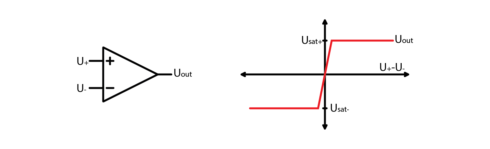
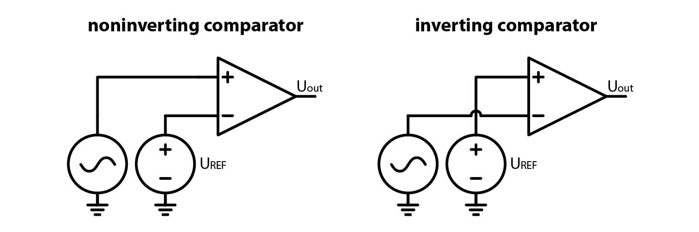
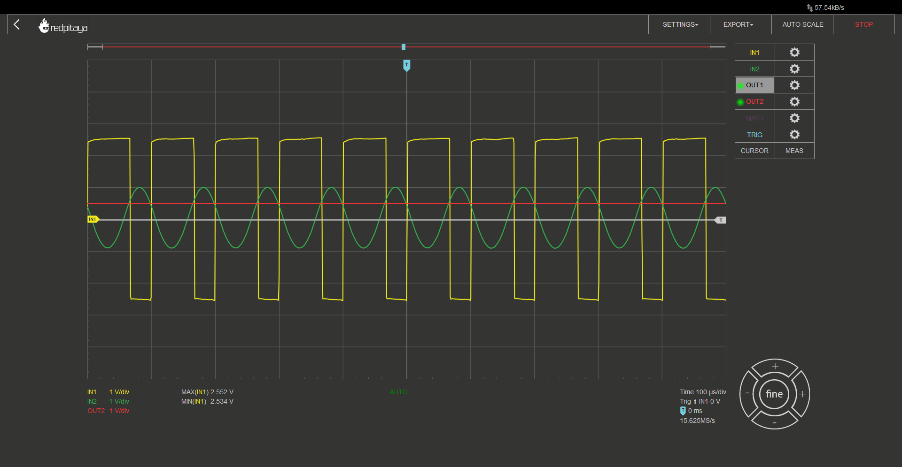
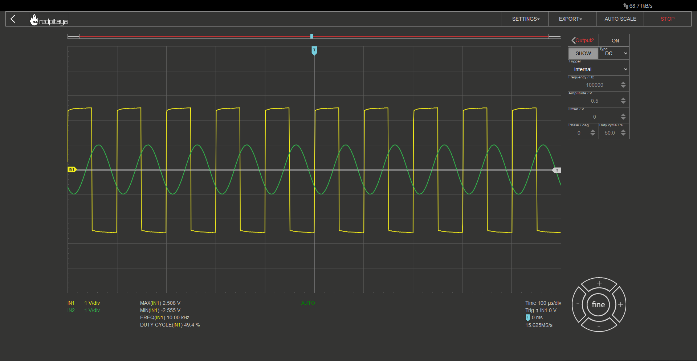
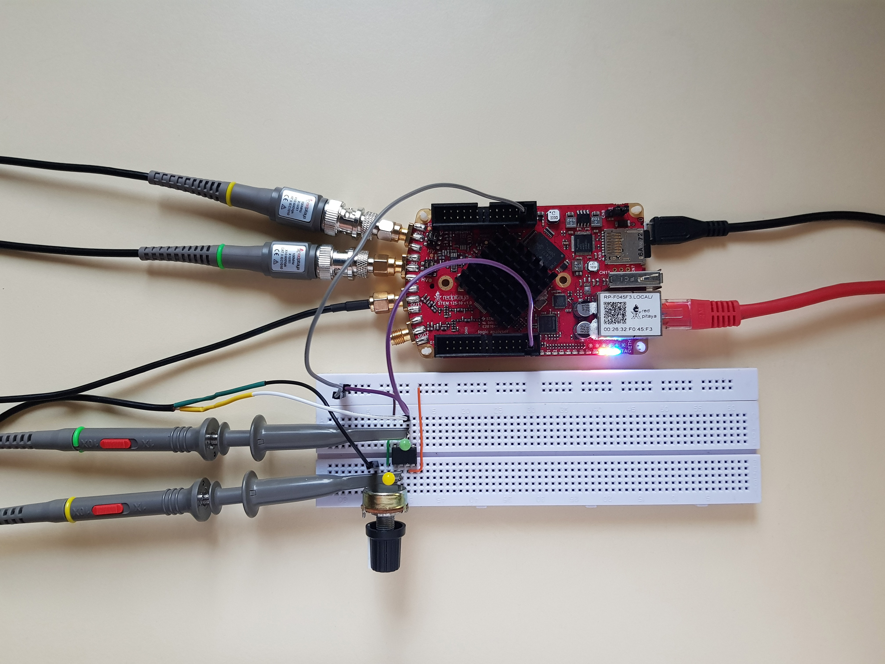
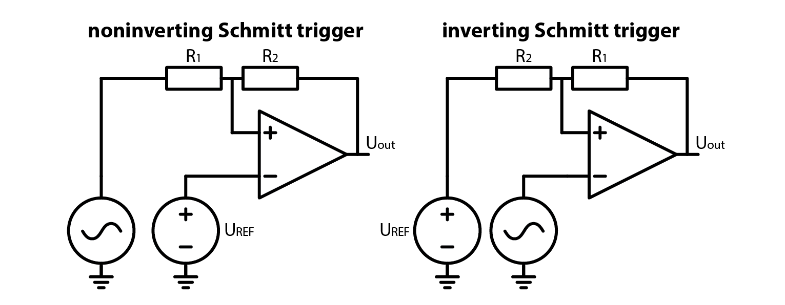
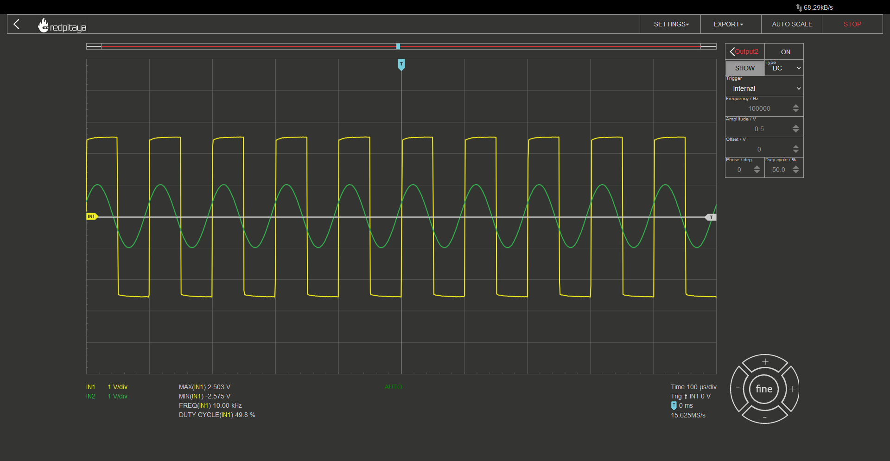
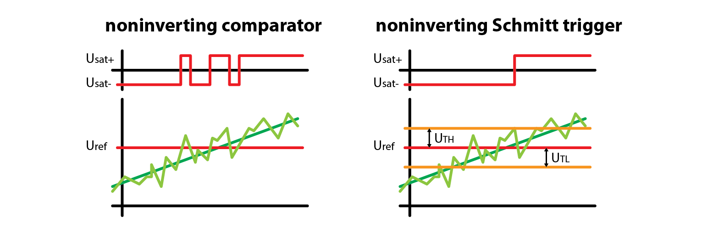

Schmitt triggers
============================

Introduction
---------------
Comparators. We’ve mentioned them before, when we’ve talked about OpAmps. When noninverting input is at higher voltage than the inverting one, their output hits positive saturation and vice versa. Let’s imagine for a second that we set the inverting input to a desired threshold voltage, and noninverting input is at the same voltage. In this case, the output will not hit saturation but will float around the zero volts. Worse still, if noninverting input has some noise, OpAmp’s output will jump sporadically between the two saturation voltages. We can’t afford that. If only there was a way to prevent the comparator form toggling the output when input change is very small… If only we could define a deadzone, where comparator wouldn’t switch again… Oh wait, there is a way to do that!

.. raw:: html
	
        

        <iframe src="https://www.youtube.com/watch?v=ETMs1zX1Dm0" frameborder="0" allowfullscreen style="position: absolute; top: 0; left: 0; width: 100%; height: 100%;"></iframe>
    	
 

Comparators
------------------
Let’s start this course off by refreshing our knowledge about comparators. They are essentially OpAmps that sacrifice their stability for faster switching speed. Much in the same way as OpAmps, their output is the voltage difference between noninverting and inverting inputs, multiplied by a huge factor.

For almost any real application, their characteristic can be described as such:

	.. math:: U_{out}= U_{sat+} \; when \; U_{+} > U_{-}
	
	.. math:: U_{out}= U_{sat-} \; when \; U_{+} < U_{-}

Depending on which input (inverting or noninverting) we select to be reference input, we can obtain an inverting or a noninverting comparator as shown on the image below.

Modifying a comparator
---------------------------
Now that we have a basic understanding of comparators, let’s play with them a little. To do that, let’s first build a simple inverting comparator. The “comparator” IC I am using is the trusty old OP37, the same chip that I’ve been using since I first introduced you to the OpAmps. The only difference is that I am powering the OpAmp from +-3.3 V instead of the usual +5 -3.3. This is done so that both saturation voltages will be symmetrical. I encourage you to follow along as this is a very simple experiment.
Let’s set one of Red Pitaya’s outputs to output a DC voltage at any level you desire – this will be our reference voltage, and let’s set the other output to be a sine wave at the maximum amplitude – this will be our input signal. Connect one input probe to the comparator’s output, the other to the sinusoidal output, and observe what happens when we modify the circuit. Aa expected, output is negative when input is greater than reference and vice versa.

What would happen if we added a load resistor to the comparator’s output? Nothing. Probably because you forgot that the loads resistor has to be connected to the ground. But even if you connected the load resistor as one should, you should still see that the output voltage remains unchanged. Unless the resistor was very small and you would overload the comparator’s output stage. Now what would happen if we replaced this one resistor with a pair of them wired in series? And let’s make them a potentiometer so that we will be able to vary their ratio easily. Unsurprisingly, comparator’s output remains unchanged. From the comparator’s perspective a potentiometer is exactly the same as a simple resistor.
But observe this mighty trick! Let’s now disconnect the reference voltage (and disable the output, we don’t want any short circuits) and connect potentiometer’s wiper terminal to comparator’s noninverting input. Depending on what position your potentiometer was in, nothing may seem to have happened, everything stopped working, or something else entirely had happened. By turning the potentiometer, you will see both of the extremes.

When this circuit operates in a somewhat inverting-compartator-ish way, you should notice, that output goes positive only after the sine wave is quite negative, and the output goes negative when the sine is quite a bit above zero. This is how an inverting Schmitt trigger behaves!

Schmitt trigger
-----------------------
In case you found it hard to follow my circuit description of an inverting Schmitt trigger from before, here is a pair of schematics, one for an inverting and one for a noninverting Schmitt trigger. Note that we connected reference voltage to the ground potential.

So we’ve made an experiment, we’ve seen how a Schmitt trigger behaves and we’ve seen the schematics, but we still have to explain how a Schmitt trigger works. Quite the opposite to what we usually do. Coming up: explanation and the equations.

How it works: inverting Schmitt trigger
-------------------------------------------
Let’s start off by looking at the inverting Schmitt trigger. Uout jumps between positive and negative saturation voltage. The resulting voltages on resistor divider are called high and low threshold voltages.

	.. math:: U_{TH}= U_{sat+} \cdot \frac{R_2}{R_1 + R_2}
	
	.. math:: U_{TL}= U_{sat-} \cdot \frac{R_2}{R_1 + R_2}

Now let's think about what happens during operation. Let’s assume that input is very low, far below comparator’s saturation voltage. This means that the comparator’s noninverting input is below 0 V and output will be positive. In order for output to toggle to negative saturation, input signal has to exceed :math:`U_{TH}`. Now that the output is at negative saturation, input has to fall below :math:`U_{TL}` for the output to toggle again. Hard to follow? Take a glance at the diagram and corresponding oscillogram.

How it works: noninverting Schmitt trigger
----------------------------------------------
Let’s now take a look at the noninverting Schmitt trigger, starting with toggle point voltages. Unlike before, where noninverting input was just saturation voltage, divided by a resistor divider, here the voltage at the noninverting input is a function of input voltage. Switch happens, when this voltage crosses 0 V. Threshold voltages in this case are such:

	.. math:: U_{TH}= -U_{sat-} \cdot \frac{R_1}{R_2}
	
	.. math:: U_{TL}= -U_{sat+} \cdot \frac{R_1}{R_1}

Instead of walking you through the thought experiment of how and why a noninverting Schmitt trigger works, let me just show you the diagram and the oscillogram.

Schmitt trigger instead of a comparator. Why?
----------------------------------------------------
Let me answer with a graph:

A noisy signal may trigger multiple transitions on the output while a Schmitt trigger with appropriately set hysteresis won’t. Pay attention to time when transition happens. Schmitt trigger has a delayed transition by design, because threshold voltages are offset from the reference voltage. For this reason, we still often use comparators. Also note that if noisy component is at a very high frequency, it may not trigger a spurious transition as the comparator needs some time to toggle the output.

Extra credits
-------------------
Remember how I told you that I connected OpAmp to +- 3.3 V? That was done so that saturation voltages were +- 2.6 V. What would happen if saturation voltages weren’t the same?

Conclusion
--------------------
Schmitt triggers are a crucial component for signal conditioning in analog to digital interfaces. They are based on a comparator and only need two more resistors to function – and now you know how.
In caser you need motivation to go back and replicate experiments from this course, let me tell you that the next course picks up from where we left off today. How do you like this cliffhanger?

Written by Luka Pogačnik

This teaching material was created by `Red Pitaya <https://www.redpitaya.com/>`_ & `Zavod 404 <https://404.si/>`_ in the scope of the `Smart4All <https://smart4all.fundingbox.com/>`_ innovation project.
