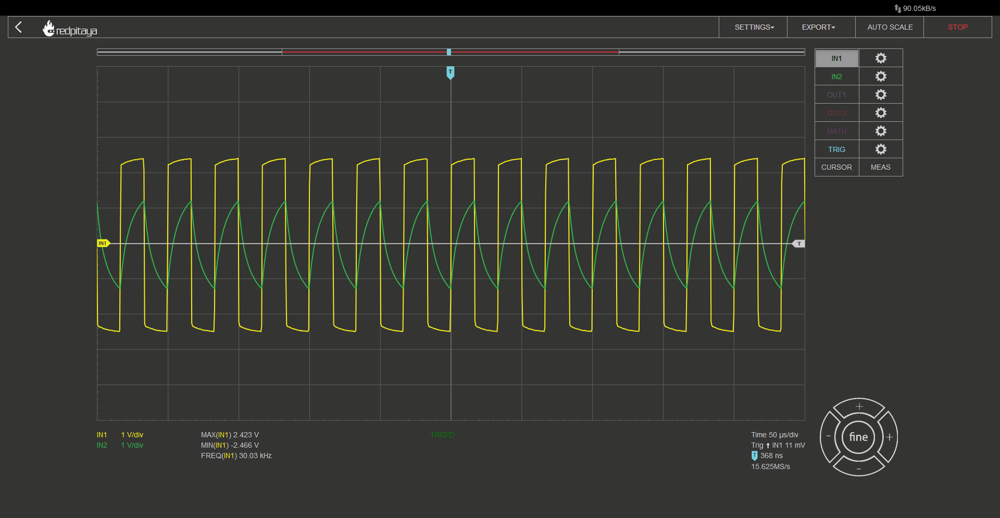
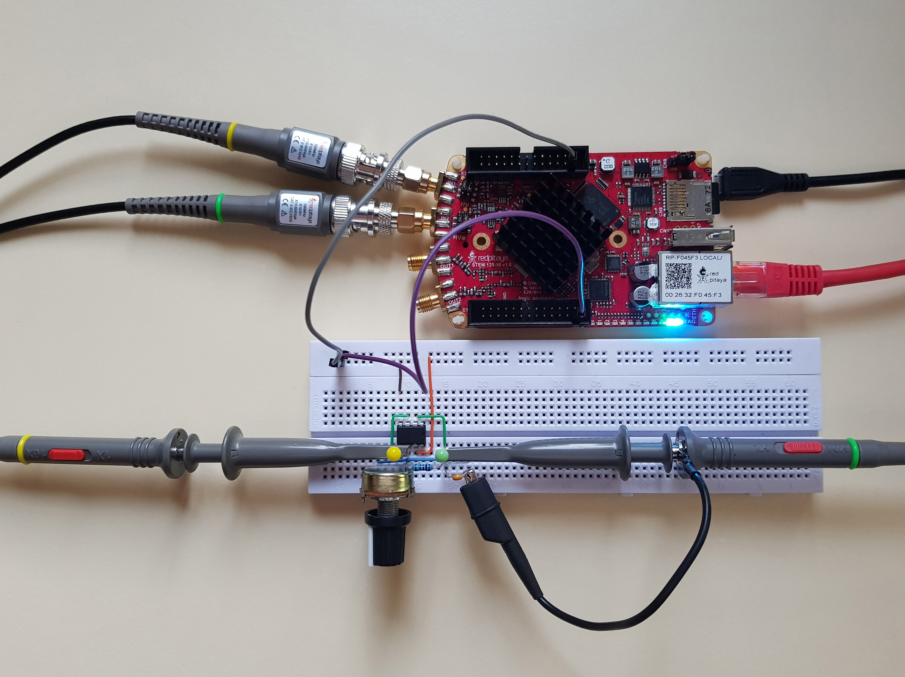
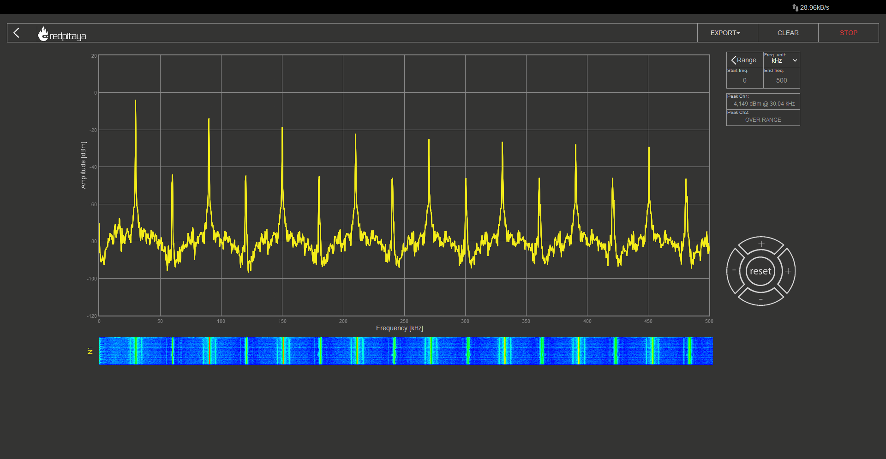
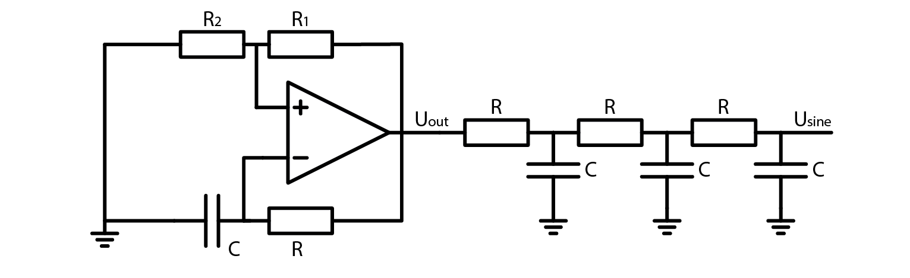
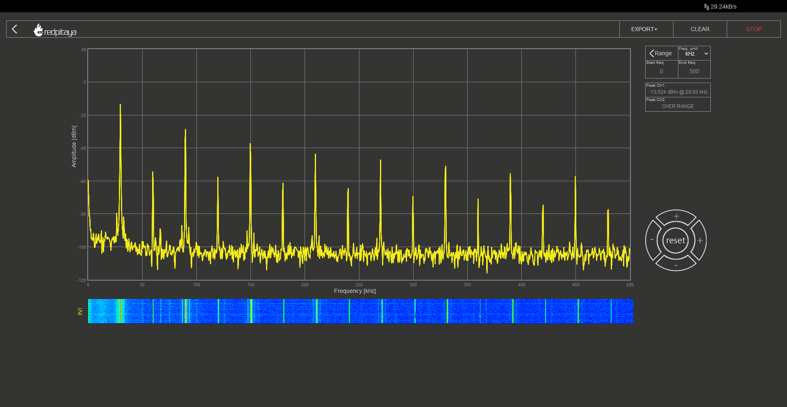
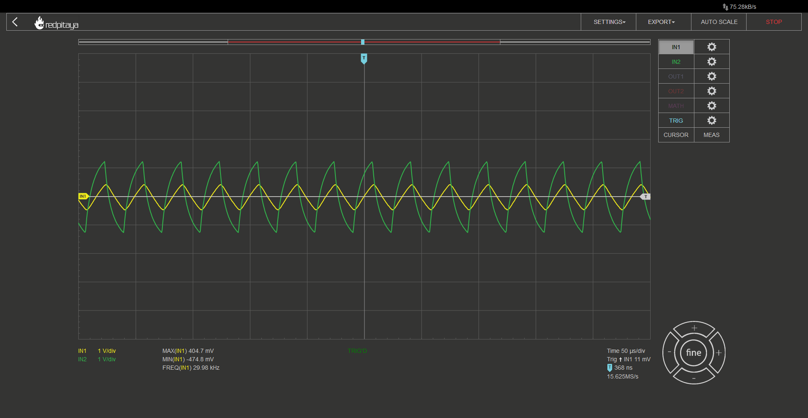
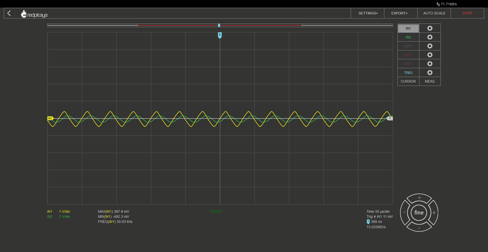
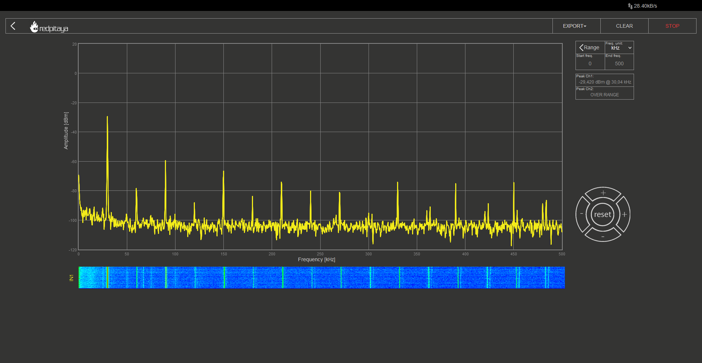
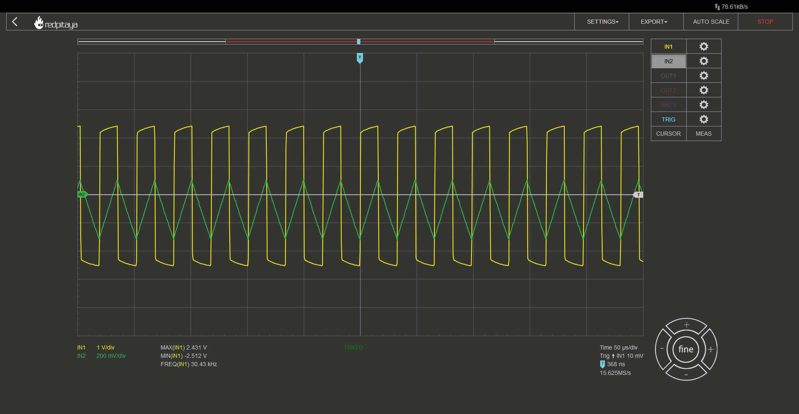
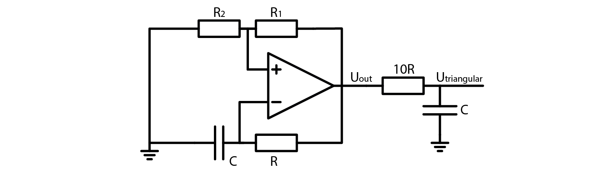

Function Generators
===================

Introduction
-------------------------
Up until now, we’ve used Red Pitaya’s function generator a number of times without addressing how it works. It uses its DAC (we’ll talk about what that is another time) to output a voltage, that corresponds to the function we’ve told it to output (sine, triangular, square, DC, etc.). DACs (and Red Pitayas) aren’t exactly cheap, which means there is a monetary incentive to find alternatives function generator for cost sensitive applications.

.. raw:: html

    

        <iframe src="https://www.youtube.com/embed/tIRu7Vvzlog" frameborder="0" allowfullscreen style="position: absolute; top: 0; left: 0; width: 100%; height: 100%;"></iframe>
    

Picking up form where we’ve left
--------------------------------------
This course builds on the previous one, the one about Schmitt triggers. We ended it by building an inverting Schmitt trigger. The circuit looked as such:

.. image:: img/10_inverting_noninverting_schmitt.png
	:name: schmitt schematics
	:align: center

.. image:: img/10_schmitt_inverting_circuit.jpg
	:name: inverting schmitt circuit
	:align: center

.. image:: img/10_schmitt_inverting_screencap.png
	:name: inverting schmitt screencap
	:align: center

Before moving on, let me remind you that OpAmp is supplied from +-3.3 V. Asymertric supply voltage won’t work.
Let’s make another experiment. What would happen, if we added another resistor to the OpAmp’s output? Answer is the same as the last time. Nothing, unless the resistor was so small that we overloaded the OpAmp’s output. Now here comes the trick question: what would happen if we loaded the OpAmp’s output with an RC low pass filter, a 1 kOhm and 10 nF RC low pass filter, for example? Answer is quite unremarkable. Here is the oscillogram (yellow trace is OpAmp’s output and green one is RC’s middle node):

This image by itself is quite unremarkable. A lousy imitation of a square wave that is fed through an RC low pass filter who’s settling time is far greater than said signal’s frequency. But here’s the interesting bit:
Remember that this was an inverting Schmitt trigger? When input signal exceeds the positive threshold, output becomes negative, and when input falls below negative threshold, output becomes positive. Feeding the filtered signal (green) into the Schmitt trigger should make the system oscilate!

An OpAmp multivibrator
--------------------------
And indeed it does. The circuit we have constructed is formally known as an OpAmp multivibrator. Here are the experimental circuit and the schematic:

You will notice that turning the potentiometer impacts the signal’s frequency. This is due to the changing threshold voltage and thus varying time between output’s transition and RC filtered voltage exceeding the threshold. Here are the equations:

	.. math:: \beta = \frac{R_2}{R_1 + R_2}
	
	.. math:: T = 2 \cdot R \cdot C \cdot ln(\frac{1+\beta}{1-\beta})
	
	.. math:: f = \frac{1}{T}
	
And for those wondering where the :math:`\beta` came from, we use it to simplify the equations. We could also use it in equations for the inverting Schmitt trigger:

	.. math:: U_{TH}= U_{sat+} \cdot \frac{R_2}{R_1 + R_2} = U_{sat+} \cdot \beta

Congratulations. You now know how to construct a simple adjustable oscillator. Its output resembles a square wave and if someone told you they wanted a sine wave, you wouldn’t know what to do. But what if I told you, that a sine wave hides inside the square wave?

Discrete Fourier transform
--------------------------------
Up until now we’ve used only two tools from Red Pitaya’s arsenal: oscilloscope and bode analyser. Today we will take a look at a new one: DFT spectrum analyser. DFT stands for Discrete Fourier Transform. It tells us what spectral components are present in the analysed signal.
What are spectral components? Any signal can be described as an infinite sum of sine and cosine functions with different amplitudes at different frequencies. DFT tells us factors for different frequencies. This is a gross simplification but it will have to suffice for today.
An ideal square wave with fundamental frequency F0 and amplitude of 1 can be approximated as such:

	.. math:: square(f)=\frac{4}{\pi} \cdot (sin⁡(F0) + \frac{1}{3} sin⁡(3 \cdot F0) + \frac{1}{5} sin⁡(5 \cdot F0) + ...)

So we would expect our square wave signal to contain the base frequency and its odd multiples. And what do we really get?

I set the oscillator to oscillate at 30 kHz and the DFT analyser to work up to 500 kHz. We can clearly see equally spaced spikes. Odd spikes are significantly larger than even ones. If this isn’t clearly obvious to you, let me remind you that the vertical axis is logarithmic. We expected the odd spectral components, but the even ones were unexpected. We can write them off as coming from the difference between an ideal square wave and the approximation that we are generating. So if we ignore them, we can see the pattern we expected from a square wave.

A sine wave generator
--------------------------
There are dedicated oscillators that produce a sine wave, but as I mentioned before, a sine wave is an integral part of any square wave. We can get to it by removing higher spectral components. We will do it by stringing RC filters one after the other.

All RC’s will be 1 kOhm with 10 nF, same as we used in our oscillator. In fact, first of RCs will be exactly what we used in the oscillator. I would like to point out that cormnr frequency of such filter is about 16 kHz, approximately half the oscillator’s frequency. This will obviously result in quite a bit of signal attenuation but will result in a much faster removal of higher spectral components. On first oscillogram, yellow trace represents oscillator’s output and the green one is the filtered output. After that, I trust you will manage to deduce what is what by comparing waveform’s shapes.

After first RC:

After second RC:

.. image:: img/11_osc_2RC_dft.png
	:name: RC1
	:align: center

After third RC:

After three stages our square wave started to look very much like a sine wave. Looking at signal’s spectrum, we can see that it still contains many higher order components but consider the fact that the next biggest spectral component is attenuated by more than 20 dB when compared to the first one. And 20 dB is far greater than 20 times.
One last thing I have to address is signal attenuation. Resulting sine wave is far smaller in amplitude when compared to the original square wave signal. You should add an amplifier to adjust the amplitude. No way around it. At least not in this oscillator design.

Triangular wave generator
------------------------------
And what if you wanted to generate a triangular wave? A quick glance at oscillograms form the previous chapter reveals that signal was pretty triangular-looking after the second RC. If rounded corners are what you’re after, sure, you can use that. But proper triangular waveforms have sharp corners and there is a very simple way to achieve that.
Adding an RC with a time constant that is far greater than oscillators base frequency results in this:

For this example, I used a 10 kOhm 10 nF RC filter. Technically the resulting triangular waveform is not truly triangular. It still fits an exponential decay that we could see after the first RC in previous example. Because the time constant is so much greater than the oscillation frequency, resulting signal is virtually indistinguishable from a pure triangular waveform.
I encourage you to run it through a DFT, convert amplitudes of signal’s peaks from dBm to volts, and compare it to triangular waveform’s spectral composition. To prevent dragging this article out, let me just tell you that volts are proportional to dBm with this relation (for those who don’t know, :math:`\propto` sign stands for “proportional to”):

	.. math:: U \propto 10^{P_{dBm/20}}

Triangular waveforms consist of base frequency and odd multiples (same as square wave) with amplitudes of those spectral following this equation:

	.. math:: a_n = \frac{2 \cdot amplitiude}{n \cdot \pi} sin(\frac{n \cdot \pi}{2}) , n=[1,2,5,...)

Conclusion
--------------------
We’ve taken a look at oscillators, we’ve learned about DFT analysis, and we’ve learned to convert a square wave into a sine or a triangular waveform. We’ve taken a look at only one of many oscillator designs. There are tonnes of other designs out there but this course is loaded with information as it is. If you are the curious kind, I would encourage you to look around the internet for oscillators that naturally produce sine waves. Maybe you are interested in sawtooths? Asymmetric square waves? Options are endless. Until next time, cheers!

Written by Luka Pogačnik

This teaching material was created by `Red Pitaya <https://www.redpitaya.com/>`_ & `Zavod 404 <https://404.si/>`_ in the scope of the `Smart4All <https://smart4all.fundingbox.com/>`_ innovation project.