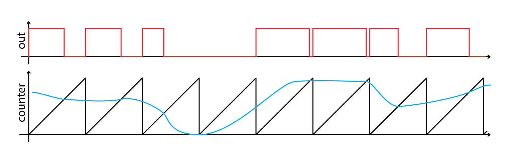
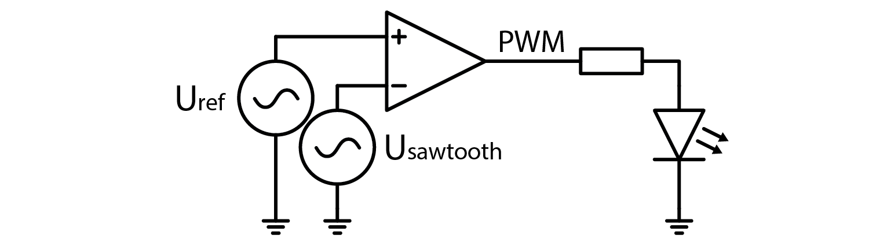
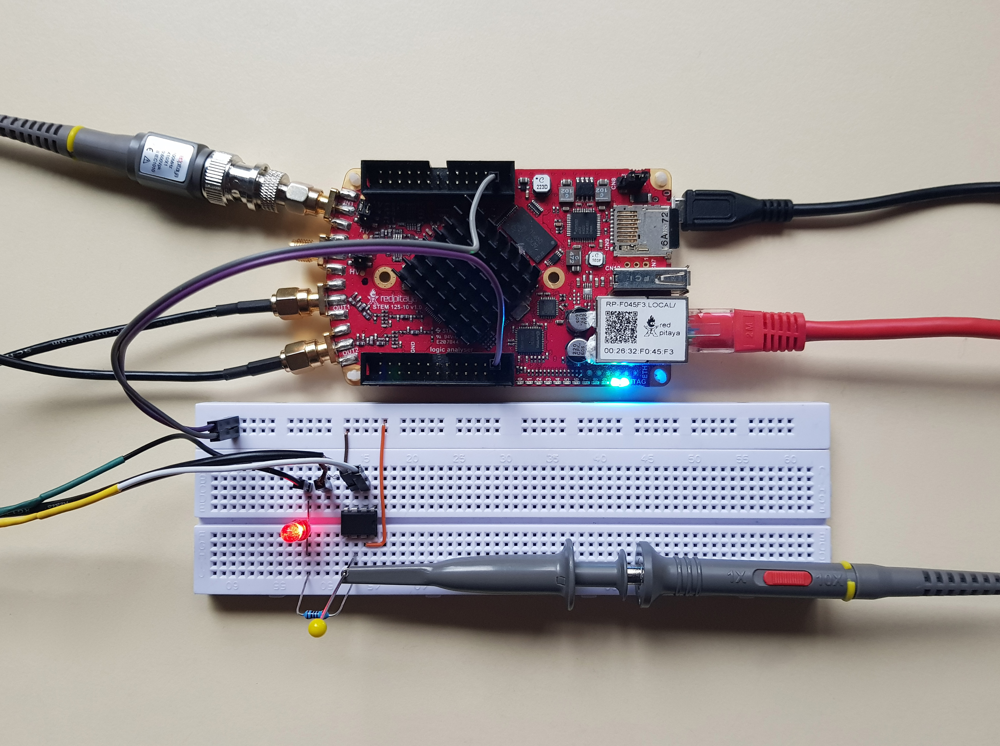
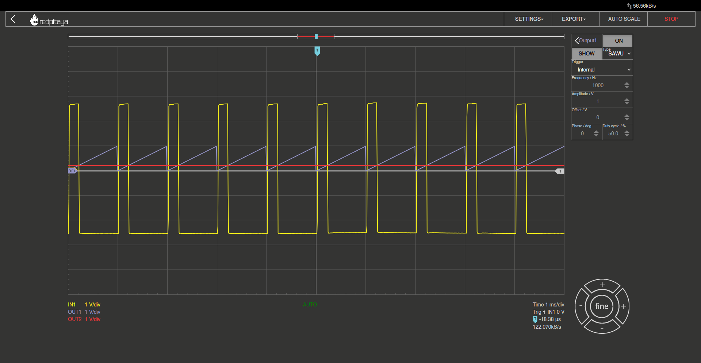
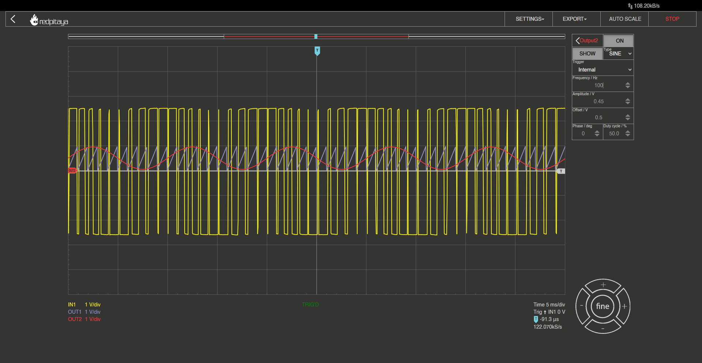
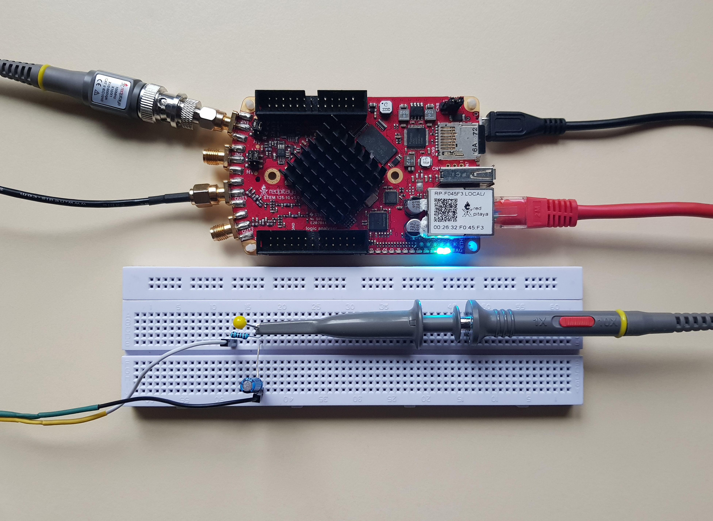
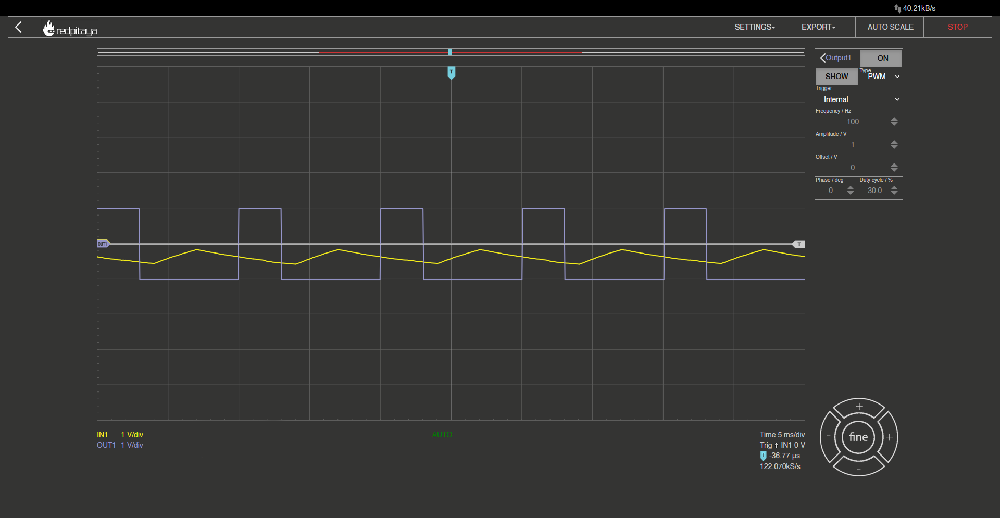

Pulse Width Modulation
============================

Introduction
-----------------
DAC. I teased this acronym in the previous course, but what is it? DAC stands for Digital to Analogue Converter. As the name tells you, it converts digital values to analogue ones, usually voltage, sometimes current. DAC’s usefulness should be self-explanatory, but to state the obvious: whenever you need a way to convert digital signal into an analogue value, you use a DAC. But this was just a teaser for the next course. Today we’ll be looking at pulse width modulation (PWM), which may be, as we’ll explore today, used to generate a stable voltage.
If you are reading this document, I am sure you have used PWM before. It is a handy tool for dimming light sources, adjusting power of small motors, and much more. PWM works by powering the device only part of the time, which reduces the average device output power. If repetition cycle is fast enough, we perceive only the average output power. But how is it generated? When can you use it? Can it be improved?

Digital PWM
------------------
Here is how PWM is implemented in microcontrollers: they have a counter with predetermined size. On each clock cycle this counter is incremented by one. When counter overflows, it resets to zero and output is set high voltage level. Counting continues indefinitely. When counter matches a reference value, output drops to low voltage level. Varying the reference value effectively varies the output waveform.

.. image:: img/12_PWM.png
	:name: digital PWM
	:align: center

As you can see in the picture above, varying the reference (blue) will affect pulse width (red). There are two edge cases though: when reference is zero and when reference is max. PWM cannot output 100%, because counter will always match reference value at least at max value. Inversely, it can easily output 0%, even though it is supposed to set output high when counter overflows. This is because output is set high and then immediately set low because it matches the reference.
Digital PWM modulators have a finite resolution. Depending on the size of the internal counter, they can only output a predetermined amount of pulse shapes. If counter has four bits, as seen in image above, modulator will have sixteen different possible pulse widths (2^4). An eight bit counter would result in 256 possible pulse widths and so on.

Problems with fast response time
-------------------------------------
PWM can only be used for systems where response time is slow in regards to the PWM modulation frequency. As mentioned before, dimming LEDs is a good example, because human eye “framerate” isn’t that high. I know we’ve just built an analog PWM modulator, but let’s be lazy and use the Red Pitaya’s built in PWM generator for the next experiment.
Set the Red Pitaya to output a PWM at full amplitude on output1 and connect an LED with a 100 Ohm series resistor to it. To avoid the need to amplify the 1V amplitude signal, we can set the second output channel to output DC voltage at 0V and offset of -1. Connect this to the LED instead of GND.

.. image:: img/12_PWM_LED_circuit.jpg
	:name: digital pwm circuit
	:align: center

To verify that the system is working, change PWM setting and see if LED’s brightness changes. Once done, try changing the modulation frequency. Nothing should happen at high frequencies, but you will notice blinking if you go too low. At that point you will have experience the problem that PWM causes when sensing devices have a fast response time. Digital cameras are even more sensitive to flickering than you are.

An unexpected experiment
---------------------------------
With this setup, you can easily verify or debunk the myth that the human eye can’t see more than 30 Hz. Set the duty cycle to 50%, modulation frequency to 30 Hz and decide whether or not you can see any blinking.
To spoil the fun, yes, you will be able to see the blinking. Quite easily in fact. That is unless you set the duty cycle to be above 90%, in which case the off period (dark time) is too short to notice. So if 30 Hz refresh rate produces a noticeable blinking, how is could the old film be shot at 24 Hz? The answer might surprise you. When projecting an old school film, the same image was actually flashed three times, resulting in an apparent 72 Hz refresh rate. That was enough to trick our brains in thinking that the image isn’t blinking (feel free to verify that statement). Apparently image processing part of our brain is not so picky and was able to reconstruct smooth motion as soon as image flashing problem was resolved. In fact, it can do it at even lower frame rates but we are getting off topic.
One way to verify that LED is modulated with PWM is to move it rapidly. If it is modulated, LED will produce spots along its trajectory. One last fun off topic fact: our peripheral vision is more sensitive to pulsating light, feel free to try it out.

Efficiency
---------------
If flickering may be a problem, why would we even bother ising PWM? PWM is great, because it lets us achieve high efficiency. Since signal is either high or low (output transistors are fully opened or closed), resistive losses are minimized. Compare that with an OpAmp’s output stage, where the difference between supply voltage and output pin are wasted on output transistors. At high load currents, power losses add up. A quick reminder, power loss is equal to the product of the voltage drop and the current.

Analog PWM
-----------------
Analog PWM is generated in much the same way as a digital one. We need a rising voltage, that periodically resets (a sawtooth waveform), a reference voltage, and a way to compare them (a comparator). If reference is above “counter” voltage, output is high and vice versa.

We can construct such modulator. Instead of building an analog sawtooth generator, we’ll be using Red Pitaya’s function generator.
Sawtooth is fed into the comparator’s inverting input, and the reference voltage is fed into the noninverting one. Reference can be generated by using a potentiometer, or, as I did, by using Red Pitaya’s other output channel to output a DC voltage. From this point on, we have a fully functional analog PWM modulator.
Just for fun, let’s connect an LED to the output and give it a go. Schematic:

The circuit:

And a screen capture:

But why do we need to use a DC signal as a reference voltage? No reason. We could easily set it to a sine wave. There is a limitation though. Sine wave’s amplitude has to be less than that of the sawtooth to achieve a proper modulation. Otherwise clipping would occur. I selected 0.45 V amplitude and 0.5V offset.

This screen capture is representative of how a PWM modulated sine wave should look like, but you wouldn’t use it like this realistically. PWM carrier frequency has to be way higher than signal’s frequency. Setting sine wave frequency at 1 Hz achieves a pleasing result.

Smoothing the signal
-------------------------
As explored in the experiment, 100 Hz is enough to fool a human eye that an LED isn’t blinking. There are other applications where this won’t do. Just imagine that you wanted to use PWM to dim lights for shooting illuminating a movie set or, even worse, set a threshold voltage of a comparator. You might say that there is no reason to use PWM for this, but hey, PWM is cheap. Very cheap. Increasing PWM frequency and adding some signal filtering may save a lot of money. Filtering may be realized by an RC filter. Filter’s time constant must be significantly greater than that of PWM, otherwise smoothing will be insufficient. Keep in mind that a filtered PWM signal must pass through a voltage buffer (OpAmp follower) if it will be connected to anything other than a high impedance load.
Let’s loose the LED for this example to make the circuit simpler. This means we can also get rid of output2 and simply connect an RC filter across output1’s connectors. Input1 is set to 10x and connected to the RC’s output.

And for clarity's sake, here's a schematic:

Depending on PWM frequency you will get different results. I used a 10 kOhm resistor and a 1 uF capacitor. Here is what I got at 100 Hz PWM:

At 1 kHz:

.. image:: img/12_PWM_RC_1kHz_screencap.png
	:name: PWM smoothing at 1kHz
	:align: center

And here is the result at 10 kHz PWM:

.. image:: img/12_PWM_RC_10kHz_screencap.png
	:name: PWM smoothing at 10kHz
	:align: center

For an RC filter with a time constant of about 15 Hz, 10 kHz input may seem to be a bit much, but that is what it takes to completely smooth out a PWM. And don’t worry, this frequency isn’t even on the high side. For an eight bit PWM, input clock has to be only 256 kHz to achieve a modulation frequency of 10 kHz, which is very low. It might be worth considering increasing the frequency even further and using a smaller capacitor. 
The filtered signal that we obtained is steady enough to use as an input to a comparator. Problems appear when we try to change the voltage. With the RC filter having a 15 Hz cutoff frequency, we obviously can’t change output signal faster than this. Filtered PWM is therefore only usable for generating very slowly changing signals. We will explore alternatives for generating higher frequency signals in the next course.

Conclusion
-----------------
And this brings us to the end. We’ve looked at PWM, how it works, its benefits, and drawbacks. We even discussed human physiology for a moment. I hope you found this course interesting and maybe even useful for one of your projects. Until next time, cheers!

Written by Luka Pogačnik

This teaching material was created by `Red Pitaya <https://www.redpitaya.com/>`_ & `Zavod 404 <https://404.si/>`_ in the scope of the `Smart4All <https://smart4all.fundingbox.com/>`_ innovation project.
