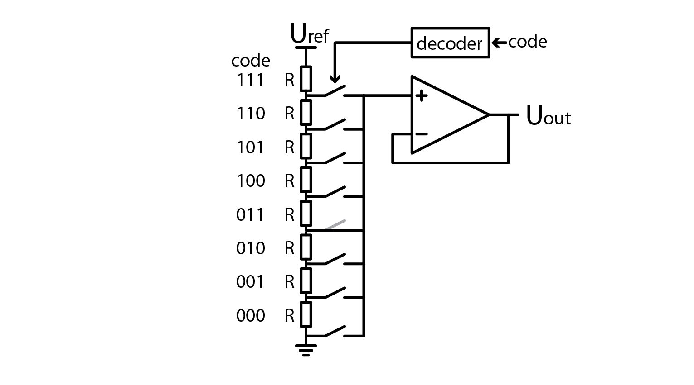
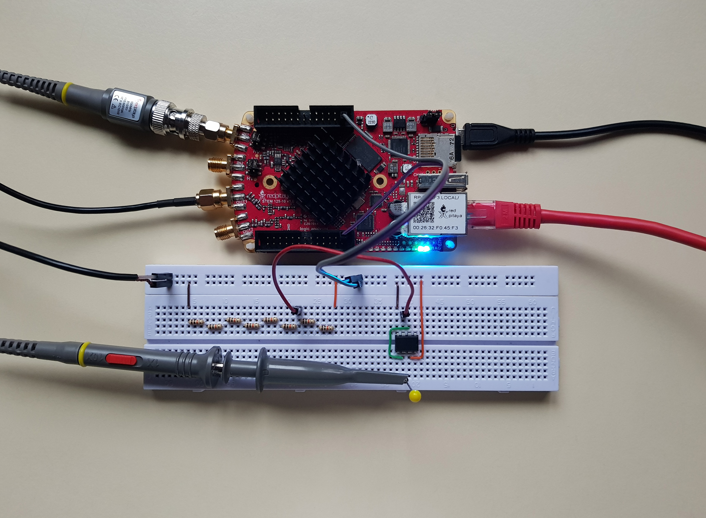
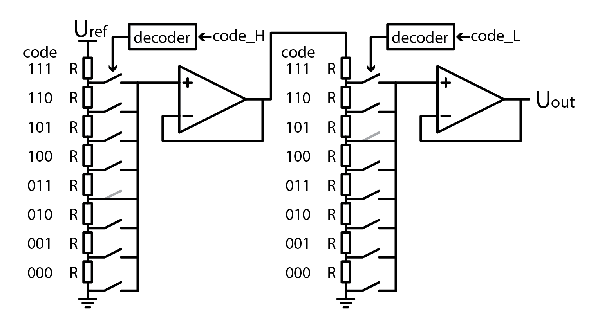
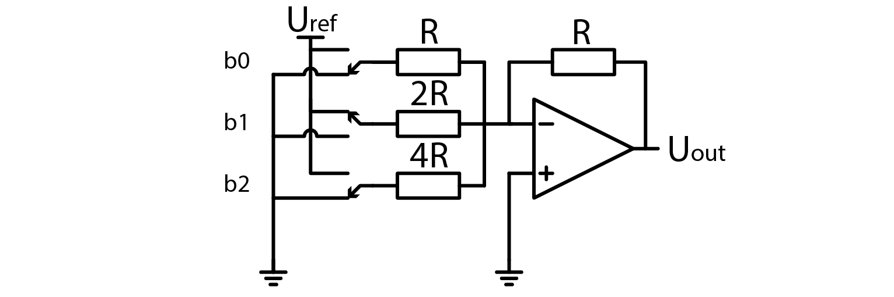
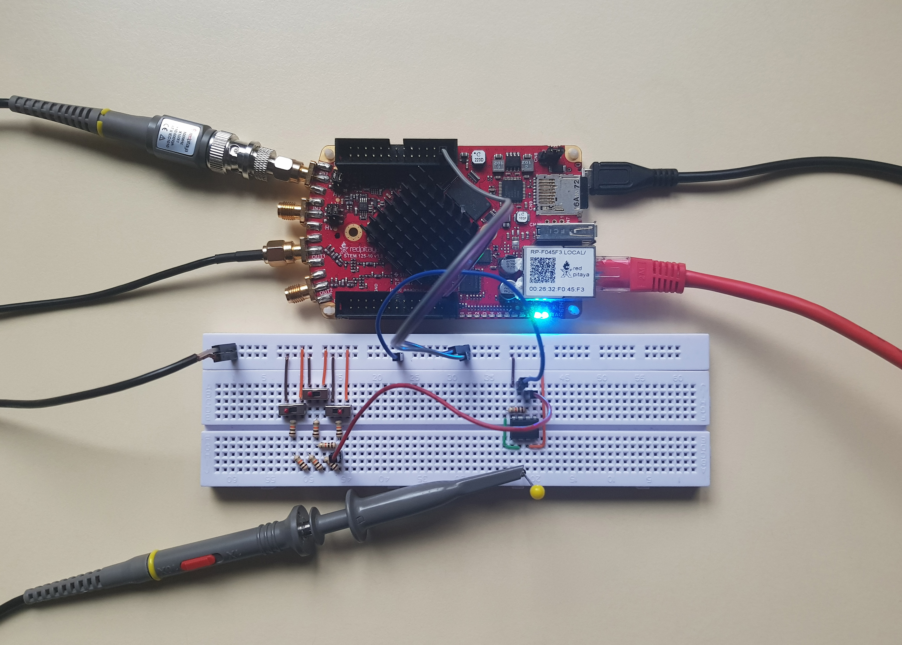
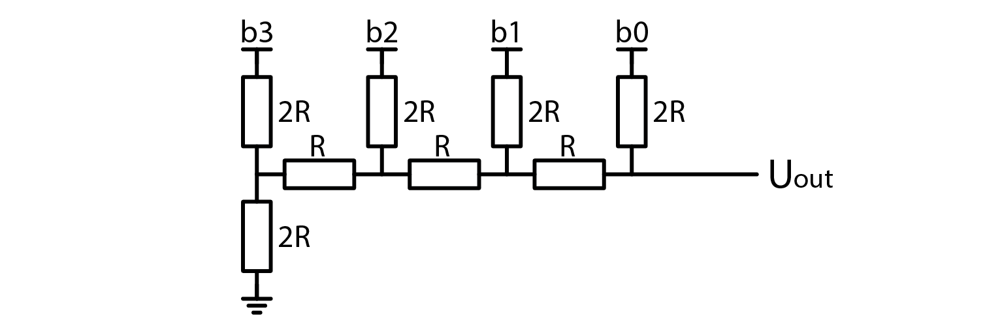
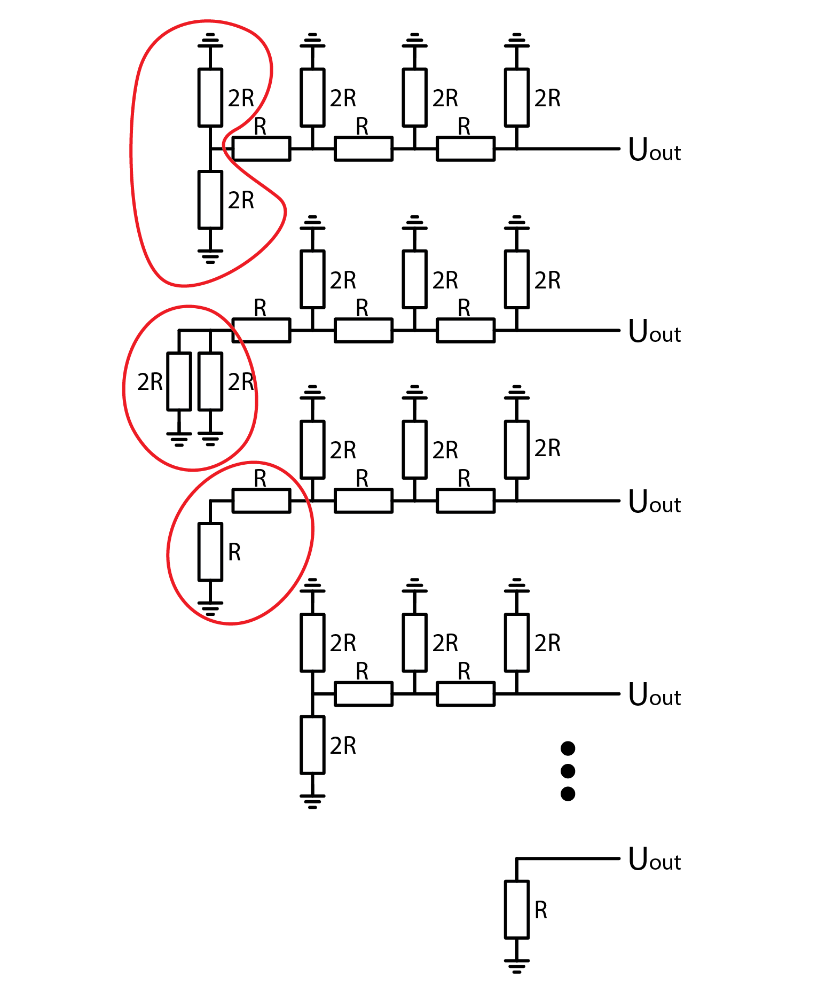
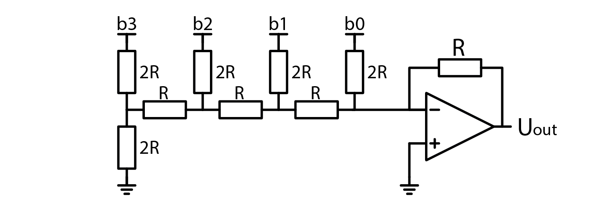
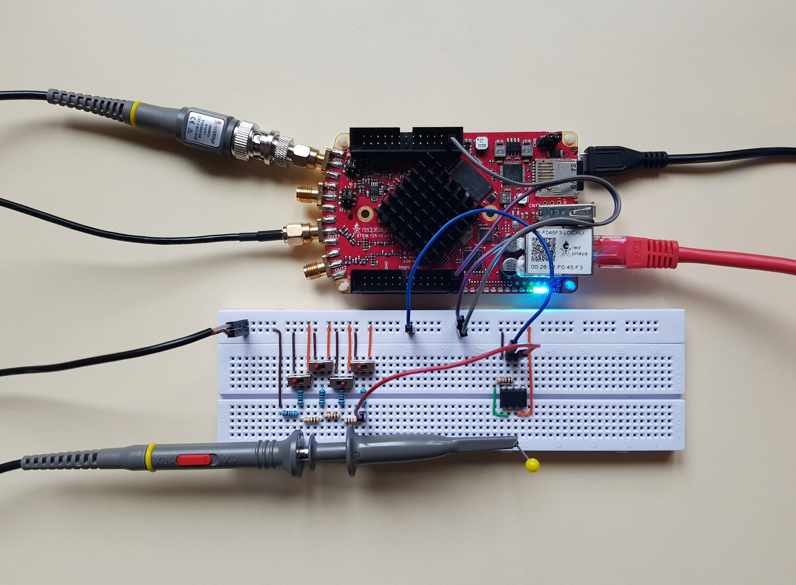

Digital to Analog Converter
============================

Introduction
---------------
So if PWM is bandwidth limited, what can be used for digital synthesis of higher frequency signals? We have a few options and we will explore three options today (or four, depends on whether or not derivatives count). Without further ado, let’s take a look at the first DAC architecture.

.. raw:: html

    <!--

        <iframe src="https://www.youtube.com/embed/Ym0sGiuoVR4" frameborder="0" allowfullscreen style="position: absolute; top: 0; left: 0; width: 100%; height: 100%;"></iframe>
    
-->

Resistor voltage divider
-------------------------------
The simplest-to-understand DAC s a string of resistors, that form a resistor divider with multiple output nodes. By selecting which of those voltages are connected to the output, we obtain a primitive but functional DAC. Image below shows a three bit DAC.

Laugh all you want, but this is a legitimate DAC. One huge drawback it has is that it requires a lot of resistors with same resistance. Any difference between their resistances results in nonlinearity. It requires :math:`2^N` resistors, where N is the number of bits in DAC. Let’s construct such DAC. Instead of using multiple switches and a decoder, we’ll be using a jumper wire, but in real application, you would use an analog multiplexer/demultiplexer such as 74HC4051, which takes care of switches and decoding.

Another disadvantage of this circuit is that by adding more bits, number of switches increases. On its own, this is not a problem, but unfortunately, each switch adds parasitic capacitance, which limits maximum operation frequency. This problem can be mitigated by using a staged design. Here first DAC with half the bits generates reference voltage for the second stage DAC.

Example on picture realizes a 6 bit DAC but only uses double the amount of components instead of four times more. In general, a two staged design requires :math:`2 \cdot 2^{N/2}` resistors and switches but yes, it requires two voltage buffers. Aside from reducing parasitic capacitance, this design also lets us double bit count of DAC. Adding even more stages is possible, but at some point noise will overshadow lowest bits.
If you want, you can test this circuit yourself, but we won’t be losing any more time with this variant. Time to find a DAC that requires fewer components.

Binary weighted resistor DAC
-----------------------------------
Remember the chapters about analog addition OpAmp amplifiers and? I do, so let’s draw some inspiration from those chapters.

.. image:: img/7_OpAmp_adder.png
	:name: OpAmp adder
	:align: center

	.. math:: U_{OUT} = -(U_1 \cdot \frac{R_2}{R_1} + U_2 \cdot \frac{R_2}{R_3})
	
Adding more input voltages and input resistors would just extend the equation. If input voltages can be only Uref or 0V, and we fix resistor values, equation becomes even simpler. In this example b0 through b3 represent bits which control state of resistors. 1 means Uref, and 0 means 0V.

.. image:: img/13_binary_weighted_DAC_schematics.png
	:name: binary weighted DAC schematic
	:align: center

	.. math:: U_{OUT} = - U_{ref} \cdot (b_0 + b_1 / 2 + n_2 / 4 + b_3 / 8) = -2 \cdot U_{ref} \cdot \frac{U_{4bit}}{16}

So in this setup we basically connect a binary code of desired voltage to inputs and bam, analog representation of digital code is generated. The x2 factor in equation is present because I wanted to emphasize that the output voltage in this configuration approaches 2xUref.

Standard resistors
----------------------------
This circuit is a lot more compact than the one before. For an N bit DAC it only needs N switches and N+1 resistors. Here’s the catch. Resistors don’t come in all shapes and sizes. Hop on to Mouser, Farnell, Digikey or whatever electronics supplier’s website you want and try to buy resistors for four bit binary weighted DAC.
If you select R value to be 10 kOhm, you wont’t have any problems with 2R, but you won’t find a 40 kOhm resistor. Closest you can get is 40.2 kOhm. How about 8R? Nope, 79.6 kOhm is your closest match. Depending on how precise you want to be, such tolerances are OK, but usually they aren’t.
Now let’s answer the question why can’t you buy any resistor you want? It has to do with tolerances. IF resistors are built with 10% tolerance, there is no reason to make standard values that are within 10% of one another. Manufacturers have agreed on making resistors in so called `E series <https://en.wikipedia.org/wiki/E_series_of_preferred_numbers>`_.
One way to alleviate the problem with tolerances is to use trimmable resistors, but this tends to be expensive. A smarter approach is to use a bunch of resistors from the same batch, even better if they were produced one after another, and hope they have the same error, which will then cancel out.

Experimenting with a binary weighted DAC
---------------------------------------------
With that out of the way, let’s use a bunch of 10 kOhm resistors to build a simple 3 bit binary weighted DAC. I have chosen to use 1V, generated by Red Pitaya, as a reference voltage. OpAmp is powered from +-3V. I opted to use switches instead of jumper wires for setting bits.

A binary weighted DAC that we have just constructed uses the same number of resistors as the previous one, but it uses significantly fewer switches. That means lower parasitic capacitance, and thus higher maximum operation frequency.

R-2R
-------------
Instead of dedicating more time to obsolete or niche DAC architectures, let’s take a look at one that you can easily find used in commercial DACs. Here is how an R-2R resistor ladder looks like:

You will immediately notice that a R-2R resistor ladder consists of only two sizes of resistors, R and 2R. This also explains the network’s name. I skipped drawing switches for simplicity’s sake. In practice places marked with bits b0 through b4 would connect to GND or Uref. But how does this resistor ladder behave as a DAC? Depending on how trustworthy you consider me to be, you may accept my claim that output voltage is calculated as such:

	.. math:: U_{out} = U_{ref} \cdot (b_0 /2 + b_1 / 4 + n_2 / 8 + b_3 / 16)

Or you can use superposition in conjunction with Thevenin’s theorem to verify my claim. A harder alternative would be to use superposition and brute force, but I won’t try to stop you.
Unlike the binary weighted DAC that we explored before, a R-2R network does not need an amplifier to output a voltage. Keep in mind though that a buffer is still required for driving low impedance loads. In spite of that we might sometimes want to use an amplifier. If we selected an inverting amplifier, knowing the networks output resistance is essential. A nice property of a R-2R ladder: it “folds” down on itself.

As illustrated above, regardless of how many bits a R-2R network has, its output resistance is always R.
A nice thing about this DAC architecture is that we can easily add or remove bits simply by adding or removing a pair of resistors. As explained just a moment ago, this doesn’t affect the rest of the circuit. AS such, we can easily add an amplifier to the circuit. The following schematic depicts an inverting amplifier with a gain of -1 added to a R-2R DAC. Note how the amplifier consists of only an OpAmp and one resistor with resistance R.

Another nice thing is that a R-2R DAC only requires N switches and 2N resistors of two sizes. By selecting R to be 10 kOhm, we can even obtain 2R (20 kOhm) from the standard set of resistors. Furthermore, R-2R ladders are so common that you can even buy a prebuilt network in a single component. They cost very little and may come in handy when we have enough free pins on a microcontroller. You don’t even need a special Uref, you can simply connect digital output pins to the inputs of a DAC and pretend that supply voltage is stable enough to serve as a reference voltage. Same holds true for a binary weighted DAC, but I see no reason why you would use that over a simple R-2R.

Experimenting with a R-2R DAC
--------------------------------------
Consider deriving a formula for R-2R DAC’s output voltage your homework and let’s quickly look at how we can construct a R-2R DAC. Just like before, I am taking Uref from Red Pitaya’s DAC, set to output a constant 1V signal.

Keen eyed among you will have noticed that I opted to buffer the output voltage with an inverting amplifier with a gain of -1. This means that the output voltage is inverted to what we would expect (obviously), but probe the R-2R’s output and you will notice that it is… at zero volts… regardless of how you set the switches (bits)… Circuit obviously still works, because output after the inverting amplifier can be set with switches… It has to do with how an inverting amplifier works. Just give it a quick thought and you’ll understand. If you disconnect the inverting amplifier (or use a buffer instead), R-2R will behave as expected.

Extra credits
-------------------
You may have noticed that this course didn’t show any screen captures of how the constructed DACs perform. That is because looking at horizontal lines is boring. If you want to see those DACs in action, I invite you to try them out yourself. One more thing you can do is to determine the output voltages of DACs that I showed throughout this article. You may have noticed that the switches were marked so that you can see their state more easily.

Conclusion
-------------------
And that brings us to the end. We set off to find a DAC that can be used for generating rapidly changing signals, which PWM could not handle. We explored three different architectures in order of rising complexity for understanding the principle of operation, but falling complexity of construction.
With that said, I hope you learned something. Bye! 

Written by Luka Pogačnik

This teaching material was created by `Red Pitaya <https://www.redpitaya.com/>`_ & `Zavod 404 <https://404.si/>`_ in the scope of the `Smart4All <https://smart4all.fundingbox.com/>`_ innovation project.