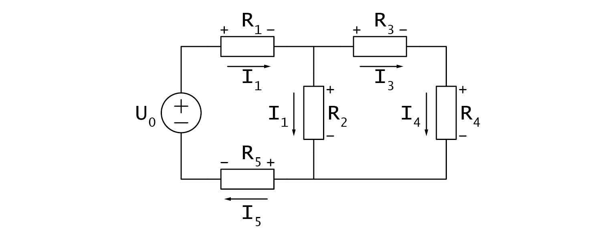
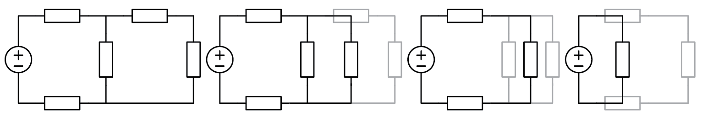
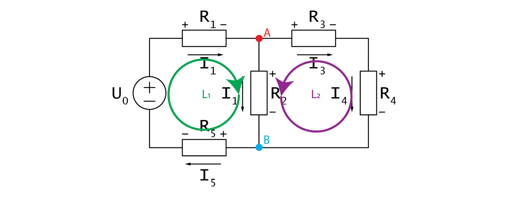
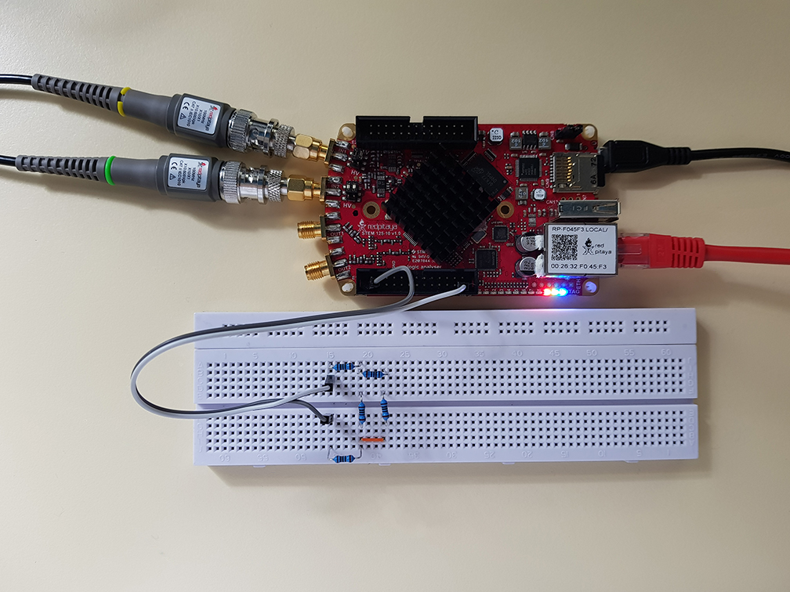
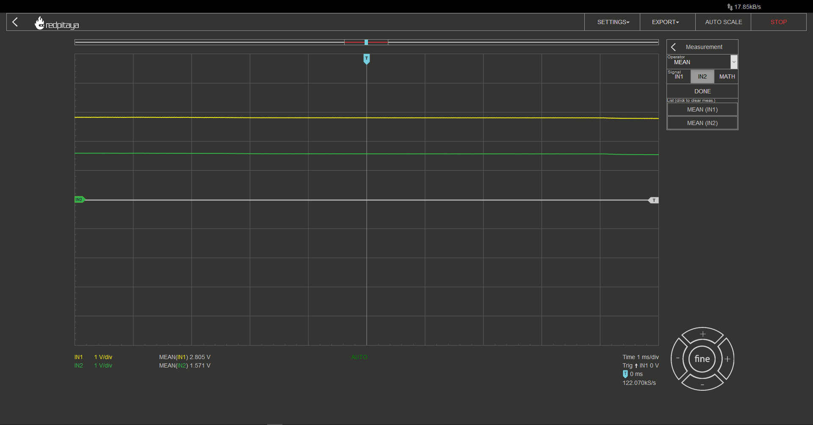

Resistor circuits
=================

Objective
---------

The objective of this activity is to brush up on your existing knowledge about Kirchhoff’s laws and expand on that knowledge by showing how they can be applied in resistor circuits. A secondary outcome will be a preliminary understanding of the Red Pitaya STEMlab hardware and software - test & measurement applications.

.. raw:: html

    

        <iframe src="https://www.youtube.com/embed/i3624KeZ_tw" frameborder="0" allowfullscreen style="position: absolute; top: 0; left: 0; width: 100%; height: 100%;"></iframe>
    

Background
----------

To begin this lesson, we will introduce you to a fundamental equation that is necessary for anyone interested in electronics.
  
  .. math:: U=R \cdot I

This equation serves as the foundation of resistor circuits, which includes any circuit that does not have active elements and remains unchanged for an extended period. Another equation that is useful in such circuits is the one that describes power dissipation on any resistor.

  .. math:: P=U \cdot I

Even though you can always determine voltage drop across, and current flowing through any resistor, it often comes in handy to remember two more equations, in which voltage drop or current is substituted for its function of the other two values.
  
  .. math:: P=I^2 \cdot R = U^2/R

With this out of the way, we can move on to…

Kirchhoff’s laws
----------------

In order to solve a circuit that consists of multiple components, it is important to understand Kirchhoff's laws, which include Kirchhoff's current law (KCL) and Kirchhoff's voltage law (KVL).

  *“KCL states that the algebraic sum of currents in a network of conductors meeting at a point is zero. Simply put, any current entering a node must also exit the same node. “*

If the first law talks about current, logic would suggest that the second law will be about voltage (KVL).

  *“KVL states that the directed sum of the potential differences (voltages) around any closed loop is zero.”*

If these concepts are still unclear, don't worry. We will clarify them through examples later on. Before that, we will explore some equations and facts that can simplify the process of solving resistor circuits.

Some equations and facts
------------------------

If there is only one voltage source in a circuit, it can be simplified using two equations for equivalent substitute resistors. This can help to easily calculate the voltage drop or current and make complex circuits easier to analyze.

  .. math:: R_{S_{series}} = R_1 + R_2

  .. math:: \frac{R_{S_{parallel}}}{1} = \frac{1}{R_1} + \frac{1}{R_2}

When you have a circuit with only one voltage or current source and one substitute resistor, you can simplify the circuit and then work backwards to calculate the branch voltages and currents. It's important to understand what happens to currents and voltages when you branch out. If the substitute resistor is split into parallel resistors, the voltage drop across them remains the same. In contrast, when the substitute resistor is split into series resistors, the voltage is divided among them proportionally to their resistance. This is due to the behavior of current, which remains unchanged when a substitute resistor is split into multiple series resistors. While this may sound complicated, knowing these principles can help you analyze complex circuits.

 .. math:: U_{R_x}=U_{R_{S_{series}}} \cdot \frac{R_x}{R_{S_{series}}}

This statement means that it is expected that when a resistor is divided into multiple parallel resistors, the current flowing through each resistor is divided in proportion to their resistance. Here are the equations that represent this relationship.

  .. math:: I_{R_x} = I_{R_{S_{parallel}}} \cdot \frac{R_{S_{series}} - R_x}{R_{S_{series}}}

It's not surprising that current prefers to flow through a path with lower resistance and the greater the resistance, the higher the voltage drop. Two more things to keep in mind when solving circuits in steady state are that capacitors act as an open circuit and inductors act as a short circuit.

Practical example
-----------------

The circuit we're going to use in this example is different from the one in the video, so you can solve it either by using Kirchhoff's laws or by substitution.

Let's assume we need to calculate voltage drop, current, and power dissipation on a certain resistor. We can solve this problem by substitution. For parallel resistors, we can represent their equivalent resistance using the "|" symbol.

To calculate voltage drop, current, and power dissipation in a circuit, we can use the substitution method to avoid calculating all voltage drops and currents. However, we will now analyze the circuit using a more formal method. The circuit has two branching nodes, so we will need to use two node equations based on Kirchhoff's Current Law (KCL). Additionally, there are three current loops in the circuit, but we will only need to use one loop equation based on Kirchhoff's Voltage Law (KVL).

  .. math:: I_0=\frac{U_0}{R_{S_{total}}} = \frac{U_0}{(R_1+(R_2 |(R_3+R_4))+R_5 )}=...

  .. math:: U_{R_2} = U_0 \cdot \frac{R_2 |(R_3+R_4)}{R_{S_{total}}} =...

  .. math:: I_{R_2} = \frac{U_{R_2}}{R_2} =...

  .. math:: P_{R_2} = U_{R_2} \cdot I_{R_2}=...

It is important to note that our goal of calculating voltage drop, current, and power dissipation in the circuit can be achieved without calculating all voltage drops and currents. However, to analyze the circuit using a more academic method, we must first identify its characteristics. The circuit contains two branching nodes, which requires us to apply two node equations based on Kirchhoff's Current Law (KCL). Furthermore, the circuit contains three distinct current loops, necessitating one less loop equation based on Kirchhoff's Voltage Law (KVL).

Let’s write them down.

  .. math:: A: \;\;\; I_2+I_3-I_1=0

  .. math:: B: \;\;\; I_5-I_2-I_4=0

I would like to mention that you should immediately see from the schematic that we have redundantly many currents. :math:`I_s`, :math:`I_1`, and :math:`I_5` are exactly the same, so are :math:`I_3` and :math:`I_4`.
As we progress through the loops in the circuit using Kirchhoff's Voltage Law (KVL), we must add any voltage encountered from the positive side and subtract any voltage encountered from the negative side.

  .. math:: L1: \;\;\; U_{R_1} + U_{R_2} + U_{R_5} - U_0 = 0

  .. math:: L2: \;\;\; U_{R_3} + U_{R_4} - U_{R_2} = 0

We can utilize the two-node equations, based on Kirchhoff's Current Law (KCL), to simplify the analysis of the circuit. Specifically, we can substitute redundant currents in node B with those from node A to simplify the equations.

  .. math:: I_5 - I_2 - I_4 = 0  \rightarrow  I_2 + I_3 - I_1 = 0

Observant readers will notice that, following this transformation, equations A and B are identical. This simplifies the analysis of the circuit, as we can express one of the currents in terms of the other two and proceed to solve the voltage equations.

 .. math:: I_1 = I_2 + I_3
 .. math:: equation\;A

Voltage drops in voltage loops should be written as products of currents and respective resistances.

 .. math:: U_{R_3} + U_{R_4} - U_{R_2} = 0

 .. math:: I_3R_3 + I_3R_4 = I_2R_2

 .. math:: I_3(R_3 + R_4) = I_2R_2

 .. math:: I_2 = I_3\frac{R_3+R_4}{R_2}
 .. math:: equation\;B

Let's now examine the other voltage loop in the circuit:

 .. math:: U_{R_1} + U_{R_2}+U_{R_5}-U_0=0

 .. math:: U_{R_1}+U_{R_2}+U_{R_5}-U_0=0

Unlike before, we are dealing with three distinct currents. This can be solved by plugging in :math:`equation\;A`, and we get:

 .. math:: (I_2+I_3)R_1+I_2 R_2+(I_2+I_3)R_5=U_0

 .. math:: I_2 (R_1+R_2+R_5 )+I_3 (R_1+R_5 )=U_0

 .. math:: (I_3  \frac{R_3+R_4}{R_2})(R_1+R_2+R_5 )+I_3 (R_1+R_5 )=U_0

 .. math:: I_3=\frac{U_0}{\frac{R_3+R_4}{R_2}(R_1+R_2+R_5 )+(R_1+R_5 ) }

And there you go, we now have an equation for :math:`I_3` that only relies on known constants. We only need to plug the values in and from there on, dominos will fall. Plugging :math:`I_3` into :math:`equation\;B`` yields :math:`I_2`. From there on :math:`equation\;A` gives us :math:`I_1`, and all of a sudden all currents are known. Lastly, we can use :math:`equation\;L1` to get any voltage drop we desire and all left to do is to calculate the power, which is now one simple multiplication away.
Was this more difficult than substitutions? Depends on who you ask. We solved the circuit both ways and you chose the way that best suits you. Besides, the second method yields all voltages and currents at once, which is what you will usually be tasked with on the exams.

Hands-on
--------

In the context of circuit analysis, it is common to use equations to solve for voltage, current, and power. For this experiment, we will construct a circuit using Red Pitaya and measure the voltage across resistors to test our calculations.

To begin, select resistors with values of at least 100 ohms to avoid any potential damage. Once you have chosen your resistors, build the circuit on a breadboard according to the provided diagram.

Next, choose the voltage source for U_0 from Red Pitaya's supply pins. You have the option to use 3.3 V, 5 V, or even -4 V depending on the requirements of your specific circuit.
  
.. image:: img/1_Extension_connector.png
   :name: Red Pitaya's pinout
   :align: center

After constructing the circuit and selecting the appropriate voltage source, connect probes in 10x mode to Red Pitaya and launch the oscilloscope application. Make sure to set the x10 attenuation in the software as well.

Since we are working with DC signals, it is not necessary to connect the alligator clips, as they are internally connected to Red Pitaya's GND. You can measure the voltage on any node by connecting a probe to it.

To make reading voltage easier, you may want to set up automatic mean measurements on both channels. This can be done by navigating to the "MEAS" menu and selecting "Operator = MEAN" for each channel, then selecting "DONE." This will display the average voltage for each channel, making it easier to read and interpret the measurements.

I recommend constructing a circuit with no more than three branching nodes to simplify the calculations. Select resistors and connect them in a suitable configuration. Next, use Ohm's Law and Kirchhoff's Laws to calculate the expected voltage drops in the circuit.

To verify the accuracy of the calculations, you can compare the calculated voltage drops with the measured values obtained by using probes connected to the circuit.

Written by Luka Pogačnik
Edited by Andraž Pirc

This teaching material was created by `Red Pitaya <https://www.redpitaya.com/>`_ & `Zavod 404 <https://404.si/>`_ in the scope of the `Smart4All <https://smart4all.fundingbox.com/>`_ innovation project.
