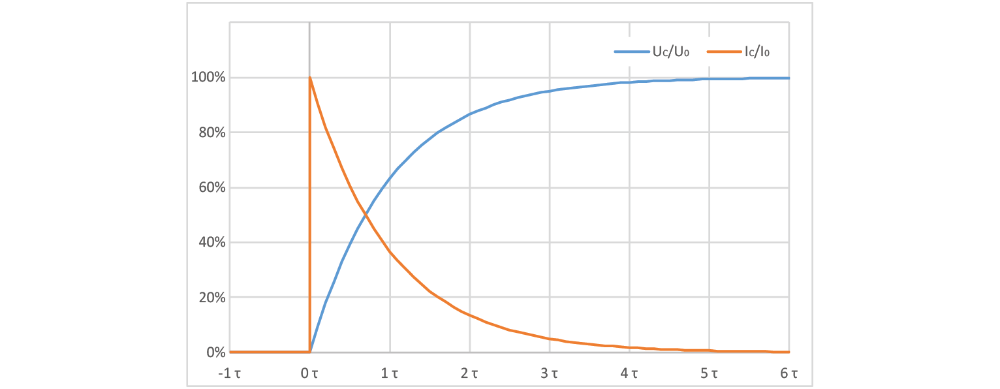
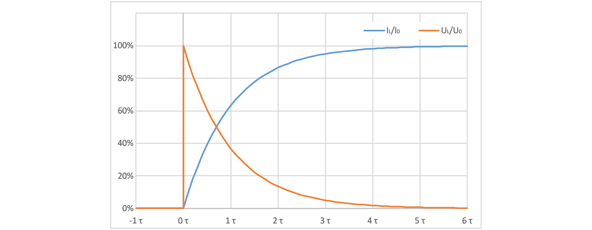
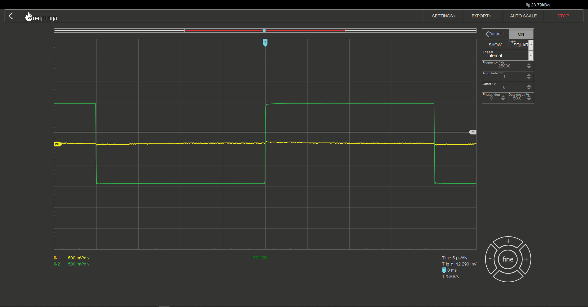
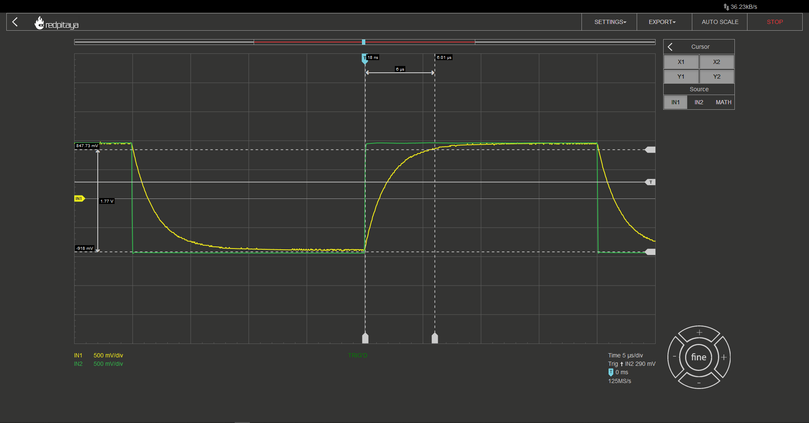
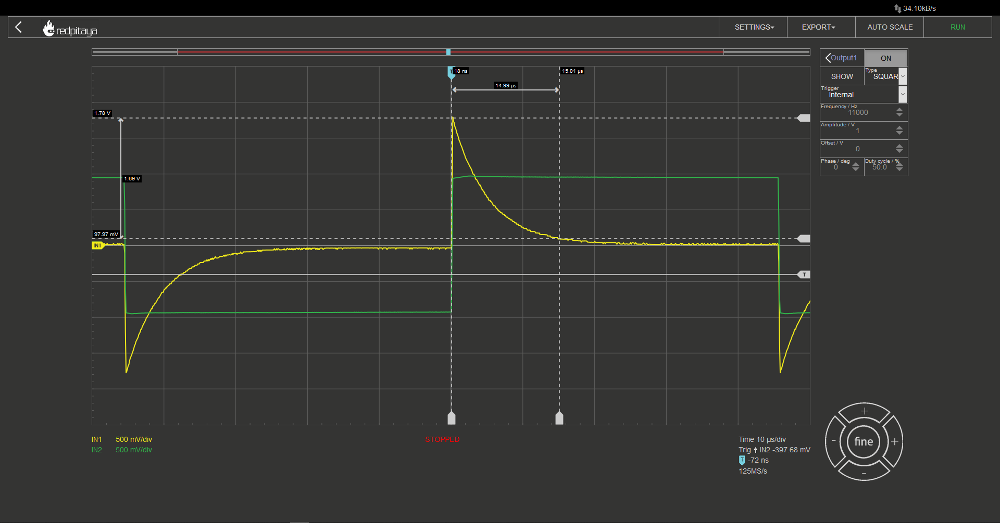

Transient Response
============================

Objective
---------------
The objective of this activity is to inform reader about transient response on a simple circuit that consists of resistors and either capacitors or inductors.

.. raw:: html

    

        <iframe src="https://www.youtube.com/embed/YLvVtrYUmqo" frameborder="0" allowfullscreen style="position: absolute; top: 0; left: 0; width: 100%; height: 100%;"></iframe>
    

Background
--------------
You might have already heard that in DC conditions, capacitors act as an open circuit inductors act as a short circuit. If you ignore inductors series resistance and capacitor’s parallel resistance, both of which more often than not can be neglected, no one will argue with you. Things get trickier when voltages aren’t constant, for example when voltage source is suddenly connected or disconnected.
Let's expand on the previously mentioned notion that in DC conditions capacitors acs as an open circuit and inductors act as a short. Capacitors resist voltage change and inductors resist current change. Just another line of gibberish or something actually useful? I hope you will find it to be the latter.

Capacitors
--------------
Resisting voltage change doesn’t mean, that capacitor’s voltage won’t change at all, it only means that it won’t ever happen suddenly. Upon voltage application, capacitors will charge slowly and when you try to discharge one, voltage will drop slowly. Contrary to that, current will change rapidly. That is described by the following two equations:

  .. math:: u_C = \frac{1}{C} \int i_c \cdot dt
  .. math:: i_C = C \cdot \frac{du_C}{dt}
  

   
But you didn't come here to do integrals, you want cookiecutter recipes. How does a capacitor behave when faced with a step change? Let’s observe a case where we have an R-C circuit who’s input jumps from 0 V to :math:`U_0`.

  .. math:: u_C = U_0 (1-e^{-t/\tau})
  .. math:: i_C = \frac{U_0}{R} e^{-t/\tau}
  .. math:: \tau = R \cdot C

Ok, so we have a set of two equations, one for voltage and one for current, and one fancy T-shaped constant. That one is pronounced as “tau” and is also known as time constant. Let’s take a look at capacitor voltage at different times, where time is a multiple of :math:`\tau`.

	+----------------------+---------------------------+---------------------------+
	| :math:`t`            | :math:`U_C / U_{C_{MAX}}` | :math:`I_C / I_{C_{MAX}}` |
	+======================+===========================+===========================+
	| :math:`0 \cdot \tau` | 00.00%                    | 100.00%                   |
	+----------------------+---------------------------+---------------------------+
	| :math:`1 \cdot \tau` | 63.21%                    | 36.78%                    |
	+----------------------+---------------------------+---------------------------+
	| :math:`2 \cdot \tau` | 86.46%                    | 13.53%                    |
	+----------------------+---------------------------+---------------------------+
	| :math:`3 \cdot \tau` | 95.02%                    | 04.98%                    |
	+----------------------+---------------------------+---------------------------+
	| :math:`4 \cdot \tau` | 98.16%                    | 01.83%                    |
	+----------------------+---------------------------+---------------------------+
	| :math:`5 \cdot \tau` | 99.32%                    | 00.67%                    |
	+----------------------+---------------------------+---------------------------+
	| :math:`6 \cdot \tau` | 99.75%                    | 00.24%                    |
	+----------------------+---------------------------+---------------------------+
	
You can see that voltage reaches over 99% of its steady state value at 5τ, which is why we consider to reach its final value at that point. Another interesting value is at 3τ, where voltage reaches exactly 95% of its final level, making it easy to read off of an oscilloscope. Current follows an inverse curve to that of the voltage, thus current values are 100% minus whatever voltage will be at.
AS a side note I would mention that if you have a CR circuit instead of an RC, voltage and current equations will be swapped (voltage will spike and current will change slowly).

Inductors
---------------

We say that inductors resist current change. This works in the same fashion as capacitors resisting voltage change, meaning that current can never change abruptly. The following two equations describe inductor’s voltage and current:

  .. math:: i_L = \frac{1}{L} \int u_L \cdot dt
  .. math:: u_L = L \cdot \frac{di_L}{dt}
  

But you didn’t come here to do integrals, you want cookiecutter recipes. How does a capacitor behave when faced with a step change? Let’s observe a case where we have an R-L circuit who’s input jumps from 0 V to :math:`U_0`.

  .. math:: i_L = \frac{U_0}{R} (1-e^{-t/\tau})
  .. math:: u_L =  U_0 \cdot e^{-t/\tau}
  .. math:: \tau = \frac{L}{R}

Ok, so we have a set of two equations, one for voltage and one for current, and one fancy T-shaped constant. That one is pronounced as “tau” and is also known as time constant. Let’s take a look at capacitor voltage at different times, where time is a multiple of :math:`\tau`.
   
	+----------------------+---------------------------+---------------------------+
	| :math:`t`            | :math:`I_L / I_{L_{MAX}}` | :math:`U_L / U_{L_{MAX}}` |
	+======================+===========================+===========================+
	| :math:`0 \cdot \tau` | 00.00%                    | 100.00%                   |
	+----------------------+---------------------------+---------------------------+
	| :math:`1 \cdot \tau` | 63.21%                    | 36.78%                    |
	+----------------------+---------------------------+---------------------------+
	| :math:`2 \cdot \tau` | 86.46%                    | 13.53%                    |
	+----------------------+---------------------------+---------------------------+
	| :math:`3 \cdot \tau` | 95.02%                    | 04.98%                    |
	+----------------------+---------------------------+---------------------------+
	| :math:`4 \cdot \tau` | 98.16%                    | 01.83%                    |
	+----------------------+---------------------------+---------------------------+
	| :math:`5 \cdot \tau` | 99.32%                    | 00.67%                    |
	+----------------------+---------------------------+---------------------------+
	| :math:`6 \cdot \tau` | 99.75%                    | 00.24%                    |
	+----------------------+---------------------------+---------------------------+

You can see that voltage reaches over 99% of its steady state value at 5τ, which…. Wait. Did I just repeat the same stuff I wrote for capacitors but only swapped currents and voltages? No, I also changed how τ is calculated. So yes. Ideal capacitors and inductors are inversely identical, meaning that you only need to remember four formulas: two for :math:`\tau`, one for rising signal and one for dropping signal.

What? Please explain...
-----------------------------
Let’s take a look at an example. RC circuit, input voltage drops from 5 V to 3 V ( :math:`U_0` =-2 V). Since we are looking at capacitor’s voltage, we should expect that it will slowly drop to that value, meaning that we need to find an equation that will equal 0 at t=0. :math:`e^{-t/\tau}` fits the bill. Final voltage will therefore be starting voltage + voltage change (3 V in this case). Voltage will follow the following curve:

  .. math:: u_C = U_{START} + U_0 (1-e^{-t/\tau})
  .. math:: u_C = 5V - 2V \cdot (1-e^{-t/\tau})

But don’t take my word for it. Feel free to try it out with a red pitaya. Just note that You will be limited to voltage range of ±1 V. Speaking of which…

The experiment
------------------
Let’s build a simple RC circuit and hook up the probes. Input 1 should be connected to the middle node, while output probe should be connected to resistor’s second lead. Capacitor’s other lead should be connected to ground (simply by connecting one alligator clip to it) and second input channel must be connected to Red Pitaya’s output. In the video I used a Y splitter that comes in RP’s accessories kit and used a piece of wire to connect output and input. It might look like a stupid solution but it’s the easiest way to see exactly what is happening on the output. If you connected probe to the node where the output probe is connected, you wouldn’t see the exact signal, because probes you are likely to be using have a 100 Ω internal resistance even in x1 mode, acting as part of a voltage divider. Oh and the second y splitter is there so that composition in photo is neater.

.. image:: img/2_img1.jpg
   :name: measuring setup for an RC circuit
   :align: center
   
With everything hooked up, you have set input 1 to x10 mode (but input 2 in x1 mode, since it’s just a piece of wire with no attenuation), and set RP’s signal generator to output a square wave at an appropriate frequency. Appropriate in this case means that it is greater than 1/5τ. I used a 100 Ω resistor and a 10 nF capacitor. Keeping in mind that output probe adds an extra 100 Ω, we get:

  .. math:: f_{max}=\frac{1}{10 \cdot 200\Omega \cdot 10nF}=50kHz

This will ensure that we can easily observe transient effect without the need to worry about previous transient.

   
Using cursors, we can measure time for the signal to reach 95% of its change. Since τ = 2 μs we are expecting this measurement to be 6 μs (3τ). Unsurprisingly that is the case. A quick side note: in my case actual peak to peak voltage was 1.85 V, that is why I am measuring time from the start of input change to delta of 1.77 V.

   
Let’s quickly swap out the capacitor for an inductor. And take a look at the resulting oscillogram.

   
Her we are measuring the time for voltage to move to within 5% of its final value. 15 μs this time. This is because the inductor I used was, 1 mH and the resulting time constant 5 μs.
I encourage you to try making RC and CR circuits but be warned; you will have to use something different than an oscilloscope probe to connect signal generator to the circuit or you will have to deal with resistor divider effect, which will reduce steady state voltage. Here is a photo of a “home lab” setup for such measurement. If you have a proper cable, I encourage you to use it instead. Or just mind the voltage divider and use a standard oscilloscope probe. Not that depicted method is a bit flimsy as cables don’t make the best contact with the signal generator. You might want to press on it.

.. image:: img/2_img2.jpg
   :name: alternative wiring setup that eliminates probe’s series resistance on signal generator’s output
   :align: center

If you make the experiment, you will notice that CR circuit’s oscillogram takes the shape of RL’s and vice versa. I won’t go into detail about why that is, but I will leave you a hint that it has something to do with capacitors and inductors following their respective current curves, current flowing through resistor and you measuring voltage on same resistors. I think I gave away enough.

One last thing
--------------------
In the video I teased you with a question, what would happen if we made the same experiments on an LC circuit. Drop the signal generator’s frequency even lower and make an experiment. Works best if you use a low impedance cable instead of an oscilloscope probe for connecting signal generator to the output.
Oh, I hope you didn’t think I will just tell you the outcome of the experiment! Well, I might in the future doc about [redacted] where this effect might come in handy.

Written by Luka Pogačnik

This teaching material was created by `Red Pitaya <https://www.redpitaya.com/>`_ & `Zavod 404 <https://404.si/>`_ in the scope of the `Smart4All <https://smart4all.fundingbox.com/>`_ innovation project.