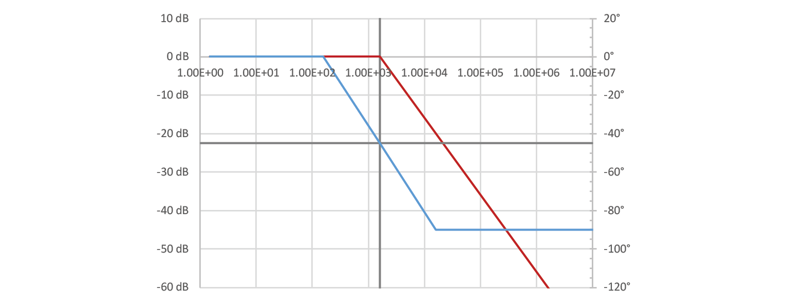
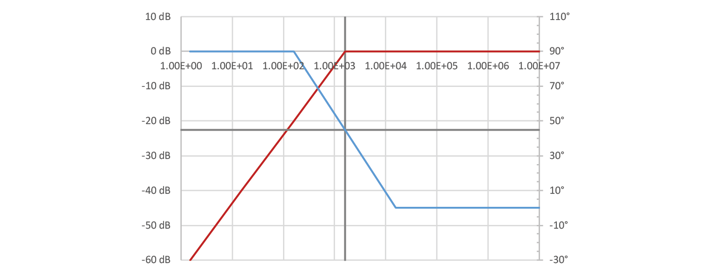
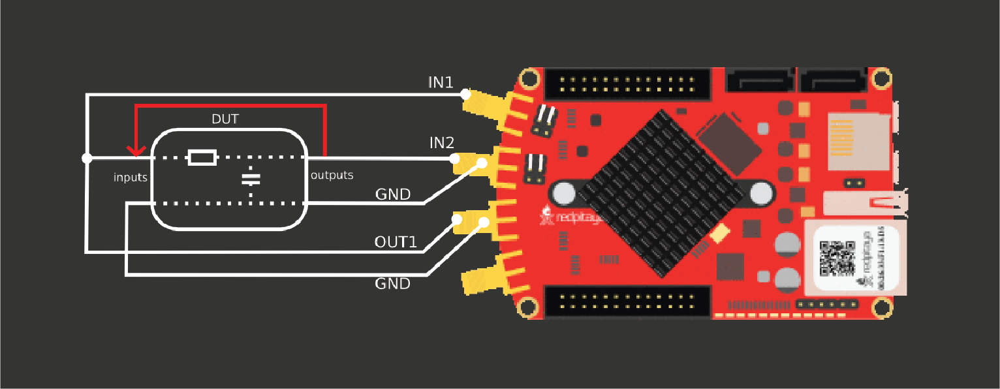
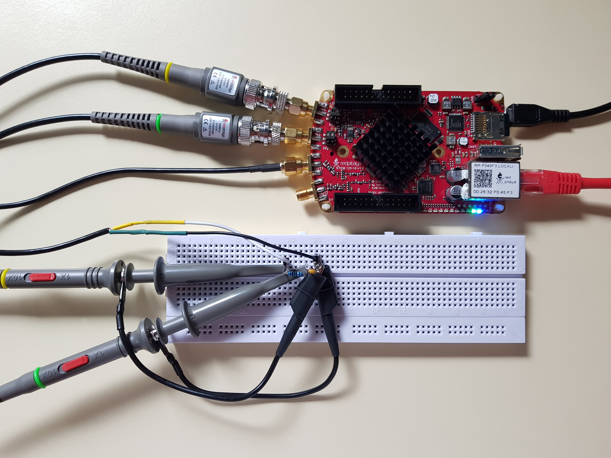
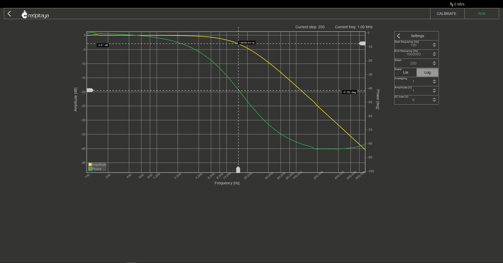
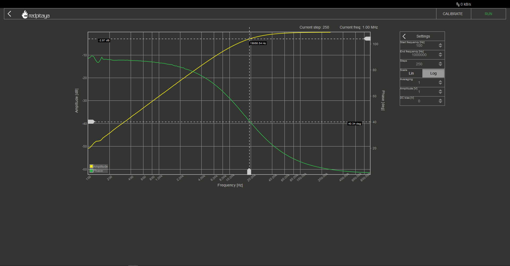

Analog Filters
============================

1. Objective
---------------
The objective of this activity is to introduce reader to the world of passive filter circuits. We will be looking at low pass and high pass filters.

.. raw:: html

    

		<iframe src="https://www.youtube.com/embed/8ctHHYkl7mQ" frameborder="0" allowfullscreen style="position: absolute; top: 0; left: 0; width: 100%; height: 100%;"></iframe>
    

2. Background
------------------
Previous course talked about transient response on simple RC and RL circuits. We saw, that square wave signal gets smoothed down when fed through an RC circuit. We intentionally set the frequency of the input signal such that its period was greater than RC’s settling time (5τ). Choosing a higher frequency would open a whole new can of worms, including Fourier analysis. To keep avoiding the mathematical background, let’s just agree on the statement, that a square wave consists of a sine wave at signal’s main frequency, and infinitely many sine waves at odd multiples of main frequency (3,5,7…). An RC filter attenuates those components differently depending on their frequency – the higher the frequency, the greater the attenuation. This makes the signal’s slope gentler, which is what we saw in last course. The inverse happened with RC circuit.
Because RC and CR circuits let some frequencies through, and some not, we call them filters. Oh, and before you attack me with “um actually-s”, yes, I did simplify a bit and no, I won’t talk about LR circuits. RL behaves as CR and LR as RC. I’ll try to keep this short and ignore inductors altogether.
Oh and one more thing. I will be talking a lot about signals and frequencies throughout this write-up. Whenever I do, I mean a sine wave signal at some frequency.

3. Decibels
----------------
Decibels, marked with dB, are a logarithmic unit, used for measuring relative power. To calculate attenuation (or gain) in dB, the following equation is used:

	.. math:: G_{dB}=10 \cdot log_{10}(P/P_0)
  
If that wasn’t confusing enough, decibels are exclusively for comparing power, but we will use it to compare voltages. Because we know that power is proportional to voltage squared, and that exponents inside a logarithm translate to multiplication outside of the logarithm, we get another equation:

	.. math:: G_{dB}=20 \cdot log_{10}(U/U_0)
	
Simply put, for every 6 dB, signal is multiplied (or attenuated) by a factor of two. For example, 30 dB corresponds :math:`2^5`.

4. Phase
------------
You likely know what happens if we add a fixed value to a sign function: it shifts left/right by a corresponding amount. This shift is known as phase (:math:`\varphi`).

	.. math:: f(t)=A \cdot \sin⁡(x)

If :math:`\varphi` equals :math:`\pi/2`, sine function transforms into a cosine function. If offset value equals :math:`2\pi` or a whole multiple of that, function is seemingly unaltered.

5. Impedance
----------------
Impedance can be thought of as “complex resistance”. It consists of resistance and reactance.

	.. math:: Z=R+jX

X represents components reactance, which is in complex domain. It is calculated differently for capacitors and inductors:

	.. math:: X_C=\frac{1}{2\pi \cdot f \cdot C}
	.. math:: X_L=2\pi \cdot f \cdot L

The j symbol represents complex operator i, because in electronics, lowercase letter i is already reserved for time variable current.
Impedance can also be expressed in polar notation as it helps to illustrate attenuation and phase shifting of the signal.

	.. math:: Z=|Z| \cdot e^{j \cdot \varphi}
	.. math:: |Z|=\sqrt{R^2+X^2}

Multiplying a signal by :math:`e^{j \cdot \varphi}` only shifts its phase by :math:`\varphi` without affecting absolute value. This means we can use |Z| to calculate signal attenuation and :math:`\varphi` for signal shifting.

6. Background math / complex voltage divider
----------------------------------------------
Aside from the name, there is nothing too complex in the underlying math. Voltage divider, where instead of resistances, we are using impedances.

You will reacll that output voltage is caluclated as:

	.. math:: u_0=u_i \cdot \frac{Z_2}{Z_1+Z_2}

If signal attenuation is all we’re after, we can use absolute impedance and ignore complex numbers altogether. This way, calculation is hardly any different than with resistive voltage divider. Keep in mind though that this only works for one frequency at a time as frequency is a parameter for calculating reactance. This method also doesn’t account for phase shift.
Accounting for different frequencies and phase shift is a bit trickier as you have to fiddle with complex numbers. If division by complex number doesn’t scare you, you should be fine. For the brevity’s sake, I won’t provide an example as you won’t ever encounter a need to do such calculations outside of exam paper world.
Enough background, time for the meat of this course.

7. What is common to all filters
--------------------------------------
Corner frequency. It is also known as a cutoff frequency. This is a frequency at which signal drops by 3 dB, which equals 71% of its initial amplitude (:math:`1/ \sqrt{2}`). This frequency is calculated as:

	.. math:: f_c = \frac{1}{2\pi \cdot R \cdot C}
	
You might recognize the RC part as τ, in case you want to play with RL filters.
In simplified terms, low pass filters have no attenuation below filter’s corner frequency, and start to attenuate the signal by 20 dB/decade. What is a decade? It is a span in which value is changed by an order of magnitude. Examples of two-decade span might be 1,10,100 or 3,30,300.
Still talking in simplified terms, phase starts to drift one decade before corner frequency and stops moving one decade after it. In total, it moves by 90°, crossing the 45° point at the corner frequency.
In practice, you will almost never see signal behave exactly this way since reality is not a kind lady. But because engineers like simplifications, we will use them up until the experimental section of this course.

8. Low pass filter
--------------------
As mentioned before, a low pas filter is just an RC circuit.

Let’s construct a low pass filter from a 1000 Ω resistor and a 10 nF capacitor. Calculated corner frequency is 15.9 kHz, idealized graph should look a little like this (not that X axis is logarithmic): 

Below corner frequency there is no attenuation, phase begins to shift one decade and settles one decade after it. A thing to point out in this simplification is that it is in conflict with the definition of corner frequency.
Corner frequency is defined as the point at which signal’s amplitude crosses the -3 dB mark, but on this graph, attenuation at corner frequency is zero. This conflict should be considered as a mere random fact to annoy your colleagues with as it really isn’t that important.

9. High pass filter
---------------------------
If low pass is just an RC circuit, high pass filter will probably be a CR circuit, right? Yes.

Let’s take a look at the characteristics of such filter, constructed from same components as before – a 1000 Ω resistor and a 10 nF capacitor. Corner frequency will be the same, 15.9 kHz, but the characteristic curves will be different. Note that the phase axis has been altered.

10. Bode analysis
-------------------
You may have wondered how we would measure filter’s characteristics in real world. The answer is simple: we excite the circuit with a synthesized sine wave at multiple frequencies along within the desired range, and measure amplitude gain (attenuation) and phase shift. Red Pitaya has a built in bode analysis functionality.
Let’s build a low pass filter and hook it up to the Red Pitaya to see it in action!

11. Hands on experiment
---------------------------
Wiring is important here. If you are ever unsure how to do it, you can always hit “calibrate” button in Red Pitaya’s bode analyzer. Or you can reference this image, that has been taken from RP’s calibration instructions:

One thing this image doesn’t emphasize is that probes have to be in x1 mode and signal output has to have as low resistance as possible (meaning that you can’t use oscilloscope probes in place of a cable).

With that set, connect to Red Pitaya, click Bode Analyser app and bode plot should start automatically. You can stop it as the default settings are somewhat useless. In settings, set appropriate start and stop frequencies and hit Run. I recommend measuring in at least 100 steps.
Once measurement completes, you are left with two curves. Yellow one is for gain, and the green one for phase. Note that gain uses vertical scale on the left, while phase’s vertical axis is on the right. If you want to make measurements, you can add cursors. F cursors will snap to frequency, G to gain, and P to phase.
Below is a measurement for a low pass filter, using same components as before:

You will notice that this graph is quite a bit different than the idealized one. There are no sharp corners, corner frequency is too low, phase at corner frequency isn’t -45°, and it never reaches -90°. This isn’t even a comprehensive list of differences between ideal and real bode plot!
Some differences can be attributed to idealized graph being oversimplified, some to component values having value tolerances, and some to parasitic properties of used components. Let’s not dwell on that and move on to a high pass filter. Just swap R and C and rerun the analysis.

All the differences listed before are still present. Most notable among them is the fact that this time the corner frequency is too high. The reasons are the same as before.
This brings us to the conclusion. You now know how to design low and high pass filters, are familiar with their idealized characteristics and have a basic understanding of how reality differs from idealizations. Or at least that was the intent:)

Written by Luka Pogačnik

This teaching material was created by `Red Pitaya <https://www.redpitaya.com/>`_ & `Zavod 404 <https://404.si/>`_ in the scope of the `Smart4All <https://smart4all.fundingbox.com/>`_ innovation project.