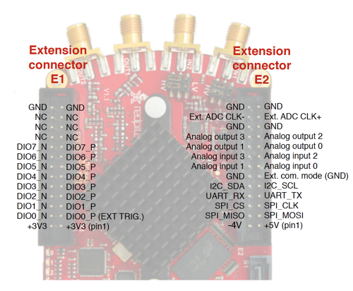
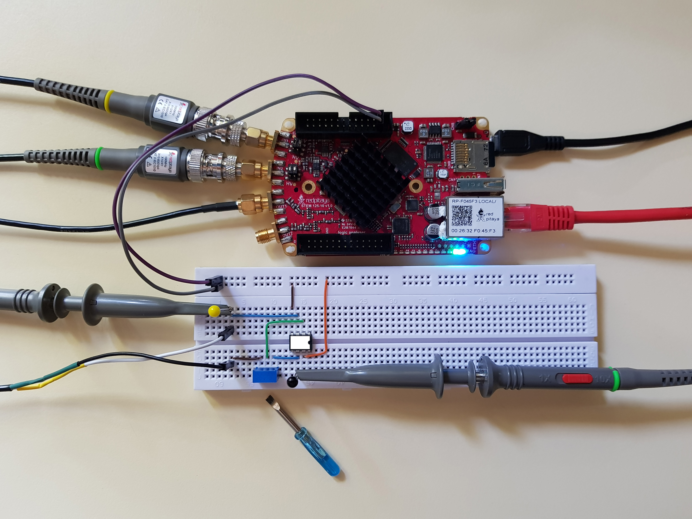
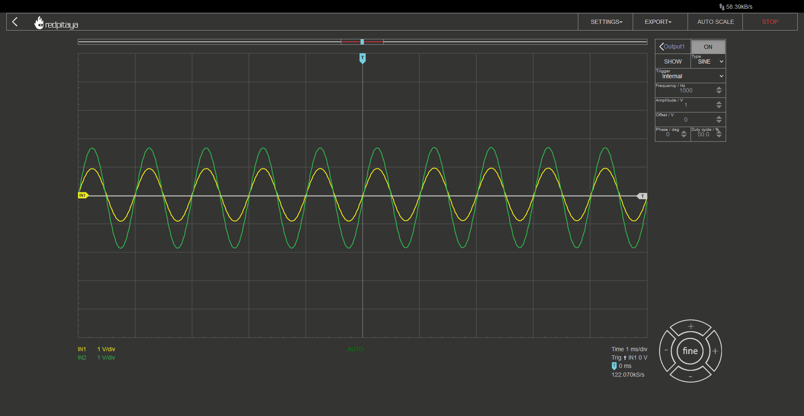
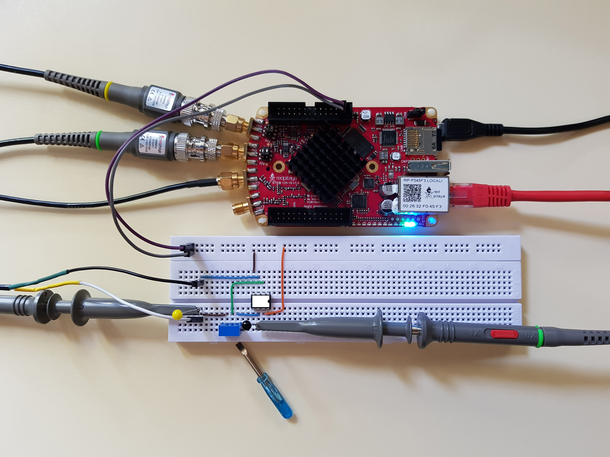
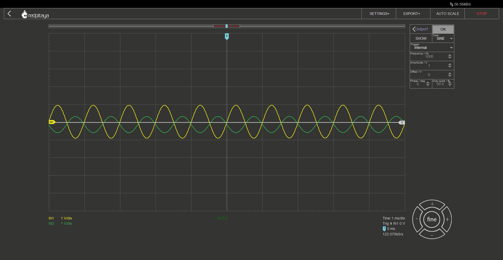

OpAmps 101
============================

1. Objective
---------------
The objective of this activity is to introduce the reader to a very useful yet not that well known type of electronic components, the operational amplifiers.

.. raw:: html

    

        <iframe src="https://www.youtube.com/embed/uCvupQx2Gsg" frameborder="0" allowfullscreen style="position: absolute; top: 0; left: 0; width: 100%; height: 100%;"></iframe>
    

2. Background
---------------
Operational amplifiers, more commonly referred to as OpAmps, are electronic components. From the outside, one will find two power pins, two input signal pins, and one output pin. Hidden inside the chip's package lies a chunk of doped silicon, that comprises a number of transistors, resistors and capacitors. They are configured in such a way, that OpAmp's output pin equals the voltage difference between the two input pins, multiplied by a significant factor.
At the first glance, OpAmps may seem like regular differential amplifiers, but, due to their very high gain and fast response time, OpAmps lend themselves to a plethora of other applications. In fact, their very high gain makes them for quite a lousy differential amplifier.

3. How it works
-----------------
I won’t go into detail about how OpAmps work as this is an introductory article on how to use OpAmps, but I will quickly go over some more important bits.
OpAmps have two input pins. One is called inverting (-) and the other one noninverting (+). Those shouldn’t be confused for power supply pins. Those are called positive and negative supply pins and may also be marked by + and – signs (though V+ and V- and variants are more common). Alongside those pins, all OpAmps also have an output pin. Some chips may also have additional connections for offset voltage compensation, but let’s leave that for a later paragraph.
As said before OpAmps have two supply pins, positive and negative one. If you are wondering why I am putting so much emphasis on those, that is because the negative one isn’t meant to go to GND and positive one to supply voltage. That may be done so, but more often than not, OpAmps are connected between positive and negative voltage, where negative is below GND potential (think -4 V pin on Red Pitaya).
Output pin equals the difference between noninverting and inverting inputs, multiplied by a large gain factor, known as “open loop gain” (A_OL). It can easily reach the order of 100 000.

	.. math:: U_{OUT}=A_{OL} \cdot (U_+-U_-)
	
Such a large gain means, that output would exceed supply voltage for even a very small difference between input voltages; even some noise, that gets coupled to inputs, may send the output into saturation. What is saturation? Saturation is what happens when OpAmp’s output hits the limits of how far it can go. And how far is it? Usually from a few volts above negative supply voltage up to a few volts below positive supply voltage. There are Some OpAmps who’s output can swing from negative to positive supply voltage. Those are called rail-to-rail OpAmps. And just to make it clear: when OpAmp hits saturation, output gets clamped.

4. The symbol
-----------------
Even though OpAmps come in a wide selection of packages, symbols have become standardized. They come in two flavours: one for conveying how a circuit works and one for drawing an electrical schematic for PCB production. The former doesn’t show power pins, while the latter does. I could talk about pins for offset compensation, differential outputs, and more, but if you are reading this article, you don’t have to bourdon yourself with those details.
Note that OpAmps’ and comparators’ symbols are very similar. In fact, they are the same. Understandable, since they are very similar in construction. 

   
Now that we’ve discussed the symbol, it is time to take a look at what can what functions an OpAmp can be used for.

5. A comparator
-----------------
Even though a comparator can be bought as a separate component (and is better optimized for speed), OpAmp can take its place. Whenever noninverting input’s voltage is above inverting input’s, output will go into positive saturation and vice versa.

6. A voltage follower
------------------------
Let’s make a thought experiment. If we connected OpAmps output to its inverting input, and noninverting input to some arbitrary voltage. What would the output voltage be?

If you read the previous chapter, you will tackle this problem by solving the “equation” for a comparator. If output was above U+, it hit negative saturation. Now it was below U+ and would hit positive saturation. Now it is above U+ and…
…and that is why we can’t use comparators instead of OpAmps. Those have a slower response and are thus more resistant to becoming unstable. What would actually happen is the following: If output was above U+, it would decrease, and keep decreasing until ouitput (and thus U-) would become equal to U+. Saying “slowly” is a bit misleading as it actually happens in microseconds or faster. 
In short: in this configuration output is equal to the input voltage. In fact, that is true for most OpAmp circuits when working within voltage limits.
But how is that useful? We say that OpAmps have a very large input impedance and a very small output impedance. This means that we can safely connect inputs to any node in a circuit (so long as node’s voltage is within OpAmps safe operating range) without affecting it, and output to any load (so long as current draw doesn’t exceed OpAmp’s rating). This comes in handy when you want to connect a load to a circuit without affecting that circuit. You know, like in analogue filters…

7. An amplifier
-------------------
Let’s say that you wanted to amplify the input voltage by some smaller factor. Something less than tens or hundreds of thousand that OpAmps normally do. How would you tackle that?

Let’s take a look at why this circuit would do the trick. Assuming OpAmp will not be hitting saturation, inverting and noninverting inputs will be at the same potential. That is marked with a dashed line. Emphasis on “marked”. Inputs aren’t connected. Now let’s take a look at the equations:

	.. math:: (U_{OUT}-0V) \cdot \frac{R_1}{R_1+R_2}=U_{IN}

Resistors 1 and 2 form a resistive voltage divider for output voltage. Obviously Output voltage will have to be greater than input, otherwise original assumption, that both inputs are at the same potential, would be false. If we flip around the equation to express exactly what output voltage should be, we get:

	.. math:: U_{OUT}=U_{IN} \cdot (1+\frac{R_2}{R_1} )

If this equation holds true, this amplifier circuit can’t possibly output voltage that is less than input voltage. Shall we verify those claims? Later, let’s first take a look at another common use case.

8. An inverting amplifier
-----------------------------
If OpAmp can be used for signal amplification, and it has an input that we call “inverting” … then there must be a configuration called “inverting amplifier”.

Once again, starting assumption is that both inputs are at the same voltage. I trust you would be able to derive the formula for output voltage as the approach is the same as before, but if you’ll want to verify your calculations, here is the setup:

	.. math:: (U_{OUT}-U_{OUT}) \cdot \frac{R_1}{R_1+R_2}=0V
	
And if we express output voltage as a function of input voltage:

	.. math:: U_{OUT}=-V_{IN} \cdot \frac{R_2}{R_1}

In this configuration, output voltage will always have an inverse sign than input, but its absolute value may be amplified or attenuated.
Now that we went through all basic OpAmp circuits, let’s verify that the two amplifiers actually behave the way I described.

9. A normal amplifier - the experiment
------------------------------------------------------
First thing that we will need is an OpAmp. I have decided to use OP37. Why? There are two in the ADALP2000 Analog Parts Kit (the kit this entire set of courses is designed around) so ye can fry one without worrying too much. Here is the chip’s pinout:

	
Connect U+ to Red Pitaya’s 5V pin and U- to -4V pin. Inputs and output will be connected as per schematic, and the rest (pins with greyed out names) will remain unconnected.

The one difference I made is that I used a potentiometer instead of two separate resistors for R1 and R2. This way I can easily vary resistor ratio. Since this is the most complex circuit so far, I made sure to wire it cleanly so that you can follow the wiring more easily. For those wondering: Connections were made using wires from Ethernet cables. CAT6 works the best.
Let’s now connect everything up. All probes in x10 mode, one on input, one on output. Let the Red Pitaya generate a sine wave and connect it to the amplifier’s input. For those playing along at home, I encourage you to turn the potentiometer and observe what happens with the output. What is the maximum amplification? When do you hit Saturation? Are inverting and noninverting inputs really at the same voltage? How about when OpAmp hits saturation? Unfortunately, I can’t show how I turn the potentiometer in this writeup but you can experiment at home, or watch the accompanying video.

If you followed the diagram correctly, you should see something like this on the screen. At least if you didn’t forget to enable the signal generator and if resistor divider is within what OpAmp can handle.

As a side note I would like to mention that a voltage follower is “just” an extreme variant of an OpAmp amplifier, where R2 equals 0 ohms and R1 is infinite.

9. A less normal amplifier - the experiment
------------------------------------------------------
This experiment will be the same deal as before. I made sure to make the wiring as clear as possible, and used a potentiometer instead of two discrete resistors. Here is the circuit:

I would once again encourage you to see what happens when you turn the potentiometer. Try to make predictions. Maybe measure signal amplitudes and calculate resistor ratio. You can then plug the potentiometer out and measure resistances to verify your calculations.

10. Conclusion
----------------
If you read through the entire article, you are now familiar with the four most common (or at least beginner friendly) applications for operational amplifiers: comparator, voltage follower and two flavours of amplifiers. If you also followed along with the experiments, you may have gotten a feeling for distortions you will encounter when amplifier is operating close to the or beyond saturation. In any case I hope You found this article both interesting and fun.
The question I would like to leave you with is: how would you build a noninverting amplifier with attenuation (gain between 0 and 1)?

Written by Luka Pogačnik

This teaching material was created by `Red Pitaya <https://www.redpitaya.com/>`_ & `Zavod 404 <https://404.si/>`_ in the scope of the `Smart4All <https://smart4all.fundingbox.com/>`_ innovation project.