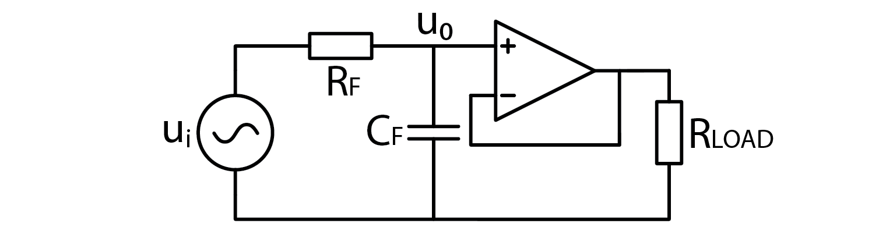
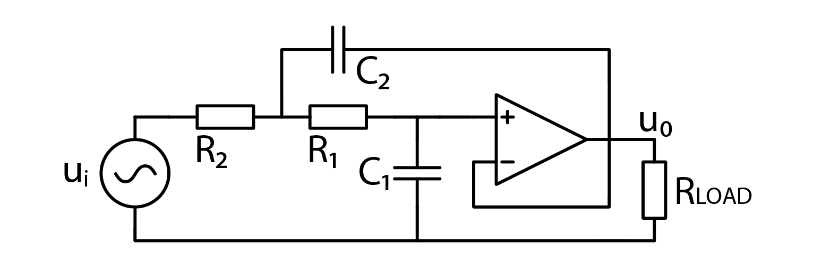
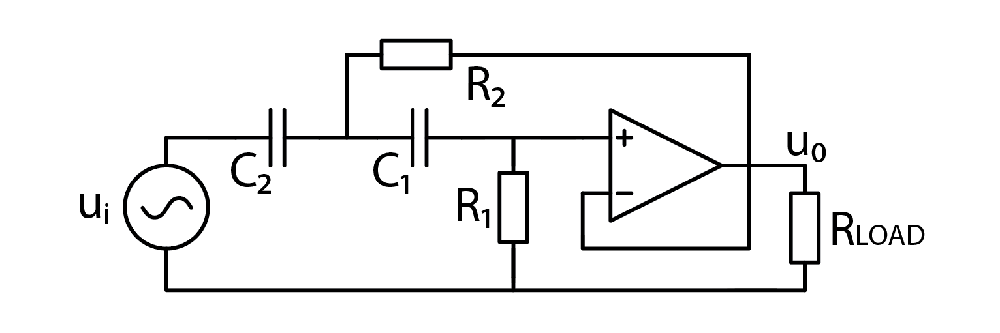
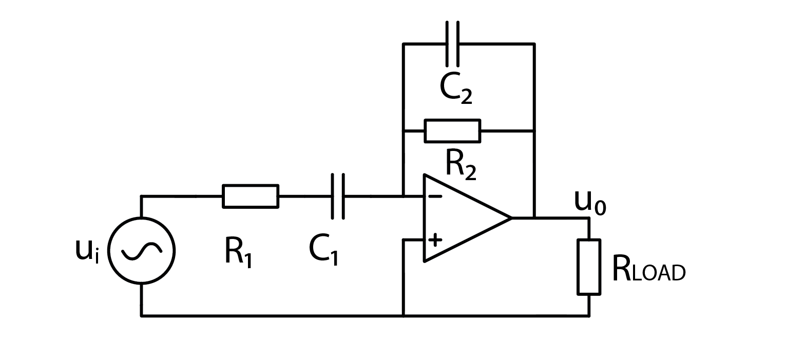
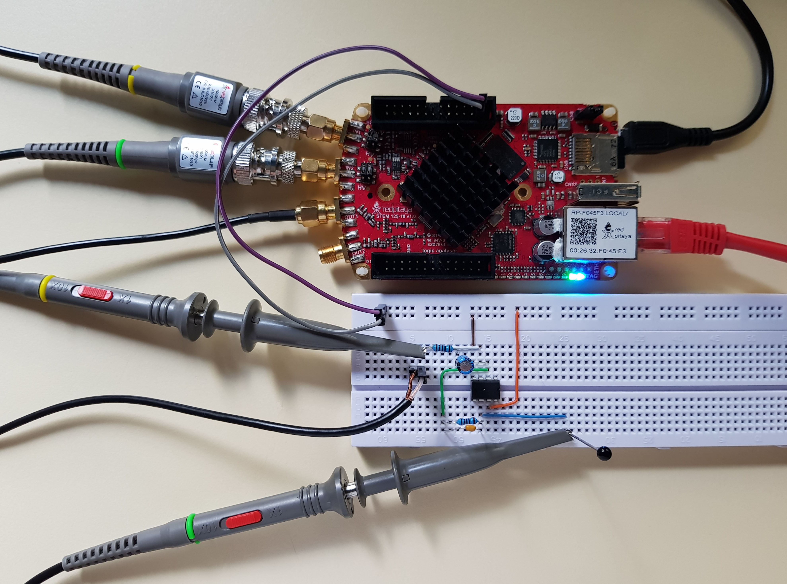
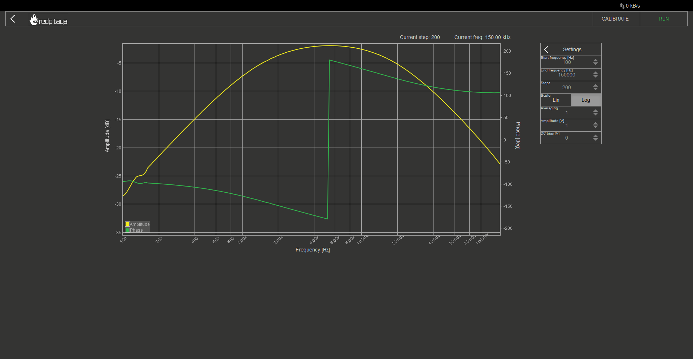
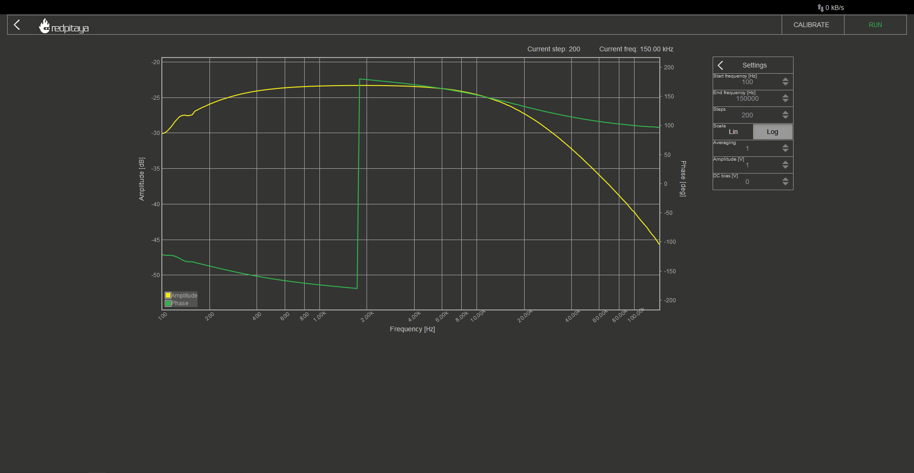

Active Filters
============================

1. Introduction
---------------
In the last two courses we’ve learned about OpAmps and filters. The logical next step is to take a look at OpAmp filters (which are actually called active filters, but that would ruin my joke), and that is exactly what we are about to do. In this course you will learn why we use OpAmp’s in analog filters, and how to design them.

.. raw:: html

    

        <iframe src="//www.youtube.com/embed/dQw4w9WgXcQ" frameborder="0" allowfullscreen style="position: absolute; top: 0; left: 0; width: 100%; height: 100%;"></iframe>
    

2. The why
--------------
Let’s take a look at a simple RC high pass filter. We’ve learned how to calculate its characteristics in isolation. But what would happen if we attached a load to filter’s output? It doesn’t take a genius to see, that attaching a resistive load will alter filter’s characteristics, because the newly added load is nothing but an additional resistor in parallel to the filter’s one. Two resistors in parallel can always be simplified into a single resistor whose resistance is less than either of original resistors’. Result is a different high pass filter with a higher cutoff frequency.

Let’s now take a look at a low pass filter, loaded with a resistive load. The two resistors form a voltage divider, meaning that filter will attenuate even DC signals.

In both examples, load’s resistance has greater impact on filter’s performance when its resistance is smaller. If load has a huge resistance, it’s effect on filter’s characteristic is negligible.
I’ve been using term resistance for the sake of simplicity but the same goes for capacitive and inductive loads though their exact effect is a bit different from resistor’s. To correct my previous sentence, if load’s impedance is huge, effect on filter’s characteristic will be negligible.

3. Enter OpAmps
-----------------
Huge impedance? Like huge input impedance? OpAmps have a huge input impedance!
Buffering filter’s output with an OpAmp follower will in fact make sure that load doesn’t change filter’s characteristics. If you don’t trust me, I encourage to verify my claim but I won’t lose any more time on this solution, because there is a much better one just around the corner. Actually I will. Here’s the schematic:

4. Second order low pass filter
-------------------------------------
OpAmp followers for buffering regular analog filters are great, but if we add just another RC pair, we can make the filter stronger. I won’t bore you with detailed explanations of how that works. Here is the schematic for a second order low pass filter:

The eagle eyed among you will notice a good old RC low pass filter, buffered by an OpAmp follower. The rest is less intuitive. Corner frequency of this filter is calculated as such:

	.. math:: f_C=\frac{1}{2\pi\sqrt{R_1 C_1 R_2 C_2 }}

5. Second order high pass filter
-------------------------------------
Are you ready to be amazed by the unexpected schematic of a second order high pass filter? Sorry to inform you that you won’t be. It’s the same as before, just resistors and capacitors switch places. Even corner frequency is the same. Here’s the schematic:

6. But what’s the point?
--------------------------------
Good question! From what I’ve told you so far, second order filters require an OpAmp and extra pair of resistor and capacitor. Let us explore the benefits of second order filters.
The first, and the most prominent one, is greater signal attenuation slope. First order filters’ slope is 20 dB/decade. Each additional order adds another 20 dB/decade, meaning that second order filters have 40 dB/decade attenuation slope. And yes, higher order filters exist as well. 
Higher order filters also induce more phase shifting. You may recall that standard low pass filter will shift the phase by a total of 90°. This effect is multiplied by the order of implemented filter. This means an ideal second order low pass filter will shift phase by 180° in total.

7. Band pass filter
--------------------------
If second order filters behave as two buffered filters in series… more or less, then shouldn’t we be able to construct a band pass filter in much the same way? Well yes, yes we could!
Just take C1 and R1 from low pass filter and C2 and R2 from high pass, tune cutoff frequencies and viola, a bandpass filter! Wrong. It would’ve been nice but in practice, such filter doesn’t work. I checked.
Active bandpass filter uses this schematic instead:

This filter has two corner frequencies. One for high pass and one for low pass portion.

	.. math:: f_{HPF}=\frac{1}{2\pi R_1 C_1}
	
	.. math:: f_{LPF}=\frac{1}{2\pi R_2 C_2}

One more special thing about this filter is that it is inverting. Negative gain can also be considered as a phase shift of 180°. It is calculated as:

	.. math:: A=-\frac{R_2}{R_1}

To truly understand how this filter works, we have to go for a somewhat deep dive into mathematical background. I propose we settle for not truly understanding how this filter works, and try it out instead.

8. The experiment
----------------------
Let’s fire up a Red Pitaya and build the circuit.

You know the drill. Signal generator channel 1 and input channel 1 to filter input, channel 2 to output. Both probes in x1 mode and run the bode analyzer! Both resistors are 100 ohm, the big capacitor (C1) is 47 uF, the small one is 100 nF, and here is what I got:

Nothing too special, sure, but we can move cutoff frequencies to alter the filter’s characteristics. This can be done either by changing resistors or changing capacitors. The following bode plot shows filter’s characteristics where C1 or R1 got changed by a factor of 10. I will let the reader try to determine which component got changed. Hint: take a look at the Y axis.

9. Conclusion
------------------
You can play around with the other two active filters we discussed in this course as well but I won’t take any more of your time. Hope you learned something new, if nothing else, that a voltage follower can be used to make sure load doesn’t affect signal shape. Until next time, bye! 

Written by Luka Pogačnik

This teaching material was created by `Red Pitaya <https://www.redpitaya.com/>`_ & `Zavod 404 <https://404.si/>`_ in the scope of the `Smart4All <https://smart4all.fundingbox.com/>`_ innovation project.