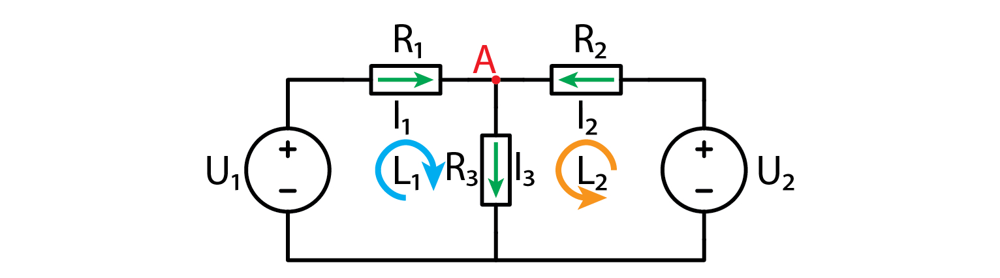
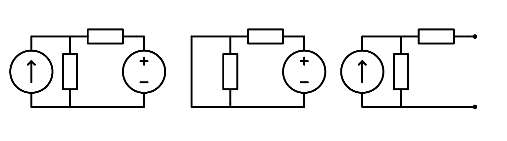
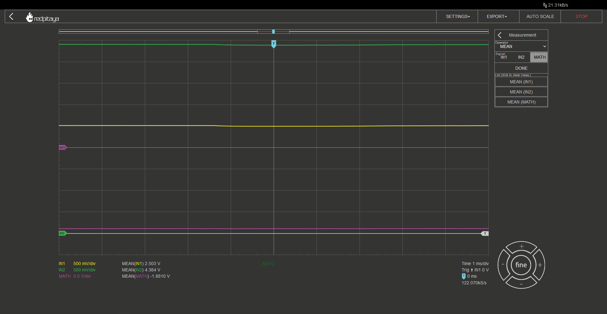

Superposition
================

1. Introduction
------------------
Because I know that you’ve more than likely had enough of all the OpAmps and filters and OpAmp filters and such, we will be making a break from all those fancy circuits and components, and focus on the basics. We will take a look at a trick, that can be used with linear circuits with multiple voltage or signal sources, the superposition.

.. raw:: html

    

        <iframe src="https://www.youtube.com/embed/emmXle4LSbc" frameborder="0" allowfullscreen style="position: absolute; top: 0; left: 0; width: 100%; height: 100%;"></iframe>
    

2. But why?
----------------
The answer is simple. Take this very simple circuit and tell me, what current flows through, let’s say… R2?

Even though this circuit consists of mere five components, solution is all but trivial. In the first course I showed you how to simplify a simple resistive circuit, but this doesn’t work here as we have two voltage sources. The only way to solve this circuit is by good old fashioned calculations. Let’s start with the two nodes.

	.. math:: A:-I_1+I_2-I_3=0 \rightarrow I_2=I_1+I_3

Ok, this wasn’t so bad, how about the loops?

	.. math:: L1
	.. math:: U_{R_1}+U_{R_2}-U_1=0
	.. math:: I_1 R_1+I_2 R_2=U_1
	.. math:: I_1 R_1+(I_1+I_3 ) R_2=U_1
	.. math:: I_1 (R_1+R_2 )+I_3 R_2=U_1
	.. math:: I_3=\frac{1}{R_3} (U_1-I_1 (R_1+R_2 ))
	
	.. math:: L2
	.. math:: U_{R_3}+U_{R_2}-U_2=0
	.. math:: I_3 R_3+(I_1+I_3 ) R_2=U_2
	.. math:: I_3 R_3+(I_1+I_3 ) R_2=U_2
	.. math:: I_1 R_2+I_3 (R_2+R_3 )=U_2
	.. math:: I_1 R_2+\frac{R_2+R_3}{R_3}  (U_1-I_1 (R_1+R_2 ))=U_2
	.. math:: I_1 (R_2-\frac{(R_2+R_3)(R_1+R_2)}{R_3})=U_2-\frac{R_2+R_3}{R_3}  U_1
	.. math:: I_1 = \frac{U_2-\frac{R_2+R_3}{R_3}  U_1}{R_2-\frac{(R_2+R_3)(R_1+R_2)}{R_3}}

Had enough? Because I did. Luckily this is all we need. Let’s say that all resistors were 100 ohms, U1 was 5V and U2 was 3.3V. Plugging those numbers in above equations we get the following resistor currents:

	.. math:: I_1=22.3 mA
	.. math:: I_2=27.7 mA
	.. math:: I_3=5.3 mA

Since all resistors are a hundred ohms, the voltage drops on resistors are just current through a resistor times one hundred.

3. A better alternative
---------------------------
If you skipped all the calculations in last chapter, I can’t blame you. They were everything but fun. And that was for a very simple circuit with two voltage sources and three resistors, just think what would happen if we had any more components!
Luckily there is a better way. We call it superposition. If a circuit is linear (this means that output can be written in the form of :math:`a \cdot U_1+b \cdot U_2+...+x \cdot I_1+y \cdot I_2+...=X`), we can analyze the circuit with only one source connected at a time. We do that for all sources and sum up the results to get the full output. This is known as superposition.
Note that “disconnection” means a different thing for voltage and current source. Voltage source gets replaced by an open circuit, while a current source is replaced by a short circuit as depicted below.

Let’s see how one would apply superposition theorem on this circuit. First, let’s disconnect U2 and solve the resulting circuit. Mind the direction in which currents are flowing as this is very important.

	.. math:: I_{1_{(1)}}=\frac{U_1}{R_1+R_2 |R_1}=\frac{5 V}{100 \Omega+50 \Omega}=33.3 mA
	.. math:: I_{2_{(1)}}= -I_{3_{(1)}}=\frac{I_{1_{(1)}}}{2}=16.7 mA

When U1 is disconnected we get the following:	

	.. math:: I_{3_{(2)}}=\frac{U_2}{R_3+R_1 |R_2}=\frac{3.3 V}{100 \Omega +50 \Omega}=22 mA
	.. math:: I_{2_{(2)}}= -I_{1_{(2)}}=\frac{I_{3_{(2)}}}{2}=11 mA

And to get the final result it up:

	.. math:: I_1=I_{1_{(1)}}+I_{1_{(2)}}=33.3-11=22.3 mA
	.. math:: I_2=I_{2_{(1)}}+I_{2_{(2)}}=16.7+11=27.7 mA
	.. math:: I_3=I_{3_{(1)}}+I_{3_{(2)}}=-16.7+22=5.3 mA

If you ask me, this method is a lot better. Much simpler. Harder to get wrong. Add more positive descriptors.

4. The expereiment.
-----------------------
There is always an experiment. But this one will be extra simple. Build a circuit and learn how to efficiently measure it. 5V, 3.3V, and GND are stolen from the Red Pitaya and both probes are set to 10x mode.

.. image:: img/6_experiment.jpg
	:name: experimental setup
	:align: center

Since this is a DC circuit with no AC stimulation, channels 1 and 2 will be just straight lines, effectively acting as voltage meters. Voltage drop between nodes can be automatically calculated by selecting MATH->Operator = “minus“->ENABLE. It would also be wise to add automatic measurements on all signals by clicking MEAS->Operator = “MEAN” ->DONE. Do this for all signals, IN1, IN2, and MATH. You can now play around with analyzing this circuit. Or maybe you would like to build a fancier one and play around with it. Red Pitaya has one more voltage output pin, -4V, hint hint…

5. Conclusion
------------------------
Superposition is a powerful tool for analyzing linear circuits. Whenever possible, it will be an easier alternative to “standard” calculations. Disconnect all but one source, calculate whatever you want to calculate, rinse and repeat for other sources. We will explore a practical application of superposition in next course.

Written by Luka Pogačnik

This teaching material was created by `Red Pitaya <https://www.redpitaya.com/>`_ & `Zavod 404 <https://404.si/>`_ in the scope of the `Smart4All <https://smart4all.fundingbox.com/>`_ innovation project.