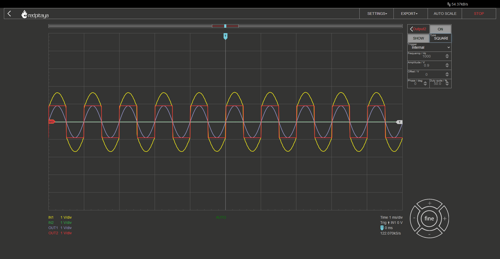
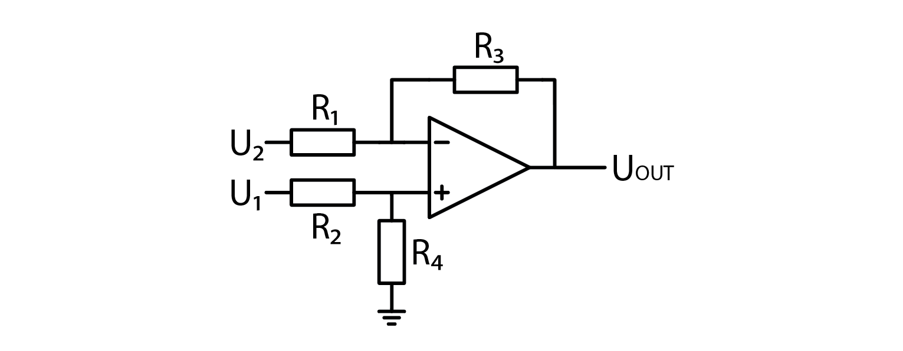
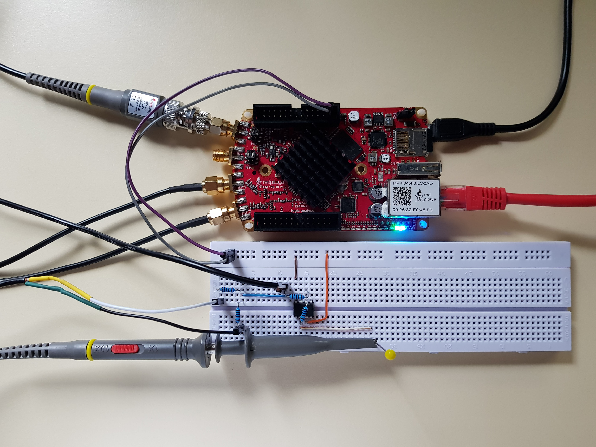
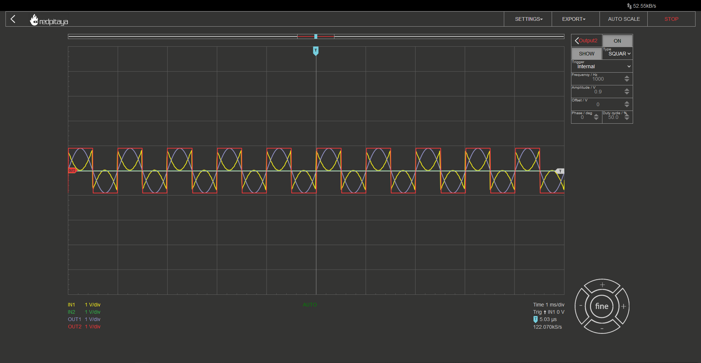

Analog addition and subtraction
=================================

Introduction
------------------
We have explored voltage dividers, voltage multipliers, and voltage inverters (negative multipliers). That covers second year primary school algebra. But what about the first year: Adding and subtracting? Throughout this course we will learn how OpAmps can be used to implement those two functions.

.. raw:: html

    

        <iframe src="https://www.youtube.com/embed/_YHuntYADYU" frameborder="0" allowfullscreen style="position: absolute; top: 0; left: 0; width: 100%; height: 100%;"></iframe>
    

Addition
----------------
In primary school you learned to add numbers before subtraction, and we will follow the same steps here. Addition first. We want a circuit that will be able to implement the following function:

	.. math:: U_{out}=a \cdot U_1 + b \cdot U_2

To make things easier to understand, let’s first take a look at how we would implement just one part of this equation, :math:`U_{out}=a \cdot U_1` for example. One circuit that matches this equation would be an inverting amplifier.

It implements the function :math:`U_{out}=-\frac{R_2}{R_1} \cdot U_1`. Now let’s make a thought experiment. If we added another voltage source, U2, connected to the inverting input of OpAmp through a capacitor, and U2 was at zero volts… What would happen? Output voltage wouldn’t change since inverting input is a virtual ground. But if we set U1 to 0V and U2 to something different, implemented function would be :math:`U_{out}=-\frac{R_2}{R_3} \cdot U_2`.

Did you read the previous course? The one about superposition? If you did, you must have already guessed what direction we’re sailing. Superposition. Function :math:`U_{out}=a \cdot U_1 + b \cdot U_2` is a textbook example of a linear combination of multiple inputs, making it suitable for solving with superposition theorem.

That said, we have learned how to add two or more voltages together. “Two or more? You only showed two!” Yes, agreed, but if you make the same thought experiment as before, and you will see, that you can add any number of additional volktage sources, connected via their respective resistor to the inverting node of the OpAmp, and resulting function will still be as expected.

Does addition really work?
---------------------------------
Don’t take my word for it. Fire up your red pitaya and check whether or not what I was saying is malarkey. RP has only two outputs, that’s why I demonstrated a simple inverting adder for two inputs, but you can experiment with adding additional signals either form another Red Pitaya, or a DC source (why not try adding a DC voltage, RP has 5V, 3.3V, and -4V pins; you can even add a voltage divider to get whatever voltage in between).

.. image:: img/7_sum_brd.jpg
	:name: summator experiment
	:align: center

Setup is the same as usual. Input probe in 10x mode, both in hardware and in software. All resistors were 1 kOhm. The following Screencapture is with both output channels enabled, one is outputting a sine, and the other a square wave function. I will let you decide of the output function, yellow, is a, inverted sum of the two inputs.

Now that we have verified that an inverting adder works, do you think you can figure out how to make a noninverting one? Not by adding an inverter to the output, but by building one out of a noninverting amplifier? Note though that you shouldn’t try connecting two inputs directly, that would yield a short circuit and possibly a damaged Red Pitaya. Connect inputs through resistors, 1k should be fine, 10kOhm would be better. Oh and you can still use superposition.

Subtraction
----------------
Subtraction, in its essence, is just addition with second operand inverted. This suggests that we will be using a combination of inverting and noninverting amplifiers, used in a similar fashion as before. And no, we won’t be pasing one input voltage through a dedicated inverting amplifier to change its sign, we will be using something more elegant. We will be using this:

U2 branch is trivial. If U1 is 0, this circuit is almost exactly the same as standard inverting amplifier. When U2 is at 0V and U1 is being analyzed, things get trickier. Keeping in mind that OpAmp’s inputs are at the same voltage during normal operation, we get the following two equations:

	.. math:: U_+=U_1 \cdot \frac{R_4}{R_3+R_4}
	
	.. math:: U_-=U_{OUT} \frac{R_1}{R_1+R_3}

When we combine them, we get:

	.. math:: U_{OUT}=U_1  \frac{R_4}{R_2+R_4} \frac{R_1+R_3}{R_1}

This acts as a nonstandard noninverting amplifier. It might be nonstandard but equations don’t lie so it’ll suffice. If we select components such that R1=R2 and R3=R4, we get a simplified equation:

	.. math:: U_{OUT} = \frac{R_3}{R_1}(U_1-U_2 )

The realized circuit is commonly known as a differential amplifier.

Does a differential amplifier really work?
----------------------------------------------
Of course it does, but this won’t stop us from verifying it! Let’s build a circuit and verify.

Same as before, probe in 10x mode, one output is sine, the other square wave, all resistors are 1k, and this is the result:

Conclusion
----------------
And now you know how to implement all the basic arithmetic in analog circuits. Addition, subtraction, multiplication, and division (by a constant with resistors and by an arbitrary value in the form of multiplication by an inverse number; arbitrary divisor circuit also exists but we won’t go in detail about it).
I hope found this course interesting and most of all, I hope you learned something. 

Written by Luka Pogačnik

This teaching material was created by `Red Pitaya <https://www.redpitaya.com/>`_ & `Zavod 404 <https://404.si/>`_ in the scope of the `Smart4All <https://smart4all.fundingbox.com/>`_ innovation project.