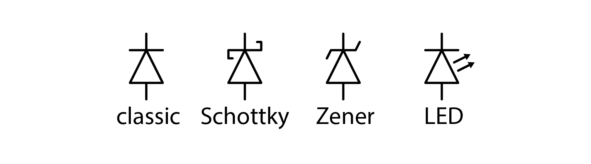
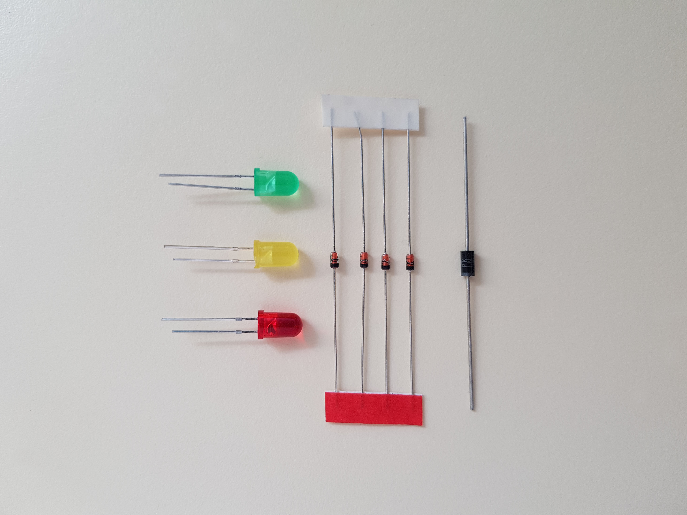
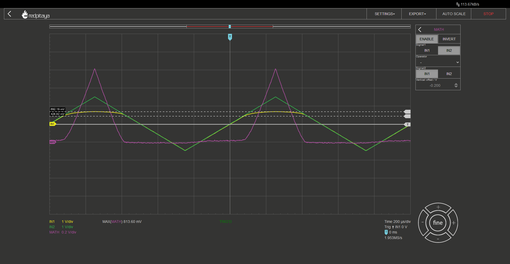
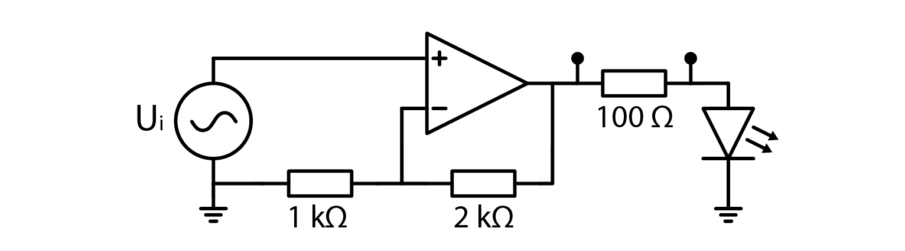
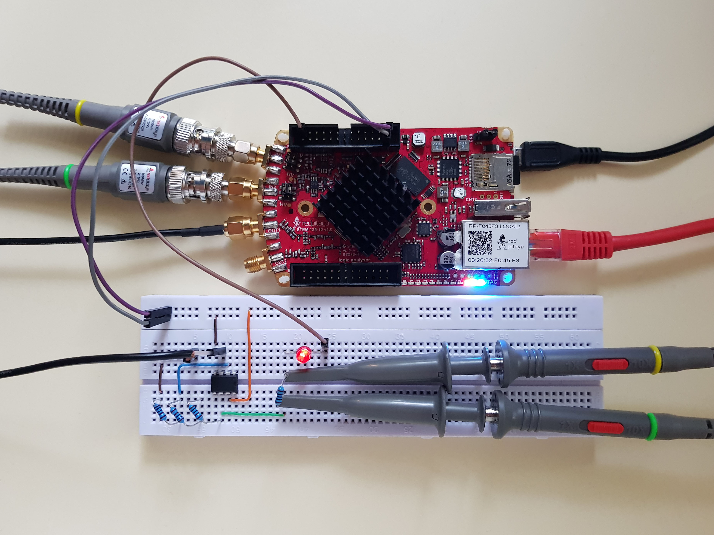
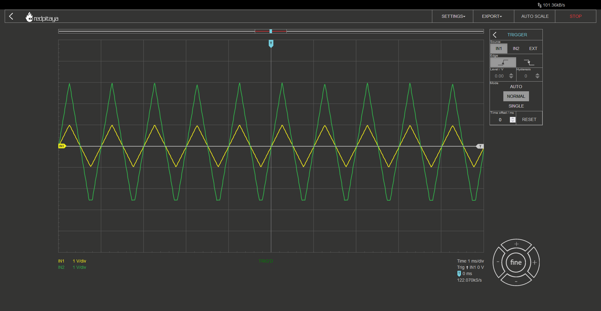
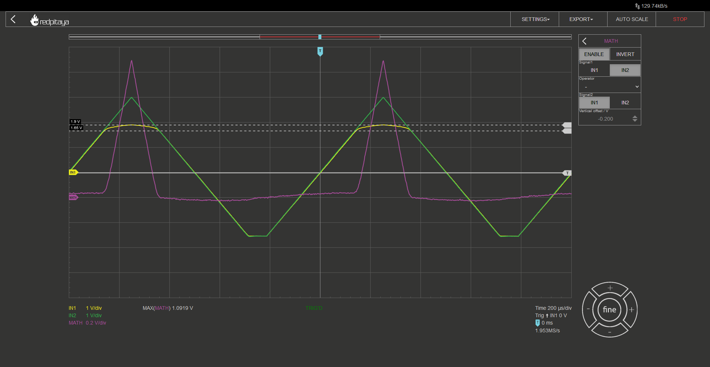
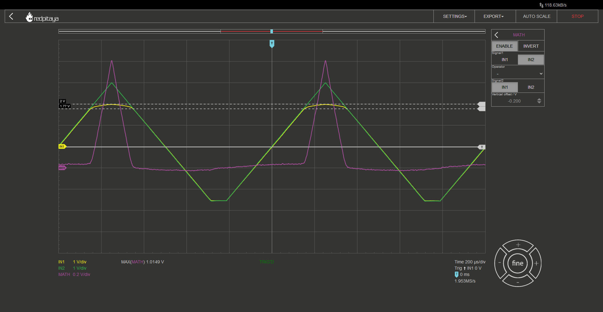
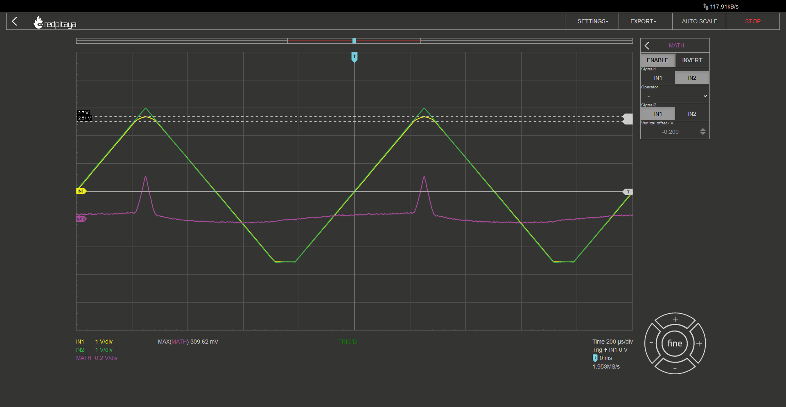

Diodes
=================

1. Introduction
---------------
Up until now, all components with two contacts were polarity agnostic. We never paid attention to how resistors, inductors or capacitors were oriented. The component we will be looking at today, exhibits vastly different characteristics depending on polarization. I am of course talking about diodes.

2. What is a diode?
------------------------
Diode is a semiconductor component that allows current to flow in one direction, but prevents it from flowing the other way. How? Diodes consist of doped silicon. One part is doped to be positive (P) and the other to be negative (N). When P and N doped silicons contact, they form a PN junction. This junction exhibits a strange phenomenon: current can flow in direction from P to N but not in reverse. This has to do with energy levels in atoms and we won’t go into details.

3. Different kinds of diodes
-------------------------------
Diodes come in a number of flavours. You have classic diodes, which don’t have any “special” properties. Very similar are Schottky diodes, which have a lower forward voltage (more on that later) and are suitable for faster switching. Those diodes are common in SMPS power supplies. Zener diodes are nothing special in terms of being a regular diode, but they have a very steep reverse breakdown voltage when they are polarized in reverse direction, making them a good voltage reference. The exact voltage can even be selected during manufacturing, making them even more useful. Last kind we will mention in this course are light emitting diodes, more commonly known as LEDs. Those behave as normal diodes, but emit light when current flows through in forward direction.
There are a few more types of diodes but these are the ones we will discuss in this course.

4. Markings
---------------
As mentioned before, polarity of diodes is important. P and N parts have special names. Positive end is called anode, and the negative is called cathode. If you have trouble remembering this, try the acronym PANK (misspelled punk, Positive Anode Negative Cathode).
Diodes come in different shapes and sizes. In the days of THT (through hole technology), cathode was marked with a straight line (resembling the line at the end of the arrow on the electrical symbol). This usually still holds true with SMD components. Other option for marking diodes polarity, very common with LEDs, is making the cathode by making its lead shorter. The following photo shows three different diode packages, all are oriented such that anode is at the top and cathode at the bottom.

5. Forward voltage
---------------------
Diodes conduct current only in forward direction, but current Vs. voltage characteristic follows an exponential curve. This means they are very lousy conductors at low voltages and very good conductors at high voltages. To simplify calculations, engineers came up with the following simplification: let’s say that voltage drop on a diode is constant and ignore its IU curve altogether.

Using this, we can calculate current through a simple resistor – diode circuit as such:

	.. math:: I_D=\frac{U_0 - U_F}{R}

Forward voltages are different for different diodes. Standard diodes have 0.7 V, Schottky diodes can go down to 0.3 V, and LEDs have 1.6 V for classic red ones or more. Blue white and UV LEDs can easily exceed 3 V.

6. Reverse breakdown voltage
-------------------------------
Diodes conduct current only in forward direction, but that is a simplification. They really conduct a bit of voltage in reverse direction. Total conducted current is quite small and more or less constant, regardless of applied voltage, but beyond reverse breakdown voltage, current increases exponentially.
Zener diodes exhibit especially steep characteristic, making them suitable for being used as voltage references.

7. An experiment
--------------------
Let’s make a very simple circuit and measure the output. You know the drill. Input at 10x, output should be a sine wave, +- 1 V. The diode I used in my experiment was 1N4001¸, one of the most classic diodes known to man.

At vertical resolution of 0.5 V/div you can see that green line (after diode) is always equal or greater than 0 V but also approximately 0.7 V less than the yellow line (function generator). Exactly the forward voltage.
But this was a very simple experiment and we haven’t mentioned OpAmps yet. Let’s try measuring currents through different diodes at higher voltages.

7. The experiment
-------------------
Here is what we are about to do: Red Pitaya can only output +- 1 V, but we want to test LEDs. Because LES’s forward voltages exceed RP’s output range, we have to extend it. My proposed solution is a noninverting amplifier with x3 setting. Schematic and the corresponding circuit are depicted below.

The purpose of the 100 ohm resistor is twofold: it limits the current so that the diode doesn’t get fried, and it acts as a shunt resistor, so that we can measure the current.

Signal generator outputs a triangular waveform at 1 V amplitude. Probes are in 10x mode and connected to the 100 ohm resistor. I also added a math function to calculate the difference between the first and the second probe. This corresponds to the current flowing through limiting resistor and the diode. Actual current is voltage drop divided by resistance.
Before showing the results, let’s discuss the power supply for OpAmp. It is powered form RP’s 5 and -4 V pins. Output voltage will try to swing from -3 to +3 V, and the negative power supply won’t allow that, as clearly seen on the oscillogram below:

Yellow is RP’s output voltage, and green is amplified voltage after the noninverting amplifier. Clipping is visible but that fortunately doesn’t concern us as no current will be flowing in that phase.
And now, some results. Green trace is before shunt resistor, yellow one is after it, and the purple one is their difference. The two dashed horizontal lines depict the point where current starts flowing (bottom) and the forward voltage (top).

Red LED:

Green LED:

White LED:

We can clearly see that peak current is getting lower and lower with each graph. Red has highest current rating and white has the lowest one. That is inversely proportional to forward voltage, which is the greatest for the white LED. Can you find a reason for that phenomenon? Let me give you a hint. Red has the longest wavelength (lowest frequency) of the bunch, green has shorter wavelength (higher frequency), and so on. Higher frequency means higher energy. Was that helpful enough?
White LED is based on blue or ultraviolet (UV) diode, and we see its forward voltage in the last oscillogram. Can you predict forward voltage of an infrared (IR) LED? If not, you can always make an experiment. You have one IR LED in the ADALP2000 kit. It’s one of the black looking diodes – the one that is slightly translucent with a bluish tint.

8. Conclusion
---------------
So this was a quick introduction to LEDs, I hope you fund it enlightening. At least the experiment with LEDs. Jokes aside, when you encounter the next problem, when you will want the current to flow in only one direction, or when you want to use an LED with an appropriate current setting, you now know how.

Written by Luka Pogačnik

This teaching material was created by `Red Pitaya <https://www.redpitaya.com/>`_ & `Zavod 404 <https://404.si/>`_ in the scope of the `Smart4All <https://smart4all.fundingbox.com/>`_ innovation project.