Full wave rectifiers
===================

Introduction
-----------------
The national electrical grid provides an abundance of electricity to users in the form of alternating current (AC) at 110 to 230 volts and 50 or 60 Hz, depending on the region. However, what if someone requires a continuous supply of direct current (DC) voltage from this source? This course will cover full wave rectifiers, which are commonly used in the industry for converting AC to DC.

.. raw:: html

    

        <iframe src="https://www.youtube.com/embed/XWAzxsCwW9g" frameborder="0" allowfullscreen style="position: absolute; top: 0; left: 0; width: 100%; height: 100%;"></iframe>
    

What is a full bridge rectifier?
--------------------------------------
In the last course we covered a half wave rectifier – just a simple diode. When AC voltage is applied to its anode, cathode will conduct only during the positive halfwave. Resulting waveform is far from DC, but it is always positive. If averaged the output, we would get a DC voltage source. This method has many significant drawbacks. Most of them originate from the fact, that diode is in conducting mode for only about half the time, but we won’t go into details.
Finding a circuit, that will conduct voltage in positive direction would alleviate the problem. Conveniently such circuit exists and is depicted below. We call it a full wave rectifier.

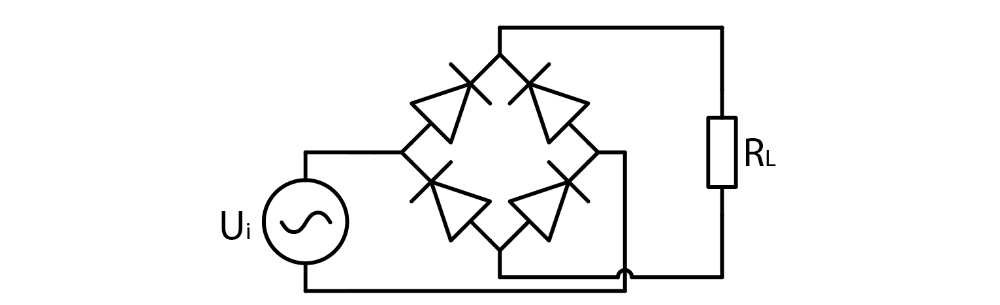
A full wave rectifier is composed of two pairs of diodes that ensure voltage 'flows' in the correct direction. It converts AC voltage to DC voltage. To comprehend its operation, it is useful to examine what happens when the applied voltage is positive and negative. For the purpose of analysis, we can assume that diodes conduct electricity when the current flows from the anode to the cathode.

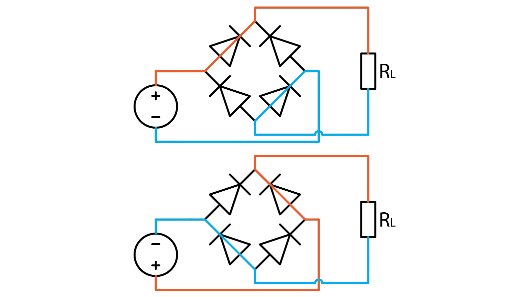

If we apply a signal to an ideal full wave rectifier, its output will be an equivalent of mathematical function out=abs(in). To illustrate that with a sine wave input where black is input and red is rectified output:

The experiment
----------------------
Without further ado, let’s build a full bridge rectifier and try it out. Let Red Pitaya output a +-1 V sine wave for an input signal, and connect one probe to the input and one to the positive output as depicted below. Note that I used the alligator clip on output signal this time.

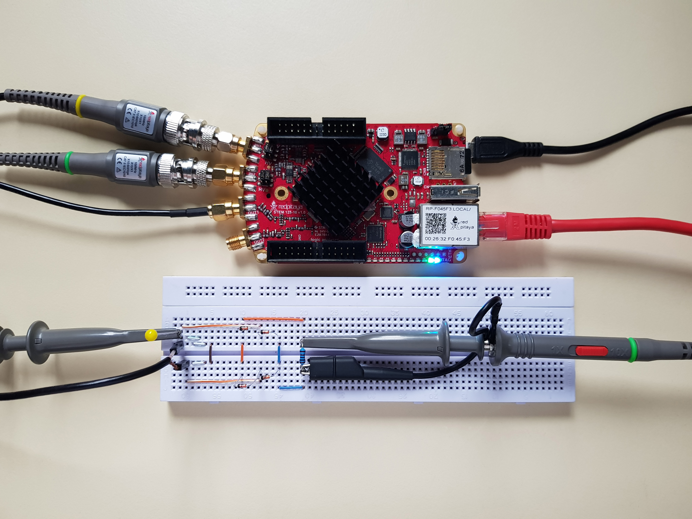

Aside from a bunch of seemingly useless wires to the left, which I call foreshadowing, I added a 1 kOhm load resistor to the output. I will let you experiment what happens without one. Anyway, the signal output is such:

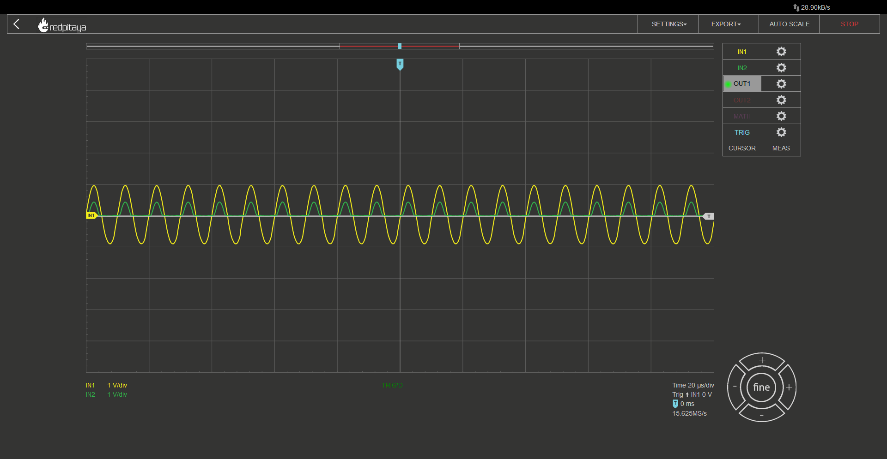

No, this is not a wrong screencap, this waveform is correct. Correct but not desired. First let’s point out that waveform resembles a half wave rectifier. Second let’s discuss the voltage drop. A real diode rectifier will always have some voltage drop. The exact value can be estimated. You may recall from the previous course, that diodes usually have 0.7 V drop. That is the case for the diodes I used as well. What you can see from the screencap is that the voltage drop isn’t 0.7 V, it is closer to 0.6 V. You may say this is nothing special, 0.6 is very close to 0.7. Yes, I agree, but since current flows through two diodes, voltage drop should be 1.4 V. What’s up with that?
The explanation is very simple. Red Pitaya can only output +-1 V signal, which is less than a nominal voltage drop on a pair of diodes. This means that diodes are operating below the point where we can simplify their characteristic to a simple voltage drop, which explains the unexpected voltage drop.
And what explains the half wave instead of full wave rectifier characteristic? This has nothing to do with diodes, and all to do with Red Pitaya. By connecting the alligator clip to the negative output of a full wave rectifier, we effectively shorted half of the rectifier, ruining the characteristics. Resulting circuit looks like this:

.. image:: img/9_full_wave_rectifier_schematicRP.png
	:name: experiment 1 explanation
	:align: center

So this is actually just a half bridge rectifier with a short circuit to ground when input is negative...  Wait, does that mean that what I told you about expected voltage drop being 1.4 V was wrong? Yes, but I wanted to share a glimpse into how troubleshooting works. Find an explanation and work with it until you can prove it doesn’t work.
What happens if you don’t connect a grounding clip can be considered your optional homework, because solution lies elsewhere and I don’t want to drag this article too long.

A transformer.
-------------------
There are only a few devices that require rectified mains voltage to operate. Usually required voltage is a lot lower. A low cost solution is to use a transformer with an appropriate winding ratio.
A transformer outputs voltage that is higher, lower, or equal to the input voltage based on how many turns input and output windings have. The exact relation is such:

	.. math:: U_{OUT}=\frac{N_OUT}{N_IN}  U_IN

Aside from changing the amplitude, a transformer also galvanically disconnects input and output. ADALP2000 component kit, from which we select components for this course, has two transformers in it. Both are from Coilcraft’s Hexa-Path series. They have six individual windings, from which we can construct “any” transformer we want. Biggest voltage ratio we can construct is 5:1 (or 1:5). This is done by selecting one coil to be input/output, and wiring the remaining five in series, paying attention on polarity (marked with a dot next to the inductor symbol. The following diagram is from the transformer’s `datasheet <https://www.coilcraft.com/getmedia/936400ae-3cbc-4381-aed1-ae101ef7a35e/hexa-path.pdf>`_

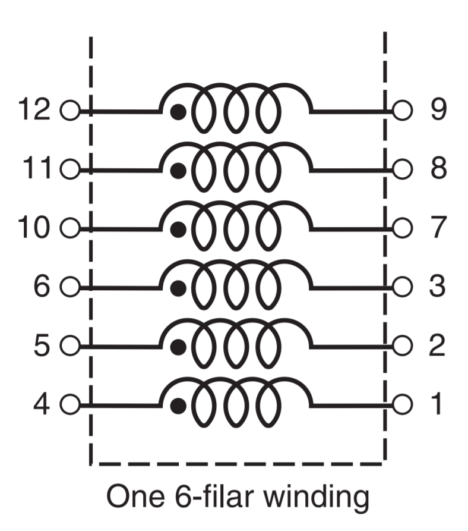

Consumer electronics usually use a transformer to convert mains voltage into something lower, but we will be using it in reverse: to change RP’s +-1 V output to +-5V. Here is input to the transformer in such configuration (yellow) Vs. output (green).

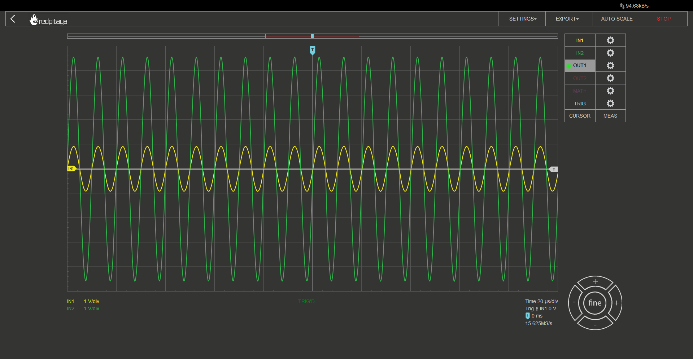

A full wave rectifier with a transformer
-----------------------------------------------
With all that said, let’s construct such circuit:

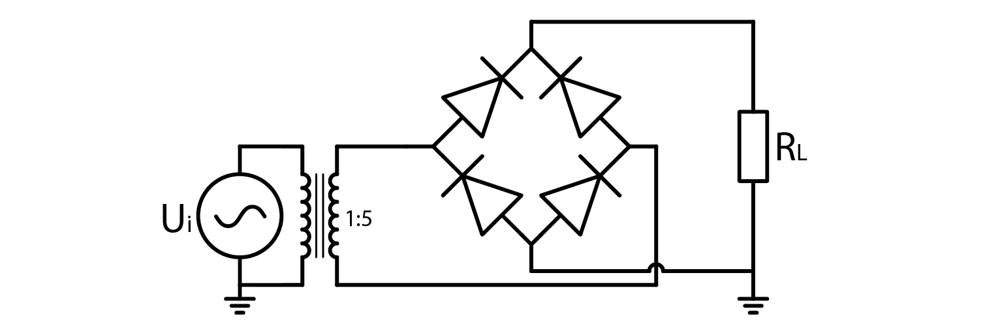

Aside from the transformer, everything is exactly the same. Even those wires I called foreshadowing are in exact same spots. As if someone showed you exactly how to connect transformer’s windings to achieve 1:5 winding ratio… Anyway, here’s the setup:

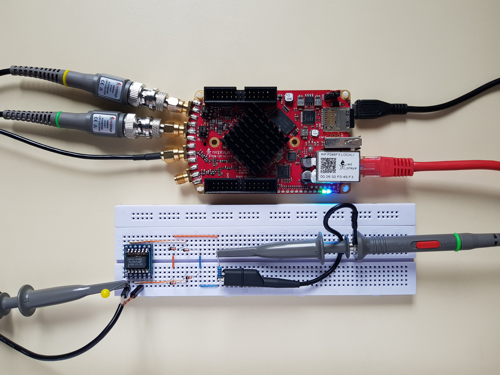

Note that you have to set Red Pitaya’s signal generator to output a sine wave at a high enough frequency. Transformer’s inductance is very low in comparison to transformers used in household appliances, thus frequency has to be a lot higher. I found 100 kHz to work fine. Te transformer I used was HPH1-019L. Here is what I got:

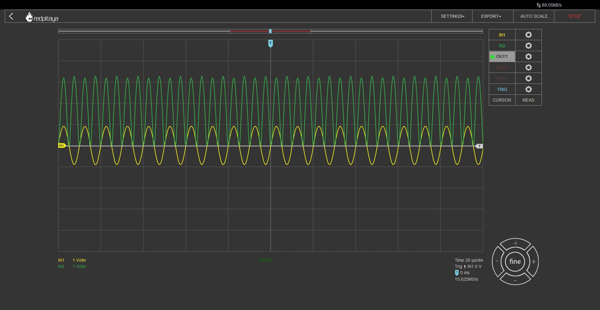

All as expected. Rectified output’s peak voltage is 5x input minus two diode drops. But I opened this course up by talking about DC power supplies… this means I have to show you how to smooth this voltage!

A DC power supply
-----------------------
Let’s summarize what we now know how to make: We know how to change input AC voltage’s amplitude by any desired factor by selecting appropriate transformer coil winding ratios, and we know how to convert AC voltage to one that oscilates between 0 and :math:`V_{IN}-2 \cdot V_{DIODE}`. All that is left to do is to average this out. One way would be to use an RC filter. A great downside to this approach is that all current that a powered device consumes has to flow through the filter’s resistor. This leads to great power losses. A smarter solution is to use an LC filter, which behaves similar to two RC’s in series (I won’t go into details), where the L part is the transformer itself! Capacitor is wired between output’s + and – nodes. Depending on its capacitance, we get different results.
Here is output voltage with a 10nF capacitor:

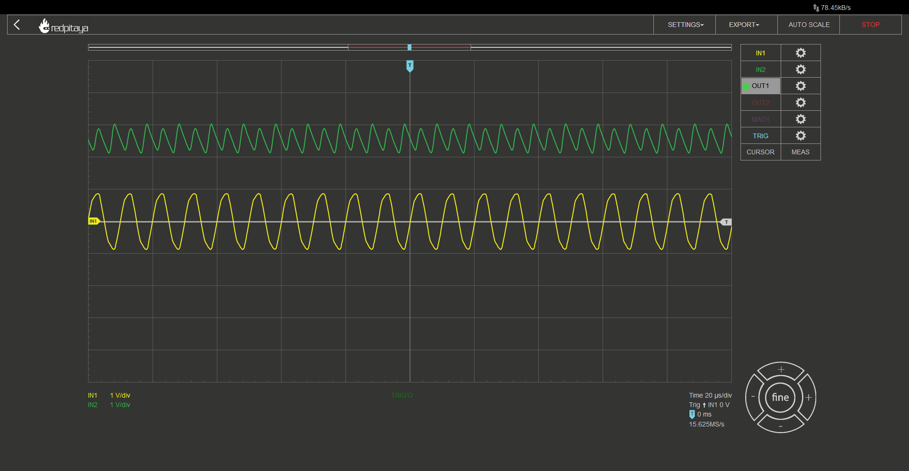

And here is one with a 47 uF capacitor:

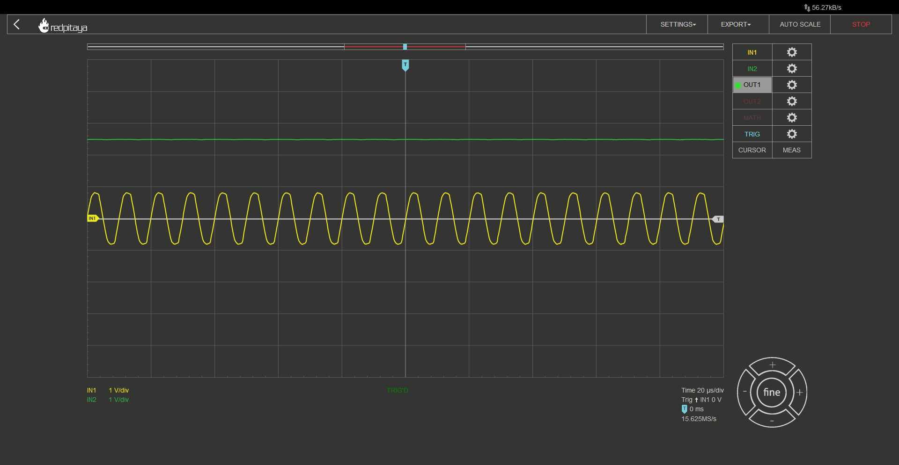

We can clearly see that bigger capacitance leads to better smoothing. Another thing you can see is that input voltage’s shape gets distorted. That is because voltage source gets overloaded.

Conclusion
----------------
This concludes our quick intro to full wave rectifiers and their applications in simple and cheap power supplies. Note that output voltage of such power supply is unregulated. This means that an additional regulation is often needed. I encourage you to test how output voltage varies with different loads. Can you guess what would happen if load was removed completely? I hope you learned something.

Written by Luka Pogačnik
Edited by Andraž Pirc

This teaching material was created by `Red Pitaya <https://www.redpitaya.com/>`_ & `Zavod 404 <https://404.si/>`_ in the scope of the `Smart4All <https://smart4all.fundingbox.com/>`_ innovation project.
