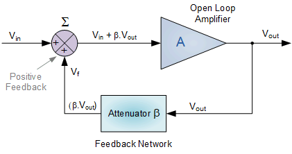
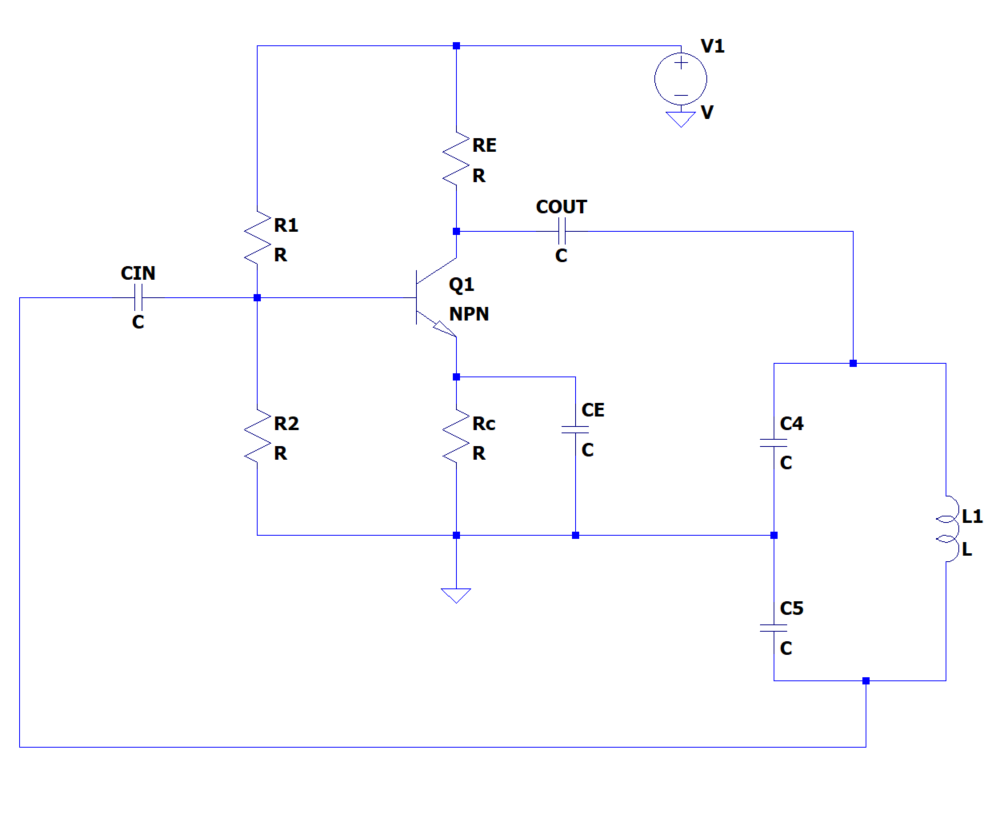
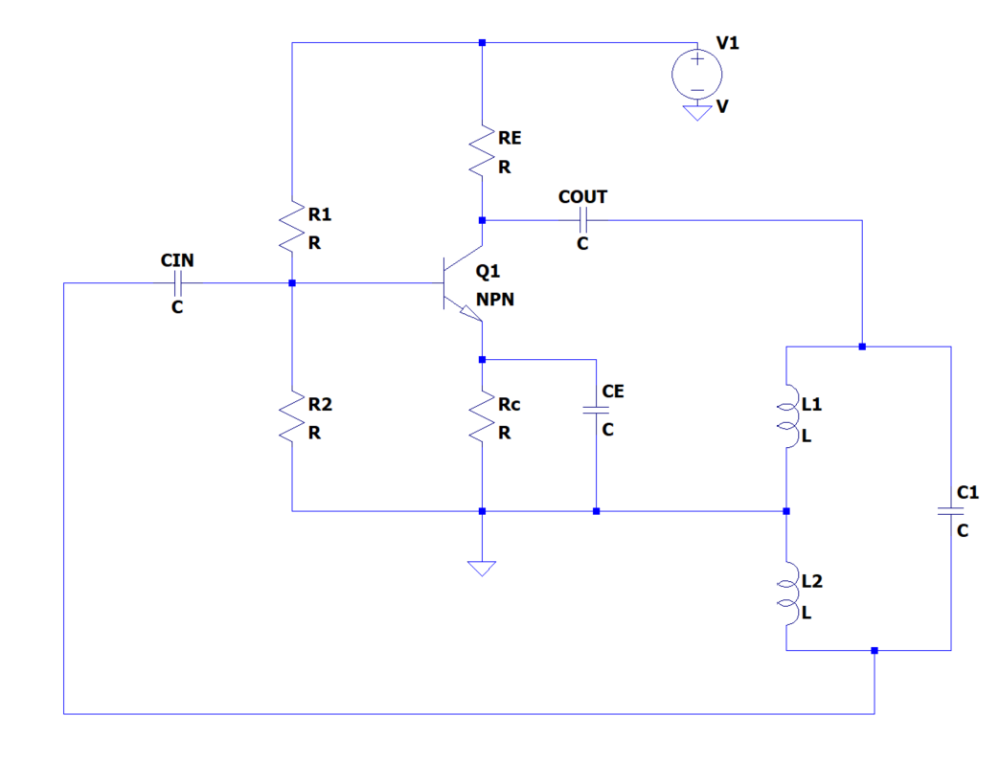
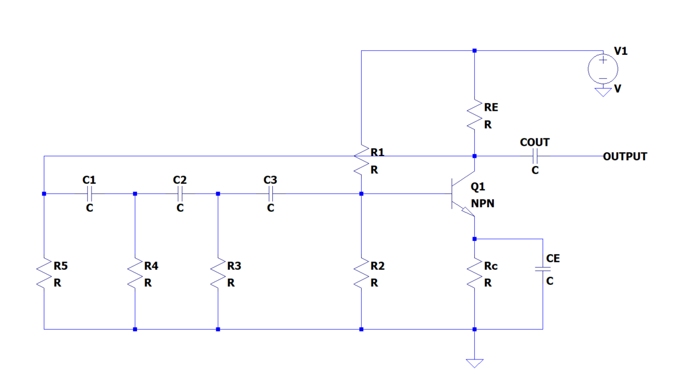
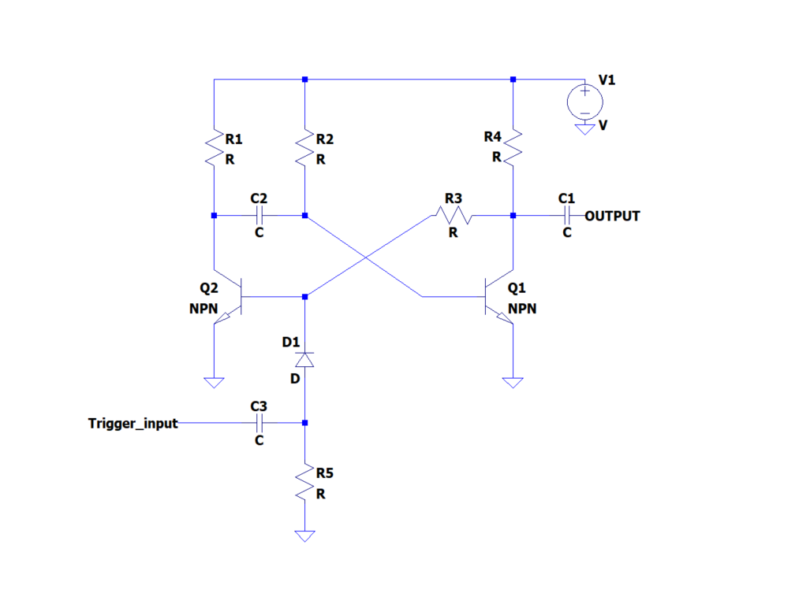
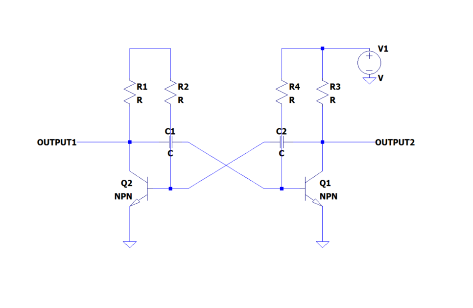
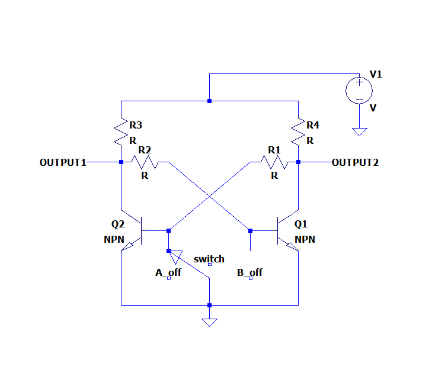

==========================
Oscillators
==========================

Objective
==========================
In this section, we will discuss the basic principles, types, and applications of oscillators in electronic circuits. Oscillators are crucial components in many electronic systems, responsible for generating a continuous waveform of a specific frequency. Oscillators can be broadly classified into two main categories: harmonic oscillators and relaxation oscillators. Understanding the principles and types of oscillators is essential for anyone working with electronic circuits and systems.

Oscillators
==========================
Oscillators are a critical component in electronic circuits, providing the foundation for many different types of applications. They generate periodic signals, often in the form of sinusoidal waveforms, that are used for signal generation, frequency synthesis, and clock generation. The importance of oscillators can be seen in their widespread use in modern electronic devices, including radios, televisions, mobile phones, and computers. Without oscillators, these devices would not be able to generate the stable and precise signals necessary for their operation.

:name: oscillators

Basic Principles of Oscillators
==========================
The basic principle of an oscillator is to convert DC power into AC signals, generating a periodic waveform. An oscillator typically consists of an amplifying component and a feedback network, which shapes the output waveform and determines the oscillation frequency. The feedback network can include passive components, such as resistors, capacitors, and inductors, or active components like transistors and operational amplifiers.

The amplifying component provides gain to the system, allowing the oscillator to produce a signal that is larger than the input signal. The feedback network takes a portion of the output signal and feeds it back to the input of the amplifying component, creating a positive feedback loop. This positive feedback reinforces the signal, causing the oscillator to continue generating a periodic waveform. The frequency of the oscillator is determined by the characteristics of the feedback network, including the gain and phase shift of the components. By selecting the appropriate components and designing the feedback network, designers can create oscillators with a wide range of frequencies and waveforms.

Overall, the principle of oscillators is essential to understanding their function and design. By combining an amplifying component with a feedback network, oscillators are able to generate stable and precise periodic signals, making them a critical component in modern electronic devices.There are a few key factors to consider when dealing with oscillators:

**Frequency Stability**

One of the key factors to consider when designing an oscillator is frequency stability. This refers to the ability of the oscillator to maintain a constant frequency over time, even in the presence of changes in temperature, voltage, or other environmental factors. Frequency stability is particularly important in communication systems, where precise frequency control is essential for reliable operation.

To achieve frequency stability, designers often use techniques such as temperature compensation, component selection, and feedback network design. Temperature compensation involves choosing components that have a stable temperature coefficient, which reduces the effects of temperature changes on oscillator frequency. Component selection involves choosing high-quality components with low tolerances and low drift rates, which ensures that the oscillator operates within its designed frequency range. Feedback network design involves choosing components with the appropriate gain and phase characteristics, which helps stabilize the oscillator and prevent unwanted frequency shifts.

There is no single equation for calculating frequency stability, as it depends on the specific system and the metrics used to evaluate the stability. However, there are several commonly used metrics in the field of frequency standards and oscillators, which can help assess frequency stability. These metrics include Allan deviation, fractional frequency stability, and phase noise.

Allan variance (AVAR) is a statistical tool used to characterize the frequency stability of an oscillator over different time intervals. It was introduced by David W. Allan in the 1960s and has since become a widely used metric for evaluating the performance of oscillators and clocks. Allan variance is particularly useful for identifying the dominant noise processes affecting the oscillator's stability over various time scales.

The Allan variance is denoted by :math:\sigma_y^2(\tau) and is given by the equation:

.. math:: \sigma_y^2(\tau) = \frac{1}{2} \cdot \mathrm{E} \left[ (y(n+1) - y(n))^2 \right] / \tau^2

where :math: '\mathrm{E}[.]' represents the expected value, :math: 'y(n)' is the fractional frequency deviation at the nth measurement, and :math: '\tau' is the time interval between measurements.

Fractional frequency stability is a measure of the stability of an oscillator's output frequency relative to its nominal frequency. It is often denoted as :math: 'y(t)' and is given by the equation:

.. math:: y(t) = \frac{\Delta f(t)}{f_0}

where :math: 'y(t)' is the fractional frequency stability at time :math: 't', :math: '\Delta f(t)' is the frequency deviation from the nominal frequency :math: 'f_0' at time :math: 't', and :math: 'f_0' is the nominal frequency of the oscillator.

Fractional frequency stability is dimensionless and is often used to characterize the performance of oscillators in a normalized form. This allows for easier comparison of stability performance between oscillators with different nominal frequencies.

Phase noise is a measure of the random fluctuations in the phase of an oscillator's output signal, which can degrade the performance of communication systems, radars, and other applications that rely on precise frequency and timing information. The phase noise of an oscillator is often represented as a power spectral density (PSD) function, which describes the distribution of the noise power over the frequency domain. Phase noise is given by the equation:

.. math:: L(f) = \frac{S_\phi(f)}{P_0}

where :math: 'L(f)' is the single-sideband phase noise PSD, :math: 'S_\phi(f)' is the power spectral density of the phase fluctuations, and :math: 'P_0' is the carrier power.

In conclusion, frequency stability is a critical parameter for oscillators used in various applications, such as communication systems, radars, and timing devices. To characterize the stability of an oscillator, several metrics and equations are used, including Allan variance, phase noise, and fractional frequency stability. By analyzing these metrics, one can identify the dominant noise processes affecting the oscillator's performance and optimize it for specific applications.

**Power Consumption**

Another important consideration when designing an oscillator is power consumption. Depending on the application, an oscillator may need to be designed to consume very low power, particularly in battery-powered devices where minimizing power consumption is critical.Designers can reduce power consumption by using low-power components, reducing the supply voltage, and using efficient circuit topologies. In addition, designers can use techniques such as duty cycling and frequency scaling to further reduce power consumption.

**Noise**

Noise is also an important consideration in oscillator design. Even small amounts of noise can affect the performance of an oscillator, particularly in high-frequency applications where noise can cause interference and degrade signal quality.

To reduce noise, designers often use techniques such as shielding, filtering, and low-noise components. Shielding involves physically enclosing the oscillator to reduce electromagnetic interference. Filtering involves using passive components to filter out unwanted noise frequencies. Low-noise components are designed with low noise characteristics and can help improve the signal-to-noise ratio of the oscillator.

In conclusion, understanding the principles of oscillators and the factors that affect their performance is essential for electronic circuit design. By considering factors such as frequency stability, power consumption, and noise, designers can select and design oscillators that meet the specific requirements of the application.

Types of Oscillators
==========================
Oscillators can be categorized into two main groups: harmonic oscillators and relaxation oscillators. Each group has its unique characteristics and applications in electronic circuits.

Harmonic Oscillators
------------------
In electronics, a harmonic oscillator is a circuit that generates a sinusoidal waveform with a specific frequency. The frequency of the oscillator is determined by the values of the circuit components, and the waveform produced is a function of the output voltage and the input signal. One of the most important properties of a harmonic oscillator is its frequency stability. This refers to the ability of the oscillator to maintain a constant frequency over time, even in the presence of changes in temperature, voltage, or other environmental factors. Frequency stability is particularly important in communication systems, where precise frequency control is essential for reliable operation.

Harmonic oscillators are widely used in electronic circuits for a variety of applications, including signal generation, frequency synthesis, and modulation. In signal generation, an oscillator is used to produce a stable and precise waveform that can be used as a reference signal or to generate a carrier signal for modulation. In frequency synthesis, multiple oscillators are combined to generate a range of frequencies, allowing for precise frequency control. In modulation, an oscillator is used to modulate the amplitude, frequency, or phase of a carrier signal, allowing for the transmission of information. The most common types of harmonic oscillators are:

**LC Oscillators**

LC oscillators utilize an LC tank circuit, which is composed of an inductor (L) and a capacitor (C) connected in parallel. The resonant frequency (f) of the LC tank circuit is determined by the following equation:

.. math:: f = \frac{1}{2 \pi \sqrt{LC}}

Where L represents the inductance (in henries) and C represents the capacitance (in farads).

The energy stored within an LC circuit alternates between the inductor and capacitor, resulting in sinusoidal voltage and current waveforms.

There are two common types of LC oscillators: Colpitts and Hartley oscillators. Both of these oscillator types employ an active element, such as a transistor or an operational amplifier, to provide gain and sustain oscillations.

|Colpitts|\ |Hartley|

**Crystal Oscillators**

Crystal oscillators use a piezoelectric crystal, such as quartz, as the resonant element in the oscillator circuit. Due to the stability and accuracy of the crystal, these oscillators produce highly stable and precise frequencies, making them suitable for applications like timekeeping and frequency synthesis.

.. image:: img/oscillators/2.4.png
:name: Crystall

**RC Oscillators**

RC oscillators use resistors (R) and capacitors (C) to generate sinusoidal waveforms. The most common type of RC oscillator is the phase-shift oscillator, which utilizes a cascade of RC circuits to create a phase shift that produces oscillation.

.. math:: \tau = RC

:name: RC

Relaxation Oscillators
-------------------------
Relaxation oscillators are electronic circuits that produce a periodic output waveform through the charging and discharging of a capacitor. Unlike other types of oscillators, relaxation oscillators do not require a resonant circuit to determine the frequency of oscillation. Instead, they use the charging and discharging of the capacitor to produce a waveform with a frequency that is determined by the values of the circuit components. Relaxation oscillators are often used in electronic circuits where a simple and low-cost oscillator is required. They are commonly used in applications such as clocks, timers, and tone generators. The waveform produced by a relaxation oscillator can be tailored to meet the specific needs of the application, such as a square wave, sawtooth wave, or other periodic waveform.

One of the main advantages of relaxation oscillators is their simplicity. They typically require only a few components and can be easily implemented using standard integrated circuits. Additionally, relaxation oscillators can be designed to consume very little power, making them ideal for battery-powered applications. However, relaxation oscillators do have some disadvantages. They are generally less stable than other types of oscillators and can be sensitive to changes in temperature, supply voltage, and other environmental factors. Additionally, the waveform produced by a relaxation oscillator may not be as clean or precise as that produced by other types of oscillators. The most common types of relaxation oscillators are:

**Astable Multivibrator**

An astable multivibrator is a type of electronic oscillator that generates a non-sinusoidal waveform, typically a square wave. It is classified as a relaxation oscillator, which is a category of oscillators that generate waveforms through the charging and discharging of capacitors. Astable multivibrators are widely used in applications such as frequency generators, pulse generators, and digital circuits. The astable multivibrator circuit employs two transistors or operational amplifiers (op-amps) in a cross-coupled configuration, where each transistor or op-amp alternately switches on and off. This creates a continuous oscillation, and the resulting output waveform has a specific duty cycle.

:name: Colpitts
:align: center

The frequency of oscillation (f0) and the duty cycle (D) for an astable multivibrator are determined by the values of the resistors (R1, R2) and the capacitor (C1) connected in the circuit. The equations for calculating these parameters are as follows:

Frequency of the oscillation:

.. math:: f_0 = \frac{1}{\ln(2) \cdot (R_1 + 2R_2)C_1}

Duty cycle:

.. math:: D = \frac{R_1 + R_2}{R_1 + 2R_2}

By adjusting the values of R1, R2, and C1, one can control the frequency and duty cycle of the output waveform, making the astable multivibrator a versatile and widely used circuit in various electronic applications.

**Monostable Multivibrator**

A monostable multivibrator is a type of electronic oscillator that generates a single output pulse in response to an external trigger signal. It is also classified as a relaxation oscillator, which is a category of oscillators that generate waveforms through the charging and discharging of capacitors. Monostable multivibrators are commonly used in applications such as timers, pulse generators, and debounce circuits.

The monostable multivibrator circuit employs a single transistor or operational amplifier (op-amp) in combination with resistors and a capacitor. Upon receiving a trigger signal, the circuit transitions from its stable state to an unstable state, producing a pulse output. After a specific time period determined by the values of the resistor (R) and capacitor (C) in the circuit, the circuit returns to its stable state.

:name: Monostable_Multivibrator
:align: center

The time duration of the output pulse (T) for a monostable multivibrator is governed by the values of the resistor (R) and the capacitor (C) connected in the circuit. The equation for calculating the pulse duration is as follows:

Time duration of the output pulse:
.. math:: T = R \cdot C \cdot \ln(1 + \frac{V_{CC}}{V_{BE}})

Here, V_CC is the supply voltage, and V_BE is the base-emitter voltage of the transistor.

You can determine the maximum repetitive rate at which the monostable multivibrator can be triggered by considering the time duration of the output pulse (T). This value depends on the resistor (R) and capacitor (C) in the circuit.

The maximum repetitive rate (f_max) can be calculated as the reciprocal of the time duration (T):

.. math:: f_\text{max} = \frac{1}{T}

Keep in mind that this value represents the maximum rate at which the monostable multivibrator can be triggered repeatedly. The actual trigger rate in a specific application may be lower, depending on the input trigger signals and other factors. By adjusting the values of R and C, one can control the duration of the output pulse, making the monostable multivibrator a highly adaptable and widely used circuit in various electronic applications.

**Bistable Multivibrator**

A bistable multivibrator, also known as a flip-flop or latch, is a type of relaxation oscillator that has two stable states. It maintains its output state until a trigger signal is applied, causing it to switch to the other state. Bistable multivibrators use cross-coupled transistors or operational amplifiers in their circuitry.

:name: Bistable
:align: center

Bistable multivibrators are commonly used in digital systems for storing binary information, counting, and various other applications. There are several types of bistable multivibrators, including SR (Set-Reset), D (Data), JK, and T (Toggle) flip-flops, each with unique properties and behavior.

Unlike astable and monostable multivibrators, bistable multivibrators do not have a specific frequency or time duration associated with their operation. Instead, they change their output state in response to specific input trigger signals. The output state is maintained until another trigger signal is applied, allowing for the storage and manipulation of digital information.

Conclusion
===================
Understanding the different types of oscillators and their functions is essential for anyone working with electronic circuits. By exploring the various types of oscillators and their applications, you can expand your knowledge of electronic circuit design and improve your ability to create innovative and efficient solutions in the world of electronics.

Written by Andraž Pirc

This teaching material was created by `Red Pitaya <https://www.redpitaya.com/>`_ & `Zavod 404 <https://404.si/>`_ in the scope of the `Smart4All <https://smart4all.fundingbox.com/>`_ innovation project.
