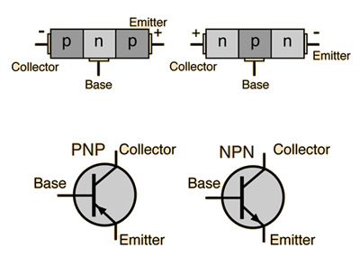
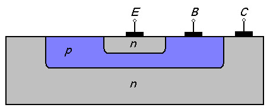
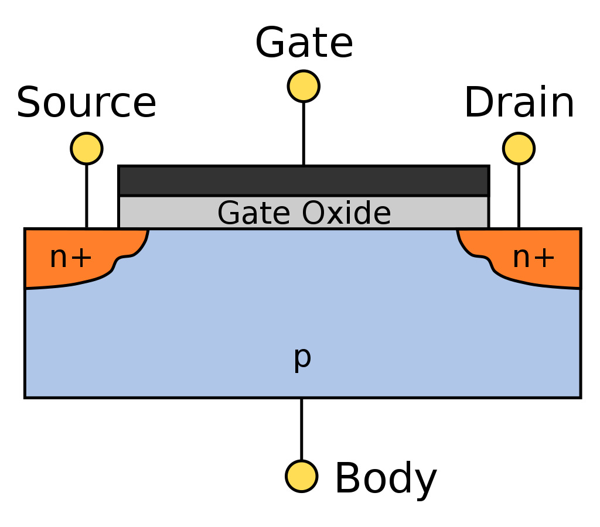
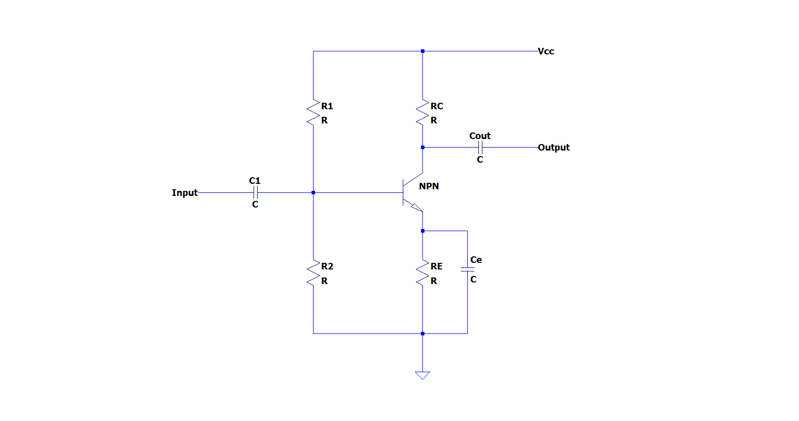
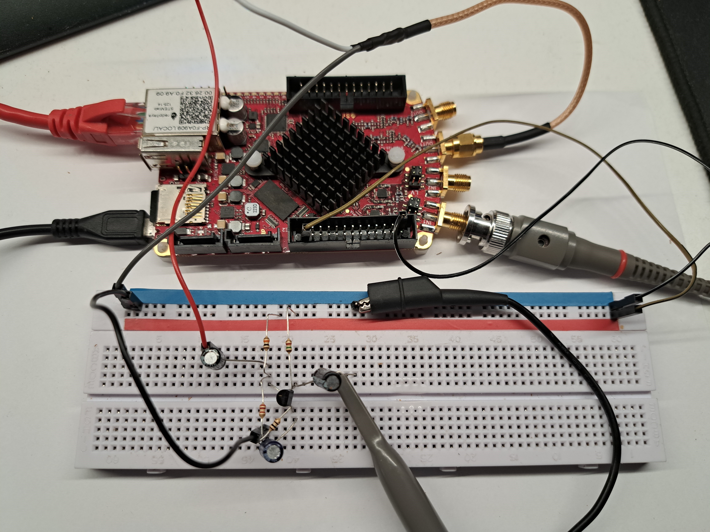
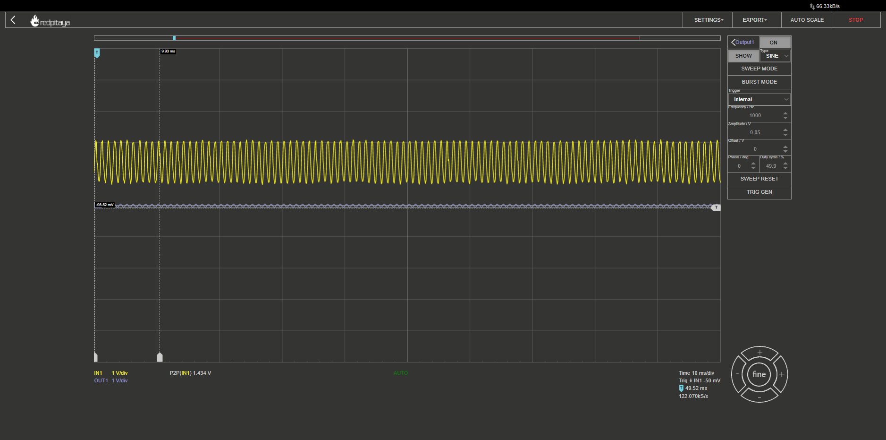

==========================
Transistors
==========================

Introductions
-------------------------
The objective of this activity is to introduce readers to the world of transistors. We will be looking at the different types of transistors and how they function.

Background
------------------------
Transistors are one of the most important inventions of the 20th century and have been instrumental in the development of modern electronics. They are semiconductor devices that can act as switches or amplifiers, and they have replaced bulky and inefficient vacuum tubes in many electronic applications. Today, transistors are found in almost every electronic device, from smartphones and computers to medical equipment and automobiles. They have enabled the development of smaller, more efficient, and more powerful electronic devices, and their impact on modern technology cannot be overstated.

What is a transistor?
============================
A transistor is a fundamental electronic component that is used to amplify and switch electronic signals. It is a three-terminal device that is composed of a collector, a base, and an emitter. Transistors can be found in almost every electronic device, from smartphones and computers to medical equipment and automobiles. They have enabled the development of smaller, more efficient, and more powerful electronic devices, and their impact on modern technology cannot be overstated.

.. image:: img/14.1.jpg
        :name: Transistors
        :align: center

Transistors work by controlling the flow of electric current through a semiconductor material, which is typically made of silicon or germanium. The base terminal is used to control the flow of current between the collector and the emitter terminals. When a small current is applied to the base terminal, it allows a larger current to flow between the collector and the emitter, which makes it possible to amplify a signal. The ability to control the flow of current through a transistor makes it an essential component in electronic circuits. There are two main types of transistors that we will cover:

Bipolar junction transistors
===============================
Bipolar junction transistors (BJTs) are versatile electronic components that play a vital role in many electronic circuits. Their primary function is to amplify electrical signals and to act as switches in various applications. BJTs are manufactured by introducing impurities into semiconductor materials, resulting in regions with distinct electrical properties. These regions form the basis of the transistor structure, consisting of two PN junctions: one between the collector and base regions, and another between the base and emitter regions.

The functionality of a BJT relies on the movement of electrons across these junctions. When a voltage is applied to the base-emitter junction, it induces electron flow from the emitter region to the base region. This flow of electrons generates a current within the base region, consequently prompting a larger current to flow from the collector to the emitter. The ability to amplify current is what makes BJTs invaluable in electronic circuits.

There are two main types of BJTs: NPN and PNP. The NPN BJT features a base region made from P-type material, while the collector and emitter regions are made from N-type material. In contrast, the PNP BJT has a base region made from N-type material, and both the collector and emitter regions are made from P-type material. The behavior of the transistor is contingent upon the direction of current flow, which can be manipulated by adjusting the voltage applied to the base.

BJTs have numerous applications in modern electronics. They can be found in a wide array of devices, such as amplifiers, oscillators, and voltage regulators. Additionally, BJTs are used in digital circuits for logic gates and flip-flops. The versatility of bipolar junction transistors, along with their ability to amplify and switch signals, make them a fundamental component in the design and operation of electronic circuits.

BJT Circuit Configurations: Common Emitter, Common Collector, and Common Base
--------------------------------------------
Transistor circuits can be configured in various ways depending on the desired functionality. The three most common configurations for bipolar junction transistors (BJTs) are the common emitter, common collector, and common base configurations. Each configuration has its own unique properties and applications in electronic circuits. In this section, we will discuss the characteristics and uses of these configurations.

**Common Emitter Configuration**

In the common emitter configuration, the emitter terminal of the transistor is shared or "common" between the input and output. This configuration is widely used in amplifier circuits because of its high voltage gain and high current gain. Some key features of the common emitter configuration are:

*Inverting amplifier: The output signal is 180 degrees out of phase with the input signal.*

*High voltage and current gain: The common emitter configuration has both high voltage and current gain, making it suitable for various amplification applications.*

*Medium input and output impedance: This configuration has a moderate input impedance and output impedance, making it suitable for interfacing with other circuits.*

*Common emitter circuits are often used in audio amplifiers, oscillators, and other applications requiring signal amplification.*

**Common Collector Configuration**

In the common collector configuration, also known as the emitter follower or voltage follower, the collector terminal of the transistor is shared or "common" between the input and output. This configuration is used primarily for impedance matching and buffering applications. Some key features of the common collector configuration are:

*Non-inverting amplifier: The output signal is in phase with the input signal.*

*Unity voltage gain: The voltage gain of the common collector configuration is close to 1, meaning there is little voltage amplification.*

*High input impedance and low output impedance: This configuration has a high input impedance and low output impedance, making it ideal for impedance matching and buffering applications.*

*Common collector circuits are often used in voltage regulators, impedance matching circuits, and as buffers for driving low-impedance loads.*

**Common Base Configuration**

In the common base configuration, the base terminal of the transistor is shared or "common" between the input and output. This configuration is less commonly used compared to the common emitter and common collector configurations. Some key features of the common base configuration are:

*Non-inverting amplifier: The output signal is in phase with the input signal.*

*High voltage gain and low current gain: The common base configuration has a high voltage gain but a low current gain, making it suitable for specific amplification applications.*

*Low input impedance and high output impedance: This configuration has a low input impedance and high output impedance.*

*Common base circuits are often used in high-frequency amplifiers, such as radio frequency (RF) amplifiers, due to their high voltage gain and good frequency response characteristics.*

Field-effect transistors
=========================
Field-effect transistors (FETs) are a crucial class of electronic components with a diverse range of applications in modern electronics. These devices can be categorized into several types, including metal-oxide-semiconductor FETs (MOSFETs), junction FETs (JFETs), and insulated-gate bipolar transistors (IGBTs).

.. image:: img/14.4.png
        :name: JFET/MOS
        :align: center

MOSFETs are prevalent in contemporary electronic devices, especially in digital circuits, due to their easy on-off switching capabilities. JFETs, on the other hand, are typically employed as voltage-controlled resistors or in low-noise amplifier applications. IGBTs find use in high-power applications, such as motor control and power electronics, where they help to manage large amounts of current and voltage. One significant advantage of FETs is their high input impedance, which results in minimal current draw from the connected circuit. This characteristic makes FETs particularly beneficial in situations where the input signal is weak, such as in sensor applications or high-impedance microphone preamplifiers.

The structure of a field-effect transistor (FET) is distinct from that of a bipolar junction transistor (BJT). An FET is built using a semiconductor material, typically silicon, with a thin insulating layer, usually silicon dioxide or other metal oxide, deposited on top. This insulating layer is called the gate oxide. The gate electrode, which is typically made of metal or highly doped polysilicon, is then placed on top of the insulating layer. The gate electrode is insulated from the semiconductor material, hence the name "insulated-gate."

The semiconductor material is also doped to create source and drain regions, which are typically N-type or P-type, depending on the desired transistor type (N-channel or P-channel). These regions are created on either side of the gate electrode, separated by a narrow channel. In the case of a MOSFET, the conductivity of this channel can be controlled by the voltage applied to the gate electrode, which in turn modulates the flow of charge carriers (electrons or holes) between the source and drain regions.

The unique construction of FETs enables them to offer several advantages over BJTs, such as high input impedance, smaller device size, and better radiation tolerance. Their distinct structure allows them to be efficiently utilized in a variety of electronic applications, from digital circuits and low-noise amplifiers to high-power motor control and power electronics.

FET Circuit Configurations: Common Source, Common Drain, and Common Gate
=================================
Field-Effect Transistors (FETs) are another type of transistor that can be configured in various ways. The three most common configurations for FETs are the common source, common drain, and common gate configurations. Each configuration has its own unique properties and applications in electronic circuits.

**Common Source Configuration**

In the common source configuration, the source terminal of the FET is shared or "common" between the input and output. This configuration is widely used in amplifier circuits because of its high voltage gain and high input impedance. Some key features of the common source configuration are:

*Inverting amplifier: The output signal is 180 degrees out of phase with the input signal.*

*High voltage gain: The common source configuration has a high voltage gain, making it suitable for various amplification applications.*

*High input impedance: This configuration has a high input impedance, making it suitable for interfacing with other high-impedance circuits.*

*Common source circuits are often used in audio amplifiers, oscillators, and other applications requiring signal amplification.*

**Common Drain Configuration**

In the common drain configuration, also known as the source follower or voltage follower, the drain terminal of the FET is shared or "common" between the input and output. This configuration is used primarily for impedance matching and buffering applications. Some key features of the common drain configuration are:

*Non-inverting amplifier: The output signal is in phase with the input signal.*

*Unity voltage gain: The voltage gain of the common drain configuration is close to 1, meaning there is little voltage amplification.*

*High input impedance and low output impedance: This configuration has a high input impedance and low output impedance, making it ideal for impedance matching and buffering applications.*

*Common drain circuits are often used in voltage regulators, impedance matching circuits, and as buffers for driving low-impedance loads.*

**Common Gate Configuration**

In the common gate configuration, the gate terminal of the FET is shared or "common" between the input and output. This configuration is less commonly used compared to the common source and common drain configurations. Some key features of the common gate configuration are:

*Non-inverting amplifier: The output signal is in phase with the input signal.*

*High voltage gain and low input impedance: The common gate configuration has a high voltage gain and a low input impedance, making it suitable for specific amplification applications.*

*High output impedance: This configuration has a high output impedance.*

*Common gate circuits are often used in high-frequency amplifiers, such as radio frequency (RF) amplifiers, due to their high voltage gain and good frequency response characteristics.*

Aplication of Transistors
=======================

Transistors are versatile and fundamental components in modern electronic devices and systems. They have various applications across numerous fields, owing to their amplification, switching, and signal processing capabilities. Here are some of the primary uses of transistors:

**Switching:**
Transistors can function as electronic switches, allowing or blocking the flow of current based on the input signal. This feature is crucial in digital circuits and logic gates, which form the basis of digital electronics, microprocessors, and memory devices.

**Voltage regulation:**
Transistors can be employed in voltage regulation circuits, such as linear voltage regulators or switching regulators, to maintain a stable output voltage despite variations in input voltage or load current.

**Signal processing:**
Transistors are used in various signal processing applications, including filters, oscillators, and modulators. They can shape, generate, or modify signals in both analog and digital domains.

**Power electronics:**
Transistors, particularly power transistors and MOSFETs, play a critical role in power electronics, where they control and convert electrical energy in devices like power supplies, motor drives, and inverters.

**Sensors and instrumentation:**
Transistors are often used in sensor circuits and instrumentation amplifiers to process signals from sensors, such as temperature, pressure, or light sensors, and convert them into a usable output.

**Telecommunication:**
Transistors are vital in telecommunication systems, where they are used for signal amplification, frequency conversion, and modulation. They can be found in various devices, such as mobile phones, radio transmitters, and satellite communication systems.

**Medical equipment:**
Transistors are employed in medical devices, such as hearing aids, pacemakers, and medical imaging equipment, where they help process and control electronic signals.

**Automotive electronics:**
Transistors are utilized in various automotive electronic systems, including engine control units (ECUs), fuel injection systems, and electronic stability control (ESC) systems.

The wide range of applications demonstrates the versatility and importance of transistors in modern electronics. They have revolutionized the electronics industry and continue to be a fundamental building block in the development of innovative devices and systems.

Hands-on Experiment: Design a common emmiter transistor amplifier
============================
To design a common emitter amplifier using a 2N3904 transistor that amplifies a 0.1V, 1000 Hz sine wave input to a 1.5V P2P output with a 5V Red Pitayas Power supply pin, we need to calculate appropriate resistor values to achieve the desired gain while ensuring proper transistor biasing and operation. A typical common emittor amplifier schematics:

Calculating the components
---------------------------
Determine the desired gain:

.. math::\text{Gain} = \frac{V_{out}}{V_{in}} = \frac{1.5\text{V}}{0.1\text{V}} = 15

**Calculate the emitter resistor (Re) and collector resistor (Rc):**

The gain of the common emitter amplifier is approximately Rc/Re. Let's express Rc in terms of Re:

.. math:: Rc = \text{Gain} \times Re = 15 \times Re

Using the rule of thumb we can choose the voltage across Re (Vre) to be around 10% of the power supply voltage (Vcc). In this case, 

.. math:: V{Re} = 0.1 \cdot 5V = 0.5V.

Using Ohm's Law, we can calculate Re:

.. math:: Re = \frac{V_{Re}}{I_{c}} = \frac{0.5\text{V}}{5\text{mA}} = 100\Omega

Now that we have Re, we can calculate Rc:

.. math:: Rc = 15 \times 100\Omega = 1500\Omega = 1.5\text{kΩ}

**Calculate the bias resistors (R1 and R2):**

Calculate the base current (Ib) using the rule of thumb that Ib should be around 1/10 of Ic:

.. math:: I_{b} = \frac{I_{c}}{10} = \frac{5\text{mA}}{10} = 0.5\text{mA}

Calculate the voltage across R2 using the base-emitter voltage (Vbe=0,7 typically for NPN transistors) and the Re voltage :

.. math:: V_{R2} = V_{be} + V_{e} = 0.7\text{V} + 0.5\text{V} = 1.2\text{V}

Using Ohm's Law, we can calculate R2:

.. math:: R2 = \frac{V_{R2}}{I_{b}} = \frac{1.2\text{V}}{0.5\text{mA}} = 2.4\text{kΩ}

Since the closest available value is 2.2 kΩ, we can use that for R2.

Calculate the voltage across R1 (VR1):

.. math:: V_{R1} = V_{cc} - V_{R2} = 5\text{V} - 1.2\text{V} = 3.8\text{V}

Using Ohm's Law, we can calculate R1:

.. math:: R1 = \frac{V_{R1}}{I_{b}} = \frac{3.8\text{V}}{0.5\text{mA}} = 7.6\text{kΩ}

Since the closest available value is 10 kΩ, we can use that for R1.

**Calculating Capacitors and it's functions:**

Using the given values of R1 = 10 kΩ, R2 = 2.2 kΩ, Rc = 1.5 kΩ, and Re = 100 Ω, along with the given collector current Ic = 5 mA, we can calculate the actual capacitance values needed for Cin, Cout, and Ce, so our 1000Hz signal get amplified correctly.

**Cin (input coupling capacitor):**

Cin is used to couple the input signal (AC component) to the amplifier while blocking any DC voltage from the input source. The value of Cin should be chosen such that it provides a low impedance path for the input signal frequency while maintaining a high impedance for the DC component. To ensure a low reactance at the input frequency (1 kHz), the accurate capacitance value can be calculated using the next steps:

We first calculate the parallel combination of R1 and R2:
.. math:: R_{in} = \frac{R1 \times R2}{R1 + R2} = \frac{10\text{kΩ} \times 2.2\text{kΩ}}{10\text{kΩ} + 2.2\text{kΩ}} \approx 1.83\text{kΩ}

Now, we can calculate Cin:

.. math:: C_{in} = \frac{1}{2\pi f R_{in}} = \frac{1}{2\pi \times 1000 \times 1.83\text{kΩ}} \approx 86.8\text{nF}

A standard value close to the calculated value is 100 nF.

**Cout (output coupling capacitor):**

Cout is used to couple the output signal (AC component) from the amplifier to the load while blocking any DC voltage from the collector. The value of Cout should be chosen similarly to Cin, considering the output impedance of the amplifier (which is approximately Rc) and the desired output frequency range.

.. math:: C_{out} = \frac{1}{2\pi f R_{c}} = \frac{1}{2\pi \times 1000 \times 1.5\text{kΩ}} \approx 106\text{nF}

A standard value close to the calculated value is 100 nF.

**Ce (emitter bypass capacitor):**

Ce is used to bypass the AC signal around the emitter resistor Re. This improves the amplifier's gain at higher frequencies by reducing the negative feedback. The value of Ce should be chosen such that it provides a low impedance path for the AC signal at the desired frequency range, while maintaining a high impedance for the DC component. 
For Ce, we can use the formula with Re:

.. math:: C_{e} = \frac{1}{2\pi f R_{e}} = \frac{1}{2\pi \times 1000 \times 100\text{Ω}} \approx 1.59\text{µF}

A standard value close to the calculated value is 1.5 µF or 2.2 µF.

Based on these calculations, the actual capacitance values for Cin, Cout, and Ce can be approximated as 100 nF for Cin, 100 nF for Cout, and 1.5 µF or 2.2 µF for Ce. These values should provide good performance in the 1 kHz frequency range.

Assembling and Measuring
---------------------------
So after some calculations, we can assemble the cirucit on a breadboard using the approximate resistor and capacitor values since we were limited to choose our desired values from the kit.

Re: 100 Ω

Rc: 1.5 kΩ

R1: 10 kΩ

R2: 2.2 kΩ

Cin=Cout=100nF

Ce=2.2uF

Let's assemble the circuit on the breadboard in the confuguration from the schematics above and connect the Red Pitayas signal generator OUT1 to the circuits input(Cin). Then connect the IN1 to circuits output (Cout). For help you can reffer to the picture bellow:

        
Now let's run the oscilloscope app, set the OUT1 to 1000Hz sine signal with 0.05V (0.1V P2P) and adjust the IN1 oscilloscope settings untill you get a clear view of the signal. We can also use the MEAS function to display the IN2 P2P value. We obtained the results bellow:

        
From the measured output voltage, we can now calculate the exact gain we got by using our calculated components values.

.. math:: \text{Gain} = \frac{V_{out}}{V_{in}} =\frac{1,435}{0.1}=14.35

Conclusion
---------------------
In conclusion, the common emitter amplifier using a 2N3904 transistor was designed to amplify a 0.1V, 1000 Hz sine wave input to a 1.5V P2P output with a 5V power supply. The calculated resistor values were R1 = 10 kΩ, R2 = 2.2 kΩ, Rc = 1.5 kΩ, and Re = 100 Ω, resulting in a target gain of 15. However, the measured output voltage was 1.435V P2P, which indicates a slightly lower gain than the intended design.

There can be several reasons for this discrepancy, such as component tolerances, temperature variations, and non-ideal behavior of the transistor. Nonetheless, the amplifier circuit was successful in significantly increasing the input signal amplitude, and the measured output of 1.435V P2P is close to the target value of 1.5V P2P. Overall, the amplifier demonstrates good performance and can be considered satisfactory for many applications.

Written by Andraž Pirc

This teaching material was created by `Red Pitaya https://www.redpitaya.com/
