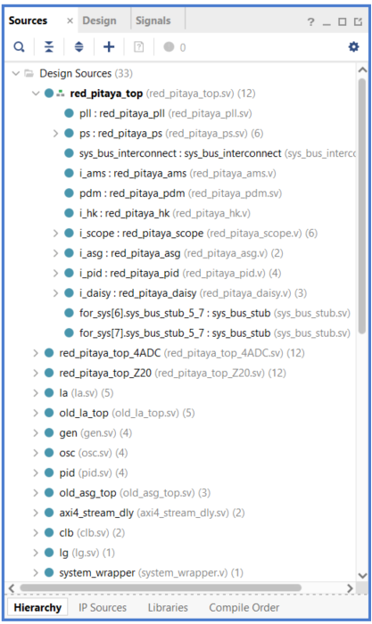
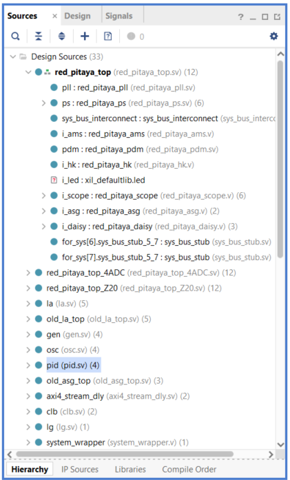
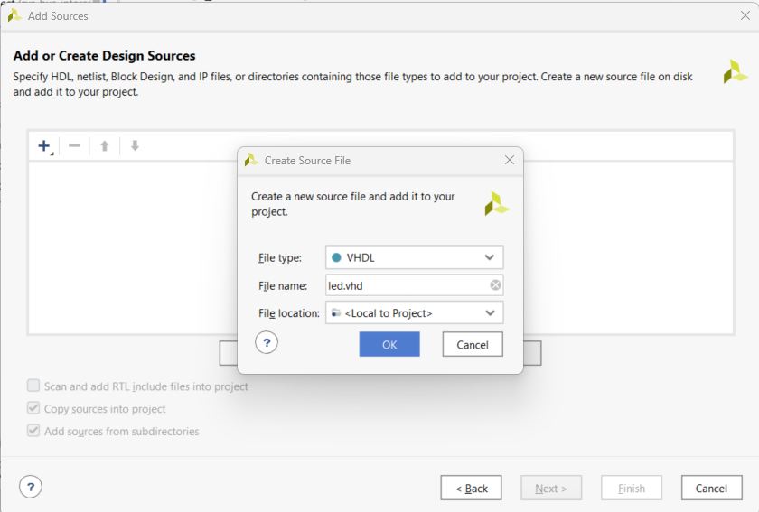

.. _led_counter:

##############
LED Counter
##############

.. note::

    The instructions here are an example for STEMlab 125-14. For other boards, different flags must be used. The design source structure may differ from the one seen in the pictures here. Please see the :ref:`Vivado Project Setup <create_fpga_project>` for more information.

Prepare the environment
========================

Download and extract the |RP FPGA| to a folder/directory on your computer.

.. |RP FPGA| raw:: html

   <a href="https://github.com/RedPitaya/RedPitaya-FPGA" target="_blank">Red Pitaya FPGA Git repository</a>

.. tabs::

   .. tab:: Linux

        Open Vivado, and in "Vivado Tcl Console", navigate to the base folder **RedPitaya-FPGA** and make a clean Red Pitaya Vivado project.

        .. code-block:: bash

            . /opt/Xilinx/Vivado/2020.1/settings64.sh
            cd Downloads/
            cd RedPitaya-FPGA/
            make project PRJ=v0.94 MODEL=Z10

        .. figure:: ./../img/Screen9.png
            :width: 70%
            :align: center

   .. tab:: Windows

        On Windows, search for **Vivado HLS 2020.1 Command Prompt** and launch it.

        Using the command line, navigate to the extracted folder and make a Vivado project:

        .. code-block:: bash

            cd Downloads/
            cd RedPitaya-FPGA/
            make project PRJ=v0.94 MODEL=Z10

        .. figure:: ./../img/Vivado_HLS_console_windows.png
            :width: 70%
            :align: center

This will automatically generate a complete project in the **RedPitaya-FPGA/prj/v0.94** directory.

Description
===========

In this project, we will learn how to create a simple LED binary counter using basic VHDL code. We will also learn how to replace one of the rarely used components in the Red Pitaya FPGA, the MIMO PID, and replace it with our own FPGA component. This way, the system bus can easily be used to give programs access to registers and, with a few minor modifications, gain access to ADCs and DACs, but let us not get ahead of ourselves. 

Our FPGA component will contain the code for a binary LED counter, but later on, you can use the same structure and completely reprogram the functionality.

Most of the FPGA code for Red Pitaya is written either in Verilog or in System Verilog. We can even include a component written in VHDL to the project without problems.

In the Sources window, under Design Sources, are all the HDL (Hardware Description Language) files included in our project. These can be either written in VHDL or Verilog. If you look closely, you will see that one of the files is highlighted in bold and has a small green-grey pyramid in front of the name. This file is called the "Top" module. It contains all other modules and FPGA code that is included in our project. In our case, the Top file is named **red_pitaya_top.sv**. If we expand the drop-down menu of the **red_pitaya_top**, we can see all the modules that are included in the project. All other modules that are not located under the red_pitaya_top are still in our overall FPGA project, but they will not affect the overall functionality (we could say that they are commented out).

If you look closely, you will notice that some of the modules included under the top module **red_pitaya_top** can also be expanded. This means that they also contain multiple submodules. Each module contains Verilog or VHDL code and can include other HDL files/modules as components. A similar example is including a library in our C or Python program.

We can think of each module as a black box with inputs and outputs that perform a specific task. We can connect this black box to other black boxes like LEGOs so that together they can perform a more complex task. Multiple smaller boxes can fit inside a larger one. Each box can also contain smaller ones. Let's say we are building a LEGO car. Once our LEGO car has been built, it represents the biggest black box or the topmost module of the FPGA program. But the LEGO car is not just one single LEGO brick; We had to build it from scratch with the general idea in mind. Our LEGO car is composed of multiple parts: Doors, seats, engine, chassis, and other components. Each of these represents a sub-module, all connected to form a fully functioning car. Each of the sub-modules (the engine, for example) may also be composed of sub-modules. The smallest of them may contain only a few LEGO bricks (lines of code) that together perform the specified task.

Enough of the theory; let's dive in.

Red_Pitaya_top.sv
------------------

We can see that our red_pitaya_top has twelve other submodules (pll, ps, sys_bus_interconnect, etc.). One of them is named "i_pid". We will replace it with our own component named i_led.

Double-click on the **red_pitaya_top** to open the file inside Vivado's code editor. In the comments at the top (lines 10-40), we can see how the modules are connected together, then there is the definition of all input and output signals of the red_pitaya_top component. The one we are interested in is the LED signal in line 110.

Since we want to "blink" the LEDs, we need to change the port logic to output:

.. code-block:: Verilog

    // LED
    output  logic [ 8-1:0] 

Scrolling downwards, we can see the definitions of local signals and parameters, and finnaly component connections. Since it will take a while to find how the LEDs are connected let us use **Ctrl+F** and type in "led" to find where and how the signal is connected.

In line 425 we spot the following code:

.. code-block:: Verilog

    red_pitaya_hk i_hk (
      // system signals
      .clk_i           (adc_clk ),  // clock
      .rstn_i          (adc_rstn),  // reset - active low
      // LED
      .led_o           (  led_o                      ),  // LED output
      // global configuration
      .digital_loop    (digital_loop),
      .daisy_mode_o    (daisy_mode),
      // Expansion connector
      .exp_p_dat_i     (exp_p_in ),  // input data
      .exp_p_dat_o     (exp_p_out),  // output data
      .exp_p_dir_o     (exp_p_dir),  // 1-output enable
      .exp_n_dat_i     (exp_n_in ),
      .exp_n_dat_o     (exp_n_out),
      .exp_n_dir_o     (exp_n_dir),
      .diag_i          (locked_pll_cnt_r2),
       // System bus
      .sys_addr        (sys[0].addr ),
      .sys_wdata       (sys[0].wdata),
      .sys_wen         (sys[0].wen  ),
      .sys_ren         (sys[0].ren  ),
      .sys_rdata       (sys[0].rdata),
      .sys_err         (sys[0].err  ),
      .sys_ack         (sys[0].ack  )
    );

As we can see, the *led_o* port is connected to a housekeeping section. Disconnect it.

.. code-block:: Verilog

      // LED
      //.led_o           (  led_o                      ),  // LED output

In lines 447-450 we see the comment for the LED section, but it is currently empty. Here is where we will include our own LED module as a component. The next thing we need to find is the *PID* component and disconect it. It is located on lines 528-550. Our LED component will be connected in almost identical way, so we should copy the code and then comment out the "MIMI PID controller":

.. code-block:: Verilog

    ///////////////////////////////////////////////////////////////////////////////
    //  MIMO PID controller
    ////////////////////////////////////////////////////////////////////////////////
    
    //red_pitaya_pid i_pid (
    //   // signals
    //  .clk_i           (adc_clk   ),  // clock
    //  .rstn_i          (adc_rstn  ),  // reset - active low
    //  .dat_a_i         (adc_dat[0]),  // in 1
    //  .dat_b_i         (adc_dat[1]),  // in 2
    //  .dat_a_o         (pid_dat[0]),  // out 1
    //  .dat_b_o         (pid_dat[1]),  // out 2
    //  // System bus
    //  .sys_addr        (sys[3].addr ),
    //  .sys_wdata       (sys[3].wdata),
    //  .sys_wen         (sys[3].wen  ),
    //  .sys_ren         (sys[3].ren  ),
    //  .sys_rdata       (sys[3].rdata),
    //  .sys_err         (sys[3].err  ),
    //  .sys_ack         (sys[3].ack  )
    //);

.. note::

    On SIGNALlab 250-12, the MIMO PID is already commented. Instead, the followign lines need to be commented:

    .. code-block:: Verilog

        //assign sys[3].ack = 1'b1 ;
        //assign sys[3].err = 1'b0 ;
        //assign sys[3].rdata = 32'h0 ;

We should also make sure that the *"pid_dat"* signals are not left floating:

.. code-block:: Verilog

    assign pid_dat[0] = 14'b0;
    assign pid_dat[1] = 14'b0;

Now it is time to prepare the connection for our LED component. Scroll back to the *LED section* of **red_pitaya_top** and input the following code:

.. code-block:: Verilog
    
    ////////////////////////////////////////////////////////////////////////////////
    // LED
    ////////////////////////////////////////////////////////////////////////////////
    
    led i_led (
       // signals
      .clk_i           (adc_clk   ),  // clock
      .rstn_i          (adc_rstn  ),  // reset - active low
      .led_o           (led_o     ),    // LEDs
      //.dat_a_i         (adc_dat[0]),  // in 1
      //.dat_b_i         (adc_dat[1]),  // in 2
      //.dat_a_o         (pid_dat[0]),  // out 1
      //.dat_b_o         (pid_dat[1]),  // out 2
      // System bus
      .sys_addr        (sys[3].addr ),
      .sys_wdata       (sys[3].wdata),
      .sys_wen         (sys[3].wen  ),
      .sys_ren         (sys[3].ren  ),
      .sys_rdata       (sys[3].rdata),
      .sys_err         (sys[3].err  ),
      .sys_ack         (sys[3].ack  )
    );

We have just connected a component called *led* that we named *i_led*. We comented out the ADC and DAC ports, which we will not be using in this example, connected the LEDs, and left everything else as is. This means we will be able to access the change the LEDs and access the System bus.

After we save the **red_pitaya_top** file, we can see that the PID component is now outside the *red_pitaya_top* and there is an unknown *i_led* file in its place, which we are going to create now.

led.vhd
--------------

Create a new design source file (click on the **blue +** in the Sources menu) ==> **Add or create design sources** ==> **Create File**.
Name the new file **led.vhd** and select VHDL as the file type.

Click OK and skip the **Define Module** step. Confirm that the **Module has not changed** ==> **OK**. We will add all the ports manualy.

You should see that the undefined *led* component now has a file associated to it. 

Open the *i_led: led(Behavioral)(led.vhd)* file and copy the following code into it, and save the file:

.. code-block:: VHDL

    --------------------------------------------------------------------------------
    -- Company: Red Pitaya
    -- Engineer: Miha Gjura
    --
    -- Design Name: led
    -- Project Name: Red Pitaya V0.94
    -- Target Device: Red Pitaya STEMlab 125-14
    -- Tool versions: Vivado 2020.1
    -- Description: Led Counter code
    -- Sys Registers: 403_00000 to 403_fffff (uses MIMO PID register space)
    --------------------------------------------------------------------------------
    
    library IEEE;
    use IEEE.STD_LOGIC_1164.all;
    use IEEE.NUMERIC_STD.all;
    
    entity led is
      port (
        clk_i   : in  std_logic;                        -- bus clock 
        rstn_i  : in  std_logic;                        -- bus reset - active low
        led_o   : out std_logic_vector(7 downto 0);     -- led bus
        sys_addr  : in  std_logic_vector(31 downto 0);  -- bus address
        sys_wdata : in  std_logic_vector(31 downto 0);  -- bus write data          
        sys_wen   : in  std_logic;                      -- bus write enable
        sys_ren   : in  std_logic;                      -- bus read enable
        sys_rdata : out std_logic_vector(31 downto 0);  -- bus read data
        sys_err   : out std_logic;                      -- bus error indicator
        sys_ack   : out std_logic                       -- bus acknowledge signal
        );
    end led;
    
    architecture Behavioral of led is
        signal count_speed : unsigned(31 downto 0) := to_unsigned(1, 32);
        signal led_count : unsigned(31 downto 0) := (others => '0');
    
    begin
    
        count: process(clk_i)
        begin 
            if rising_edge(clk_i) then
                if rstn_i = '0' then
                    led_count <= (others => '0');
                else
                    led_count <= led_count + count_speed;
                end if;
            end if;
        end process;
    
        led_o <= std_logic_vector(led_count(31 downto 24));
        
        -- Handling non-connected system signals
        -- sys_ack <= '1';
        sys_err <= '0';
    
        --  Registers, write & control logic
        pbus: process(clk_i)
        begin 
            if rising_edge(clk_i) then
                if rstn_i = '0' then
        
                else
                    sys_ack <= sys_wen or sys_ren;    -- acknowledge transactions
                
    --                if sys_wen='1' then               -- decode address & write registers
    --                    if sys_addr(19 downto 0)=X"00054" then
    --    
    --                    end if;
    --                end if;
                end if;
            end if;
        end process;
    
        -- decode address & read data
        with sys_addr(19 downto 0) select
            sys_rdata <= X"FEEDBACC" when x"00050",   -- ID
                         X"00000000" when others;
    
    end Behavioral;

So, what exactly does the code above do?

The entity contains all the signals that go in and out of our *led* module. These signals enable us to control the LEDs and access the System bus.

.. code-block:: VHDL

    entity led is
      port (
        clk_i   : in  std_logic;                        -- bus clock 
        rstn_i  : in  std_logic;                        -- bus reset - active low
        led_o   : out std_logic_vector(7 downto 0);     -- led bus
        sys_addr  : in  std_logic_vector(31 downto 0);  -- bus address
        sys_wdata : in  std_logic_vector(31 downto 0);  -- bus write data          
        sys_wen   : in  std_logic;                      -- bus write enable
        sys_ren   : in  std_logic;                      -- bus read enable
        sys_rdata : out std_logic_vector(31 downto 0);  -- bus read data
        sys_err   : out std_logic;                      -- bus error indicator
        sys_ack   : out std_logic                       -- bus acknowledge signal
        );
    end led;

In the architecture, we defined two signals. *led_count* contains the value of the counter with initial value of 0 and *count_speed* how fast the counter changes (set to 1).

.. code-block:: VHDL

    architecture Behavioral of led is
        signal count_speed : unsigned(31 downto 0) := to_unsigned(1, 32);
        signal led_count : unsigned(31 downto 0) := (others => '0');
    
    begin

In the *count* process, on each rising edge of the clock signal the *led_count* is increased by *count_speed*. And the upper eight bits are assigned to the *led_o* port.

.. code-block:: VHDL

    count: process(clk_i)
    begin 
        if rising_edge(clk_i) then
            if rstn_i = '0' then
                led_count <= (others => '0');
            else
                led_count <= led_count + count_speed;
            end if;
        end if;
    end process;
    
    led_o <= std_logic_vector(led_count(31 downto 24));

Next, we have connected the *sys_err* signal that we are not using to 0.

.. code-block:: VHDL

    -- Handling non-connected system signals
    -- sys_ack <= '1';
    sys_err <= '0';

This section is not used for this project, but it is an example of how you can change a value of a variable inside the FPGA (write data to FPGA), by writing a value to a specific registry address. Since this module is connected to the PID registry space, we can only use addresses between 403_00000 and 403_fffff, which is why we are only interested in the lower 20 bits of the system address bus. 

.. code-block:: VHDL

    --  Registers, write & control logic
            pbus: process(clk_i)
            begin 
                if rising_edge(clk_i) then
                    if rstn_i = '0' then
            
                    else
                        sys_ack <= sys_wen or sys_ren;    -- acknowledge transactions
                    
        --                if sys_wen='1' then               -- decode address & write registers
        --                    if sys_addr(19 downto 0)=X"00054" then
        --    
        --                    end if;
        --                end if;
                    end if;
                end if;
            end process;

Finaly an example of how to read data from the FPGA. In our case, we implemented a ID into the registry space. We can check whether our FPGA image is loaded, by reading from address 0x40300050, where we should get the value *FEEDBACC* in return.

.. code-block:: VHDL

    -- decode address & read data
    with sys_addr(19 downto 0) select
        sys_rdata <= X"FEEDBACC" when x"00050",   -- ID
                     X"00000000" when others;
    

Generate Bitstream and program the FPGA
-------------------------------------------

We are ready to click on the *Generate Bitstream* button. After successful completion of synthesis, implementation, and bitstream generation, the bit file can be found at **RedPitaya-FPGA\prj\v0.94\project\redpitaya.runs\impl_1\red_pitaya_top.bit**.

How the FPGA is reprogrammed depends on the Red Pitaya OS version.

Please make sure that the *PATH environment variable* is set correctly. See :ref:`Vivado installation guide <install_Vivado>` for more information.

.. note::

   On Windows, the process can also be done through a standard Command Prompt, but any ``echo`` commands must be executed inside the Windows Subsystem for Linux (WSL) Terminal (The output file encoding is a problem with Windows ``echo``). For more information, refer to the following forum topics:
   
       - |batch_file_topic_1|
       - |batch_file_topic_2|

.. |batch_file_topic_1| raw:: html

      <a href="https://superuser.com/questions/601282/%cc%81-is-not-recognized-as-an-internal-or-external-command" target="_blank">́╗┐' is not recognized as an internal or external command</a>

.. |batch_file_topic_2| raw:: html

      <a href="https://devblogs.microsoft.com/oldnewthing/20210726-00/?p=105483" target="_blank">Diagnosing why your batch file prints a garbage character, one character, and nothing more</a>

.. tabs::

    .. tab:: OS version 1.04 or older

        Please note that you need to change the forward slashes to backward slashes on Windows.

        1. Open Terminal or CMD and go to the .bit file location.

        .. code-block:: bash
    
            cd <Path/to/RedPitaya/repository>/prj/v0.94/project/repitaya.runs/impl_1

        2. Send the newly generated *.bit* file to the RedPitaya’s **/root** folder using **WinSCP** or type the following commands in the **Linux console** or **Windows Command Prompt**.

        .. code-block:: bash

            scp red_pitaya_top.bit root@rp-xxxxxx.local:/root/Led_counter.bit

        3. Now establish an SSH communication with your Red Pitaya and check if you have the copy *red_pitaya_top.bit* in the root directory.

        .. code-block:: bash

            ssh root@rp-xxxxxx.local

        .. code-block:: bash

            redpitaya> ls

        4. Finally, we are ready to program the FPGA with our own bitstream file located in the **/root/** folder on Red Pitaya. 
           To program the FPGA simply execute the following line in the Linux console your Red Pitaya:

        .. code-block:: bash

            redpitaya> cat Led_counter.bit > /dev/xdevcfg

    .. tab:: OS version 2.00

        The 2.00 OS uses a new mechanism of loading the FPGA. The process will depend on whether you are using Linux or Windows as the ``echo`` command functinality differs bewteen the two.

        Please note that you need to change the forward slashes to backward slashes on Windows.

        1. On Windows, open **Vivado HSL Command Prompt** and go to the *.bit* file location.

           On Linux, open the **Terminal** and go to the *.bit* file location.

           .. code-block:: bash

               cd <Path/to/RedPitaya/repository>/prj/v0.94/project/repitaya.runs/impl_1

        2. Create *.bif* file (for example, *red_pitaya_top.bif*) and use it to generate a binary bitstream file (*red_pitaya_top.bit.bin*)

           **Windows (Vivado HSL Command Prompt):**

           .. code-block:: bash

               echo all:{ red_pitaya_top.bit } >  red_pitaya_top.bif
               bootgen -image red_pitaya_top.bif -arch zynq -process_bitstream bin -o red_pitaya_top.bit.bin -w

           **Linux and Windows (WSL + Normal CMD):**

           .. code-block:: bash

               echo -n "all:{ red_pitaya_top.bit }" >  red_pitaya_top.bif
               bootgen -image red_pitaya_top.bif -arch zynq -process_bitstream bin -o red_pitaya_top.bit.bin -w

        3. Send the newly generated *.bit.bin* file to the RedPitaya’s **/root** folder using **WinSCP** or type the following commands in the **Linux console** or **Windows Command Prompt**.

           .. code-block:: bash
   
               scp red_pitaya_top.bit.bin root@rp-xxxxxx.local:/root/Led_counter.bit

        4. Now establish an SSH communication with your Red Pitaya and check if you have the copy *red_pitaya_top.bit.bin* in the root directory.

           .. code-block:: bash

               ssh root@rp-xxxxxx.local

           .. code-block:: bash

               redpitaya> ls

        5. Finally, we are ready to program the FPGA with our own bitstream file located in the **/root/** folder on Red Pitaya. 
           To program the FPGA simply execute the following line in the Linux console your Red Pitaya:

           .. code-block:: bash

               redpitaya> /opt/redpitaya/bin/fpgautil -b Led_counter.bit.bin

Now, you should see the LEDs blink in the pattern of a binary counter. Congratulations on making it this far!!! Don’t worry, you did not destroy your Red Pitaya.

Reverting to original FPGA image
----------------------------------

If you want to roll back to the official Red Pitaya FPGA program, run the following command:

.. tabs::

    .. group-tab:: OS version 1.04 or older

        .. code-block:: shell-session

            redpitaya> cat /opt/redpitaya/fpga/fpga_0.94.bit > /dev/xdevcfg

    .. group-tab:: OS version 2.00

        .. code-block:: shell-session

            redpitaya> overlay.sh v0.94

or simply restart your Red Pitaya.

Conclusion
============

In this section we have learned how to create a simple LED counter project in the Red Pitaya's FPGA. We also found out that it does not matter if a specific module/component is written in Verilog or VHDL, because of the "black box" principle that HDL languages use. This project can easily be expanded to include the ADC and DAC, but that is a topic for another time.

Written by Miha Gjura.

Based on Red Pitaya FPGA code and `University of Ljubljana Faculty of Electrotechics LNIV <https://lniv.fe.uni-lj.si/redpitaya/>`_.

This teaching material was created by `Red Pitaya <https://www.redpitaya.com/>`_.

