.. _vga_game:

#########
Ping pong
#########

This is a continuation of the project → :ref:`vga image <vga_image>`

====================
Building the Project
====================

Move to folder *RedPitaya-FPGA/prj/Examples*. 
Uncomment the line "set project_name Vga_game" and comment out all files in the make_project.tcl file. 
Open Vivado and in Vivado Tcl Console navigate to the base folder: *RedPitaya-FPGA/prj/Examples*. 

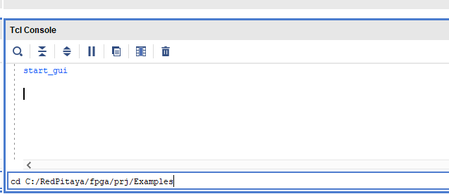

Then run the script source make_project.tcl. Tools → Run Tcl Script.

This will make the full project, if you want to follow through with this tutorial you will need to install *Xilinx Vitis*. Afterward, run the *Vga_draw* project and continue with the tutorial.

=====================
Step-by-step tutorial
=====================

After the previous project started working, I wanted to be able to change the picture pattern, picture size, and location on the screen. 
I added a few more ports which will be later controlled through AXI_GPIO, with the Vitis application.

.. code-block:: vhdl

    entity picture is
        Port (
            clk50: in STD_LOGIC;
            data_position: in unsigned(16 downto 0);
            Offset: in unsigned(15 downto 0);
            size: in unsigned(15 downto 0);
            data_in: in STD_LOGIC;
            hst: out unsigned(10 downto 0);
            vst: out unsigned(9 downto 0);
            rgb: out STD_LOGIC_VECTOR(2 downto 0));
    end picture;

* clk50 - 50 MHz clock
* data_position - position to write the data + Write enable bit
* Offset - picture location on the screen
* size - picture size
* data_in - "1" or "0" that is written in an array
* hst, vst - current position on the screen
* rgb - signal to be displayed on the screen

I created and connected another block design. As seen in the picture below:

.. figure:: img/VgaDraw1.png
    :alt: Logo
    :align: center

Block diagram explained
***********************

If you are doing block design for the first time, 
I recommend the Zynq book as a good starting point because it explains the basic steps of how to build a project in Vivado.

Ok, let's explain the block diagram:

1. First, we start with the *Zynq7 processing system*, these are the brains.
#. I added three AXI_GPIO blocks

	* The first one (*axi_gpio_0*) is connected to on-board LEDs, and it is there just to check if the program is running
	* The second one (*axi_gpio_1*) has two outputs, the first output controls the position on the screen, and the second output controls the picture size.
	* The third one (*axi_gpio_2*) also has two outputs, the first output is controlling where and when we write our data to the array, and on the second output, the actual data is coming in.
	
3. picture IP (*picture_0*) is used to save the picture and to read from the array
#. VGA IP (*VGA_0*) is used to set signals to synchronize the screen and output the data.
#. The last important IP is Clocking Wizard (*clk_wiz_0*). Linux sets the clock on the FCLK_CLK0 port to 125 MHz, but we need a 50 MHz clock so we place a Clocking Wizard to lower the clock frequency to the desired rate.

Picture IP and VGA IP are located in *RedPitaya-FPGA/prj/Examples/Vga_draw*

Setting 50 MHz clock
********************

First, we need to set the source clock from the ZYNQ7 IP.

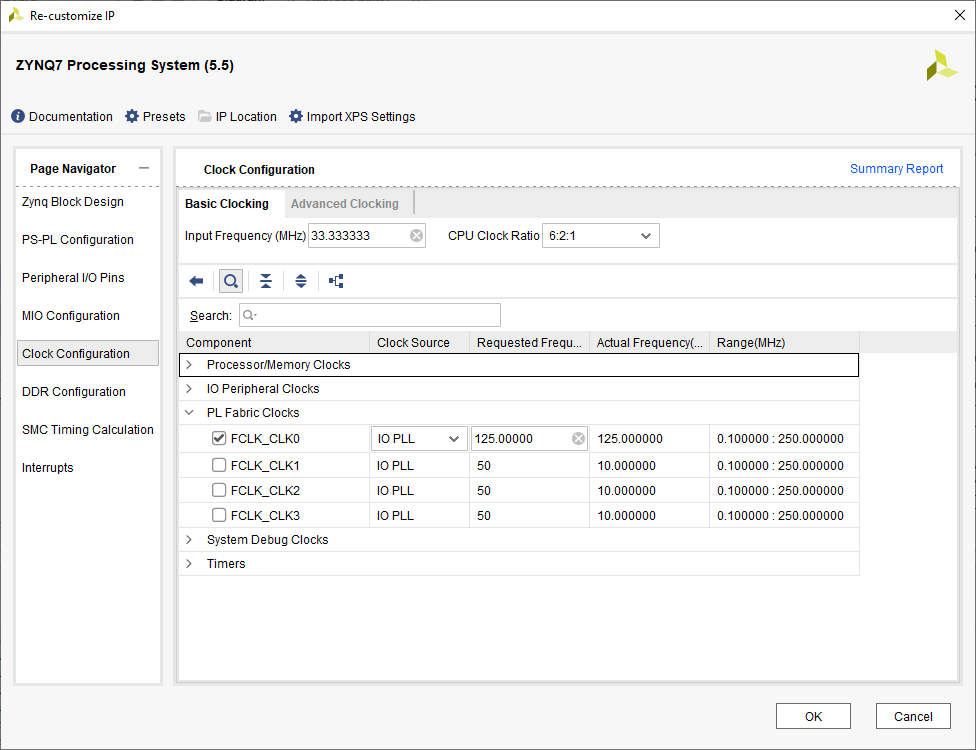

After setting the 125 MHz clock we have to divide it to get 50 MHz that we use. For this, we need the Clocking Wizard.

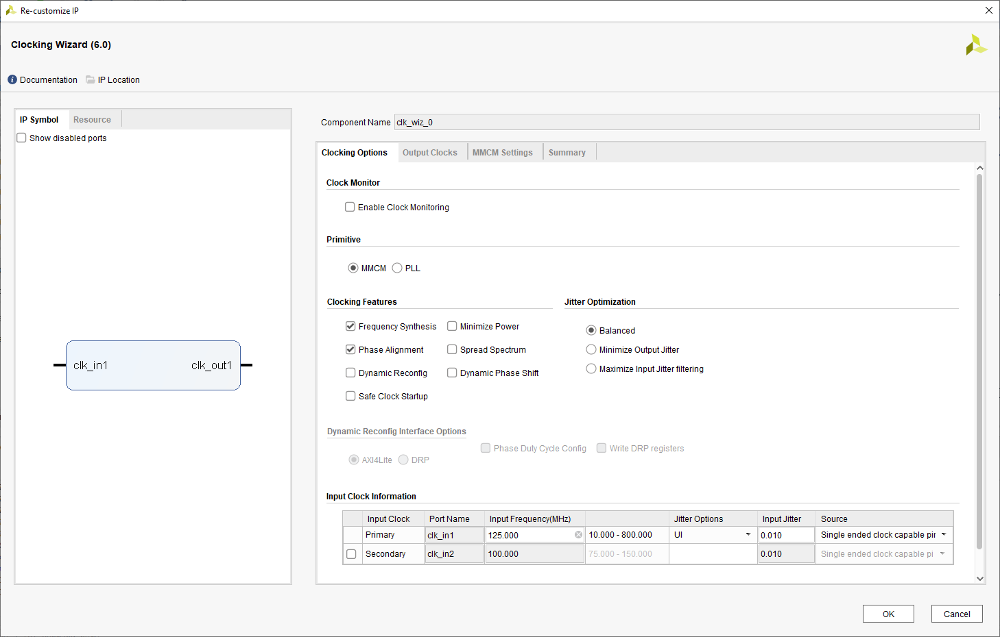

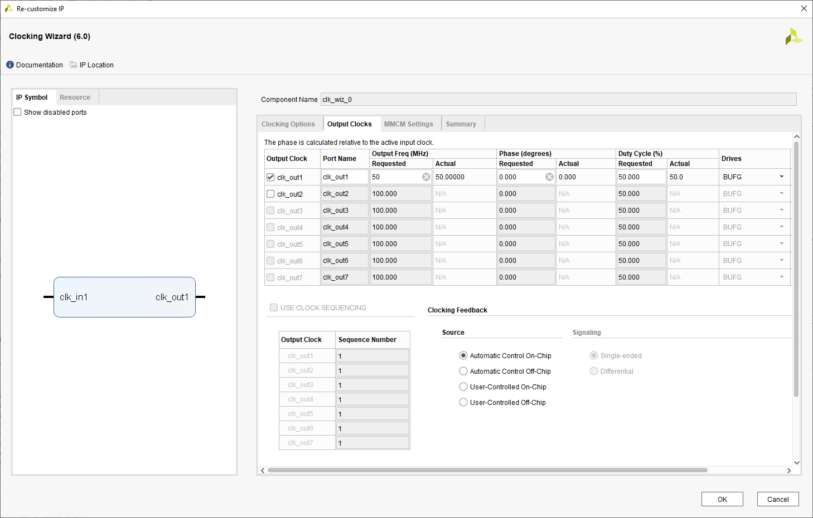

Run Synthesis, Implementation and Generate Bitstream for the project Vga_draw.

Exporting hardware
******************

Go to *File → Export → Export Hardware*.

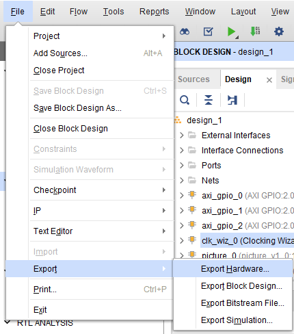

Use a fixed platform type.

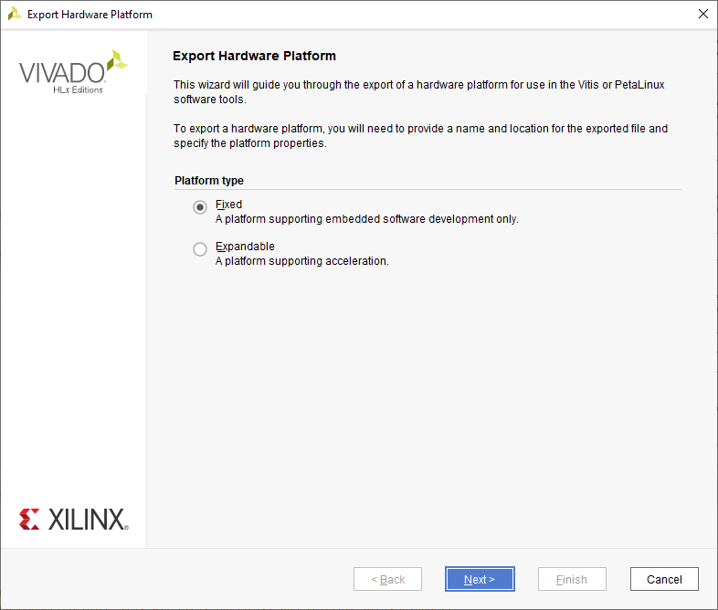

Select *Include bitstream*.

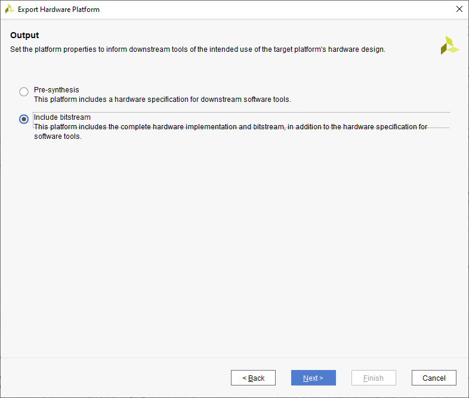

Complete the instructions and note the location of the file. In my case, the file is named design_1_wrapper (after the top module of the project).

Creating Vitis platform project
*******************************

Start Vitis

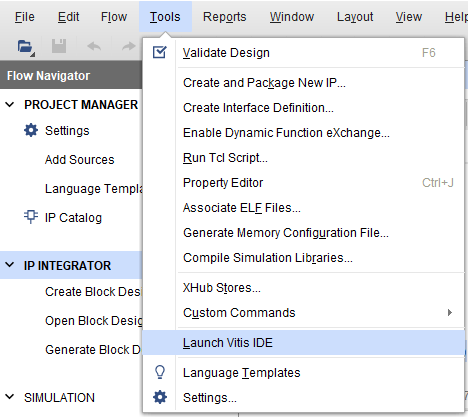

Press *→ Create Platform Project*.
Set the project name and choose **Create from hardware specification (XSA)**
Then point to the generated xsa file (Do not forget to specify the operating system as Linux):

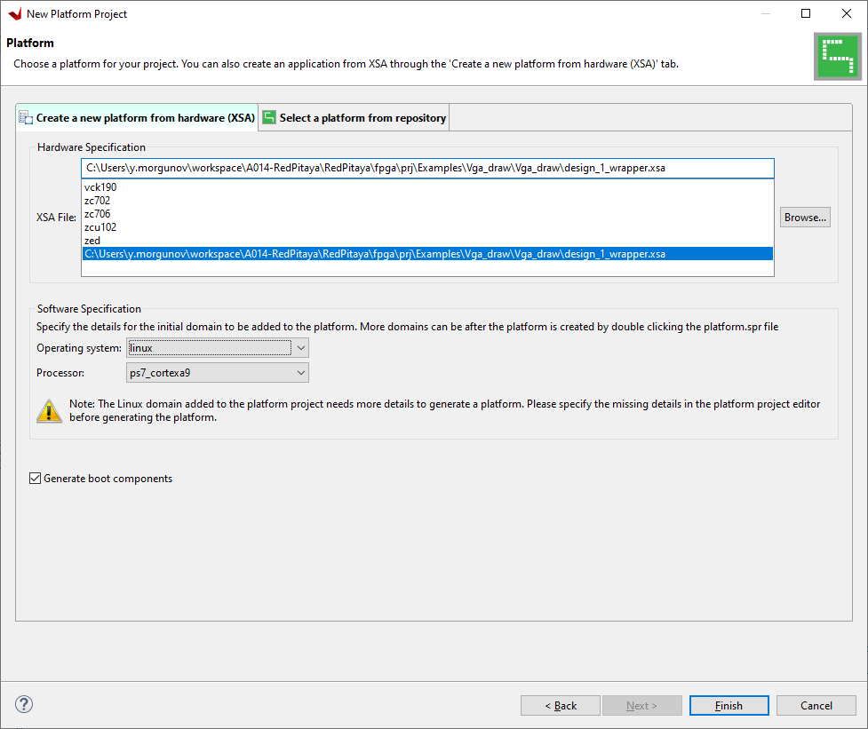

And press *finish*.

The last step is building:

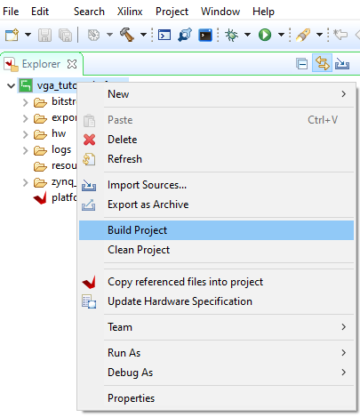

Now we can use the resulting platform to write a program.

Creating Vitis application project
**********************************

Go to *File → New → Application project*. Click next and select the platform you just created

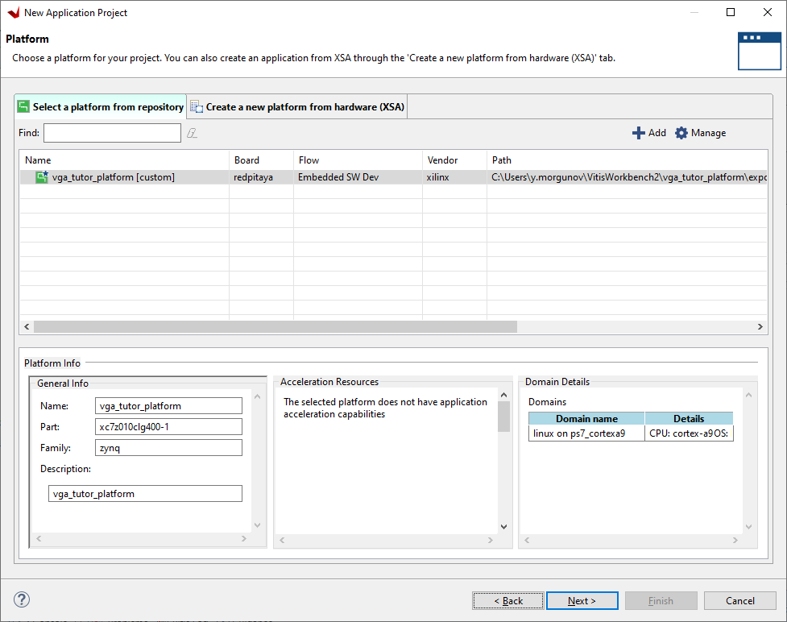

Press next and set the project name (Ping_pong). Leave the rest of the parameters by default.
When prompted to choose a domain template, check if it matches the created platform and click next.
The next step is choosing a template - I have chosen an *Empty Linux Application*.

Next we need to copy the main.c file from Vga_draw into our application project - in the Explorer sub-window right click on the project and select *Import Sources...*, navigate to *RedPitaya-FPGA/prj/Examples/Vga_draw/Vitis_sources* and click OK. Then check the *main.c* file and click *Finish*.

The *main.c* file should now be visible in the *src* folder of the Explorer sub-window.

We need to add the *math.h* library, so right click on the project *-> Properties* and then add the *m* library to the project.

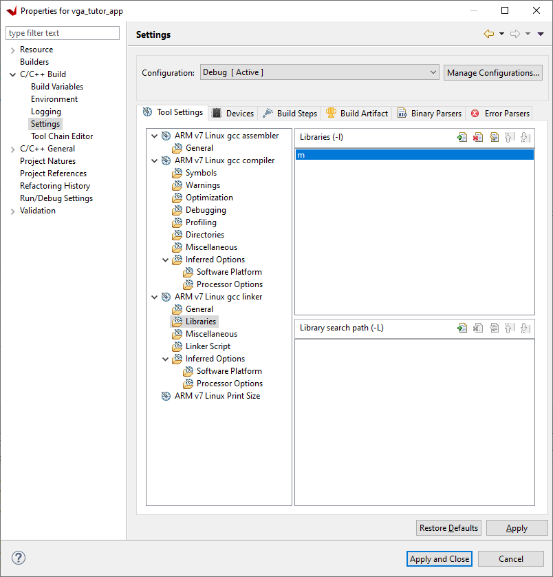

The project should compile.

Vitis code explained
********************

For every AXI_GPIO we have to define its address and its size as shown below

.. code-block:: c

    static unsigned long addr;
    static unsigned long addr_2;
    static unsigned long addr_3;

    addr = 0x41200000;  
    addr_2 = 0x41220000;	
    addr_3 = 0x41210000;

This is how we define dual ports. The second port is shifted by 0x0008.

.. code-block:: c

    data_position = map_base_2 + (addr_2 & MAP_MASK_2);
    data_in = map_base_2 + ((addr_2 + 0x0008) & MAP_MASK_2);

How to run an application on Red Pitaya
****************************************

For running the program on Red Pitaya I used Winscp (Windows) or the terminal (Linux), to transfer the *.bit* file from Vivado and the *.elf* file from SDK on the board.

Then connect to the RedPitaya via Putty/terminal.

Instructions on changing the FPGA image:

.. tabs::

    .. tab:: OS version 1.04 or older

        Please note that you need to change the forward slashes to backward slashes on Windows.

        1. Open Terminal or CMD and go to the .bit file location.

        .. code-block:: bash
    
            cd <Path/to/RedPitaya/repository>/prj/v0.94/project/repitaya.runs/impl_1

        2. Send the file .bit (*red_pitaya_top.bit* is the default name) to the Red Pitaya with the ``scp`` command.

        .. code-block:: bash

            scp red_pitaya_top.bit root@rp-xxxxxx.local:/root

        3. Now establish an SSH communication with your Red Pitaya and check if you have the copy *red_pitaya_top.bit* in the root directory.

        .. code-block:: bash

            redpitaya> ls

        4. Load the *red_pitaya_top.bit* to **xdevcfg** with

        .. code-block:: bash

            redpitaya> cat red_pitaya_top.bit > /dev/xdevcfg

    .. tab:: OS version 2.00

        The 2.00 OS uses a new mechanism of loading the FPGA. The process will depend on whether you are using Linux or Windows as the ``echo`` command functinality differs bewteen the two.

        Please note that you need to change the forward slashes to backward slashes on Windows.

        1. On Windows, open **Vivado** and use the **TCL console**. Alternatively, use **Vivado HSL Command Prompt** (use Windows search to find it). Navigate to the *.bit* file location.

           On Linux, open the **Terminal** and go to the *.bit* file location.

           .. code-block:: bash

               cd <Path/to/RedPitaya/repository>/prj/v0.94/project/repitaya.runs/impl_1

        2. Create *.bif* file (for example, *red_pitaya_top.bif*) and use it to generate a binary bitstream file (*red_pitaya_top.bit.bin*)

           **Windows (Vivado TCL console or Vivado HSL Command Prompt):**

           .. code-block:: bash

               echo all:{ red_pitaya_top.bit } >  red_pitaya_top.bif
               bootgen -image red_pitaya_top.bif -arch zynq -process_bitstream bin -o red_pitaya_top.bit.bin -w

           **Linux and Windows (WSL + Normal CMD):**

           .. code-block:: bash

               echo -n "all:{ red_pitaya_top.bit }" >  red_pitaya_top.bif
               bootgen -image red_pitaya_top.bif -arch zynq -process_bitstream bin -o red_pitaya_top.bit.bin -w

        3. Using a standard command prompt, send the file *.bit.bin* to the Red Pitaya with the ``scp`` command.

           .. code-block:: bash
   
               scp red_pitaya_top.bit.bin root@rp-xxxxxx.local:/root

        4. Now establish an SSH communication with your Red Pitaya and check if you have the copy *red_pitaya_top.bit.bin* in the root directory.

           .. code-block:: bash

               redpitaya> ls

        5. Load the *red_pitaya_top.bit.bin* image into the FPGA:

           .. code-block:: bash

               redpitaya> fpgautil -b red_pitaya_top.bit.bin

After the FPGA image has been changed type in the following:

.. code-block:: bash
    
    chmod +x <file_name.elf>
    ./ <file_name.elf>

Creating an IP core with an AXI bus
***********************************

Open the *Vga_draw* project with Vivado.

Let's create an IP core for drawing a rectangle. 
The core must draw a rectangle according to the specified parameters; coordinates (x, y), and size along both axes.

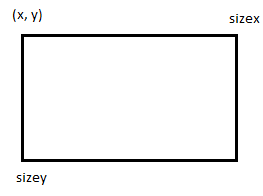

To create an IP core, go to *tools → Create and Package New Ip*:

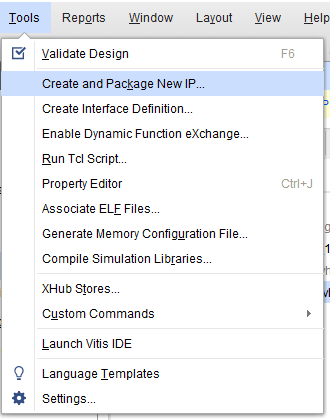

Select **Create AXI4 Peripheral**.

Next, we give a name to our block, its version, and its description:

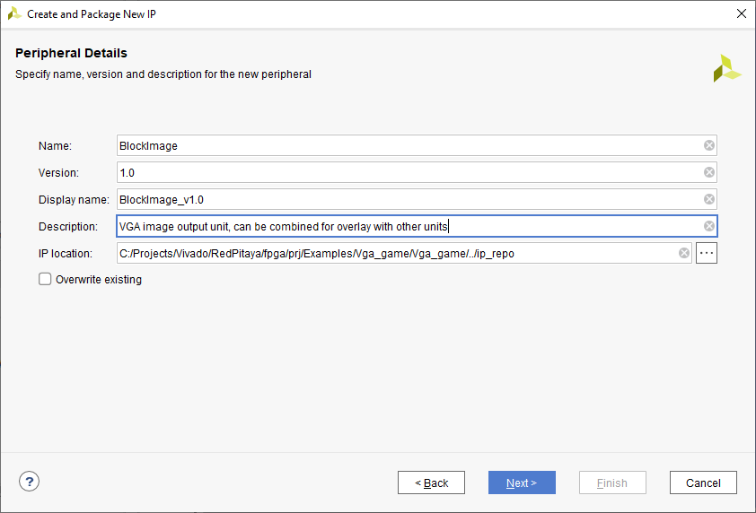

Vivado automatically generates code for working on the AXI bus, 
we just need to specify the number of registers we need when creating the IP core. I have specified 5 registers:

.. figure:: img/PingPong4.png
    :alt: Logo
    :align: center

Next, select the item to **add IP to the repository**.

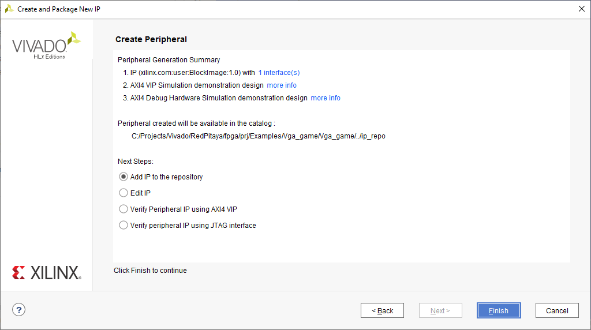

Now one can edit the IP core, go to the IP directory and look for the created core (Window -> IP Catalog):

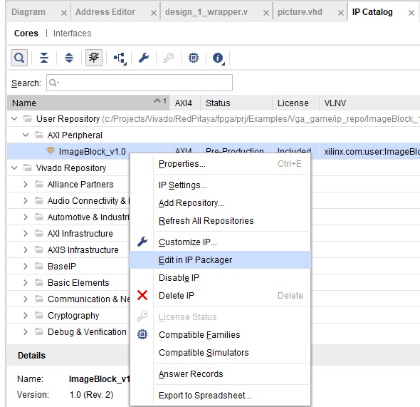

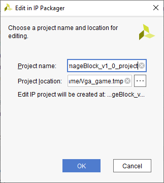

A new project will be created, which we can use to start writing logic.

Writing an IP core to draw a rectangle in Verilog
*************************************************

Let's create a new Verilog file named *RectPic.v*. This module will describe drawing a rectangle - the module's inputs are:

.. code-block:: verilog

    module RectPic #
    (
        parameter integer SCREEN_HEIGHT	= 600,
        parameter integer SCREEN_WIDTH	= 800
    )
    (
        input wire clk,
        input wire [10 : 0] hst,
        input wire [9 : 0] vst,
        input wire [15 : 0] block_posx,  // The position of the rectangle on the x-axis
        input wire [15 : 0] block_posy,  // The position of the rectangle on the y-axis
        input wire [15 : 0] block_sizex,  // The size of the rectangle on the x-axis
        input wire [15 : 0] block_sizey,  // The size of the rectangle on the y-axis
        input wire [2 : 0] draw_color,    // The color with which the object will be drawn
        input wire [2 : 0] rgb_i,         // Sent to rgb_o when there is nothing to draw
        output reg [2 : 0] rgb_o          
    );

Drawing a rectangle is pretty straightforward. 
To do this, it is enough to determine that the displayed pixel is inside the screen and inside the rectangle. 
The process of drawing a rectangle is written below:

.. code-block:: verilog

    always @(posedge clk)
    begin
        if ((hst < SCREEN_WIDTH) &&  (vst < SCREEN_HEIGHT)) // inside the screen
            if ((hst > block_posx) && (hst < (block_posx + block_sizex)))
                if ((vst > block_posy) && (vst < (block_posy + block_sizey)))
                    rgb_o <= draw_color;
                else
                    rgb_o <= rgb_i;
            else
                rgb_o <= rgb_i;
        else  
            rgb_o <= 3'b000;
    end
    endmodule

Now we need to describe the IO for the *BlockImage_v1_0* top-level module. After the line: *Users to add ports here*.

.. code-block:: verilog

    input wire [10 : 0] hst,
    input wire [9 : 0] vst,
    input wire [2 : 0] rgb_i,
    output wire [2 : 0] rgb_o,

Also, these ports need to be added to *BlockImage_v1_0_S00_AXI* - After the line: *Users to add ports here*.

.. code-block:: verilog

    input wire [10 : 0] hst,
    input wire [9 : 0] vst,
    input wire [2 : 0] rgb_i,
    output wire [2 : 0] rgb_o,

Add the parameters that will be required in the future to *BlockImage_v1_0* and *BlockImage_v1_0_S00_AXI*:

.. code-block:: verilog

    // Users to add parameters here
    parameter integer SCREEN_HEIGHT = 600,
    parameter integer SCREEN_WIDTH  = 800,

    parameter integer RESET_POSX = 10,
    parameter integer RESET_POSY = 10,
    parameter integer RESET_SIZEX = 10,
    parameter integer RESET_SIZEY = 10,
    parameter integer RESET_COLOR = 1,

Now let's connect the *BlockImage_v1_0* and the *BlockImage_v1_0_S00_AXI* module (find and change the following in *BlockImage_v1_0.v*):

.. code-block:: verilog

    // Instantiation of Axi Bus Interface S00_AXI
    BlockImage_v1_0_S00_AXI # ( 
        .SCREEN_HEIGHT(SCREEN_HEIGHT),
        .SCREEN_WIDTH(SCREEN_WIDTH),
        .RESET_POSX(RESET_POSX),
        .RESET_POSY(RESET_POSY),
        .RESET_SIZEX(RESET_SIZEX),
        .RESET_SIZEY(RESET_SIZEY),
        .RESET_COLOR(RESET_COLOR),
        
        .C_S_AXI_DATA_WIDTH(C_S00_AXI_DATA_WIDTH),
        .C_S_AXI_ADDR_WIDTH(C_S00_AXI_ADDR_WIDTH)
    ) BlockImage_v1_0_S00_AXI_inst (
    .hst(hst),
    .vst(vst),
    .rgb_i(rgb_i),
    .rgb_o(rgb_o),
    .S_AXI_ACLK(s00_axi_aclk),
    .S_AXI_ARESETN(s00_axi_aresetn),
    .S_AXI_AWADDR(s00_axi_awaddr),
    ...etc...

Let's go to the *BlockImage_v1_0_S00_AXI* file and rename the registers according to their purpose:

.. code-block:: verilog

    //-- Number of Slave Registers 5
    reg [C_S_AXI_DATA_WIDTH-1:0]	posx;
    reg [C_S_AXI_DATA_WIDTH-1:0]	posy;
    reg [C_S_AXI_DATA_WIDTH-1:0]	sizex;
    reg [C_S_AXI_DATA_WIDTH-1:0]	sizey;
    reg [C_S_AXI_DATA_WIDTH-1:0]	draw_color;

Set default values for registers:

.. code-block:: verilog

    always @( posedge S_AXI_ACLK )
    begin
    if ( S_AXI_ARESETN == 1'b0 )
        begin
        posx <= RESET_POSX;
        posy <= RESET_POSY;
        sizex <= RESET_SIZEX;
        sizey <= RESET_SIZEY;
        draw_color <= RESET_COLOR;

In the same process rename all the instances of *slv_regN* (N: 0-4) with the appropriate new register (so replace each instance of *slv_reg0* with *posx*, *slv_reg1* with *posy*, and so on). Do this wherever an error is displayed after you renamed the registers in the file.

The last thing left to do is to connect *RectPic*:

.. code-block:: verilog

    // Add user logic here
    RectPic # 
    (
    	SCREEN_HEIGHT,
    	SCREEN_WIDTH	
    ) pic_inst (
        .clk(S_AXI_ACLK),
        .hst(hst),
        .vst(vst),
        .block_posx(posx),
        .block_posy(posy),
        .block_sizex(sizex),
        .block_sizey(sizey),
        .draw_color(draw_color),
        .rgb_i(rgb_i),
        .rgb_o(rgb_o)
    );

Optionally, you can write tests for *RectPic* and the top-level module in the same project before packaging. 
After all these procedures, you can pack the project into the IP kernel. Click *Edit packaged IP* and complete all steps (Click *Merge changes from File Groups Wizard* in all instances where there is no checkmark):

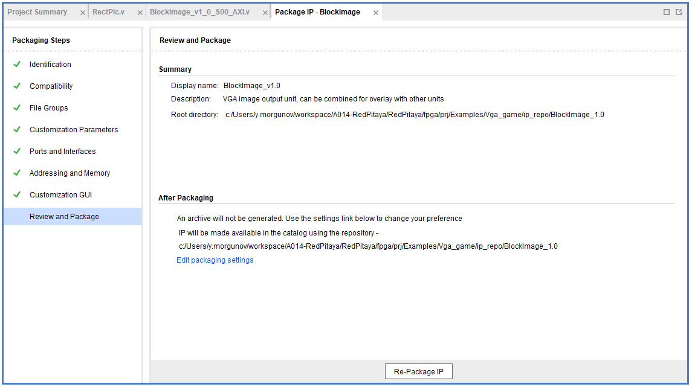

Press *Re-Package IP*.

Writing an IP core to draw a circle in Verilog
**********************************************

Let's create an AXI IP core named *CircleImage*, we only need 3 registers, but I left 4. 

Drawing a circle is not an easy task for FPGA. 
One of the simpler solutions is to use a block of memory and load a circle image into it (Vga_draw lesson), 
but we will go the simpler way and create an array immediately with a circle drawing inside. Let's create a *CircPic.v* file:

.. code-block:: verilog

    Ports:

    module CircPic #
        (
            parameter integer SCREEN_HEIGHT	= 600,
            parameter integer SCREEN_WIDTH	= 800
        )
        (
        input wire clk,
        input wire [10 : 0] hst,
        input wire [9 : 0] vst,
        input wire [15 : 0] block_posx,  // The position of the rectangle on the x-axis
        input wire [15 : 0] block_posy,  // The position of the rectangle on the y-axis
        input wire [2 : 0] draw_color,
        input wire [2 : 0] rgb_i,
        output reg [2 : 0] rgb_o
        );
	

The drawing process is similar to *RectPic*:

.. code-block:: verilog

    reg [31 : 0] mem [31 : 0];
        
    initial begin
        mem[0]  = 32'b00000000000011111111000000000000;
        mem[1]  = 32'b00000000011111111111111000000000;
        mem[2]  = 32'b00000001111111111111111110000000;
        mem[3]  = 32'b00000011111111111111111111000000;
        mem[4]  = 32'b00000111111111111111111111100000;
        mem[5]  = 32'b00001111111111111111111111110000;
        mem[6]  = 32'b00011111111111111111111111111000;
        mem[7]  = 32'b00111111111111111111111111111100;
        mem[8]  = 32'b00111111111111111111111111111100;
        mem[9]  = 32'b01111111111111111111111111111110;
        mem[10] = 32'b01111111111111111111111111111110;
        mem[11] = 32'b01111111111111111111111111111110;
        mem[12] = 32'b11111111111111111111111111111111;
        mem[13] = 32'b11111111111111111111111111111111;
        mem[14] = 32'b11111111111111111111111111111111;
        mem[15] = 32'b11111111111111111111111111111111;
        mem[16] = 32'b11111111111111111111111111111111;
        mem[17] = 32'b11111111111111111111111111111111;
        mem[18] = 32'b11111111111111111111111111111111;
        mem[19] = 32'b11111111111111111111111111111111;
        mem[20] = 32'b01111111111111111111111111111110;
        mem[21] = 32'b01111111111111111111111111111110;
        mem[22] = 32'b01111111111111111111111111111110;
        mem[23] = 32'b00111111111111111111111111111100;
        mem[24] = 32'b00111111111111111111111111111100;
        mem[25] = 32'b00011111111111111111111111111000;
        mem[26] = 32'b00001111111111111111111111110000;
        mem[27] = 32'b00000111111111111111111111100000;
        mem[28] = 32'b00000011111111111111111111000000;
        mem[29] = 32'b00000001111111111111111110000000;
        mem[30] = 32'b00000000011111111111111000000000;
        mem[31] = 32'b00000000000011111111000000000000;
    end
        
    always @(posedge clk)
    begin
        if ((hst < SCREEN_WIDTH) &&  (vst < SCREEN_HEIGHT)) // inside the screen
            if ((hst >= block_posx) && (hst < (block_posx + 32)))
                if ((vst >= block_posy) && (vst < (block_posy + 32)))
        if (mem[vst - block_posy][hst - block_posx])
            rgb_o <= draw_color;
        else
            rgb_o <= rgb_i;
                else
                    rgb_o <= rgb_i;
            else
                rgb_o <= rgb_i;
        else  
            rgb_o <= 3'b000;
    end
    endmodule

As in the previous paragraph, add the necessary ports and rename the registers for their purpose (this time we only have 3 registers). 
Do not forget to pack the project into an IP core.

Writing an IP core to work with the keyboard.
*********************************************

Create another empty IP core where you will need to add an input for the buttons:

.. code-block:: verilog

    input wire [3 : 0] keys,

And write the values at the keys input to register 0 at each clock signal:

.. code-block:: verilog

    always @( posedge S_AXI_ACLK )
	begin
	  if ( S_AXI_ARESETN == 1'b0 )
	    begin
	      slv_reg0 <= 4'b1111;
	      slv_reg1 <= 0;
	      slv_reg2 <= 0;
	      slv_reg3 <= 0;
	    end 
	  else begin
                slv_reg0 = keys;
	    if (slv_reg_wren)

In my case, with the buttons connected and not pressed, the keys port has the value 4'b1111. 
When you press one of the buttons, its corresponding bit will be equal to 0.

Scheme of one of the buttons:

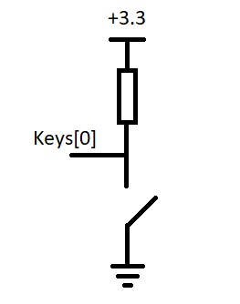

Connecting IP cores to the processor.
*************************************

Now you can change the Vga_draw project with the newly added cores or open the project Vga_game where everything is already done.

We add the resulting IPs to the main project and connect them to the AXI bus. 
In total, you need 4 BlockImage (2 paddles and 2 counters), 1 CircleImage (1 ball), and a keyboard. 
We connect rgb_o to rgb_i of each of the cores. The order is not very important, as it only affects which object is drawn on top of the other. 
The resulting diagram:

.. figure:: img/PingPong10.png
    :alt: Logo
    :align: center

Setting up addressing:

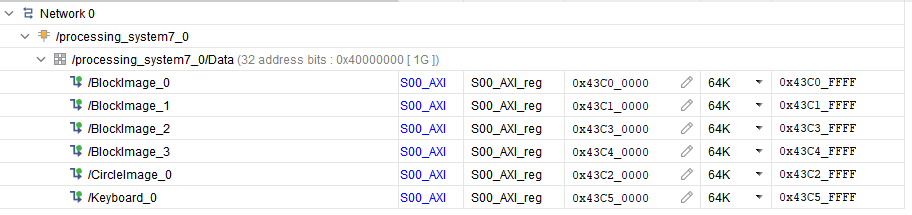

Writing game code in C++
************************

The complete game code is located in *RedPitaya-FPGA/prj/Examples/Vga_game/Vitis_sources*. In the following chapters, we will discuss what the important parts of the code do.

All classes Rectangle, Keyboard, and Ball - describe work with the corresponding IP cores, constructors take a file descriptor as input, and an address in memory for the corresponding IP cores.

Keyboard class
^^^^^^^^^^^^^^

Since there are no debounce mechanisms for the button inputs, they will have to be processed programmatically. The algorithm is quite simple, it is enough for us to poll the keyboard at a certain frequency, less than the duration of the bounce. In our case, the polling rate of the keyboard is 60Hz.

Processing of clicks is done in the Process method of the Keyboard class. The purpose of this method is to return the button number and its state. The above algorithm is good, but the current implementation is not capable of handling simultaneous key presses within a single loop. I suggest doing it yourself, but what we did is enough for the game to be operational.

The order of the keys is set by the position of the button in the class enum Keys, so the buttons can be soldered incorrectly.

Rectangle class
^^^^^^^^^^^^^^^

Quite a simple class, the functionality of which boils down to writing coordinates and sizes in the corresponding registers.

Ball class
^^^^^^^^^^

A distinctive feature of this class is racket collision detection. Collision handling is performed in the Process method of this class, objects that need to be detected as an argument are passed. Also, this method implicitly detects collisions with screen borders.

Players score
^^^^^^^^^^^^^

To simplify the code, the score is displayed through the Rectangle class, its width corresponds to the player's score.

Building
********

Copy the c ++ code to RedPitaya, and compile:

.. code-block:: shell

    g++  -std=c++11 -o vga_game.o vga_game.cpp

First run
*********

Downloading Bitstream and compiling the code is described in the previous lessons.

If you have followed the steps this far - congratulations, you have just made a simple version of a pong game. To run it connect to your Red Pitaya with a browser and launch your new application.

When loading a bitstream, all blocks with the default size and position will be outputs:

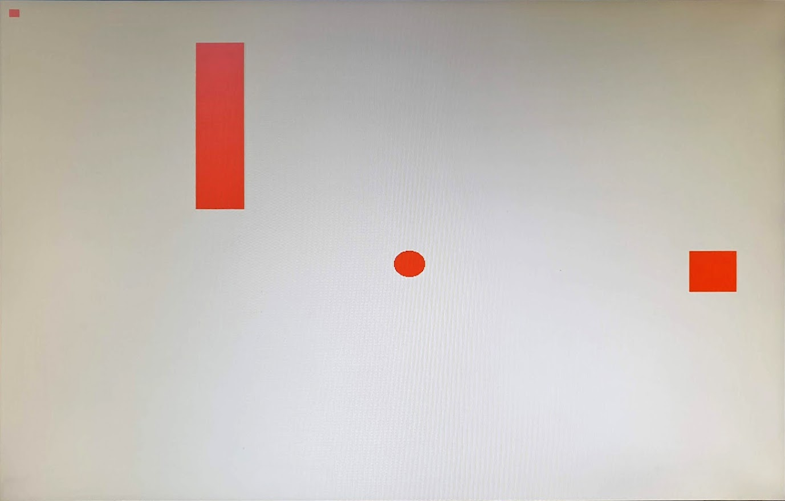

After starting the program, all the figures will be displayed in their places:

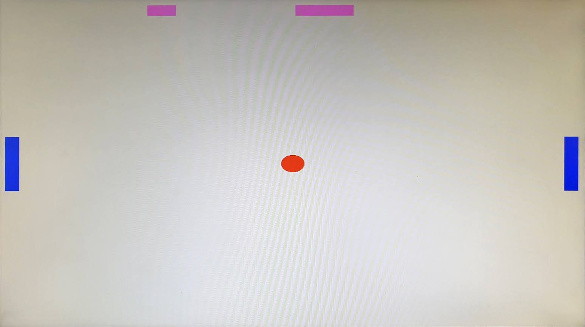
