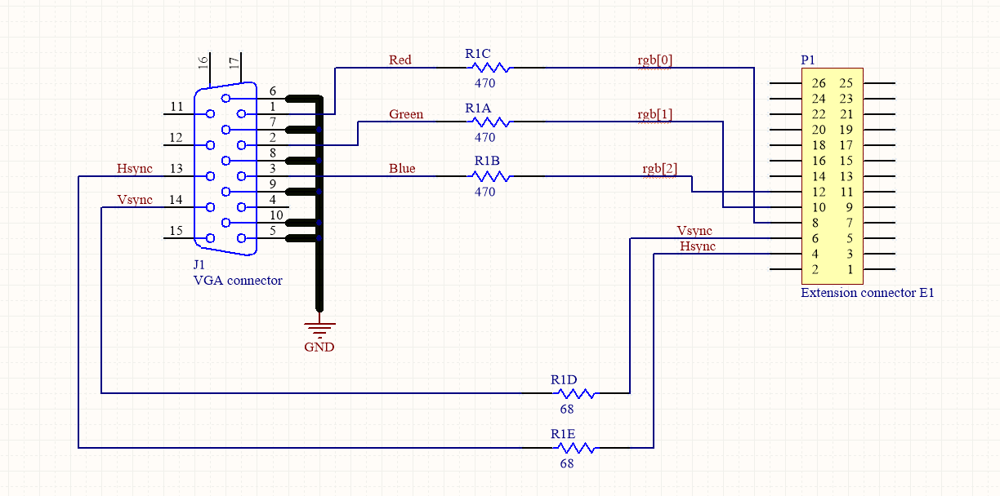
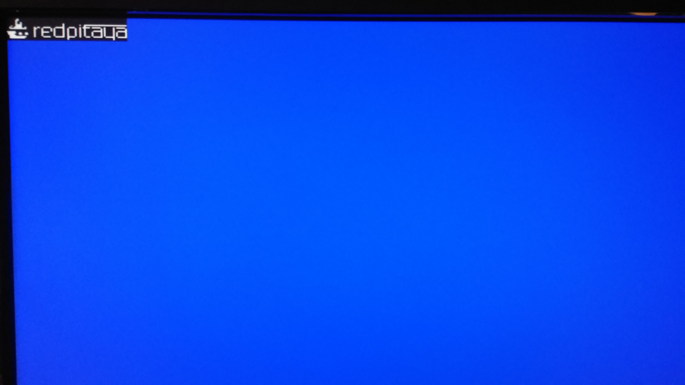
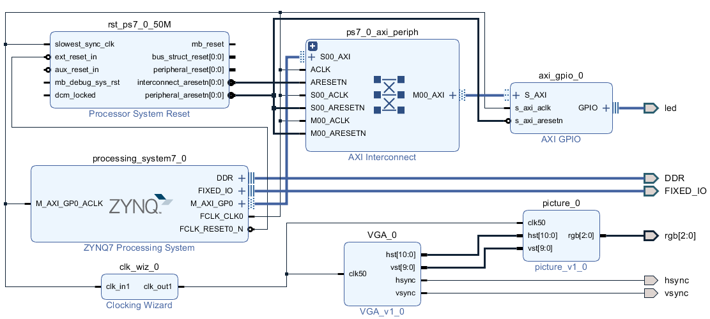
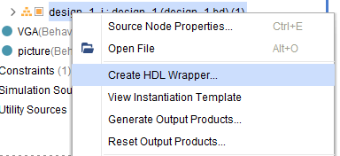

.. _freq_counter:

#######################
Red Pitaya VGA tutorial
#######################

In this tutorial I will explain how to display a picture on a monitor using Red Pitaya. 
I used Xilinx Vivado 2021.1 for hardware programming with Xilinx SDK 2021.1 for software application. 
The picture is just a simple matrix with "1" and "0" that represent black and white pixels. 
Picture can be scalled, moved and it can display different patterns.

Required hardware:

* Red pitaya
* Hardware extension for VGA connector

====================
Building the Project
====================

Move to folder RedPitaya/fpga/prj/Examples. 
Uncomment the line "set project_name Vga_image" and comment all files in the make_project.tcl file.
Open Vivado and in Vivado Tcl Console navigate to the base folder: RedPitaya\fpga\prj\Examples.

.. figure:: img/VgaImage2.png
    :alt: Logo
    :align: center

Then run the script source make_project.tcl. Tools → Run Tcl Script.

=====================
Step by step tutorial
=====================

Open vivado and choose to create a new project, type in project name and project location. It is recommended to choose a location that has no spaces in the file path, because vivado can have some problems with it.
Click *next* till you come to the page when you have to define what hardware you are using.
Select *"Boards"* and choose Red Pitaya.

Vivado doesn't have Red Pitaya installed by default so you have to copy board definitions from 
`github <https://github.com/RedPitaya/RedPitaya/tree/master/fpga/brd>`_
to 
C:/Xilinx/Vivado/***/data/boards/board_files/

We will use Block design to design our project, because it is more managable, but we will still have to write some VHDL code, because not all the IPs we will be using are already implemented in Vivado. 
We will start by writing code in VHDL and creating our custom made IPs.

First we need to define resolution and frequency for the monitor. 
Below is a table with values chosen for resolution 800 x 600, with frequency 50 MHz.

+----------------------+---------------------------+---------------------------+
| VGA 800 x 600        | Number of periods         | Number of rows            |
+======================+===========================+===========================+
| period               | H = 1040                  | V = 666                   |
+----------------------+---------------------------+---------------------------+
| visible section      | Hp = 800                  | Vp = 600                  |
+----------------------+---------------------------+---------------------------+
| pulse start          | Hf = 856                  | Vf = 637                  |
+----------------------+---------------------------+---------------------------+
| pulse duration       | Hs = 120                  | Vs = 6                    |
+----------------------+---------------------------+---------------------------+

For displaying the picture we need a process that runs line by line on the screen. 
Below is the process that shifts the cursor on the screen, with frequency 50 MHz. (vga_vhdl.vhd)

.. code-block:: vhdl

    P1: process (clk50)
    begin
        if rising_edge(clk50) then 
            clk_div <= not(clk_div);
            if hst_sig < (H-1) then
                hst_sig <= hst_sig +1;

            else
                hst_sig <= (others => '0');
                if vst_sig < V-1 then
                    vst_sig <= vst_sig +1;
                else 
                    vst_sig <= (others => '0');
                end if;
            end if;
        end if;
    end process;

A second process to read the data from the array (picture.vhd).

.. code-block:: vhdl

    P2: process (hst_sig, vst_sig, cx_sig, cy_sig)
    begin
        if (hst_sig < Hp) and (vst_sig < Vp) then -- and en = '1' then
            if(cx_sig < Hslika) and (cy_sig < Vslika) then
                if slika(to_integer(cy_sig))( to_integer(cx_sig)) = '1' then
                    rgb <= "111";
                else
                    rgb <= "000"; 
                end if;
            else
                rgb <= "001";
            end if;
        else
            rgb <= "000";
        end if;
    end process;

Image for display

.. code-block:: vhdl

    type logo is array(0 to 19) of std_logic_vector(0 to 79);
    signal slika: logo := (
    "00000000000000000000000000000000000000000000000000000000000000000000000000000000",
    "00000000100000000000000000000000000000000000000000000000000000000000000000000000",
    "00000001100000000000000000000000000000000000000000000000000000000000000000000000",
    "00000001000000000000000000000000000000000000000000000000000000000000000000000000",
    "00000001001000000000000000000000000000000000000000000000000000000000000000000000",
    "00000001001000000000000000000000000000100000000000000000000000000000000000000000",
    "00000001111000000000000000000000000000100000000001001111111111111111111111111111",
    "00001001111000000000000000000000000000100000000000001000000000000000000000000000",
    "00010011111001000001011001111100011111100011110001011111011111100100000101111110",
    "00011111111111000001100010000010100000100100001001001000000000010100000100000001",
    "00000000000000000001000010000010100000100100001001001000000000010100000100000001",
    "00000000000000000001000010000010100000100100001001001000001111110100000100111111",
    "01111110000000000001000011111000100000100100001001001000010000010100000101000001",
    "00111110011001100001000010000000100000100100001001001000010000010100000101000001",
    "00111100011001100001000010000000100000100100001001001000010000010100000101000001",
    "00011110000000000001000010000000100000100100001001001000010000010100000101000001",
    "00011111111111000001000001111100011111100111110001000111001111110011111100111111",
    "00011111111110000000000000000000000000000100000000000000000000000000000100000000",
    "00000000000000000000000000000000000000000100000000000000000000000000000100000000",
    "00000000000000000000000000000000000000000000000000000000000000000000000000000000");

It’s look like

For the monitor to work correctly, it is necessary to send syncronization pulses at the exact time, for the exact duration.

.. code-block:: vhdl

    --signals to synhronize the screen
    hsync <= '1' when hst_sig >= Hf and hst_sig < Hf + Hs else '0';
    vsync <= '1' when vst_sig >= Vf and vst_sig < Vf + Vs else '0';
    rgb_out <= rgb_in;
    end Behavioral;

I packed this two codes in sapareted IP, and created a simple block diagram.

Before building the project, do not forget to create a wrapper over the block design, otherwise the top module will not be found

Copy the resulting bitstream to RedPitaya, for example, via WinSCP and download its with command 

.. code-block:: bash

    cat file_name.bit > /dev/xdevcfg

