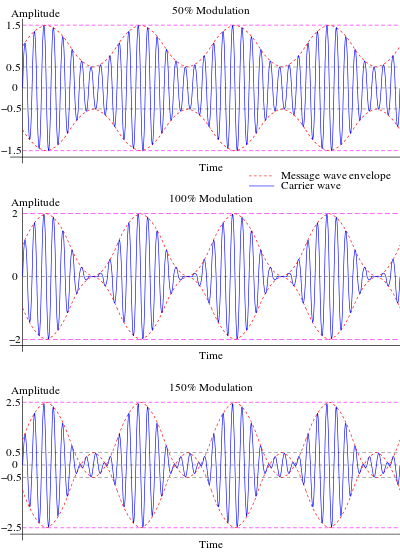

Theory
======

Mixing
------

To achieve this modulation, we can view the mathematical result of
multiplying two periodic waveforms. For this analysis case, we will
employ two sinusoids.

.. math::

   \begin{matrix}
   x_{1}(t) = A_{1}\cos\left( \omega_{1}t + \phi_{1} \right)x_{2}(t) = A_{2}\cos\left( \omega_{2}t + \phi_{2} \right)\ \#(1) \\
   \end{matrix}

Multiplying these two is made simple by invoking the well known trig
identity:

.. math::

   \begin{matrix}
   \cos(x)\cos(y) = \frac{1}{2}\left\lbrack \cos(x - y) + cos(x + y) \right\rbrack\#(2) \\
   \end{matrix}

thus allowing:

.. math::

   \begin{matrix}
   x_{1}(t)x_{2}(t) = \frac{A_{1}A_{2}}{2}\left\lbrack \cos\left( \omega_{1}t + \phi_{1} - \left\lbrack \omega_{2}t + \phi_{2} \right\rbrack \right) + cos\left( \omega_{1}t + \phi_{1} + \left\lbrack \omega_{2}t + \phi_{2} \right\rbrack \right) \right\rbrack\ \#(3) \\
   \end{matrix}

This shows that:

a. We generate data at the sum and difference frequencies

b. Phases add directly

c. The amplitude/energy of the resulting data is shared from both
   waveforms

In most mixing applications, the results of a mixer are then filtered to
only include either the sum or the difference frequency.

AM modulation
-------------

Amplitude modulation is one of the simplest forms of modulation. This
involves using a message signal (bandlimited to :math:`f_{m}`) to
modulate the amplitude of a faster “carrier” signal at :math:`f_{c}`.
For simplicity, we will take the carrier to have no phase (this is
justified by (3), where we can see that the mixed results simple add
phase, and we can simply define :math:`\phi_{1} = 0`), and give the
modulated signal some phase :math:`\phi`.

.. math::

   \begin{matrix}
   \begin{matrix}
   x_{c}(t) = A_{c}\cos\left( \omega_{c}t \right) \\
   x_{m}(t) = A_{m}\cos\left( \omega_{m}t + \phi \right) \\
   \end{matrix}\ \#(4) \\
   \end{matrix}

Dual Side Band (DSB) Modulation
~~~~~~~~~~~~~~~~~~~~~~~~~~~~~~~

Employing the simplest mixing, we simply multiple the carrier (denoted
:math:`x_{c}(t)`) by the message signal (denoted :math:`x_{m}(t)`). This
makes the resulting signal :math:`x_{DSB}(t)`

.. math::

   \begin{matrix}
   x_{DSB}(t) = \ x_{c}(t)x_{m}(t) = \frac{1}{K}\frac{A_{c}A_{m}}{2}\left\lbrack \cos\left( \omega_{c}t - \left\lbrack \omega_{m}t + \phi \right\rbrack \right) + cos\left( \omega_{c}t + \left\lbrack \omega_{m}t + \phi \right\rbrack \right) \right\rbrack\ \#(5) \\
   \end{matrix}

This is what is known as Dual Side Band (DSB) or suppressed carrier
modulation.

Amplitude Modulation
~~~~~~~~~~~~~~~~~~~~

A more traditional AM modulation method for AM modulation employs a
slightly modified version of DSB modulation. This time, the modulating
signal is 1) scaled by the carrier amplitude, and 2) given a DC offset.
This makes the new modulation function :math:`m(t)` take the form

.. math::

   \begin{matrix}
   m(t) = 1 + \frac{x_{m}(t)}{A_{c}}\ \#(6) \\
   \end{matrix}

This makes the modulated signal simply :math:`x_{AM}(t) = x_{c}(t)m(t)`.
This can be shown with some more clever trig identities to take the form

.. math::

   \begin{matrix}
   x_{AM}(t) = A_{c}\cos(2\pi f) + \frac{A_{c}}{2}\left\lbrack \cos\left( \omega_{c}t - \left\lbrack \omega_{m}t + \phi \right\rbrack \right) + cos\left( \omega_{c}t + \left\lbrack \omega_{m}t + \phi \right\rbrack \right) \right\rbrack\ \#(7) \\
   \end{matrix}

Sidenote: Modulation Index
^^^^^^^^^^^^^^^^^^^^^^^^^^

Since there are now two terms, a carrier and the encoded message signal,
we can consider the case of analyzing the peak of the message signal
compared to the peak of the carrier. This ratio is known as the
modulation index :math:`\mu`, and describes the modulation “strength” of
the message onto the carrier.

.. math::

   \begin{matrix}
   \mu = \frac{\left| m(t) \right|}{A_{c}}\ \#(8) \\
   \end{matrix}

Full strengths modulation corresponds to a 100% index, and means that
potential peaks of the carrier can be suppressed into a null. This
parameter is not so important for this lab, but will be of interest to
the analysis of communication systems in a future course.

 

Figure : Modulation Index visualized. Credit: Wikipedia
(https://en.wikipedia.org/wiki/Amplitude_modulation#Modulation_index)

Normalized Frequency:
---------------------

After the act of sampling, it becomes convenient to rescale (normalize)
frequency w.r.t. the sampling frequency. This is done by the relation

.. math::

   \begin{matrix}
   \widehat{\omega} = \omega T_{s} = \frac{2\pi f}{f_{s}}\ \#(8) \\
   \end{matrix}

Where
:math:`\omega = 2\pi f,\ and\ T_{s} = 1\backslash f_{s}\ is\ the\ sampling\ time.\ `\ This
representation is oftentimes used in discrete time systems as it allows
for the consideration of systems in reference to the total bandwidth of
the discrete system.

Tasks/Questions:
================

.. _theory-1:

Theory 
-------

1. Why in the analysis of mixing, were two sinusoids used? (Hint,
   sinusoids are what for the space of periodic functions?)

2. Why is the carrier being a sinusoid preferrable from a transmission
   perspective?

3. In both described AM schemes (DSB, AM w/modulation index), is there a
   way to reduce the total bandwidth of the system anymore? (Hint, do
   you need both sides of a spectrum to retrieve a signal if you know
   the signal is real valued?)

4. It was stated in the theory, that for AM, usually
   :math:`f_{c} > 10x\ f_{m}`. Why would this be true, and why would one
   want :math:`f_{c}` to be even larger. For example, FM radio operates
   on a carrier of :math:`\approx 88 - 108MHz`, but the bandwidth of
   audio signals is only :math:`20kHz` (as was demonstrated last lab).

5. Why is the carrier generally a very powerful signal in real systems?
   (Hint: how far are you from the radio tower when you listen to the
   radio? As all signals travel, they will spread out unless coerced
   otherwise)

Experiment
----------

1. Set the frequency of the message signal to 0.1. Show a plot of the
   acquired waveform

What does a normalized frequency
:math:`\widehat{\omega} < \frac{1}{2\pi}` mean, and why does it
introduce odd behavior into the observed waveforms?

2. What happens when the message signal frequency is the same size or
   greater than the carrier frequency?

3. Use a message signal that is not a pure sinusoid (e.g. use anything
   that is a superposition of sinusoids), show the resulting spectrum,
   and comment as to the bandwidth of the modulated signal.

4. Use a carrier signal that is not a pure sinusoid (e.g. use the square
   function), show the resulting spectrum, and comment as to the
   resulting signal strength in any one peak when compared to a pure
   sinusoidal carrier.

5. Demonstrate aliasing with the modulated signal. This will involve you
   setting the message signal to have frequency content that passes the
   sampling frequency when modulated by the carrier. Show a plot of the
   aliased content in the time domain, and the frequency domain.
