============================================================================
ECE2170: Measuring the Frequency response of LTI Systems with the Red Pitaya
============================================================================

Goals of this lab
=================

-  Perform analysis on simple LTI systems

-  Measure frequency responses for simple LTI systems

-  Use the knowledge of LTI systems to measure real world values of
   physical components

-  Demonstrate the stacking nature of LTI systems

Background
==========

LTI systems
-----------

In general, a Linear system is a system that takes and input :math:`X`,
and produces an output :math:`Y`, that can be defined by a series of
linear operators. Recall a linear operator is an operation that
satisfies the principles of scalar multiplication and superposition.
More mathematically, for vectors :math:`\mathbf{x,y}`, scalars
:math:`\alpha,\beta`, the operator :math:`A` is linear if:

.. math:: A\left( \alpha\mathbf{x} + \beta\mathbf{y} \right) = \alpha A\left( \mathbf{x} \right) + \beta A\left( \mathbf{y} \right)\ 

is satisfied. Examples of linear operators are:

-  Differentiation/Integration

-  Convolution

-  Gradient/Divergence/Curl

-  Laplace/Fourier transforms

Note that if there are multiple Linear systems, their cascaded effect
can be described by composing each subsequent system with the output of
the other. This is equivalent to combing each of the operators the
systems are implementing and forming a compound operator.

Time invariance is the property that for a given system, if :math:`y(t)`
is the output of the system when given an input :math:`x(t)`, then
applying a delayed input :math:`x(t - T)` will produce :math:`y(t - T)`,
a delayed version of :math:`y(t)`. In the Time domain, this system has
an impulse response :math:`h(t)` and relates :math:`y(t)`,\ :math:`x(t)`
by the relation:

.. math:: y(t) = h(t)*x(t)

Where :math:`*` is the convolution operation. The act of convolution can
be difficult, so it is oftentimes more convenient to operate in another
domain through some sort of transformation. A common transform is the
Fourier transform, whereby a time domain signal is represented in the
frequency domain. A consequence of the transform is the convolution
operation is now reduced to multiplication.

.. math:: y(t) = h(t)*x(t) \rightarrow Y(f) = H(f)X(f)

Where :math:`H(f)` is now the transfer function or frequency response of
the system. Canonically, the transfer function is written as:

.. math:: H(f) = \frac{Y(f)}{X(f)} = \frac{a_{0} + a_{1}f + a_{2}f^{2} + \ldots + a_{n - 1}f^{n}}{b_{0} + b_{1}f + b_{2}f^{2} + \ldots + b_{m - 1}f^{m}};n,m \in \mathbb{Z}^{+}\ 

Every LTI system can be described by a given transfer function, with
various systems being formed by various coefficients :math:`a,b`. In
this lab, we will form a small number of systems with real components,
and examine their behaviors.

Materials 
----------

For this lab, you will need:

-  1x Red Pitaya

-  3x SMA to BNC adapters

-  3x BNC to alligator clamp cables

-  1x Breadboard

-  1x package of passive components

Connect the cables to the Red Pitaya via the adapters as shown in Fig.
1, noting that we need IN1,IN2, and OUT1 connections.

.. image:: media/image4.1.jpeg
	:name: Red Pitaya hardware configuration
	:align: center

Fig. 1: Red Pitaya hardware configuration

A quick introduction to Breadboards and Passive components
----------------------------------------------------------

Breadboards
~~~~~~~~~~~

.. image:: media/image4.2.png
	:name: Breadboard
	:align: center

Bread boards are arrays of metal contacts internally tied together on a
row wise basis (a,b,c,d,e) that are electrically separated on the
columns (1,2,3,…,30). The exception to the rules are the bus bars on the
extreme sides of the breadboard, where the entire row of the (-,+) rows
are all electrically connected together. This is useful when using
common terminals that are used through the circuit (as in the case of
common, ground, or power supply nodes.

Passives
~~~~~~~~

.. image:: media/4.3.jpg
	:name: components
	:align: center

Resistors
^^^^^^^^^

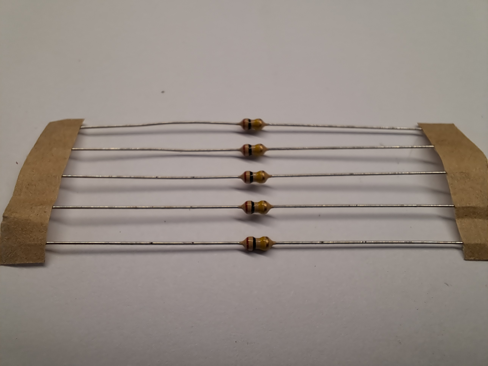

Resistors are a general element that obey Ohm’s law:

.. math:: V = IR

Where :math:`R` is the resistance measured in Ohms (V/A) is a measure of
the resistance to current flow. These are frequency independent devices.

Capacitors
^^^^^^^^^^

.. image:: media/4.5.jpg
	:name: Capacitors
	:align: center

Capacitors have the Current-voltage relation:

.. math:: i_{C}(t) = C\frac{dV}{dt}

Where :math:`C` is the capacitance measured in Farads (V/m). Capacitors
have the impedance:

.. math:: Z(f) = \frac{1}{j2\pi fC}

Potentiometers
^^^^^^^^^^^^^^

.. image:: media/4.56.jpg
	:name: Potentiometer
	:align: center

Potentiometers are three terminal devices consist of a resistor and a
sliding contact that effectively breaks the resistor into two separate
resistances. Depending on the contact location, the proportion of the
total potentiometer resistance is distributed to each branch.

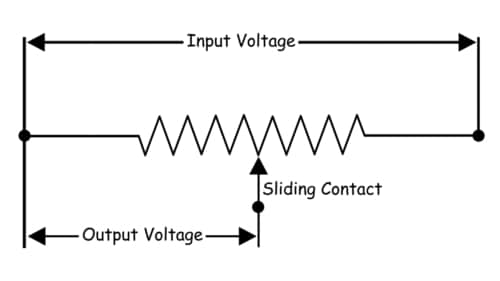

|potenciometer|

.. |potenciometer| raw:: html

 <a href=https://www.electrical4u.com/potentiometer/ target="_blank">Electrical4u potentiometer</a>

From: 

Tasks / Measurements
====================

Single stage RC circuit – 1
---------------------------

Build the Single stage RC circuit shown in Fig. 2, with
:math:`R = 10k\Omega`,\ :math:`C = 0.47\mu F`.

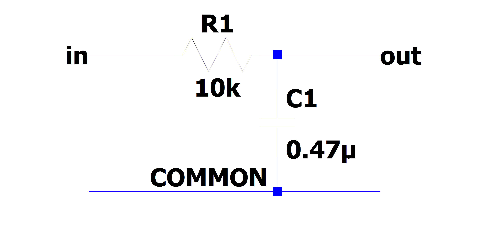
   
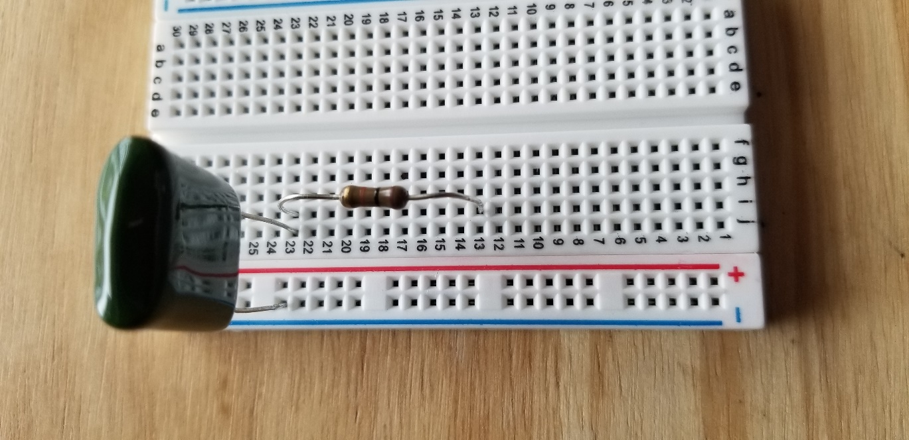

Fig. 2: (left) schematic of the single stage RC circuit, (right)
implementation on breadboard

Analysis
~~~~~~~~

The claimed transfer function of this circuit is

.. math::

   \begin{matrix}
   T(f) = \ \frac{V_{out}(f)}{V_{in}(f)} = \frac{1}{1 + j2\pi fRC}\ \#(1) \\
   \end{matrix}

Where :math:`j = \sqrt{- 1}` is the imaginary unit.

1. What is the magnitude of the transfer function?

2. What is the phase response of the circuit?

3. What class (low-pass, high-pass, band-pass, band-stop) of filter is
   this? (This is equivalent to asking what happens to
   :math:`\left| T(f) \right|` as :math:`f\ `\ gets lower or higher?)

4. At what frequency does
   :math:`\left| T(f) \right| = \frac{1}{\sqrt{2}} \approx 0.707`? (This
   corresponds to the so-called “half power point” where the ratio of
   the input to output power is 2 (-3dB) – The circuit drops half of the
   total power) This value is generally referred to the “cutoff
   frequency” or “-3dB frequency” and is represented by :math:`f_{c}`.

5. | (optional) What would happen if I swapped the input and output
     ports?
   | (Hint: is there any current flowing through the resistor?)

Measurement
~~~~~~~~~~~

Using the Red Pitaya’s Bode Analyzer tool, measure the frequency
response (:math:`\left| T(f) \right|`).

1. Connect the Red Pitaya to the circuit, also known as the Device Under
   Test (DUT)), as shown below

.. image:: media/image4.9.png
	:name: PitayaSchematic
	:align: center
   

.. image:: media/image4.9.png
	:name: PitayaSchematic
	:align: center

   (from :
   https://redpitaya.readthedocs.io/en/latest/appsFeatures/apps-featured/bode/bode.html)

2. Connect to the Red Pitaya and select the Bode Analyzer tool.

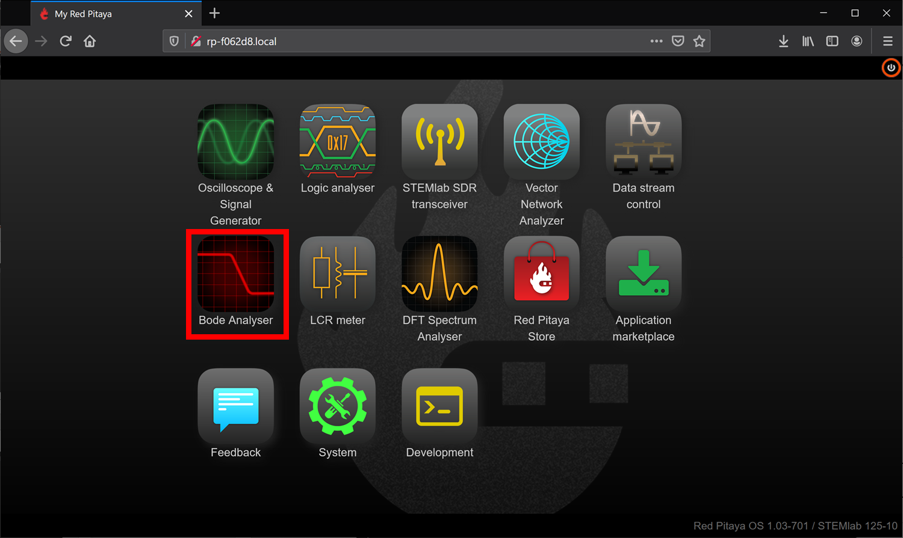
   

   A more detailed description of the Bode analyzer can be found here:
   https://redpitaya.readthedocs.io/en/latest/appsFeatures/apps-featured/bode/bode.html

3. Click on the settings box to access the sweep settings

.. image:: media/image4.11.png
	:name: settings1
	:align: center

4. Configure the settings as shown below, we will find new sweep values
   as we go on, but these should be safe values to try

   .. image:: media/image4.12.png
	:name: settings2
	:align: center

5. Click RUN – The sweep can take awhile to complete.

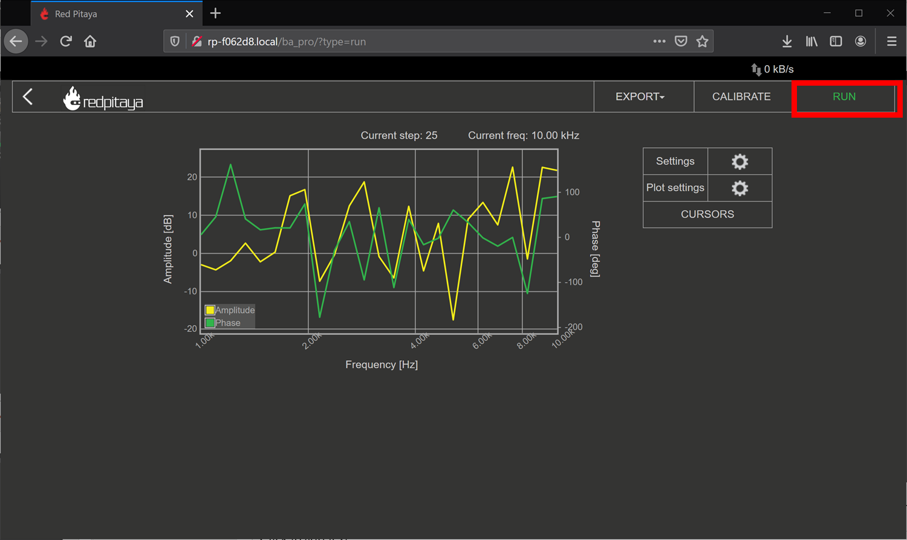

6. To export data: click the Export tab, and either select Graph for a
   PNG of the chart, or CSV for the raw CSV data of the plot.

.. image:: media/image4.14.png
	:name: settingsexport
	:align: center

1. Show the plot of the measurement below:

Comparison
~~~~~~~~~~

Respond to the following questions:

1. Does the shape of the frequency response match your expectation from
   the analysis? Is there any point that stands out as odd?

2. Find the -3dB point in the circuit, and compare this value to the one
   you previously calculated.

Single stage RC circuit – 2
---------------------------

Build the Single stage RC circuit shown in Fig. 3, with
:math:`R = 10k\Omega`,\ :math:`C = 0.47\mu F`.

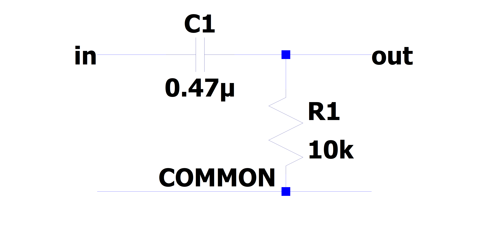
	
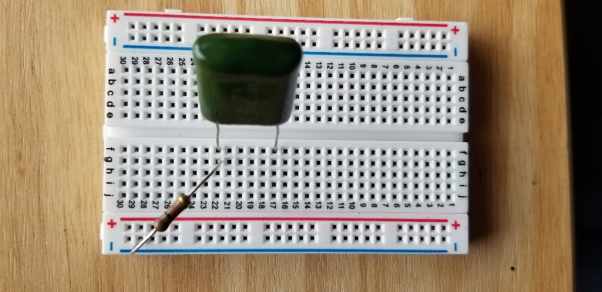

Fig. 3: (left) schematic of the single stage RC circuit, (right)
implementation on breadboard

.. _analysis-1:

Analysis
~~~~~~~~

The claimed transfer function of this circuit is

.. math::

   \begin{matrix}
   T(f) = \ \frac{V_{out}(f)}{V_{in}(f)} = \frac{j2\pi fRC}{1 + j2\pi fRC}\ \#(2) \\
   \end{matrix}

Where :math:`j = \sqrt{- 1}` is the imaginary unit.

1. What is the magnitude of the transfer function?

2. What is the phase response of the circuit?

3. What class (low-pass, high-pass, band-pass, band-stop) of filter is
   this?

4. What is the -3dB frequency?

.. _measurement-1:

Measurement
~~~~~~~~~~~

Using the Red Pitaya’s Bode Analyzer tool, measure the frequency
response (:math:`\left| T(f) \right|`) as described in section ‎3.1.2.

1. Show the plot of the measurement below:

.. _comparison-1:

Comparison
~~~~~~~~~~

Respond to the following questions:

1. Does the shape of the frequency response match your expectation from
   the analysis? Is there any point that stands out as odd?

2. Find the -3dB point in the circuit, and compare this value to the one
   you previously calculated.

Single stage RC circuit – Unknown parameter estimation
------------------------------------------------------

Build the Single stage RC circuit shown in Fig. 4, with the
potentiometer and :math:`C = 4.7nF`. Use another resistor to provide
electrical contact. Ensure that the potentiometer pins used are the two
furthest pins, as this will be the total resistance of the device.

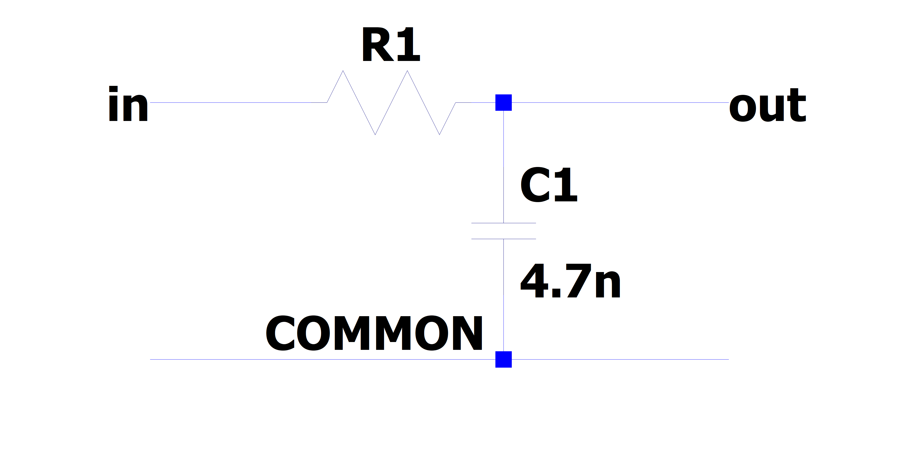
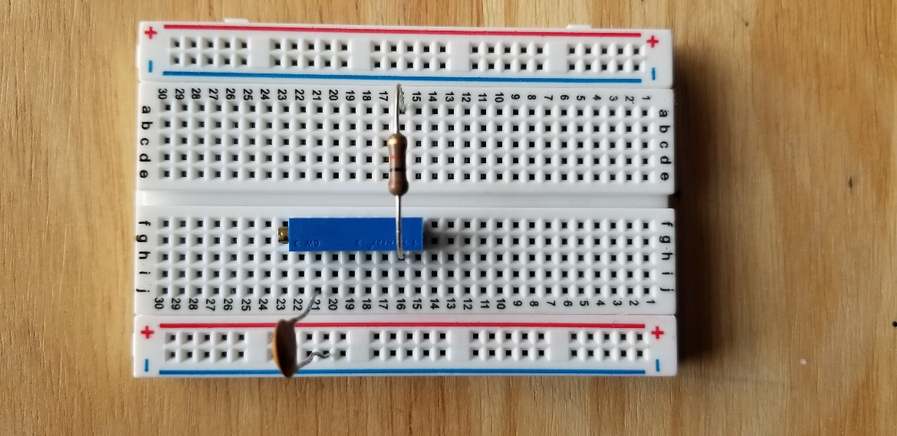
	
Fig. 4: (left) schematic of the single stage RC circuit, (right)
implementation on breadboard

.. _analysis-2:

Analysis
~~~~~~~~

The claimed transfer function of this circuit is the same as in ‎3.1
(reprinted here for courtesy)

.. math::

   \begin{matrix}
   T(f) = \ \frac{V_{out}(f)}{V_{in}(f)} = \frac{1}{1 + j2\pi fRC}\  \\
   \end{matrix}

Where :math:`j = \sqrt{- 1}` is the imaginary unit. However now the
value of :math:`R` is unknown. Since we already know the expected
behavior of the system, we can estimate the value of :math:`R` by
measuring the transfer function again.

1. Derive the expression for the -3dB frequency as a function of
   :math:`R`.

.. _measurement-2:

Measurement
~~~~~~~~~~~

Using the Red Pitaya’s Bode Analyzer tool, measure the frequency
response (:math:`\left| T(f) \right|`) as described in section ‎3.1.2.
Pay special attention to include the cutoff frequency in the sweep.

1. Show the plot of the measurement below:

.. _comparison-2:

Comparison
~~~~~~~~~~

Respond to the following questions:

1. Use the expression you derived to calculate the value of :math:`R`
   from the measured value of :math:`f_{c}`.

2. The previous analysis all presumed we knew the value of :math:`f,C`
   perfectly. In reality, the values of there are only approximately
   known.

   a. If the capacitance value :math:`C` can vary :math:`\pm 20\%`, what
      is the bounds on the error of the calculated value of :math:`R`?

   b. If the frequency :math:`f` value can vary :math:`\pm 0.1\%`, what
      is the bounds on the error of the calculated value of :math:`R`?

   c. If the both :math:`C,f` as above simultaneously, what is the total
      bounding on the error of the calculated value of :math:`R`? (Hint:
      This should be a rectangular area)

3. (Optional) In the same line of thought, assume that the values of
   :math:`C,f` are described statistically by gaussian distributions
   with mean and variances provided below:

.. math::

   \begin{matrix}
   C\sim\mathcal{N}(4.7,1)nF\  \\
   f\sim\mathcal{N}\left( f_{C},1 \right)Hz \\
   \end{matrix}

a. What is the resulting probability distribution of :math:`R`?

Cascading filters – Repeated stages
-----------------------------------

Build the RC circuit shown in below, with
:math:`R_{1} = R_{2} = 10k\Omega`,\ :math:`\ C_{1} = C_{2} = 4.7nF`.

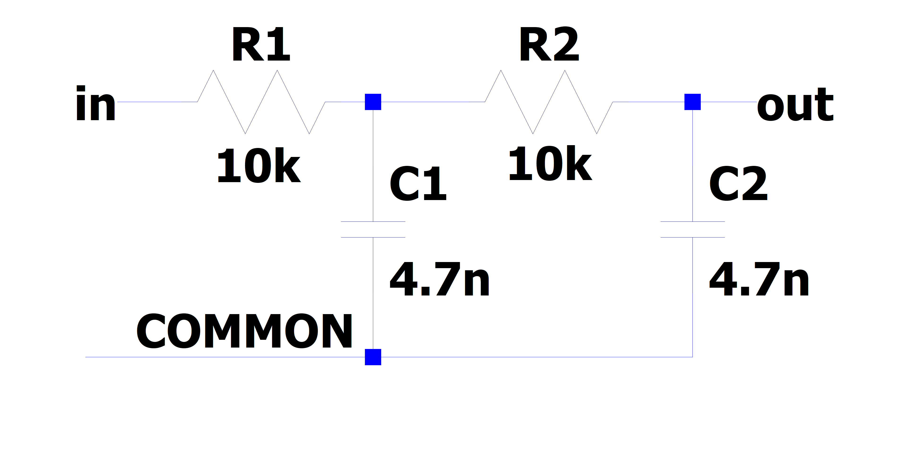
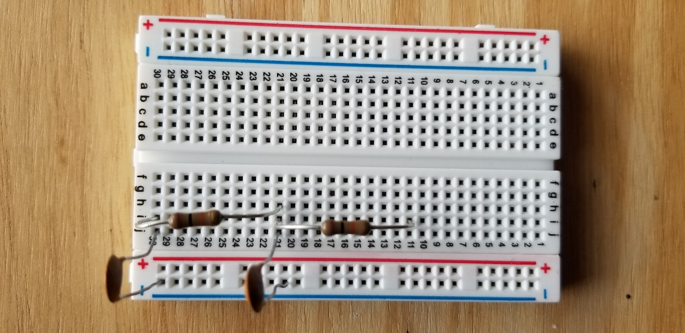

Fig. 5: (left) schematic of the single stage RC circuit, (right)
implementation on breadboard

.. _analysis-3:

Analysis
~~~~~~~~

The claimed transfer function of this circuit is

.. math::

   \begin{matrix}
   T(f) = \ \frac{V_{out}(f)}{V_{in}(f)} = \frac{1}{1 + j2\pi f\left\lbrack R_{1}C_{1} + C_{2}\left( R_{1} + R_{2} \right) \right\rbrack - 4\pi^{2}f^{2}R_{1}R_{2}C_{1}C_{2}}\ \#(3) \\
   \end{matrix}

Where :math:`j = \sqrt{- 1}` is the imaginary unit.

1. What is the magnitude of the transfer function?

2. What is the phase response of the circuit?

3. What class (low-pass, high-pass, band-pass, band-stop) of filter is
   this?

4. What is the -3dB frequency?

.. _measurement-3:

Measurement
~~~~~~~~~~~

Using the Red Pitaya’s Bode Analyzer tool, measure the frequency
response (:math:`\left| T(f) \right|`) as described in section ‎3.1.2.

1. Show the plot of the measurement below:

.. _comparison-3:

Comparison
~~~~~~~~~~

Respond to the following questions:

1. Does the shape of the frequency response match your expectation from
   the analysis? Is there any point that stands out as odd?

2. Find the -3dB point in the circuit, and compare this value to the one
   you previously calculated.

3. This circuit can be viewed as two separate 1\ :sup:`st` order filters
   (see section ‎3.1) cascaded. What would the expected transfer function
   of such an arrangement look like? How different is this the
   expression you would expect from two ideal LTI systems?

.. math:: T(f) = H_{1}(f)H_{2}(f) = \frac{1}{1 + j2\pi fR_{1}C_{1}}\ \frac{1}{1 + j2\pi fR_{2}C_{2}}

Cascading filters – variable stages
-----------------------------------

Build the filter shown below, with :math:`R_{1}` using the potentiometer
as constant resistance. Once again, use the other 10K resistor as an
electrical contact.

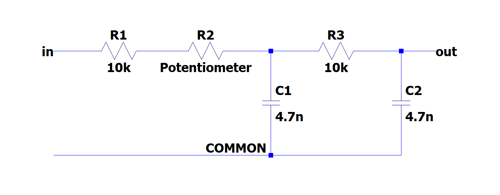
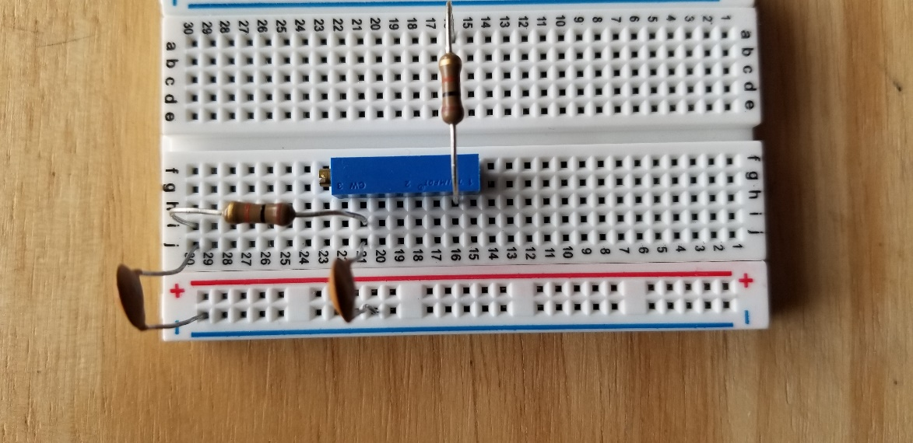
	
Fig. 6: (left) schematic of the single stage RC circuit, (right)
implementation on breadboard

.. _analysis-4:

Analysis
~~~~~~~~

The claimed transfer function of this circuit is

.. math::

   \begin{matrix}
   T(f) = \ \frac{V_{out}(f)}{V_{in}(f)} = \frac{1}{1 + j2\pi f\left\lbrack R_{1}C_{1} + C_{2}\left( R_{1} + R_{2} \right) \right\rbrack - 4\pi^{2}f^{2}R_{1}R_{2}C_{1}C_{2}}\ \#(4) \\
   \end{matrix}

Where :math:`j = \sqrt{- 1}` is the imaginary unit.

1. What is the magnitude of the transfer function?

2. What is the phase response of the circuit?

3. What class (low-pass, high-pass, band-pass, band-stop) of filter is
   this?

4. What is the -3dB frequency?

.. _measurement-4:

Measurement
~~~~~~~~~~~

Using the Red Pitaya’s Bode Analyzer tool, measure the frequency
response (:math:`\left| T(f) \right|`) as described in section ‎3.1.2.

1. Show the plot of the measurement below:

2. (Optional) Try sweeping from 10Hz to 1MHz. Is there anything strange
   that happens to the frequency response? Capture the frequency
   response, and describe what seems to happen to the transfer function.

.. _comparison-4:

Comparison
~~~~~~~~~~

Respond to the following questions:

3. Does the shape of the frequency response match your expectation from
   the analysis? Is there any point that stands out as odd?

4. Find the -3dB point in the circuit, and compare this value to the one
   you previously calculated.

