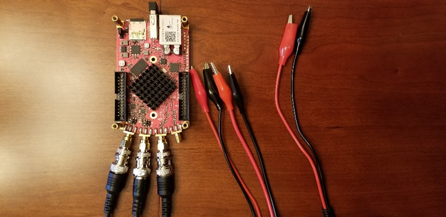
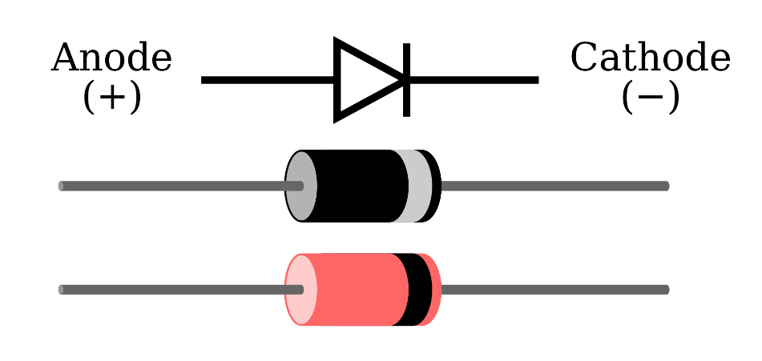
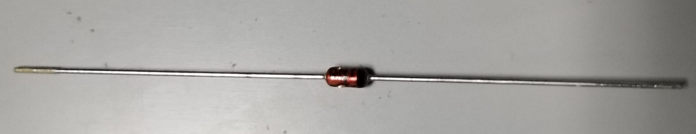
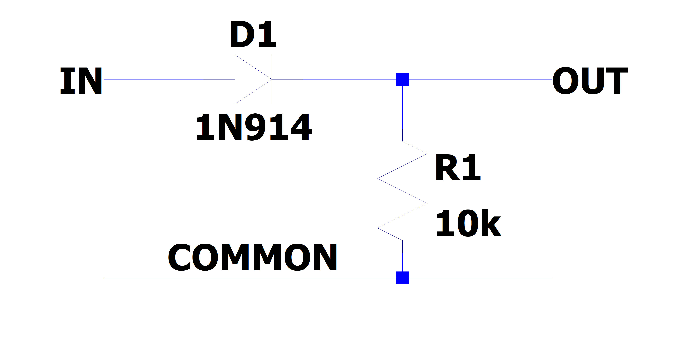
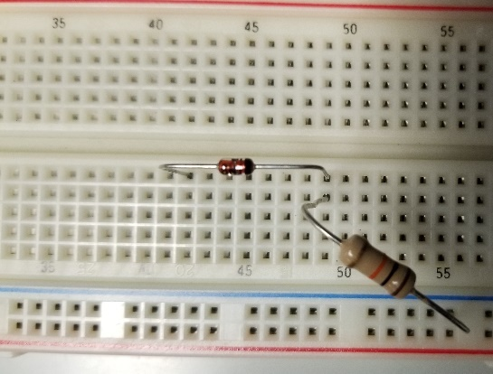

########################################
Brief Tour of Nonlinear Systems
########################################

=================
Goals of this lab
=================

- Perform analysis on simple non-linear systems

- Measure frequency responses for simple non-linear systems

- Demonstrate use-cases for non-linear systems

Background
==========

Nonlinear systems
-----------------

As opposed to Linear Time Invariant (LTI) systems, nonlinear systems do
**not** obey the principles of linearity and superposition.
Consequently, these systems do not generally have sinusoids as
eigenfunctions; a single sinusoid input does not provide a single
sinusoid out. In this lab we will do some preliminary analysis to see
the effects of such a system.

Materials
---------

For this lab, you will need:

- 1x Red Pitaya

- 3x SMA to BNC adapters

- 3x BNC to alligator clamp cables

- 1x Breadboard

- 1x package of passive components

Connect the cables to the Red Pitaya via the adapters as shown in Fig.
1, noting that we need IN1,IN2, and OUT1 connections.

Fig. 1: Red Pitaya hardware configuration

A quick introduction to diodes
------------------------------

Diodes are a semiconductor device that is formed by a PN junction. The
current-voltage (I-V) relation of the device can be described by the
Ideal (Shockley) diode equation:

.. math:: I = I_{0}\left( \exp\left( \frac{V}{K_{B}T/q\ } \right) - 1 \right)

Where :math:`K_{B}` is the Boltzmann constant, :math:`T` is the
temperature in Kelvin, :math:`q` is the absolute value of the charge of
an electron in Coulombs, and :math:`I_{0}` is the reverse saturation
current in amperes. When :math:`V \ll K_{B}T/q`, the argument to the
exponent becomes very small, and
:math:`\exp\left( \frac{V}{K_{B}T/q} \right) \ll 1`. This makes
:math:`I \approx \  - I_{0}`. Conversely, when :math:`V \gg K_{B}T`/q,
:math:`\exp\left( \frac{V}{K_{B}T/q} \right) \gg 1`, and thus
:math:`I \approx I_{0}\exp\left( \frac{V}{K_{B}T/q} \right)`. This
exponential relationship is obviously non-linear, and can be made
explicit by taking the taylor series of the exponential function:

.. math:: \exp(x) = \sum_{n = 0}^{\infty}\frac{x^{n}}{n!} = \underset{linear}{\overset{1 + x}{︸}} + \underset{{non - linear}\overset{\frac{x^{2}}{2!} + \frac{x^{3}}{3!} + \ldots}{︸}}

.. math:: I=I_0 \left(\sum_{n=0}^\infty \frac{\left(\frac{V}{K_B T/q}\right)^n}{n!}-1\right)=\underbrace{I_0 \left(\frac{V}{K_B T/q}\right)}{\text{linear}}+\underbrace{I_0 \left(\frac{1}{2!} \left(\frac{V}{K_B T/q}\right)^2+\frac{1}{3!} \left(\frac{V}{K_B T/q}\right)^3+\cdots\right)}{\text{non-linear}}

This nonlinear behavior can be exploited for many applications. The
diode symbol is shown below, and has an anode and cathode ends. This is
reflected in the package by a stripe on the end of the package that
mirrors the line in the diode symbol.

|Wikipedia diode|

.. |Wikipedia diode| raw:: html

    <a href="https://en.wikipedia.org/wiki/Diode#/media/File:Diode_pinout_en_fr.svg" target="_blank">Source:Wikipedia diode</a>

1n914 diode with Cathode bar on right

Tasks / Measurement
===================

Half bridge rectifier
---------------------

Build the Single stage RC circuit shown in Fig. 2, with
:math:`R = 10k\Omega`,\ :math:`D = 1N914`.

|Chart, timeline Description automatically generated|\ |image1|

Fig. 2: (left) schematic of the single stage RC circuit, (right)
implementation on breadboard

Analysis
^^^^^^^^

Oftentimes in analysis for a nonlinear systems, we choose to *linearize*
the system about a specific operating point. This leverages the fact
that for a small perturbation :math:`V_{new} = V_{old} + \delta V`, the
series expansion of a nonlinear function will be primarily linear for
small :math:`\delta V`. This comes from the calculation of the powers of
:math:`V_{new}`; for instance,

.. math:: \left( V_{new} \right)^{2}\  = \left( V_{old} + \delta V \right)^{2} = \left( V_{old} \right)^{2} + 2V_{old}\delta V + (\delta V)^{2}

If :math:`2\delta V \ll \ V_{old}`, then

.. math:: \left( V_{old} \right)^{2} + 2V_{old}\delta V + (\delta V)^{2} \approx \left( V_{old} \right)^{2} + \epsilon

where :math:`\epsilon` is some error term. Applying the same logic to
the ideal diode equation gives us the response.

.. math:: I + \delta I = I_{0}\left( \exp\left( \frac{V + \delta V}{K_{B}T/q} \right) - 1 \right)

Rearranging to subtract out the original current :math:`I`,

.. math:: \delta I = I_{0}\left\lbrack \exp\left( \frac{V + \delta V}{K_{B}T/q\ } \right) - \exp\left( \frac{V}{K_{B}T/q} \right) \right\rbrack

Calling
:math:`\frac{V}{K_{B}T/q} = V_{0},\frac{\delta V}{K_{B}T/q} = V_{\delta}`

.. math:: \delta I = I_{0}\left\lbrack \exp\left( V_{0} + V_{\delta} \right) - \exp\left( V_{0} \right) \right\rbrack

Applying a Taylor expansion on all terms

.. math:: \delta I = I_{0}\left\lbrack \underset{linear}{\overset{1 + \left( V_{0} + V_{\delta} \right)}{︸}} + \underset{non - linear}{\overset{\frac{\left( V_{0} + V_{\delta} \right)^{2}}{2!} + \frac{\left( V_{0} + V_{\delta} \right)^{3}}{3!} + \ldots}{︸}} - \left( \underset{linear}{\overset{1 + \left( V_{0} \right)}{︸}} + \underset{non - linear}{\overset{\frac{\left( V_{0} \right)^{2}}{2!} + \frac{\left( V_{0} \right)^{3}}{3!} + \ldots}{︸}} \right) \right\rbrack

Cancelling like terms being subtracted in the brackets gives

.. math:: \delta I = I_{0}\left\lbrack V_{\delta} + \frac{\left( V_{0} + V_{\delta} \right)^{2}}{2!} + \frac{\left( V_{0} + V_{\delta} \right)^{3}}{3!} + \ldots - \left( \frac{\left( V_{0} \right)^{2}}{2!} + \frac{\left( V_{0} \right)^{3}}{3!} + \ldots \right) \right\rbrack

Finally applying the approximation
:math:`\left( V_{0} + V\_\delta \right)^{2} \approx \left( V_{0} \right)^{2}`
and cancelling the resulting terms

.. math:: \delta I \approx I_{0}V_{\delta} = \frac{I_{0}}{K_{B}T/q}\delta V

At this point, the perturbation can be make to look like ohm’s law, and
thus the perturbation is linear in behavior. This is equivalent to
approximating the I-V curve of the diode as a tangent line
approximation, and is a theme that is used extensively in engineering
and applied mathematics.

1. Using the above linearization, what does the frequency response of
   the half bridge circuit look like?

Measurement
^^^^^^^^^^^

Using the Red Pitaya’s Bode Analyzer tool, measure the frequency
response (:math:`\left| T(f) \right|`) as described in the previous lab.
Keep in mind that for this circuit, we stated that the amplitude must be
small. Set the DC bias to > 0.6V to ensure the diode is forward biased
while testing.

1. Show the plot of the measurement below:

2. Try making the amplitude larger and see what occurs. Find a point at
   which the behavior is no longer linear

    Using the Red Pitaya’s Bode Oscilloscope & Spectrum analyzer tools,
    measure the large signal response to a sinusoid:

    - With DC Bias of 0.7V, and amplitude 0.1

    - With DC bias of 0V, and amplitude 1V

3. Comment on the Spectral content of the output signal when compared to
   the input signal.

4. Show a plot of the both the time waveforms and frequency domain.

Comparison
^^^^^^^^^^

Respond to the following questions:

1. Find the -3dB point in the circuit, and compare this value to the one
   you previously calculated.

