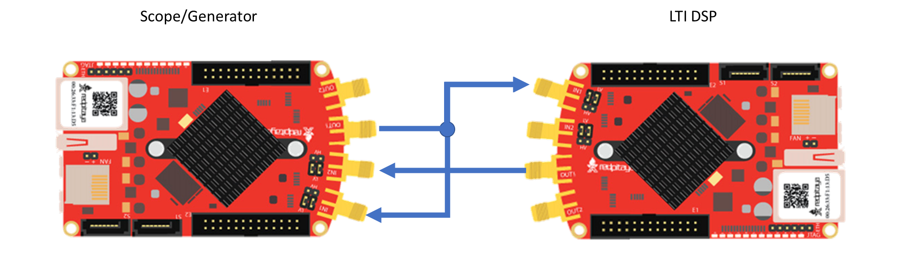

ECE2170: Digital Filtering on the Red Pitaya
=====

Observe behavior for multiple digital filters implemented via the Red Pitaya

Background
----------

LTI systems in the Z-domain
~~~~~~~~~~~~~~~~~~~~~~~~~~~

Reminder all discrete time LTI systems can be represented in a canonical
form of:

.. math:: H(z) = \frac{b_{0} + b_{1}z^{- 1} + b_{2}z^{- 2} + \ldots + b_{k}z^{- k}}{a_{0} + a_{1}z^{- 1} + a_{2}z^{- 2} + \ldots + a_{m}z^{- m}}\ where\ k,m\mathbb{\in N}

Where the coefficients of each expression can be viewed as the
coefficients in the difference equation:

.. math:: y\lbrack n\rbrack\left( a_{0} + a_{1}\delta\lbrack n - 1\rbrack + a_{2}\delta\lbrack n - 2\rbrack + \ldots + a_{m}\delta\lbrack n - m\rbrack \right) = x\lbrack n\rbrack\left( b_{0} + b_{1}\delta\lbrack n - 1\rbrack + b_{2}\delta\lbrack n - 2\rbrack + \ldots + b_{k}\delta\lbrack n - k\rbrack \right)\ 

Hardware configuration
----------------------

This configuration will require an additional piece of equipment, a
second red pitaya. One red pitaya will be used as in the
oscilloscope/signal generator or the spectrum analyzer modes, while the
other will be used in the LTI DSP workbench. Connect the red pitayas
such that the IN1 of the LTI DSP device is connected to OUT1 of the
generator. You can also use a T-joint to connect the OUT1 of the
generator board to IN1 of itself to see the response of the circuits
more clearly and to measure the Frequency response with the Bode
analyzer. |Diagram Description automatically generated|

**Tasks**

All-Pass Filter – Delay Element
-------------------------------

Enter the following transfer function into the LTI workbench:

.. math:: H(z) = \frac{1}{1}

This is accomplished by setting :math:`b_{0} = 1`. This kind of filter
is called an all pass filter, due to its input/output relation of simply
passing the output. Note that this is a special class of all-pass
filter, namely a delay filter. This kind of filter purely provides a
delayed version of the input as it’s output.

Measurement
~~~~~~~~~~~

1. Note down the Bode plot from the LTI workbench for both gain and
   phase(Note for some filters, you may want to do this over two
   screenshots, as the magnitude and phase are plotted on a common axis,
   even if one is in dB and the other is in degrees), and describe what
   happens as the frequency of the input signals are increased or
   decreased. (Hint: refer to the frequency response from the LTI
   workbench)

2. Show the resulting waveform in the Red Pitaya/Spectrum Analyzer scope
   object for

   a. A sine wave of 1kHz is applied

   b. A square wave of 1kHz is applied

   c. A triangle wave of 1kHz is applied

Analysis
~~~~~~~~

.. math:: H(z) = \frac{z^{- k}}{1}

also an all pass filter? Why or why not?

1. If I wanted to attenuate the incoming by 50% (multiply by 0.5) what
   would the general all-pass filter function be?

2. Write out the difference equation for a general all pass filter.

.. math:: y\lbrack n\rbrack = x\lbrack n - k\rbrack

Moving average filter
---------------------

An :math:`n`-tap moving average filter has the form:

.. math:: H(z) = \frac{1}{N}\left\lbrack \frac{1 + z^{- 1} + z^{- 2} + \ldots + z^{- N - 1}}{1} \right\rbrack

This is accomplished by setting :math:`b_{k} = 1/N\ ` where
:math:`k \in \left\{ 0,1,2,\ldots,N - 1\ :N\mathbb{\in N} \right\}`.
This kind of filter is called a moving average or boxcar filter, due to
its nature of taking a local average of :math:`n` samples at every
sample point. Oftentimes the size of :math:`N` is known as the window
size.

.. _measurement-1:

Measurement
~~~~~~~~~~~

1. Note down the Bode plot from the LTI workbench for both gain and
   phase for the provided value of :math:`N`, describing what happens as
   the frequency of the input signals are increased or decreased.

   a. :math:`N = 3`

   b. :math:`N = 5`

   c. :math:`N = 6`

   d. What are the trends as :math:`N` gets larger?

2. Show the resulting waveform in the Red Pitaya/Spectrum Analyzer scope
   object for:

   a. A sine wave of 1kHz is applied

   b. A square wave of 1kHz is applied

   c. A triangle wave of 1kHz is applied

.. _analysis-1:

Analysis
~~~~~~~~

1. What class of filter does this look like? (high-pass, low-pass,
   band-pass, band-stop)

2. What does the window size say about the filter’s performance?

3. Write out the difference equation of this filter.

.. math:: \frac{1}{N}\left\lbrack \frac{1 + z^{- 1} + z^{- 2} + \ldots + z^{- N - 1}}{1} \right\rbrack

.. math:: y\lbrack n\rbrack = \frac{1}{N}\left( x\lbrack n\rbrack + x\lbrack n - 1\rbrack + x\lbrack n - 2\rbrack + x\lbrack n - 3\rbrack + \ldots + x\left\lbrack n - (N - 1) \right\rbrack \right)

Low pass filter
---------------

Enter the following transfer function into the LTI workbench:

.. math:: H(z) = \frac{1 + {2z}^{- 1} + z^{- 2}}{1}

.. _measurement-2:

Measurement
~~~~~~~~~~~

1. Note down the Bode plot from the LTI workbench for both gain and
   phase. (Note for some filters, you may want to do this over two
   screenshots, as the magnitude and phase are plotted on a common axis,
   even if one is in dB and the other is in degrees)

2. Show the resulting waveform in the Red Pitaya/Spectrum Analyzer scope
   object for:

   a. A sine wave of 1kHz is applied

   b. A square wave of 1kHz is applied

   c. A triangle wave of 1kHz is applied

3. Describe what happens as the frequency of the input signals are
   increased or decreased.

.. _analysis-2:

Analysis
~~~~~~~~

1. Write out the difference equation of this filter.

.. math::

   y\lbrack n\rbrack = x\lbrack n\rbrack + 2x\lbrack n - 1\rbrack + x\lbrack n - 2\rbrack

2. In the previous lab, we showcased that low-pass filters can be used
   to approximate integral operations. At what frequency does this
   filter do a passable job of implementing this operation?

1\ :sup:`st` difference filter
------------------------------

Enter the following transfer function into the LTI workbench:

.. math:: H(z) = \frac{1}{2}\left\lbrack \frac{1 - z^{- 1}}{1} \right\rbrack

This is accomplished by setting :math:`b_{0} = 0.5,\ b_{1} = - 0.5`.

.. math:: \frac{d}{dx} = \lim_{h \rightarrow 0}\frac{f(x) - f(x - h)}{h}

.. _measurement-3:

Measurement
~~~~~~~~~~~

1. Note down the Bode plot from the LTI workbench for both gain and
   phase, and describe what happens as the frequency of the input
   signals are increased or decreased.

2. Show the resulting waveform in the Red Pitaya/Spectrum Analyzer scope
   object for:

   a. A sine wave of 1kHz is applied

   b. A square wave of 1kHz is applied

   c. A triangle wave of 1kHz is applied

.. _analysis-3:

Analysis
~~~~~~~~

1. What does removing the common factor of :math:`1/2\ ` do to the
   filter? Why do you think the factor of :math:`1/2\ `\ was included?

2. Write out the difference equation of this filter.

.. math:: y\lbrack n\rbrack = \frac{1}{2}\left( x\lbrack n\rbrack - x\lbrack n - 1\rbrack \right)

3. In the previous lab, we showcased that high-pass filters can be used
   to approximate derivative operations. At what frequency does this
   filter do a passable job of implementing this operation?

Feedback
--------

Enter the following transfer function into the LTI workbench:

.. math:: H(z) = \frac{z^{- 1}}{1 - {0.93z}^{- 1}} = \frac{Y(z)}{X(z)}

.. math:: x\lbrack n - 1\rbrack + 0.93y\lbrack n - 1\rbrack = y\lbrack n\rbrack

.. _measurement-4:

Measurement
~~~~~~~~~~~

4. Note down the Bode plot from the LTI workbench for both gain and
   phase. (Note for some filters, you may want to do this over two
   screenshots, as the magnitude and phase are plotted on a common axis,
   even if one is in dB and the other is in degrees)

5. Show the resulting waveform in the Red Pitaya/Spectrum Analyzer scope
   object for

   a. A sine wave of 1kHz is applied

   b. A square wave of 1kHz is applied

   c. A triangle wave of 1kHz is applied

6. Describe what happens as the frequency of the input signals are
   increased or decreased.

.. _analysis-4:

Analysis
~~~~~~~~

3. Write out the difference equation of this filter.

4. [STRIKEOUT:In the previous lab, we showcased that low-pass filters
   can be used to approximate integral operations. At what frequency
   does this filter do a passable job of implementing this operation?]

