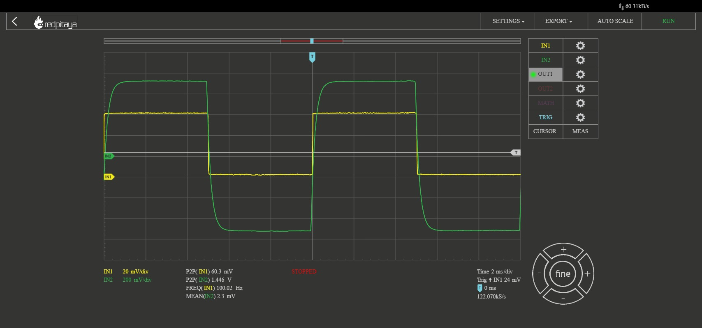
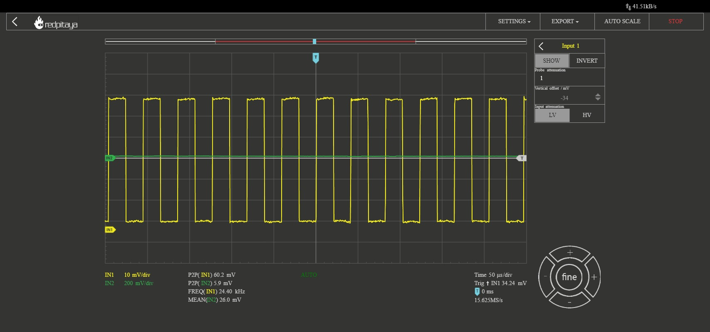

#########################################
FIR vs. IIR filters - Red Pitaya
#########################################

Introduction
============
Digital signal processing relies on filters to manipulate signals by selectively modifying their frequency content. FIR and IIR filters are two major classes used in this domain. FIR filters have a finite impulse response, while IIR filters have an impulse response that extends indefinitely. In this discussion, we explore the characteristics and behaviors of FIR and IIR filters implemented using the Red Pitaya platform. By analyzing their impulse response, frequency response, and pole-zero plots, we gain insights into their strengths and applications. Practical examples, such as the running sum filter and the resonant filter, showcase their effects on different input signals. Understanding these filters enhances our ability to process and enhance signals in various applications.

Theory
==========

LTI systems in the Y-domain
---------------------------

Reminder all discrete time LTI systems can be represented in a canonical
form of:

.. math:: H(z) = \frac{b_{0} + b_{1}z^{- 1} + b_{2}z^{- 2} + \ldots + b_{k}z^{- k}}{a_{0} + a_{1}z^{- 1} + a_{2}z^{- 2} + \ldots + a_{m}z^{- m}}\ where\ k,m\mathbb{\in N}

Where the coefficients of each expression can be viewed as the
coefficients in the difference equation:

.. math:: y[n](a_0 + a_1\delta[n-1] + a_2\delta[n-2] + \cdots + a_m\delta[n-m]) = x[n](b_0 + b_1\delta[n-1] + b_2\delta[n-2] + \cdots + b_k\delta[n-k])

Depending on the configurations of the transfer function, the filter can
show various behaviors. This lab will demonstrate the differences
between two large classes of filters, Finite Impulse Response (FIR), and
Infinite Impulse Response (IIR).

Finite Impulse Response (FIR) Filters:
--------------------------------------
FIR filters are a class of digital filters that possess a finite impulse response. The impulse response of an FIR filter is finite in length and decays to zero after a certain number of samples. This property makes FIR filters inherently stable and easy to implement. FIR filters operate by convolving the input signal with a set of coefficients, also known as the filter kernel or tap weights. The output of an FIR filter :math:`y[n]` at time index :math:`n` can be computed as:

.. math:: y[n] = b_0 \cdot x[n] + b_1 \cdot x[n-1] + b_2 \cdot x[n-2] + \ldots + b_M \cdot x[n-M]

where :math:`x[n]` represents the input signal at time index :math:`n`, and :math:`b_0, b_1, \ldots, b_M` are the filter coefficients.

Running Sum Filter:
-------------------
The running sum filter is a classic example of an FIR filter. It calculates the sum of the previous :math:`M` samples of the input signal. In the z-domain, the transfer function of the running sum filter can be expressed as:

.. math:: H(z) = 1 + z^{-1} + z^{-2} + \ldots + z^{-M}

This transfer function implies that the output :math:`y[n]` at time index :math:`n` is given by the sum of the :math:`M` previous input samples:

.. math:: y[n] = x[n] + x[n-1] + x[n-2] + \ldots + x[n-M]

Varying the number of taps (:math:`M`) in the running sum filter alters the length of the impulse response. With more taps, the impulse response becomes longer, capturing a larger portion of the input history. Consequently, the frequency response of the filter also changes. Increasing the number of taps allows for sharper frequency cutoffs and improved stopband attenuation.

Additionally, by assigning all :math:`b_k` values as :math:`1/M`, the running sum filter becomes a moving average filter. In this case, each tap weight is equal, and the filter performs a simple averaging of the previous :math:`M` samples. The moving average filter can be represented by the following transfer function:

.. math:: H(z) = \frac{1}{M} \cdot (1 + z^{-1} + z^{-2} + \ldots + z^{-M})

This filter is commonly used for smoothing or denoising applications, as it attenuates high-frequency components and preserves the low-frequency components of the input signal.

Infinite Impulse Response (IIR) Filters:
----------------------------------------
IIR filters are a class of digital filters that possess an infinite impulse response. Unlike FIR filters, the impulse response of an IIR filter extends indefinitely. IIR filters are designed by utilizing feedback, where a portion of the output signal is fed back into the filter's input. This feedback mechanism allows IIR filters to achieve complex frequency response characteristics and resonant behavior.

Resonant Filter:
----------------
The resonant filter is a classic example of an IIR filter that exhibits resonance at a specific frequency. It introduces feedback by feeding a delayed version of the output signal back into the filter's input. The transfer function of a resonant filter shows a peak in the frequency response at the resonant frequency. The resonant filter can be represented by the following transfer function:

.. math:: H(z) = \frac{1}{{1 - z^{-N}}}

Where :math:`N` represents the feedback delay or the order of the filter. This transfer function implies that the output :math:`y[n]` at time index :math:`n` can be computed as:

.. math:: y[n] = y[n-N] + x[n]

The resonant filter amplifies the input signal at the resonant frequency, leading to resonance. This behavior is commonly used in audio and music applications to emphasize specific frequencies or create resonant effects.

Hands on experiment
======================
This configuration will require an additional piece of equipment, a
second red pitaya. One red pitaya will be used as in the
oscilloscope/signal generator or the spectrum analyzer modes, while the
other will be used in the LTI DSP workbench. Connect the red pitayas
such that the IN1 of the LTI DSP device is connected to OUT1 of the
generator. You can also use a T-joint to connect the OUT1 of the
generator board to IN1 of itself to see the response of the circuits
more clearly and to measure the Frequency response with the Bode
analyzer. |Diagram Description automatically generated|

Running Sum Filter
------------------

This is a classical FIR filter that operates with the following
difference equation

.. math:: y\lbrack n\rbrack = \sum_{k = 0}^{M - 1}{x\lbrack n - k\rbrack}

This has the z domain transfer function of simply the sum each delay
element multiplied by unity.

.. math:: H(z) = \sum_{k = 0}^{M - 1}z^{- k} = \frac{z^{M} - 1}{z^{M - 1}(z - 1)}

Where the final transfer function expression is simply the expansion of
the M-th partial sum of a geometric series for :math:`|z| < 1`.

MATLAB Analysis
^^^^^^^^^^^^^^^

1. In the provided matlab script, vary the number of taps (value of
   :math:`M`) for the running sum filter and comment on as to how the:

   a. Impulse response changes

*As the number of taps increases, the impulse response becomes longer, capturing a larger portion of the input history.*

   b. Frequency response changes
   
   *Increasing the number of taps allows for sharper frequency cutoffs and improved stopband attenuation.*

   c. Pole zero plot behaves
   
   *The pole-zero plot will show M zeros at the origin.*
   

2. If we assign all :math:`b_{k} = \frac{1}{M}` , this is the moving
   average filter from the previous lab, how does this valuing of the
   :math:`b_{k}` values change:

   a. Impulse response
   
   *The impulse response will have a flat top and a gradual decay.*

   b. Frequency response
   
   *The frequency response will have a flat magnitude response in the passband and roll-off in the stopband.*

   c. Pole zero plot

*The pole-zero plot will show M zeros at the origin.*

Red Pitaya
^^^^^^^^^^

In the red pitaya’s LTI workbench, we can construct arbitrary transfer
functions using the coefficients :math:`a_{k},b_{k}`\ where
:math:`k \in \lbrack 0,5\rbrack` with the caveat that :math:`a_{0} = 1`.
Expanding the transfer function of the running sum filter to accommodate
this maximal number of taps yields the following transfer function

.. math:: H(z) = \sum_{k = 0}^{5}z^{- k} = 1 + z^{- 1} + z^{- 2} + z^{- 3} + z^{- 4} + z^{- 5}

This shows that all :math:`b_{k}` values are 1, and that
:math:`a_{0} = 1`.

1. Plot the frequency response of this filter when entered into the red
   pitaya LTI workbench.

    |Chart Description automatically generated with medium confidence|\ |Chart, line chart Description automatically generated|

2. Show to resulting filtered waveforms/spectra to a:

   a. Square wave within the filter bandwidth

   .. image:: media/image7.4.jpeg
      :name: PitayaScreenshotSquareWave
      :align: center

   b. Square wave outside of the filter bandwidth

   .. image:: media/image7.5.jpeg
        :name: Diagram Description automatically generated
        :align: center

Resonant Filter
----------------
This is a classical IIR filter that operates with the following
difference equation

.. math:: y\lbrack n\rbrack = \ y\lbrack n - N\rbrack + x\lbrack n\rbrack

Which describes a feedforward of the input with a delayed version of the
output. Intuitively, for periodic signals, this implies that the filter
will, when supplied a signal with fundamental period :math:`N` will have
reinforcing effect, whereby each of the previous peaks of a signal will
be summed with the current peak of the signal to provide large gain at
this specific frequency. This behavior is known as resonance, and is
commonly used to design many kinds of filters. Mapping this to the
z-domain provides the following equation:

.. math:: Y(z) = z^{- N}Y(z) + X(z)

Which after some algebra, provides the transfer function of:

.. math:: \frac{Y(z)}{X(z)} = H(z) = \frac{1}{1 - z^{- N}} = \frac{z^{N}}{z^{N} - 1}

.. _matlab-analysis-1:

MATLAB Analysis
^^^^^^^^^^^^^^^

1. In the provided matlab script, vary the feedback delay (value of
   :math:`N`) for the resonant filter and comment on as to how the:

   a. Impulse response changes
   
   *The impulse response will exhibit resonance at the frequency determined by the feedback delay.*

   b. Frequency response changes
   
   *The frequency response will show a peak at the resonant frequency and roll-off in neighboring frequencies.*

   c. Pole zero plot changes
   
   *The pole-zero plot will show a single pole at z=1/N.*
   

.. _red-pitaya-1:

Red Pitaya
^^^^^^^^^^

In the red pitaya’s LTI workbench, we can construct arbitrary transfer
functions using the coefficients :math:`a_{k},b_{k}`\ where
:math:`k \in \lbrack 0,5\rbrack` with the caveat that :math:`a_{0} = 1`.
Expanding the transfer function of the resonant filter to accommodate
this maximal number of taps yields the following transfer function

.. math:: H(z) = \frac{1}{1 - z^{- 5}} = \frac{1}{1 + 0 \times \left( z^{- 1} + z^{- 2} + z^{- 3} + z^{- 4} \right) + z^{- 5}}

This shows that
:math:`b_{0} = 1,\ b_{k} = 0\ \forall\ k \in \left\{ \lbrack 1,5\rbrack\mathbb{\cap Z} \right\}`,
and that and that :math:`a_{0},a_{N} = 1` and
:math:`a_{k} = 0\ \forall\ k \in \left\{ \lbrack 1,5\rbrack\mathbb{\cap Z} \right\}`.

1. Plot the frequency response of this filter when entered into the red
   pitaya LTI workbench.

    .. image:: media/image7.6.png
        :alt: Chart Description automatically generated
        :align: center

    .. image:: media/image7.7.png
        :alt: Chart, line chart Description automatically generated
        :align: center

2. Show to resulting filtered waveforms/spectra to a:

    a. Square wave within the filter resonance

    .. image:: media/image7.8.png
        :alt: Chart Description automatically generated
        :align: center

    b. Step Response of the filter outside of the resonance

    .. image:: media/image7.9.jpeg
        :align: center

Filter Cascade
--------------
As mentioned previously, cascading two filters is described simply by
multiplying their transfer functions.

.. math:: H_{new}(z) = H_{1}(z)H_{2}(z)

Perform analysis on the resulting cascaded filter :math:`H_{new}(z)`
where :math:`H_{1}(z),H_{2}(z)` are the running sum filter with 6 taps
(:math:`M = 6`), and the resonant filter with order 6 (:math:`N = 5`).

.. _matlab-analysis-2:

MATLAB Analysis
^^^^^^^^^^^^^^^

Using the previous two filter transfer function in MATLAB, calculate the
result of cascading the filters.

1. Calculate the result of cascading the filters.

2. Write out the resulting transfer function

3. Plot and comment on the:

   a. Impulse response shape w.r.t either of the before filters

   b. Frequency response w.r.t either of the before filters

   c. Pole zero plot w.r.t either of the before filters

.. _red-pitaya-2:

Red Pitaya
^^^^^^^^^^

Enter the previously calculated transfer function into the Red Pitaya.

1. Plot the frequency response of this filter

    .. image:: media/image7.10.png
        :alt: Chart, line chart Description automatically generated
        :align: center

    .. image:: media/image7.11.png
        :alt: Chart, line chart Description automatically generated
        :align: center

2. Show to resulting filtered waveforms/spectra to a square wave at:

   a. Square wave within the filter bandwidth

b. Square wave outside of the filter bandwidth

.. |Diagram Description automatically generated| image:: media/image7.1.png

.. |Chart Description automatically generated with medium confidence| image:: media/image7.2.png

.. |Chart, line chart Description automatically generated| image:: media/image7.3.png

Conclusion
======================
In conclusion, the study of Linear Time-Invariant (LTI) systems and digital filters provides valuable insights into signal processing and control systems. We explored the properties of LTI systems, including linearity and time-invariance, and discussed Finite Impulse Response (FIR) and Infinite Impulse Response (IIR) filters. Through examples such as the running sum filter and the resonant filter, we observed how different filter characteristics impact the impulse response, frequency response, and pole-zero plot. Additionally, we examined the concept of cascading filters. Understanding these concepts empowers engineers and researchers to design effective filters for various applications, optimizing signal processing and system performance.
