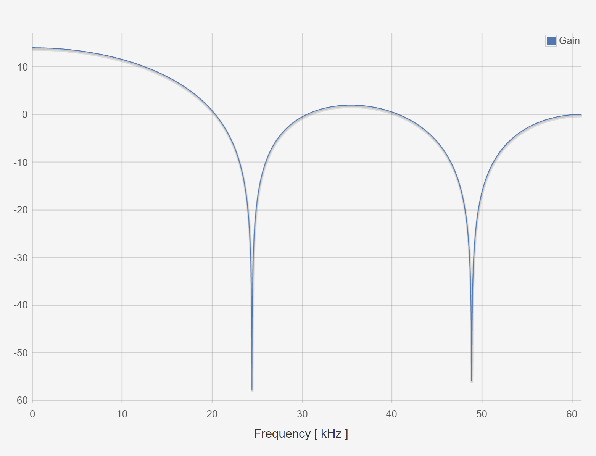
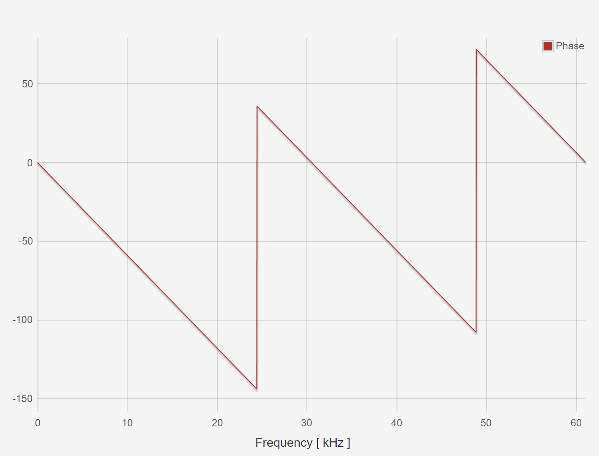

#########################################
ECE2170: FIR vs. IIR filters - Red Pitaya
#########################################

=====
Goals
=====

Observe the characteristic behaviors for Finite Impulse response (FIR) and Infinite Impulse response (IIR) filters implemented via the Red Pitaya

Background
==========

LTI systems in the Y-domain
---------------------------

Reminder all discrete time LTI systems can be represented in a canonical
form of:

.. math:: H(z) = \frac{b_{0} + b_{1}z^{- 1} + b_{2}z^{- 2} + \ldots + b_{k}z^{- k}}{a_{0} + a_{1}z^{- 1} + a_{2}z^{- 2} + \ldots + a_{m}z^{- m}}\ where\ k,m\mathbb{\in N}

Where the coefficients of each expression can be viewed as the
coefficients in the difference equation:

.. .. math:: y\lbrack n\rbrack\left( a_{0} + a_{1}\delta\lbrack n - 1\rbrack + a_{2}\delta\lbrack n - 2\rbrack + \ldots + a_{m}\delta\lbrack n - m\rbrack \right) = x\lbrack n\rbrack\left( b_{0} + b_{1}\delta\lbrack n - 1\rbrack + b_{2}\delta\lbrack n - 2\rbrack + \ldots + b_{k}\delta\lbrack n - k\rbrack \right)\

.. ! FAILS !

Depending on the configurations of the transfer function, the filter can
show various behaviors. This lab will demonstrate the differences
between two large classes of filters, Finite Impulse Response (FIR), and
Infinite Impulse Response (IIR).

Hardware configuration
----------------------

This configuration will require an additional piece of equipment, a
second red pitaya. One red pitaya will be used as in the
oscilloscope/signal generator or the spectrum analyzer modes, while the
other will be used in the LTI DSP workbench. Connect the red pitayas
such that the IN1 of the LTI DSP device is connected to OUT1 of the
generator. You can also use a T-joint to connect the OUT1 of the
generator board to IN1 of itself to see the response of the circuits
more clearly and to measure the Frequency response with the Bode
analyzer. |Diagram Description automatically generated|

Tasks
=====

Running Sum Filter
------------------

This is a classical FIR filter that operates with the following
difference equation

.. math:: y\lbrack n\rbrack = \sum_{k = 0}^{M - 1}{x\lbrack n - k\rbrack}

This has the z domain transfer function of simply the sum each delay
element multiplied by unity.

.. math:: H(z) = \sum_{k = 0}^{M - 1}z^{- k} = \frac{z^{M} - 1}{z^{M - 1}(z - 1)}

Where the final transfer function expression is simply the expansion of
the M-th partial sum of a geometric series for :math:`|z| < 1`.

MATLAB Analysis
^^^^^^^^^^^^^^^

1. In the provided matlab script, vary the number of taps (value of
   :math:`M`) for the running sum filter and comment on as to how the:

   a. Impulse response changes

   b. Frequency response changes

   c. Pole zero plot behaves

2. If we assign all :math:`b_{k} = \frac{1}{M}` , this is the moving
   average filter from the previous lab, how does this valuing of the
   :math:`b_{k}` values change:

   a. Impulse response

   b. Frequency response

   c. Pole zero plot

Red Pitaya
^^^^^^^^^^

In the red pitaya’s LTI workbench, we can construct arbitrary transfer
functions using the coefficients :math:`a_{k},b_{k}`\ where
:math:`k \in \lbrack 0,5\rbrack` with the caveat that :math:`a_{0} = 1`.
Expanding the transfer function of the running sum filter to accommodate
this maximal number of taps yields the following transfer function

.. math:: H(z) = \sum_{k = 0}^{5}z^{- k} = 1 + z^{- 1} + z^{- 2} + z^{- 3} + z^{- 4} + z^{- 5}

This shows that all :math:`b_{k}` values are 1, and that
:math:`a_{0} = 1`.

1. Plot the frequency response of this filter when entered into the red
   pitaya LTI workbench.

    |Chart Description automatically generated with medium confidence|\ |Chart, line chart Description automatically generated|

2. Show to resulting filtered waveforms/spectra to a:

   a. Square wave within the filter bandwidth

   .. image:: media/image7.4.jpeg
      :alt: PitayaScreenshotSquareWave
      :width: 4.26901in
      :height: 2in

   b. Square wave outside of the filter bandwidth

   .. image:: media/image7.5.jpeg
        :name: Diagram Description automatically generated
        :align: center

Resonant Filter
----------------

This is a classical IIR filter that operates with the following
difference equation

.. math:: y\lbrack n\rbrack = \ y\lbrack n - N\rbrack + x\lbrack n\rbrack

Which describes a feedforward of the input with a delayed version of the
output. Intuitively, for periodic signals, this implies that the filter
will, when supplied a signal with fundamental period :math:`N` will have
reinforcing effect, whereby each of the previous peaks of a signal will
be summed with the current peak of the signal to provide large gain at
this specific frequency. This behavior is known as resonance, and is
commonly used to design many kinds of filters. Mapping this to the
z-domain provides the following equation:

.. math:: Y(z) = z^{- N}Y(z) + X(z)

Which after some algebra, provides the transfer function of:

.. math:: \frac{Y(z)}{X(z)} = H(z) = \frac{1}{1 - z^{- N}} = \frac{z^{N}}{z^{N} - 1}

.. _matlab-analysis-1:

MATLAB Analysis
^^^^^^^^^^^^^^^

1. In the provided matlab script, vary the feedback delay (value of
   :math:`N`) for the resonant filter and comment on as to how the:

   a. Impulse response changes

   b. Frequency response changes

   c. Pole zero plot changes

.. _red-pitaya-1:

Red Pitaya
^^^^^^^^^^

In the red pitaya’s LTI workbench, we can construct arbitrary transfer
functions using the coefficients :math:`a_{k},b_{k}`\ where
:math:`k \in \lbrack 0,5\rbrack` with the caveat that :math:`a_{0} = 1`.
Expanding the transfer function of the resonant filter to accommodate
this maximal number of taps yields the following transfer function

.. math:: H(z) = \frac{1}{1 - z^{- 5}} = \frac{1}{1 + 0 \times \left( z^{- 1} + z^{- 2} + z^{- 3} + z^{- 4} \right) + z^{- 5}}

This shows that
:math:`b_{0} = 1,\ b_{k} = 0\ \forall\ k \in \left\{ \lbrack 1,5\rbrack\mathbb{\cap Z} \right\}`,
and that and that :math:`a_{0},a_{N} = 1` and
:math:`a_{k} = 0\ \forall\ k \in \left\{ \lbrack 1,5\rbrack\mathbb{\cap Z} \right\}`.

1. Plot the frequency response of this filter when entered into the red
   pitaya LTI workbench.

    .. image:: media/image7.6.png
        :alt: Chart Description automatically generated
        :width: 6.5in
        :height: 3.25in

    .. image:: media/image7.7.png
        :alt: Chart, line chart Description automatically generated
        :width: 6.5in
        :height: 4.95764in

2. Show to resulting filtered waveforms/spectra to a:

    a. Square wave within the filter resonance

    .. image:: media/image7.8.png
        :alt: Chart Description automatically generated
        :width: 4.5426in
        :height: 2.47222in

    b. Step Response of the filter outside of the resonance

    .. image:: media/image7.9.jpeg
        :width: 6.49028in
        :height: 3.04306in

Filter Cascade
--------------

As mentioned previously, cascading two filters is described simply by
multiplying their transfer functions.

.. math:: H_{new}(z) = H_{1}(z)H_{2}(z)

Perform analysis on the resulting cascaded filter :math:`H_{new}(z)`
where :math:`H_{1}(z),H_{2}(z)` are the running sum filter with 6 taps
(:math:`M = 6`), and the resonant filter with order 6 (:math:`N = 5`).

.. _matlab-analysis-2:

MATLAB Analysis
^^^^^^^^^^^^^^^

Using the previous two filter transfer function in MATLAB, calculate the
result of cascading the filters.

1. Calculate the result of cascading the filters.

2. Write out the resulting transfer function

3. Plot and comment on the:

   a. Impulse response shape w.r.t either of the before filters

   b. Frequency response w.r.t either of the before filters

   c. Pole zero plot w.r.t either of the before filters

.. _red-pitaya-2:

Red Pitaya
^^^^^^^^^^

Enter the previously calculated transfer function into the Red Pitaya.

1. Plot the frequency response of this filter

    .. image:: media/image7.10.png
        :alt: Chart, line chart Description automatically generated
        :width: 6.5in
        :height: 3.32361in

    .. image:: media/image7.11.png
        :alt: Chart, line chart Description automatically generated
        :width: 6.5in
        :height: 5.07153in

2. Show to resulting filtered waveforms/spectra to a square wave at:

   a. Square wave within the filter bandwidth

   .. image:: media/image7.12.jpeg
      :width: 6.49028in
      :height: 3.04306in

    b. Square wave outside of the filter bandwidth

    .. image:: media/image7.13.jpeg
        :name: inverting schmitt screencap
        :align: center

.. |Diagram Description automatically generated| image:: media/image7.1.png
   :width: 6.5in
   :height: 1.87014in

