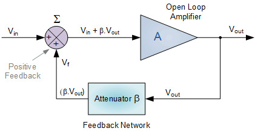

###################
Measuring Frequency
###################

=========
Objective
=========

In this section, we will discuss the measurement of frequency, which is a fundamental property of electrical circuits. Frequency is a measure of the number of oscillations per unit of time, and it is expressed in Hertz (Hz). Frequency measurement is essential in many areas of electrical engineering, including signal processing, audio, and radio frequency (RF) design. Frequency measurement can be challenging due to various factors, including signal distortion, noise, and measurement instrument limitations.

=====================
Frequency Measurement
=====================

Frequency measurement is the process of determining the frequency of a signal. It is a crucial step in many electronic circuits and systems, such as audio, RF, and digital systems. In this section, we will discuss the basics of frequency measurement and explore a hands-on experiment using the Red Pitaya board. The choice of frequency measurement technique depends on several factors, including the frequency range of the signal, the accuracy required, and the equipment available

There are several techniques for measuring frequency, including:

Period Counting Method
--------------------------

The period counting method involves measuring the time duration of a single cycle of a periodic waveform and then calculating the frequency by taking the inverse of the time duration. This method is simple and straightforward, requiring only an oscilloscope or frequency counter to measure the period. However, the period counting method may not be suitable for high-frequency signals or signals with significant noise or distortion, as these factors can make it difficult to accurately determine the period of the waveform.

Frequency-to-Voltage Conversion Method
--------------------------------------

The frequency-to-voltage conversion method involves using a dedicated converter circuit to convert the input frequency into a proportional voltage. This converter circuit typically consists of a comparator, a monostable multivibrator, and an integrator. The output voltage from the converter circuit can then be measured using a voltmeter or an analog-to-digital converter (ADC). Although this method can provide good accuracy, it may be affected by temperature changes and component aging, which can introduce errors in the output voltage.

Phase-Locked Loop Method
------------------------

The phase-locked loop (PLL) method is a more complex and versatile technique that can provide high accuracy over a wide frequency range. A PLL is a feedback control system that adjusts its output frequency to match the input frequency. The PLL compares the phase of the input signal with that of its output signal, and adjusts the frequency of the output signal to minimize the phase difference between the two signals. This method is commonly used in communication and navigation systems, where precise frequency control is critical.

Time Interval Method
--------------------------

The time interval method involves measuring the time between two consecutive rising (or falling) edges of a signal and using this information to calculate the frequency. This method requires specialized equipment, such as a time interval counter or a high-speed oscilloscope, with fast rise times and low jitter to accurately measure the time interval between signal edges. The time interval method is suitable for measuring high-frequency signals with a high level of accuracy.

Fast Fourier Transform Method
---------------------------------

The fast Fourier transform (FFT) method is a digital signal processing technique that converts a time-domain signal into a frequency-domain signal by decomposing it into its constituent frequencies. By analyzing the frequency-domain representation of the signal, the frequency of the input signal can be determined. This method requires a digital storage oscilloscope or a signal analyzer with FFT capability, and it can provide high-resolution frequency measurements. However, the accuracy of the FFT method depends on the quality of the input signal and the resolution of the digital sampling.

===========
Oscillators
===========

Oscillators are essential components used in a variety of applications, such as signal generators, frequency synthesizers, and clocks. They generate signals that oscillate at a specific frequency, which is determined by the characteristics of the oscillator circuit. In this introduction to oscillators, we will explore the basic principles, types, and applications of oscillators in electronic circuits.

|Oscillator|

.. |Oscillator| raw:: html

    <a href="https://www.electronics-tutorials.ws/oscillator/oscillators.html" target="_blank">Source:electronics-tutorials.ws</a>

Basic Principles of Oscillators
-------------------------------

An oscillator circuit consists of an amplifier and a feedback network that produces a positive feedback loop. The amplifier provides gain to the feedback signal, and the feedback network feeds a portion of the output signal back to the input, resulting in sustained oscillations at a specific frequency. The frequency of the oscillations is determined by the characteristics of the feedback network, which can be passive (resistors, capacitors, and inductors) or active (transistors or operational amplifiers).

There are several types of oscillators:

LC Oscillators
--------------

LC oscillators, also known as tuned or tank circuit oscillators, are particularly suited for high-frequency applications due to their low phase noise and relatively low power consumption. They rely on the resonant behavior of the LC circuit, where the inductor (L) and capacitor (C) store and exchange energy. Some common types of LC oscillators include the Hartley, Colpitts, and Clapp oscillators. These oscillators are used in applications like RF transmitters, receivers, and frequency mixers, as well as in high-frequency test equipment.

Crystal Oscillators
-------------------

The piezoelectric properties of quartz crystals allow them to vibrate at a specific frequency when subjected to an electric field. This frequency is determined by the crystal's size, shape, and cut. The high stability and accuracy of crystal oscillators are particularly advantageous in applications like GPS receivers, microcontrollers, and telecommunications equipment. Some popular configurations of crystal oscillators include the Pierce, Butler, and Miller oscillators.

RC Oscillators
--------------

RC oscillators are often used in applications where the required frequency stability and accuracy are not as stringent, such as in simple timing circuits, low-cost signal generators, and basic electronic experiments. Due to their simplicity, they are easy to design and implement, making them a popular choice for educational purposes and hobbyists. The most common RC oscillator types are phase shift and Wien bridge oscillators.

Wien Bridge Oscillators
-----------------------

Wien Bridge Oscillators (continued)
In Wien Bridge oscillators, the bridge configuration of resistors and capacitors determines the frequency of oscillation. This type of oscillator can provide low distortion, stable oscillation frequency, and good frequency response. Applications include audio amplifiers, distortion analyzers, and precision oscillators for lab equipment. The oscillator's frequency can be adjusted by varying the values of the resistors or capacitors, making it a versatile choice for variable-frequency applications.

Phase Shift Oscillators
-----------------------

Phase Shift oscillators use a feedback network consisting of multiple RC sections to create a phase shift of 180 degrees at a specific frequency. This type of oscillator generates a sinusoidal output waveform and is often used in low-frequency applications such as audio synthesizers and function generators.

Relaxation Oscillators
----------------------

Relaxation oscillators generate non-sinusoidal waveforms such as square, triangular, or sawtooth waves. They use a combination of active devices (such as transistors, operational amplifiers, or comparators) and passive components (resistors and capacitors) to produce output waveforms with sharp transitions. Relaxation oscillators are used in applications like pulse generators, timers, and waveform synthesizers.

Each type of oscillator has its unique advantages and applications, depending on factors such as desired frequency range, stability, and waveform shape. Designers can choose the most suitable oscillator type based on the specific requirements of their projects.

===========================
Applications of Oscillators
===========================

Oscillators play a crucial role in various electronic circuits and systems:

Signal Generators
-----------------

Oscillators are used in signal generators to generate signals with specific frequencies and waveforms. These signals are used in a variety of applications, such as testing, measurement, and calibration.

Frequency Synthesizers
----------------------

Frequency synthesizers are used to generate a range of frequencies from a single reference frequency. They are commonly used in communication systems, where multiple frequencies are required for different channels and bandwidths.

Clocks
------

Oscillators are used in clocks to generate a steady and accurate reference frequency. This frequency is used to synchronize the operation of other circuits in the system, ensuring reliable and consistent performance.

In summary, inductors are fundamental passive components in electronic circuits, characterized by their ability to store and release energy in the form of a magnetic field. They come in various types and are used in a wide range of applications, from filters and power supplies to oscillators and noise suppression. Understanding the principles, types, and applications of inductors is essential for anyone working with electronic circuits and systems. But there are types of inductances that we
don't want in our circuits.

In summary, oscillators are fundamental components in electronic circuits, characterized by their ability to generate signals that oscillate at a specific frequency. They come in various types and are used in a wide range of applications, from signal generators and frequency synthesizers to clocks and other timing circuits.

=================================================================
Hands on Experiment: Measuring RLC circuits Oscillating frequency
=================================================================

The RLC circuit consists of a resistor, an inductor, and a capacitor connected in series. In this experiment, we will use a 100 ohm resistor, a 1mH inductor, and a 10 nF capacitor. We will connect the RLC circuit to the Red Pitaya board following the image:

.. image:: img/3.4/1.2.jpg
    :name: Circuit
    :align: center

To set up the circuit, connect the RLC circuit to the Red Pitaya board as shown in the diagram. Connect the probe IN1 to resistor and probe IN2 to the capacitor and indutor.

Hold the button to charge the circuit on 3.3V and press run. Release the button and the response should be captured. You should see an oscillating voltage, slowly decreasing:

.. image:: img/3.4/1.3.png
    :name: Wave
    :align: center

To measure the frequency of the oscillations, use the Cursor function on the Oscilloscope app, which displays the X,Y (time and voltage) value of the desired point. Measure the time interval for one complete cycle of the oscillation, from peak to peak.

.. image:: img/3.4/1.4.png
    :name: Cursors
    :align: center

The frequency of the oscillation can then be calculated using the formula:

.. math:: f = \frac{1}{T}

where f is the frequency in hertz (Hz), and T is the time interval for one complete cycle of the oscillation in seconds.

The results of the experiment for the RLC circuit are as follows:

Measured time interval for one complete cycle of the oscillation (T) = 0.0000218 seconds

Frequency (f) = 45.8 kHz

We can confrim our measurements using the values of elements, and calculate the resonant frequency of the RLC circuit using the formula:

.. math:: f_{resonant} = \frac{1}{2 \pi \sqrt{LC}}

where L is the inductance in henries, and C is the capacitance in farads.

The calculated resonant frequency of the RLC circuit is:

.. math:: f_{resonant} = \frac{1}{2 \pi \sqrt{(1 \times 10^{-3}) \times (10 \times 10^{-9})}} = 50.329 kHz

The measured frequency of the oscillation is close to the calculated resonant frequency, which indicates that the RLC circuit is operating as expected, and the error we got came from the tolerances of the elements.

Conclusion
----------

In this experiment, we used the Red Pitaya to measure the frequency of an oscillating signal generated by an RLC circuit. We demonstrated how the oscilloscope application and frequency measurement tool in the Red Pitaya web interface can be used to measure the frequency of a signal. The Red Pitaya is a versatile and affordable instrument that can be used for a wide range of measurements, including frequency measurement.

Written by Andraž Pirc

This teaching material was created by `Red Pitaya <https://www.redpitaya.com/>`_& `Zavod 404 <https://404.si/>`_ in the scope of the `Smart4All <https://smart4all.fundingbox.com/>`_ innovation project.
