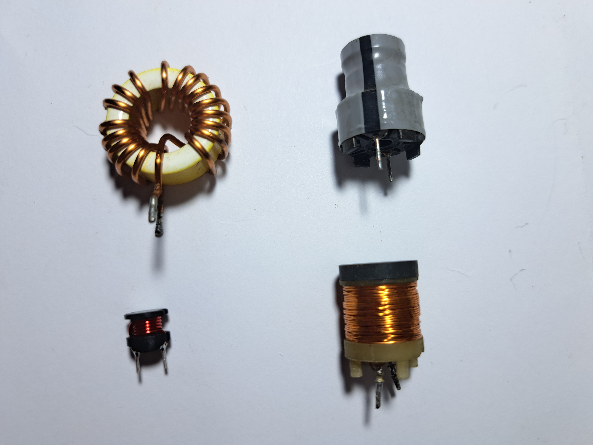
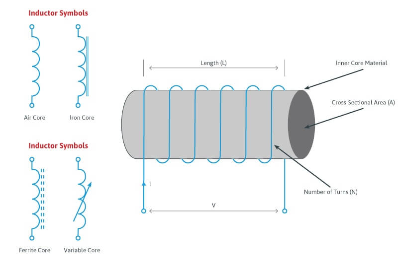
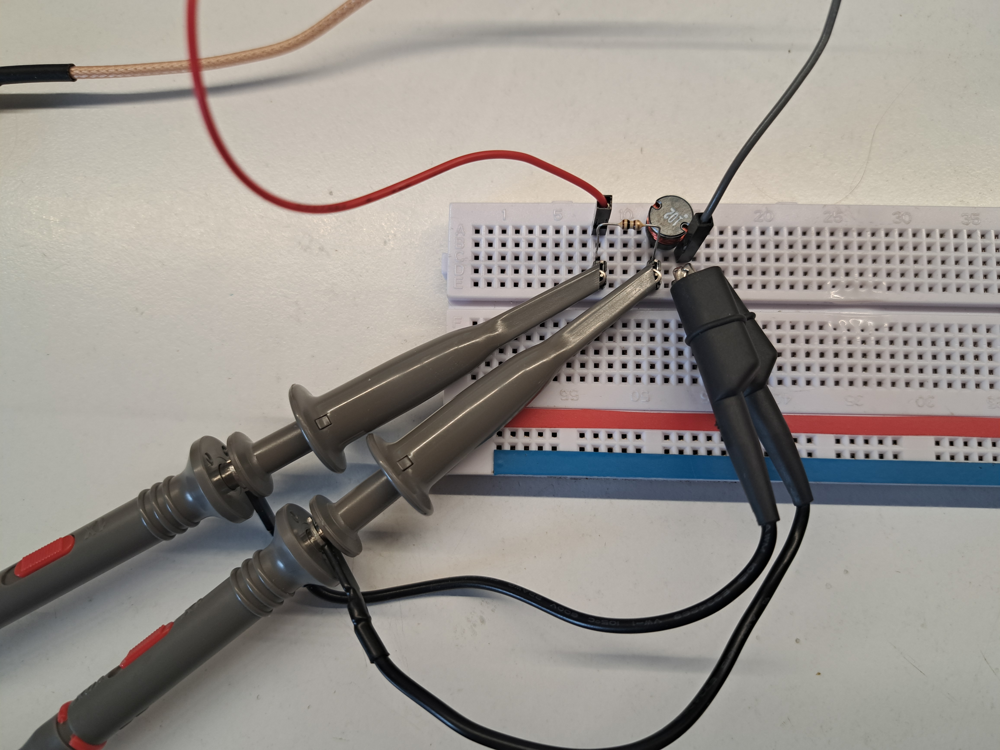
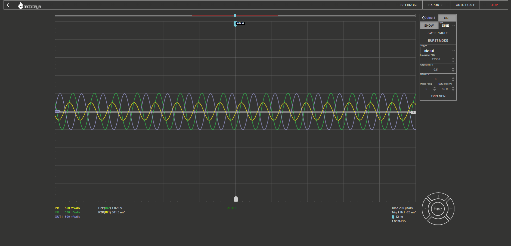

============================
Measuring Inductance
============================

Objective
===============
In this section, we will discuss the measurement of inductance, which is a fundamental property of electrical circuits. Inductance is a measure of an object's ability to store electrical energy in a magnetic field, and it is expressed in henries (H). Inductance measurement is essential in many areas of electrical engineering, including power transmission, signal processing, and electronic circuit design. Inductance measurement can be challenging due to various factors, including stray inductance, parasitic inductance, and measurement instrument limitations.

Inductors
================
Inductors are essential passive electronic components used in a variety of applications, such as power supplies, filters, and oscillators. They store energy in the form of a magnetic field when an electrical current flows through them and release that energy when the current changes. In this introduction to inductors, we will explore the basic principles, types, and applications of inductors in electronic circuits.

**Basic Principles of Inductors**

An inductor consists of a coil of wire, usually wound around a magnetic core. When an electric current flows through the coil, it generates a magnetic field around it. This magnetic field stores energy, and when the current changes, the energy is released back into the circuit. The inductor's ability to store and release energy is determined by its inductance, which is measured in henrys (H). The inductance value depends on factors such as the number of turns in the coil, the coil's dimensions, and the core material.

The inductance of an inductor is given by equation:

.. math:: L = \frac{1}{4\pi^2 f_{res}^2 C}

where L is the inductance in henries (H), f_res is the resonant frequency in hertz (Hz), and C is the capacitance in farads (F).

There are several types of inductors:

**Air-Core Inductors**
As the name suggests, air-core inductors do not have a magnetic core. They consist of a coil of wire wound in a helical or spiral shape, often used in high-frequency applications due to their low parasitic capacitance and low loss.

**Iron-Core Inductors**
These inductors have a core made of iron or a ferromagnetic material, which increases their inductance and energy storage capacity. Iron-core inductors are commonly used in power supplies and other low-frequency applications.

**Ferrite-Core Inductors**
Ferrite-core inductors use a core made of a ferrite material, which has high magnetic permeability and low electrical conductivity. These inductors are suitable for a wide range of applications, including radio frequency (RF) circuits and noise suppression.

**Toroidal Inductors**
Toroidal inductors have a doughnut-shaped core, which provides a closed magnetic path, resulting in high inductance and reduced electromagnetic interference (EMI). They are often used in power supply filters and other applications requiring compact, high-performance inductors.

**Applications of Inductors**

Inductors play a crucial role in various electronic circuits and systems:

**Filters**
Inductors can be used in combination with capacitors to create low-pass, high-pass, and band-pass filters to control the flow of signals with specific frequencies in a circuit.

**Power Supplies**
In power supply applications, inductors help stabilize the output voltage by smoothing out current ripples and transient voltage spikes.

**Oscillators**
Inductors, in combination with capacitors and resistors, can create oscillating circuits that generate specific frequencies for applications like signal generation and frequency synthesis.

In summary, inductors are fundamental passive components in electronic circuits, characterized by their ability to store and release energy in the form of a magnetic field. They come in various types and are used in a wide range of applications, from filters and power supplies to oscillators and noise suppression. Understanding the principles, types, and applications of inductors is essential for anyone working with electronic circuits and systems. But there are types of inductances that we
don't want in our circuits.

Stray and Parasitic Inductance: Common Obstacles in Inductance Measurement
==============================
Parasitic and stray inductances are unintentional and often undesirable inductive effects that occur in electronic circuits. They can lead to performance issues, inaccuracies in measurements, and signal degradation. Both types of inductance arise from the physical layout and design of a circuit, including the arrangement and proximity of conductive traces, components, and wiring. In this brief introduction, we will discuss the origins and potential impacts of parasitic and stray inductances on electronic circuits.

Stray Inductance and its Impact on Circuit Performance
--------------------------------
Stray inductance is an unintended and often undesirable inductive effect that occurs in electronic circuits, causing potential performance issues and inaccuracies in measurements. This phenomenon is primarily caused by the physical layout of a circuit, including the spacing and arrangement of conductive traces, components, and wiring. In this brief introduction, we will discuss the origins of stray inductance and its potential impact on circuit performance.

**Stray Indutance in High-Frequency Applications**

Stray inductance is particularly troublesome in high-frequency applications, such as radio frequency (RF) circuits, because the rapid changes in current can exacerbate the effects of stray inductance. Signal loss, reflections, and crosstalk can occur, reducing the overall performance of the circuit. Designers can mitigate the impact of stray inductance by using specialized components, such as air-core inductors or ferrite beads, which exhibit low magnetic permeability and eddy current losses. Additionally, arranging components and conductive traces to minimize mutual inductance and coupling can further reduce the impact of stray inductance on high-frequency circuits.

**Minimzing Stray inductance in Measurements**

Calibration is a crucial process that can help minimize the effect of stray inductance on measurement accuracy. By using a known reference object, the inductance meter or network analyzer can account for the presence of stray inductance and correct the measurements accordingly. This process involves comparing the measured value of the reference object to its known value, calculating the difference, and adjusting the measurement system to account for this discrepancy. Calibration should be performed periodically to maintain the highest level of measurement accuracy and account for any drift in the instrument's performance over time.

**Guard Traces for Isolation from External Influences**

Guard traces are an effective technique for isolating the object being measured from external conductive objects that may introduce stray inductance. By surrounding the measurement area with a conductive shield connected to a low-impedance ground, the guard trace can intercept stray magnetic fields and prevent them from affecting the measurement signal. This technique is especially useful in low-frequency applications, where the shield's inductance can be made sufficiently large to effectively isolate the measurement area from external influences.

Parasitic Inductance and Techniques to Minimize its Effects
--------------------------------
Parasitic inductance is an undesired phenomenon in electronic circuits, stemming from unintentional inductance present in conductive traces, components, and other circuit elements. It arises due to the physical layout and design of a circuit and can cause a range of issues that degrade circuit performance, such as signal distortion, reduced bandwidth, and diminished signal-to-noise ratio. In this brief introduction, we will explore the origins of parasitic inductance, its impact on electronic circuits, and methods to minimize its effects.

**Utilizing Low-Inductance Components**

To reduce the impact of parasitic inductance on circuit performance, designers can use components with low inductance values. Surface-mount inductors and multilayer ceramic inductors offer lower parasitic inductance due to their compact size and minimal lead length. By using these components in high-frequency applications, designers can minimize the impact of parasitic inductance and reduce signal distortion, bandwidth limitations, and other performance issues associated with this phenomenon.

**Implementing Ground Planes and Power Planes**

Ground planes and power planes are essential elements of circuit layout design that can help minimize the effect of parasitic inductance. These large conductive planes serve as low-inductance paths for current flow, reducing the inductance of conductive traces and improving signal integrity. Designers should carefully consider the placement and routing of ground and power planes to optimize their performance and ensure that they effectively reduce parasitic inductance.

**Employing Simulation Tools for Circuit Optimization**

Simulation tools like SPICE can be invaluable for predicting the impact of parasitic inductance on a circuit and identifying potential issues before fabrication. By creating a virtual model of the circuit, designers can analyze the performance, identify areas of concern, and optimize the layout and component selection to minimize the effects of parasitic inductance. This proactive approach can save time, resources, and reduce the likelihood of errors in the final design.

Measuring Inductance
=======================

**Bridge Measurement Method:**

The bridge measurement method is based on the principle of a balanced bridge circuit, which consists of four arms with known and unknown components. In an inductance bridge, one arm contains the unknown inductor (Lx), while the other three arms consist of reference components such as resistors, capacitors, or inductors. By adjusting the reference components' values and monitoring the voltage across the bridge, a balance point can be found where the voltage across the bridge becomes zero or very close to it. At this balance point, the inductance of the unknown component (Lx) can be determined using the known reference component values.

*Advantages:*

- High accuracy and precision.
- Suitable for a wide range of inductance values.
- Applicable to both low and high-frequency measurements.

*Disadvantages:*

- Can be time-consuming due to manual adjustments.
- Requires a stable and accurate reference component.

**Resonant Frequency Method:**

The resonant frequency method involves creating a resonant LC circuit by connecting the unknown inductor either in series or parallel with a known capacitor. The resonant frequency of the LC circuit is the frequency at which the inductive and capacitive reactances are equal and opposite, resulting in maximum current flow in the circuit. By measuring the resonant frequency (fr) and knowing the capacitance value (C), the inductance (L) can be calculated using the following formula:

For a series resonance: 

.. math:: L = 1 / (C * (2 * π * fr)^2)

For a parallel resonance: 

.. math:: L = C * (2 * π * fr)^2

*Advantages:*

- Simple and cost-effective method.
- Suitable for measuring small inductances.
- Offers good accuracy.

*Disadvantages:*

- Limited to a specific frequency range.
- May require additional instruments, such as frequency counters or oscilloscopes, to measure the resonant frequency.

**Time Domain Reflectometry (TDR):**

Time Domain Reflectometry (TDR) is a technique that involves sending a fast-rising voltage pulse down a transmission line and analyzing the reflected signal. When the pulse encounters a change in impedance, such as an inductor connected at the far end of the transmission line, a portion of the pulse is reflected back towards the source. By measuring the time delay between the transmitted and reflected pulses and the amplitude of the reflected pulse, the inductance value can be calculated based on the reflection coefficient (Γ) and the transmission line's characteristic impedance (Z0).

*Advantages:*

- Non-destructive testing method.
- Capable of measuring inductance in complex environments, such as embedded components or multi-layer PCBs.
- Offers high spatial resolution for locating impedance discontinuities.

*Disadvantages:*

- Requires specialized equipment and expertise.
- May be limited by the bandwidth of the TDR instrument.

Hands-on Experiment: Measuring Inductance with Red Pitaya using Impedance Measurement Method
=======================================================================
The impedance measurement method is an effective way to measure the inductance of an inductor. It involves connecting the inductor in series with a known resistor and applying a sinusoidal voltage signal. The voltage across the resistor and the inductor is measured, and the inductance can be calculated using the impedance formula.

In this experiment, we will measure the inductance of an unknown inductor using the impedance measurement method with a Red Pitaya board.

**Experimental Setup**

For this experiment, we will use a simple circuit consisting of a known resistor (100 ohms) in series with the unknown inductor. We will apply a sinusoidal voltage signal (1 kHz) using the Red Pitaya's function generator and measure the voltages across the resistor and the inductor using the Red Pitaya's oscilloscope function.
Connect the known resistor (100 ohms) in series with the unknown inductor on the breadboard. Connect one end of the resistor to the Red Pitaya's positive function generator output (OUT1) and the other end of the inductor to the ground (GND).Connect the oscilloscope probe 1 (IN1) across the Inductor. Connect the oscilloscope probe 2 (IN2) across the entire RL circuit (across the resistor and inductor).

For help you can refer to the picture bellow:

Now, configure the Red Pitaya's function generator and oscilloscope. Set the function generator to output a sinusoidal signal with a frequency of 1 kHz and an amplitude of 1V peak-to-peak. Set the oscilloscope's time and voltage scales to display the waveforms properly. Trigger the oscilloscope to capture the waveforms across the resistor (IN1) and across the RL circuit (IN2). Start increasing the frequency, untill you reach 50% voltage on the inductor. Write down the frequency and let's calculate the impedance (Z) of the RL circuit, the inductive reactance (X_L), and the inductance (L) using these values:

For help you can refer to the picture bellow:

   
   
At the half-power frequency (50% voltage drop), the inductive reactance (X_L) is equal to the resistance (R). Therefore:

.. math:: X_L = R

Given that the inductive reactance is calculated using the following formula:

.. math:: X_L = 2\pi f L

We can rearrange this formula to find the value of the inductor (L):

.. math:: L = \frac{X_L}{2\pi f}

Now we know that X_L = R, we can substitute R for X_L:

.. math:: L = \frac{R}{2\pi f}

Substitute the values you provided (R = 100 ohms, f = 12300 Hz) into the equation:

.. math:: L = \frac{100}{2\pi \cdot 12300}

Calculate the inductance:

.. .. math:: L \approx 0.001326 , \text{H} = 1.326 , \text{mH}

Thus, the estimated value of the unknown inductor is approximately 1.326 mH. Keep in mind that this is an approximation and may not be the exact value, but it should provide a reasonable estimate for your experiment. The specified inductor value was 1mH but note that is made with 15% tolerance, which means our measurement was really an approximation of the value.

Written by Andraž Pirc

This teaching material was created by `Red Pitaya <https://www.redpitaya.com/>`_ & `Zavod 404 <https://404.si/>`_ in the scope of the `Smart4All <https://smart4all.fundingbox.com/>`_ innovation project.
