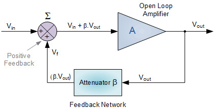
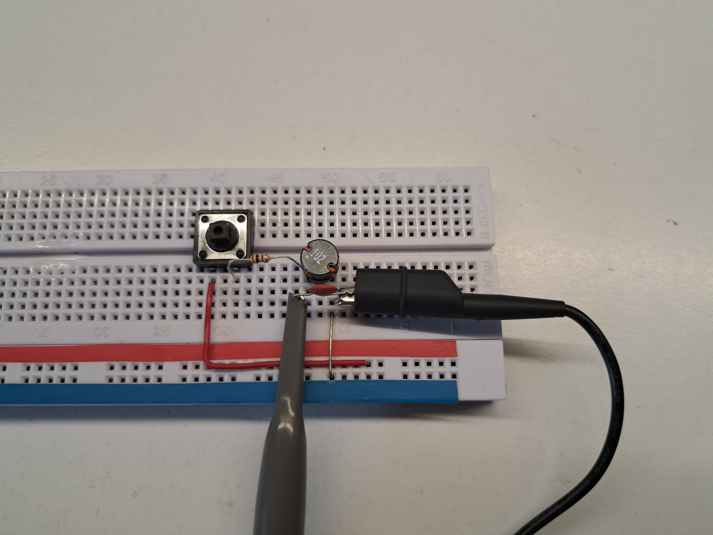
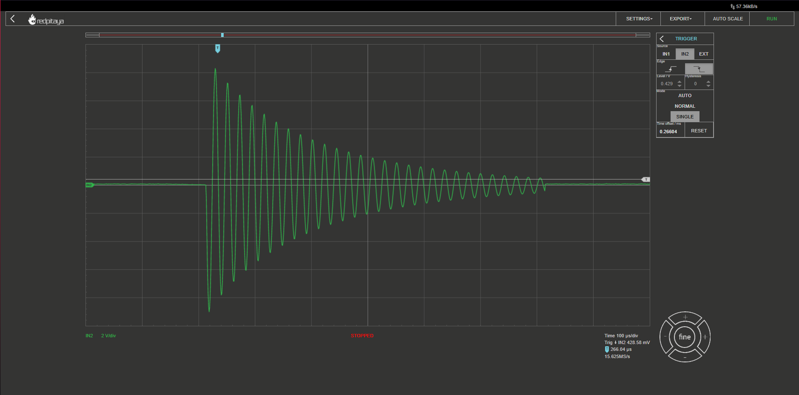

============================
Measuring Frequency
============================

Objective
===============
In this section, we will discuss the measurement of frequency, which is a fundamental property of electrical circuits. Frequency is a measure of the number of oscillations per unit of time, and it is expressed in Hertz (Hz). Frequency measurement is essential in many areas of electrical engineering, including signal processing, audio, and radio frequency (RF) design. Frequency measurement can be challenging due to various factors, including signal distortion, noise, and measurement instrument limitations.

Oscillators
================
Oscillators are essential components used in a variety of applications, such as signal generators, frequency synthesizers, and clocks. They generate signals that oscillate at a specific frequency, which is determined by the characteristics of the oscillator circuit. In this introduction to oscillators, we will explore the basic principles, types, and applications of oscillators in electronic circuits.

	
	|Oscillator|

.. |Oscillator| raw:: html

   <a href="https://www.electronics-tutorials.ws/oscillator/oscillators.html" target="_blank">Source:electronics-tutorials.ws</a>

**Basic Principles of Oscillators**

An oscillator circuit consists of an amplifier and a feedback network that produces a positive feedback loop. The amplifier provides gain to the feedback signal, and the feedback network feeds a portion of the output signal back to the input, resulting in sustained oscillations at a specific frequency. The frequency of the oscillations is determined by the characteristics of the feedback network, which can be passive (resistors, capacitors, and inductors) or active (transistors or operational amplifiers).

There are several types of oscillators:

**LC Oscillators**
LC oscillators use a combination of inductors and capacitors in the feedback network. They are commonly used in radio frequency (RF) applications due to their ability to generate high-quality sine waves.

**Crystal Oscillators**
Crystal oscillators use a quartz crystal in the feedback network. They are highly stable and accurate, making them suitable for precision applications like clocks and frequency standards.

**RC Oscillators**
RC oscillators use resistors and capacitors in the feedback network. They are simple and inexpensive, but their frequency stability and accuracy are generally lower than that of other types of oscillators.

**Applications of Oscillators**

Oscillators play a crucial role in various electronic circuits and systems:

**Signal Generators**
Oscillators are used in signal generators to generate signals with specific frequencies and waveforms. These signals are used in a variety of applications, such as testing, measurement, and calibration.

**Frequency Synthesizers**
Frequency synthesizers are used to generate a range of frequencies from a single reference frequency. They are commonly used in communication systems, where multiple frequencies are required for different channels and bandwidths.

**Clocks**
Oscillators are used in clocks to generate a steady and accurate reference frequency. This frequency is used to synchronize the operation of other circuits in the system, ensuring reliable and consistent performance.

In summary, inductors are fundamental passive components in electronic circuits, characterized by their ability to store and release energy in the form of a magnetic field. They come in various types and are used in a wide range of applications, from filters and power supplies to oscillators and noise suppression. Understanding the principles, types, and applications of inductors is essential for anyone working with electronic circuits and systems. But there are types of inductances that we
don't want in our circuits.

In summary, oscillators are fundamental components in electronic circuits, characterized by their ability to generate signals that oscillate at a specific frequency. They come in various types and are used in a wide range of applications, from signal generators and frequency synthesizers to clocks and other timing circuits.

Frequency Measurement
==============================
Frequency measurement is the process of determining the frequency of a signal. It is a crucial step in many electronic circuits and systems, such as audio, RF, and digital systems. In this section, we will discuss the basics of frequency measurement and explore a hands-on experiment using the Red Pitaya board. The choice of frequency measurement technique depends on several factors, including the frequency range of the signal, the accuracy required, and the equipment available

Measurement Techniques
--------------------------------
here are several techniques for measuring frequency, including:

**Period Counting Method**
The period counting method is a simple and straightforward technique that can be implemented with basic equipment, but it may not be suitable for high-frequency signals or signals with significant noise or distortion. The frequency-to-voltage conversion method is also relatively simple and can provide good accuracy, but it requires a dedicated converter circuit and may be affected by temperature changes and component aging.

**Frequency-to-Voltage Conversion Method**
The frequency-to-voltage conversion method converts the input frequency to a proportional voltage using a frequency-to-voltage converter circuit. The output voltage can then be measured using a voltmeter.

**Phase-Locked Loop Method**
The PLL method is a more complex but versatile technique that can provide high accuracy over a wide frequency range. It is commonly used in communication and navigation systems, where precise frequency control is critical. The time interval method is suitable for measuring high-frequency signals with a high level of accuracy, but it requires specialized equipment with fast rise times and low jitter.

**Time Interval Method**
The time interval method involves measuring the time between two consecutive rising (or falling) edges of a signal and using this information to calculate the frequency. This method is suitable for measuring high-frequency signals with a high level of accuracy.

**Fast Fourier Transform Method**
The fast Fourier transform (FFT) method is a digital signal processing technique that converts a time-domain signal into a frequency-domain signal. The frequency of the input signal can then be determined from the frequency-domain signal.

Hands on Experiment: Measuring RLC circuits Oscillating frequency
==========================
The RLC circuit consists of a resistor, an inductor, and a capacitor connected in series. In this experiment, we will use a 100 ohm resistor, a 1mH inductor, and a 10 nF capacitor. We will connect the RLC circuit to the Red Pitaya board following the image:

:name: Circuit
:align: center

To set up the circuit, connect the RLC circuit to the Red Pitaya board as shown in the diagram. Connect the probe IN1 to resistor and probe IN2 to the capacitor and indutor.

Hold the button to charge the circuit on 3.3V and press run. Release the button and the response should be captured. You should see an oscillating voltage, slowly decreasing:

:name: RLC Oscillation
:align: center

To measure the frequency of the oscillations, use the Cursor function on the Oscilloscope app, which displays the X,Y (time and voltage) value of the desired point. Measure the time interval for one complete cycle of the oscillation, from peak to peak.

.. image:: img/3.4/1.4.png
:name: Cursonrs
:align: center

The frequency of the oscillation can then be calculated using the formula:

.. math:: f = \frac{1}{T}

where f is the frequency in hertz (Hz), and T is the time interval for one complete cycle of the oscillation in seconds.

The results of the experiment for the RLC circuit are as follows:

Measured time interval for one complete cycle of the oscillation (T) = 0.0000218 seconds

Frequency (f) = 45.8 kHz

We can confrim our measurements using the values of elements, and calculate the resonant frequency of the RLC circuit using the formula:

.. math:: f_{resonant} = \frac{1}{2 \pi \sqrt{LC}}

where L is the inductance in henries, and C is the capacitance in farads.

The calculated resonant frequency of the RLC circuit is:

.. math:: f_{resonant} = \frac{1}{2 \pi \sqrt{(1 \times 10^{-3}) \times (10 \times 10^{-9})}} = 50.329 kHz

The measured frequency of the oscillation is close to the calculated resonant frequency, which indicates that the RLC circuit is operating as expected, and the error we got came from the tolerances of the elements.

Conclusion
------------------
In this experiment, we used the Red Pitaya to measure the frequency of an oscillating signal generated by an RLC circuit. We demonstrated how the oscilloscope application and frequency measurement tool in the Red Pitaya web interface can be used to measure the frequency of a signal. The Red Pitaya is a versatile and affordable instrument that can be used for a wide range of measurements, including frequency measurement.

Written by Andraž Pirc

This teaching material was created by `Red Pitaya <https://www.redpitaya.com/>`_ & `Zavod 404 <https://404.si/>`_ in the scope of the `Smart4All <https://smart4all.fundingbox.com/>`_ innovation project.
