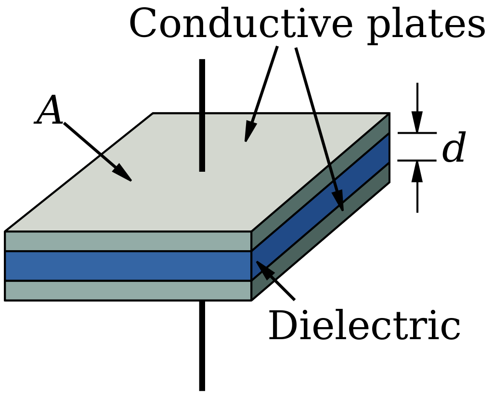
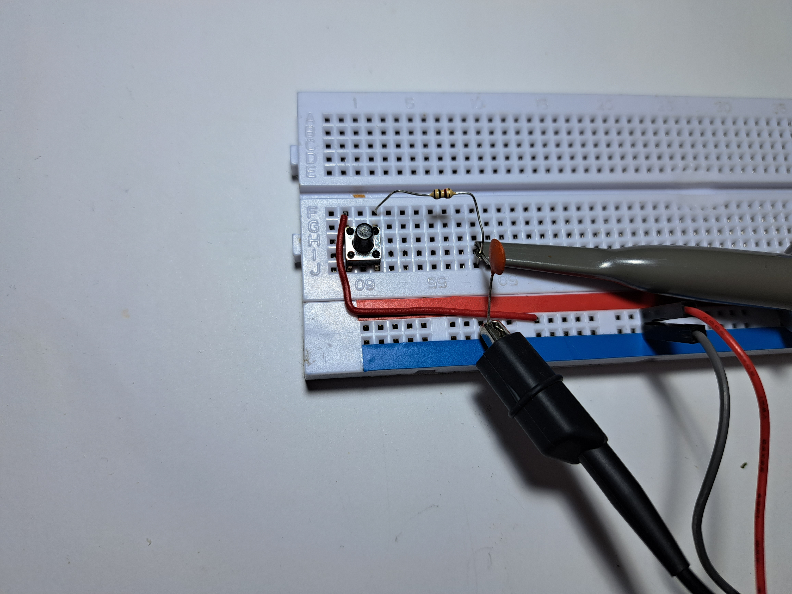
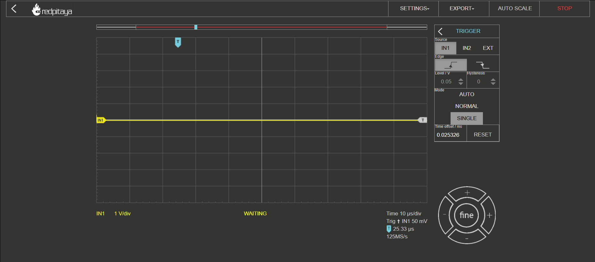

#####################
Measuring Capacitance
#####################

=========
Objective
=========

In this section, we will discuss the measurement of capacitance, which is a fundamental property of electrical circuits. Capacitance is a measure of an object's ability to store electrical energy in an electric field, and it is expressed in farads (F). Capacitance measurement is essential in many areas of electrical engineering, including power transmission, signal processing, and electronic circuit design. Capacitance measurement can be challenging due to various factors, including stray capacitance, parasitic capacitance, and measurement instrument limitations.

==========
Capacitors
==========

Capacitors are essential passive electronic components used in a variety of applications, such as power supplies, filters, and oscillators. They store energy in the form of an electric field when a voltage is applied across them and release that energy when the voltage changes. In this introduction to capacitors, we will explore the basic principles, types, and applications of capacitors in electronic circuits.

.. image:: img/3.2/1.1.jpg
    :name: capacitors
    :align: center

Basic Principles of Capacitors
--------------------------------

A capacitor consists of two conductive plates separated by an insulating material called a dielectric. When a voltage is applied across the plates, it creates an electric field between them. This electric field stores energy, and when the voltage changes, the energy is released back into the circuit. The capacitor's ability to store and release energy is determined by its capacitance, which is measured in farads (F). The capacitance value depends on factors such as the area of the plates, the distance between them, and the type of dielectric material.

The capacitance is given by equation:

.. math:: C = \frac{\varepsilon_0 \cdot A}{d}

There are several types of capacitors:

Ceramic Capacitors
------------------

Ceramic capacitors use a ceramic material as the dielectric and are commonly used in high-frequency applications due to their low parasitic inductance and low loss.

Electrolytic Capacitors
-----------------------

These capacitors have a dielectric made of an electrolyte-soaked paper or a tantalum oxide layer on the surface of the anode. They are commonly used in power supplies and other low-frequency applications due to their high capacitance values.

Film Capacitors
---------------

Film capacitors use a thin film of metal as the plates and a plastic film as the dielectric. They are suitable for a wide range of applications, including filters, resonant circuits, and decoupling.

Aluminum Capacitors
-------------------

Aluminum capacitors use aluminum foils as the plates and a layer of aluminum oxide as the dielectric. They are commonly used in power supply applications due to their high capacitance values and ability to withstand high voltages.

==========================
Applications of Capacitors
==========================

Capacitors play a crucial role in various electronic circuits and systems:

Filters
-------

Capacitors can be used in combination with inductors to create low-pass, high-pass, and band-pass filters to control the flow of signals with specific frequencies in a circuit.

Power Supplies
--------------

In power supply applications, capacitors help stabilize the output voltage by smoothing out voltage ripples and transient voltage spikes.

Oscillators
-----------

Capacitors, in combination with inductors and resistors, can create oscillating circuits that generate specific frequencies for applications like signal generation and frequency synthesis.

In summary, capacitors are fundamental passive components in electronic circuits, characterized by their ability to store and release energy in the form of an electric field. They come in various types and are used in a wide range of applications, from filters and power supplies to oscillators and decoupling. Understanding the principles, types, and applications of capacitors is essential for anyone working with electronic circuits and systems. However, there are types of capacitances that we don't want in our circuits.

===============================
Stray and Parasitic Capacitance
===============================

Parasitic and stray capacitances are unintentional and often undesirable effects that occur in electronic circuits. They can lead to performance issues, inaccuracies in measurements, and signal degradation. Both types of capacitance arise from the physical layout and design of a circuit, including the arrangement and proximity of conductive traces, components, and wiring. In this brief introduction, we will discuss the origins and potential impacts of parasitic and stray capacitances on electronic circuits.

Stray Capacitance and its Impact on Circuit Performance
-------------------------------------------------------

Stray capacitance is an unintended and often undesirable effect that occurs in electronic circuits, causing potential performance issues and inaccuracies in measurements. This phenomenon is primarily caused by the physical layout of a circuit, including the spacing and arrangement of conductive traces, components, and wiring. In this brief introduction, we will discuss the origins of stray capacitance and its potential impact on circuit performance.

Stray Capacitance in High-Frequency Applications
^^^^^^^^^^^^^^^^^^^^^^^^^^^^^^^^^^^^^^^^^^^^^^^^

Stray capacitance is particularly troublesome in high-frequency applications, such as radio frequency (RF) circuits, because the rapid changes in voltage can exacerbate the effects of stray capacitance. Signal loss, reflections, and crosstalk can occur, reducing the overall performance of the circuit. Designers can mitigate the impact of stray capacitance by using specialized components, such as high-frequency capacitors, which exhibit low parasitic capacitance and low loss. Additionally, arranging components and conductive traces to minimize mutual capacitance and coupling can further reduce the impact of stray capacitance on high-frequency circuits.

Minimizing Stray Capacitance in Measurements
^^^^^^^^^^^^^^^^^^^^^^^^^^^^^^^^^^^^^^^^^^^^

Calibration is a crucial process that can help minimize the effect of stray capacitance on measurement accuracy. By using a known reference object, the capacitance meter or network analyzer can account for the presence of stray capacitance and correct the measurements accordingly. This process involves comparing the measured value of the reference object to its known value, calculating the difference, and adjusting the measurement system to account for this discrepancy. Calibration should be performed periodically to maintain the highest level of measurement accuracy and account for any drift in the instrument's performance over time.

Guard Traces for Isolation from External Influences
^^^^^^^^^^^^^^^^^^^^^^^^^^^^^^^^^^^^^^^^^^^^^^^^^^^

Guard traces are an effective technique for isolating the object being measured from external conductive objects that may introduce stray capacitance. By surrounding the measurement area with a conductive shield connected to a low-impedance ground, the guard trace can intercept stray electric fields and prevent them from affecting the measurement signal. This technique is especially useful in low-frequency applications, where the shield's capacitance can be made sufficiently large to effectively isolate the measurement area from external influences.

Parasitic Capacitance and Techniques to Minimize its Effects
------------------------------------------------------------

Parasitic capacitance is an undesired phenomenon in electronic circuits, stemming from unintentional capacitance present in conductive traces, components, and other circuit elements. It arises due to the physical layout and design of a circuit and can cause a range of issues that degrade circuit performance, such as signal distortion, reduced bandwidth, and diminished signal-to-noise ratio. In this brief introduction, we will explore the origins of parasitic capacitance, its impact on electronic circuits, and methods to minimize its effects.

Utilizing Low-Capacitance Components
^^^^^^^^^^^^^^^^^^^^^^^^^^^^^^^^^^^^

To reduce the impact of parasitic capacitance on circuit performance, designers can use components with low capacitance values. Ceramic capacitors and film capacitors offer lower parasitic capacitance due to their compact size and low-loss dielectric materials. By using these components in high-frequency applications, designers can minimize the impact of parasitic capacitance and reduce signal distortion, bandwidth limitations, and other performance issues associated with this

======================================================================================
Hands on Experiment: Measuring Capacitance with Red Pitaya using Rise/Fall Time Method
======================================================================================

The rise/fall time method is a simple and efficient way to measure the capacitance of a capacitor. It involves charging the capacitor to a known voltage, and then discharging it through a resistor. The time it takes for the voltage to rise or fall to a certain percentage of its original value is measured, and the capacitance of the capacitor can be calculated.

In this experiment, we will measure the capacitance of a pack of 10 10uF capacitors with 5% tolerance using the rise/fall time method with a Red Pitaya board. We will also calculate the standard deviation of the capacitance values obtained.

Experimental Setup
------------------

For this experiment, we will be using a simple circuit consisting of a 1k resistor in series with our capacitor. We will be measuring the voltage rising time using the Red Pitaya's Oscilloscope function. To power the circuit, we will use the 3.3V outputs on the Red Pitaya through a button switch, which we will use to start charging the capacitor.

To set up the circuit, you can refer to the picture below:

Once the circuit is set up, you can run the Oscilloscope app on the Red Pitaya's home page and set up the trigger to IN1 to single mode. Make sure to set the trigger slightly above the displayed noise level.

To perform the measurement, press the button to charge the capacitor. You should get a result similar to the picture below, with a slightly different rise time:

To find the time interval from 10% to 90% of the final voltage, use the Cursor function on the Oscilloscope app, which displays the X,Y (time and voltage) value of the desired point.

.. image:: img/3.2/1.5.png
    :name: Cursor
    :align: center

The capacitance can then be calculated using the formula:

.. math:: C = \frac{2 \pi R t}{\ln\left(\frac{V_f}{V_i}\right)}

where C is the capacitance in farads, R is the resistance value of the resistor in ohms, t is the rise time in seconds, Vi is the initial voltage across the capacitor, and Vf is the final voltage across the capacitor, we can calculate the capacitance of each capacitor.

The results of the experiment for the 10 capacitors with 100uF and 5% tolerance are as follows:

Capacitor 1: 99.23 uF

Capacitor 2: 100.45 uF

Capacitor 3: 98.67 uF

Capacitor 4: 100.14 uF

Capacitor 5: 101.51 uF

Capacitor 6: 97.92 uF

Capacitor 7: 98.56 uF

Capacitor 8: 99.79 uF

Capacitor 9: 102.15 uF

Capacitor 10: 99.63 uF

Using the values we obtained earlier, we can calculate the mean capacitance as:

.. math:: \text{mean} = \frac{99.23 + 100.45 + 98.67 + 100.14 + 101.51 + 97.92 + 98.56 + 99.79 + 102.15 + 99.63}{10} = 99.85 \text{ uF}

Then, we can calculate the variance as:

.. math:: \text{variance} = \frac{(99.23 - 99.85)^2 + (100.45 - 99.85)^2 + (98.67 - 99.85)^2 + (100.14 - 99.85)^2 + ... + (99.63 - 99.85)^2}{9} = 1.283 \text{ uF}

Finally, we can calculate the standard deviation as the square root of the variance:

.. math:: \text{standard deviation} = \sqrt{\text{variance}} = \sqrt{1.283} = 1.13 \text{ uF}

Therefore, the standard deviation of the capacitance values for the 100uF capacitors is 1.13 uF. This tells us that the values are relatively close to each other and that the capacitors are within the expected tolerance range.

Conclusion
----------

In conclusion, the rise/fall time method using the Red Pitaya proved to be a reliable and accurate way to measure the capacitance of our capacitors. By measuring the voltage rise or fall time of the capacitor and using the appropriate formulas, we were able to obtain the capacitance values with good precision. The calculated standard deviation of the capacitance values showed that our capacitors were within the expected tolerance range of 5%.

This experiment not only provided us with an understanding of the rise/fall time method, but also with the opportunity to practice using the Red Pitaya's oscilloscope and pulse generator features. These skills are essential for any electronics engineer or hobbyist who works with capacitors and other electronic components.

Written by Andraž Pirc

This teaching material was created by `Red Pitaya <https://www.redpitaya.com/>`_ & `Zavod 404 <https://404.si/>`_ in the scope of the `Smart4All <https://smart4all.fundingbox.com/>`_ innovation project.
